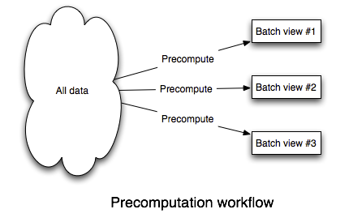
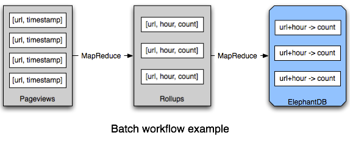
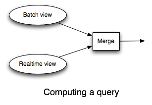

# Lambda:How to beat the CAP theorem

[CAP定理](http://baike.baidu.com/view/45961.htm)指出一个数据库不可能同时满足：一致性（Consistency）、可用性（Availability）和分区容错性（Partition-Tolerance）。但是你不能牺牲分区容错性（见[You Can’t Sacrifice Partition Tolerance](http://codahale.com/you-cant-sacrifice-partition-tolerance/)和[CAP Confusion: Problems with ‘partition tolerance’](http://www.cloudera.com/blog/2010/04/cap-confusion-problems-with-partition-tolerance/)这两篇文章）。所以需要在一致性和可用性上做出取舍，而这点也是目前NoSQL数据库的主要议题。

一致性是指如果你执行了一次成功的写操作，未来的读操作一定可以读到这个写入的值。可用性是指系统总是可读可写的。在分区的情况下，你只能选择上述两种性质中的一种。

选择一致性而不是可用性的系统将面临一些尴尬的问题，当系统不可用的时候你将如何做？你可以对写操作进行缓冲处理，但是如果存储缓冲数据的机器出现故障，你将丢失你写入的值。同样的，缓冲写也可以被认为是一种非一致性的操作，因为客户端认为成功的写入实际上并没有最终写入到数据库中。当然，你可以在机器不可用时候给客户端返回错误，但是你可以想象，一个经常告诉你“try again later”的产品是多么令人讨厌。

另外一个选项就是选择可用性放弃一致性。这种情况下最好的一致性保障是“最终一致性”（Eventually Consistency）。当你使用一个最终一致性的系统，你有时候会读到你某次写入后的不同结果。有时，同一时间同一个key的多个请求有可能返回的是不同的结果。数据更新并不能及时在所有的复制节点上生效，所以不同的复制节点上你可能读取到的是不同的值。当你检测到数据不一致性时候，你需要进行repair操作，这就需要使用矢量时钟（Vector Clocks）记录数据的版本历史和合并不同的数据更新（叫做read repair）。

在应用程序层面上对最终一致性进行维护对开发人员来说是一个巨大的负担，read pair的算法正确性很容易受到开发人员的误操作影响，一旦开发人员在read repair过程中犯了错误，将对数据库系统造成不可逆的影响。

 所以牺牲可用性将问题很多，牺牲一致性构建和维护系统的复杂度又很高，但是这里又只有两个选项，不管怎么做都会不完美。CAP定理是一个自然定理，那么在工程上我们是不是可能有另外的选择呢？

这里有另外一个办法，你并不能避开CAP定理，但是你可以把复杂的问题独立出来，使得他不至于破坏你对整个系统的掌控能力。CAP定理复杂性在于，我们如何实现数据系统的构建这一根本问题，其中两个问题特别重要：数据可变状态的使用和数据状态更新的增量算法。这两个问题的交互导致了CAP定理的复杂性。

在这篇文章中我将通过展示一个数据库系统的设计，来说明我是如何解决CAP定理造成的复杂性问题。但是我要做的不仅仅于此，CAP定理是一个针对机器发生错误时系统容错问题的一个定理，但是这里有比机器容错性更加重要的容错性——人为操作容错性。在软件开发中一个确定的事实是，我们的系统必须对有bug程序写入的错误数据有足够的适应能力，我要展示的系统将是这样一个可以容忍人为错误的系统。

这篇文章将改变你对数据系统如何构建这一问题的看法，通过颠覆传统数据系统构建方法，我会让你看到这个系统将是一个足够优雅，扩展性强，鲁棒性好的数据系统。

## **什么是数据系统？**

在开始介绍系统设计之前，让我们先来看看我们要解决的问题：什么是数据系统？数据系统的目的在于？在我们考虑CAP定理之前，我们必须给出一个可以适用于所有数据应用程序的定义来回答上述问题。

数据应用程序包括了存入和提取数据对象，连接，聚合数据流处理、机器学习等等。这里并没有一个对数据系统的明确定义，数据处理的多样性使得我们很难有一个单一的定义。

但是这里却有一个简单的定义，他是这样的：

```
Query = Function(All Data)
```

这个方程概括了数据库和数据系统的所有领域，每一个领域——有50年历史的RDBMS，索引，OLAP，OLTP，MapReduce，EFL，分布式文件系统，流处理，NoSQL等——都被概括进了这个方程。

一个数据系统就是对数据集问题的回答，这些问题我们称之为“查询”。上面的方程表明，查询就是你所拥有数据上的一个函数而已。

上面的方程对于实际使用来说太过于笼统，他几乎对复杂的数据系统设计不起什么作用。但是如果所有的数据系统都遵循这个方程又会怎么样呢？这个方程是探索我们数据系统的第一步，而他最终将引导我们找到“打败”CAP定理的方法。

上面的方程里面有两个关键的概念：“数据”与“查询”。这两个完全不同的概念经常在数据库领域里面被混为一谈，所以让我们严谨地来看看这两个概念究竟是什么意思。

## 数据

我们先从“数据”开始。一个数据就是一个不可分割的单位，你拥有这个数据不是因为有什么别的原因，就是因为他真的存在，这就跟数学里面的公理一样。

关于“数据”有两个关键的性质。首先，**数据是跟时间相关的**，一个真实的数据一定是在某个时间点存在于那儿。比如，假如Sally在她的社交网络个人资料中写他住在芝加哥，这个你拿到的数据肯定是她在某个时间在芝加哥填写的。假如某天Sally把她资料里面居住地点更新到了亚特兰大，那么你知道她肯定在这个时候是住在亚特兰大的，但她住在亚特兰大的事实无法改变她曾经住在芝加哥过这个事实，这两个数据都是真实的。

“数据”的第二个性质跟第一个密切相关：**数据无法改变**。由于数据跟某个时间点相关，所以数据的真实性是无法改变的。没有人可以回到那个时间去改变数据的真实性，这个说明了对数据操作只有两种：读取已存在的数据和添加更多的新数据。那么CRUD就变成了CR（译注：CRUD是指Create Read Update Delete，即数据的创建，读取，更新和删除）

我去掉了“更新”操作，因为更新对于不可改变的数据没有任何作用，比如，更新Sally的位置信息本质上就是在她住的地方数据中新加一条最近的位置信息而已。

我同样去掉了“删除”操作，同样的，绝大部分删除操作可以更好的表述为新加一条数据。比如Bob在twitter上不再关注Mary了，这个并不能改变他曾经关注过Mary这个事实。所以与其删除Bob关注Mary这个数据，还不如新加一条Bob在某个时间点不再关注Mary这个数据。

这里只有很少数的情况你需要永久“删除”数据，比如规则要求你每隔一段时间清掉数据，这个情况在我将要展示的系统中有很好的解决方案，所以为了简洁，我们暂不考虑这些情况。

## 查询

在上面的方程中的第二个概念是“查询”。查询是一个针对数据集的推导。从这方面来说，查询就像是一个数学里面的定理。比如，“Sally现在的位置在哪里”这是一个查询，你可以通过计算这个查询来的得到Sally最新的位置数据。查询是整个数据集合上的函数，所以它可以做一切事情：聚合，连接不同类型的数据等等。所以你可以查询你系统中女性用户的数量，你可以查询最近几小时热门的twitter内容。

前面我已经定义查询是整个数据集上的函数，当然，不是所有的查询都需要整个数据集，他们只需要数据集的一个子集。但是我的定义是涵盖了所有的查询类型，如果我们想要“打败”CAP定理，我们需要能够处理所有的查询。

## 打败CAP

最简单的方法就是直接按照查询字面意思，在整个数据集上运行一个函数。如果这个可以满足你对延迟的要求，那么就没有其他需要的做的了。

可想而知，我们不能指望在整个数据集上的查询能够很快完成，特别是那些运行着大的web服务，需要处理每秒几百万次请求的系统。但是，假如这种查询可以很快完成，让我们来看看像这样的系统是如何与CAP定理打交道的，你将会看到，这个系统不仅打败了CAP定理，而且还消灭了它。

CAP定理还是存在，所以你需要在可用性和一致性上做出选择，这里的绝妙之处在于，一旦你权衡之后做出了选择，你就做完了所有的事情。通常的那些因为CAP定理带来的问题，都可以通过不可改变的数据和从原始数据中计算查询来规避。

如果你选择一致性而不是可用性，那么跟以前并没有多大的区别，因为你放弃了可用性，所以一些时候你将无法读取或者写入数据。当然这只是针对对强一致性有要求的系统。

如果你选择可用性而不是一致性，这里就变得有意思了。在这种情况下，系统可以达到最终一致性而且规避了所有最终一致性带来的复杂度。由于系统总是可用的，所以你总可以写入新数据或者进行查询。在出错情况下，查询可能返回的不是最近写入的数据，但是根据最终一致性，这个数据最终会一致，而查询函数最终会把这个数据计算进去。

这里的关键在于数据是不可变的。不可变数据意味着这里没有更新操作，所以不可能出现数据复制不相同的这种不一致的情况，这也意味着这里不需要版本化的数据，矢量时钟或者read repair。在一个查询场景中，一个数据只有存在或者不存在这两种情况。这里只有数据和在数据之上的函数。这里没有需要你为确保最终一致性额外做的事情，最终一致性也不会因此使你的系统变得复杂。

之前的复杂度主要来自增量更新操作和CAP定理之间的交互。增量更新与CAP定理不能在一起很好地工作。在最终一致性系统中可变的值需要通过read-repair来保证最终一致性。通过使用不可变数据，去掉增量更新，在每次从原始数据计算查询，你可以规避那些复杂的问题。CAP定理就被打败了。

当然，我们现在讲的不过是脑袋中的想法而已，而且我们知道，每次从原始数据计算查询，这个基本上不可能。但是我们从中可以学到一些在实际解决方案中的关键点：

1. 数据系统因为不可变数据和不断增长的数据变得简单了
2. 基本的写入操作就是写入一条新的不可变数据
3. 数据系统通过重新从原始数据计算查询规避了CAP定理带来的复杂度
4. 数据系统利用增量算法使得查询的返回延迟降低到一个可以接受的程度

让我们开始探索这个数据系统应该如何设计。请注意从这里开始我们所描述都是针对系统的优化，数据库，索引，EFL，批量计算，流处理——这些技术都是对查询函数的优化，让查询返回时间降低到一个可以接受的程度。这些很简单，但是也是数据系统所面对的现实。数据库是数据管理的核心，但是他们是更大蓝图中的一部分。

## **批量计算**

我们知道如何让任意一个函数可以在任意一个数据集上快速执行完成这个问题太过于复杂，所以先让我们放宽一下这个问题依赖条件。我们首先假设，可以允许数据可以滞后几小时。放宽这个条件之后，我们可以得到一个数据系统构建简单的，优雅的以及通用的解决办法。之后，我们会通过扩展这个解决方案使得他可以解决不用放宽条件来解决问题。

由于查询是所有数据的一个函数，让查询变快的最简单的方法就是预先计算好这些查询。只要这里有新的数据，你就重新计算这些查询。这个是可能的，因为我们放宽了条件使得我们的数据可以滞后几个小时。这里有一个图示展示了这个工作流程：



为了实现这个，你的系统需要：

1. 能够很容易存储大的、不断增长的数据集
2. 能够在数据集上可扩展的计算查询函数

这样的系统是存在的，它是一个成熟的，经历了无数团队实战检验过的系统，同时拥有一个巨大的工具生态系统——[Hadoop](http://hadoop.apache.org/)。Hadoop并不完美，但是它只是在这里用来做批量处理的一个工具而已。

许多人也许会告诉你，Hadoop只适用于那些“未结构化”的数据，这是完全错误的看法。Hadoop处理“结构化”的数据也很不错，通过使用像[Thrift](http://thrift.apache.org/)或者[Protocol Buffers](http://code.google.com/p/protobuf/)这样的工具，你可以使用丰富的数据结构存储你的数据。

Hadoop由两部分构成：一个分布式文件系统（HDFS）和一个批量处理框架（MapReduce）。HDFS可以通过文件存储大量的数据，MapReduce可以在这样数据上很好的进行可扩展地计算。这个系统完全符合我们的要求。

我们将数据以文件形式存储到HDFS中去。一个文件可以包括一个数据记录序列。新增数据时候，我们只需要在包括所有数据的文件夹中新增一个包含这条新记录的文件即可。像这样在HDFS存储数据满足了“能够很容易存储大的、不断增长的数据集”这个要求。

预计算数据集上的查询也很直观，MapReduce是一个足够复杂的框架，使得几乎所有的函数都可以按照多个MapReduce任务这种方式实现。像[Cascalog](https://github.com/nathanmarz/cascalog)，[Cascading](http://cascading.org/)和[Pig](http://pig.apache.org/)这样的工具使实现这些函数变得十分简单。

最后，为了可以快速访问这些预计算查询结果，你需要对查询结果进行索引，这里有许多数据库可以完成这个工作。[ElephantDB](https://github.com/nathanmarz/elephantdb)和[Voldemort read-only](http://sna-projects.com/blog/2009/06/voldemort-and-hadoop/)可以通过从Hadoop中导出key/value数据来加快查询速度。这些数据库支持批量写和随机读，同时不支持随机写。随机写导致了数据库的复杂度，所以通过不支持随机写，这些数据库设计得特别简洁，也就几千行代码而已。简洁使得这些数据库鲁棒性变得非常好。

让我们来看看我们的批量处理系统整体上是如何配合工作的。假设你在写一个web分析程序来跟踪页面访问量，你需要能够查询到任意时间段的页面访问量，数据是以小时方式提供的。



实现这个很简单，每一个数据记录包括一个单一页面的访问量。这些数据通过文件形式存储到HDFS中，一个函数通过实现MapReduce计算任务，来计算一个url下页面的每小时的访问量。这个函数产生的是Key/Value对，其中[URL,hour]是key，value是页面的访问量。这些key/value对被导出到ElephantDB中去，使得应用程序可以快速得到任意[URL,hour]对对应的值。如果应用程序想要知道某个时间范围内某个页面的访问量，它可以查询ElephantDB中那段时间内的数据，然后把这些数据相加就可以得到这个访问量数据了。

在数据滞后几小时这个缺陷下，批量处理可以计算任意数据集上的任意函数。系统中的“任意性”是指可以这个系统处理任何问题。更重要的是，他很简单，容易理解和复杂度可伸缩，你需要考虑的只是数据和查询函数，Hadoop会帮你处理并行的事情。

## **批处理系统，CAP定理和容忍人为错误**

到目前为止我们的系统都很不错，那么这个批处理系统是不是可以达到我们容忍人为错误的目标呢？

让我们从CAP定理开始。这个批处理系统总是最终一致的：写入的数据总可以在几小时后被查询到。这个系统是一个很容易掌控的最终一致性系统，使得你可以只用关注你的数据和针对数据的查询函数。这里没有read-repair，并行和其他一些复杂的问题。

接下来，让我们来看看这个系统对人为错误的容忍性，在这样的系统中人们可能会犯两个错误：部署了一个有bug的查询函数或者写入了错误的数据。

如果你部署了一个有bug的查询函数，你需要做的所有事情就是修正那个bug，重新部署这个查询函数，然后在主数据集上重新计算这个函数。这个能起作用是因为查询只是一个函数而已。

另外，错误的数据有明确的办法可以恢复：删除错误数据，然后重新计算查询。由于数据是不可变的，而且数据集只是往后添加新数据，写入错误的数据不会覆盖或者删除正确的数据，这个与传统数据库更新一个数据就丢掉旧的数据形成了鲜明的对比。

注意到[MVCC](http://en.wikipedia.org/wiki/Multiversion_concurrency_control)和HBase-like行版本管理并不能达到上面人为错误容忍级别。MVCC和HBase行版本管理不能永久保存数据，一旦数据库合并了这些版本，旧的数据就会丢失。只有不可变数据系统能够保证你在写入错误数据的时候可以找到一个恢复数据的方法。

## 实时层

上面的批量处理系统几乎完全解决了在任意数据集上运行任意函数的实时性需求。任何超过几个小时的数据已经被计算进入了批处理视图中，所以剩下来要做的就是处理最近几个小时的数据了。我们知道在最近几小时数据上进行查询比在整个数据集上查询要容易，这是一个关键的地方。

为了处理最近几个小时的数据，你需要一个实时系统和批处理系统同时运行。这个实时系统在最近几个小时数据上预计算查询函数。要计算一个查询函数，你需要查询批处理视图和实时视图，并把他们合并起来以得到最终的数据。

在这个实时层，你可以使用像Riak或者Cassandra这种读写数据库 ，而且实时层依赖那些数据库中对状态更新的增量算法。

让Hadoop模拟实时计算的工具是[Storm](https://github.com/nathanmarz/storm/wiki)。我写Storm的目的是让Hadoop可以鲁棒地，可扩展地处理大量的实时数据。Storm在数据流上运行无限的计算，并且对这些数据处理提供了强有力的保障。

让我们回到刚才那个根据某个URL查询某个页面在某个时间段内页面访问量的例子，通过这个例子我将展示实时层是如何工作的。



批处理系统还是跟之前一样：一个基于Hadoop和ElephantDB的批处理工作流，在几个小时之前的数据上预计算查询函数。剩下就是让实时系统去预计算最近几小时数据上的查询函数了。

我们将最近几小时的数据状态存入Cassandra中，我们用Storm去处理页面访问量数据流并并行更新到数据库中，针对每一个页面访问量，在[URL,hour]所代表的key下，有一个计数器，这个计数器在Cassandra中实现。这就是所有的事情，Storm让事情变得非常简单。

## **批处理层+实时层，CAP定理和人为错误容忍性**

从某些方面来说我们又回到了我们一开始提出的问题上去了，访问实时数据需要我们使用NoSQL数据库和增量算法。这就说明我们回到了版本化数据，矢量时钟和read-pair这些复杂的问题中来。

但是这里是有本质区别的。由于实时层只处理最近几个小时的数据，所有实时层计算的都会被最终批处理层重新计算。所以如果你犯了什么错误或者实时层出了问题，最终都会被批处理层更正过来，所有的复杂的问题都是暂时的。

这并不意味着你不需要关心实时层的read-repair和最终一致性，你仍然需要实时层尽可能的一致。但是当你犯了一个错误，你不会永久性的破坏你的数据。这个移除了许多你所需要面对的复杂问题。

在批处理层你仅需要考虑数据和数据上的查询函数，批处理层因此很好掌控。在实时层，你需要使用增量算法和使用复杂的NoSQL数据库。把所有的复杂问题独立到实时层中，对系统的鲁棒性，可靠性做出了重大贡献。

同样的，实时层并没有影响系统的人为错误容忍性，这个数据不可变和只追加的批处理系统，仍然是整个系统的核心，所以所有的都可以像上面说的一样被纠正过来。

我给大家分享一个我自己的把复杂问题独立出来的故事。我有一个系统与我现在描述的系统非常类似：Hadoop和ElephantDB组成批处理系统，Storm和Cassandra组成实时系统。由于缺乏监控，某天当我起床的时候发现Cassandra运行满负荷了，使得所有的数据请求都超时。这个使得Storm计算失败，一些数据又重新回到了等待队列中，这个数据就一次次重复请求。

如果我没有批处理层，那么我就需要恢复Cassandra，这个很不容易。同时更糟的是，因为请求不断的重复，无法得到正确的数据。

幸运的是，所有的复杂问题都被隔离到实时层中去了，我把所有的后台请求队列打到了批处理层上，同时重启了Cassandra集群，过了几个小时之后所有的数据都恢复正常了。没有错误数据，请求中也没有不准确的地方。

## 垃圾回收

上面我描述的所有东西都是建立在一个不可变的，不断增长的数据集上的。那么如果当你的数据集已经很大，使得你甚至不可能用水平扩展储存所有时间的所有数据，你该如何处理呢？这个是不是就推翻了上面我说的一切呢？你是不是需要回到可变数据的系统上去呢？

不。我们可以很容易地用“垃圾回收”对基本模型机型扩展，来解决上面的问题的。垃圾回收就是一个在主数据集上的一个简单函数，它返回的是一个过滤版本的主数据集。垃圾回收掉了较为旧的数据，你可以选择任意的垃圾回收策略。你可以在易变的系统中只保留数据最新的一个值，也可以保留每个数据的历史。比如，如果你要处理位置数据，你可以保留每人每年的一个地点。可变性是一个不是很灵活的垃圾回收形式（他跟CAP定理交互得也很糟糕）

垃圾回收可以被实现成批处理的一个任务，你可以隔一段时间运行他一下，也许是一个月。由于垃圾回收是作为离线的批处理任务执行的，所以他不影响我们与CAP定理的交互。

## 总结

让可扩展的数据系统复杂的原因不是因为CAP系统，而是因为数据增量算法和数据的可变状态。最近由于分布式数据库的兴起导致了复杂度越来越不可控。

我在这篇文章开头时候说过了，我将打破你对传统数据系统构建方法的认识。我把CRUD变成了CR，把持久化层分成了批处理和实时两个层，并且得到对人为错误容忍的能力。我花费了多年来之不易的经验打破我对传统数据库的认识，并得到了这些结论。

批处理/实时架构有许多有趣的方面我并没有提到，下面我总结了一些：

- **算法的灵活性**。随着数据量的增长，一些算法会越来越难计算。比如计算标识符的数量，当标识符集合越来越大的时候，将会越来越难计算。批处理/实时分离系统给了你在批处理系统上使用精确算法和在实时系统上使用近似算法的灵活性。批处理系统计算结果会最终覆盖实时系统的计算结果，所以最终近似值会被修正，而你的系统拥有了“最终精确性”
- **数据结构迁移变得很容易**。数据结构迁移的难题将一去不复返。由于批量计算是系统的核心，很容易在整个系统上运行一个函数，所以很容易更改你数据的结构或者视图。
- **简单的ad-hoc分析**。由于批处理系统的任意性，使得你可以在数据上进行任意的查询。由于所有的数据在一个点上都可以获取，所以ad-hoc分析变得简单而且方便。
- **自我检查**。由于数据是不可变的，数据集就可以自我检查。数据集记录了它的数据历史，我已经讨论了这点对于人为错误容忍性有多重要，而且这对于数据分析也很用。

我并没有说我已经“解决”了数据量过大的问题，但是我已经为解决大数据问题制定了一个框架。批处理/实时架构可以应用到任何一个数据系统中去，授人以鱼，不如授人以渔，我已经告诉你了如何去构建这样的系统。

为了提高系统整体能力来解决大数据的问题，我们还有许多工作需要做。下面是一些可提升的地方：

1、**扩展数据模型，支持批量写和随机读**。不是每一个应用程序都支持key/value的数据库，这也是我们团队对扩展ElephantDB，使得可以支持搜索，文档数据库，区间查询感兴趣的原因。

2、**更好的批处理原语**。Hadoop并不是批处理的最终形态，还有好多批处理计算Hadoop效率不是很高。[Spark](https://github.com/mesos/spark)就是一个扩展MapReduce的有意思的项目。

3、**提升后的读写NoSQL数据库**。这里不同类型数据的数据库还有很大的提升空间，随着这些数据库的成熟，他们将收获很多。

4、**高层级的抽象**。未来工作中最有意思的就是对批处理模块和实时处理模块的高层次抽象，在批处理和实时架构下你没有理由不拥有一个简单的，描述性的，鲁棒性好的语言