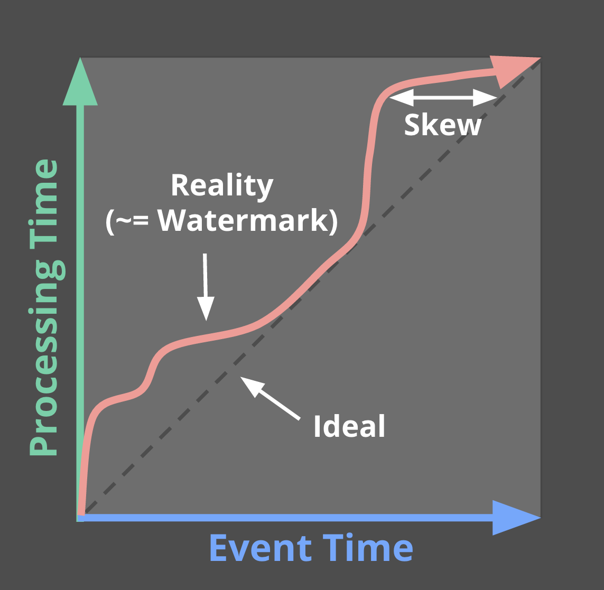

# Streaming 102: 超越批次处理的流处理世界

------

## 1. 简单回顾和路线图

  在Streaming 101中，首先澄清了一些术语，介绍了**有限数据 VS无限数据**。有限数据源具有有限的大小，通常被称为“批处理”数据。无限数据源源可能具有无限大小，通常被称为“流”数据。在后边将会尽量避免使用批处理和流式传输来修饰数据源，因为这些名称带有一些令人误解和限制性的含义。

然后，解释了**批处理和流处理引擎**之间的区别：批处理引擎是设计优先考虑有限数据(现在批处理引擎提供了micro-batch的方式处理流式数据，Spark-Streaming)，而流处理引擎设计用于处理无限数据。目标是在描述执行引擎时使用批处理和流处理。

   定义完术语之后，介绍了与处理有限数据有关的两个重要的基本概念。首先阐述事件时间（事件发生的时间）和处理时间（数据在系统中被处理的时刻）之间的关键区别。这为Streaming 101中提出的主要论文提供了基础：如果关心事件实际发生时间，则必须基于事件的事件时间，而不是处理时间。

   接下来介绍了窗口的概念(即沿时间边界切分数据集)，这是一种常用的方法，用于应对无限数据源的数据处理，无限数据源理论上永远不会结束。窗口策略的最常见且简单的例子是固定和滑动的窗口，更复杂的窗口类型，例如会话窗口(其中窗口由数据本身的特征决定，捕获每个用户的活动会话窗口，会话窗口之后紧接着是用户的不活动期)也比较广泛的用法。

   除了前文中介绍的概念，现在再介绍3个新的概念：

- **Watermark**

Watermark是相对于事件时间的输入完整性的概念。Watermark表示通一个时间X，表示所有事件时间<X的所有数据到到齐了。因此，当处理无限数据源时，Watermark作为进度的度量。

- **Triggers**

触发器是一种由外部条件触发，来表明何时计算窗口结果的机制。触发器可以让我们灵活的选择何时计算结果并发送给下游，而且随着数据的不停的到来，窗口的可以产生多次输出。所以，窗口结束前可以先提供相似结果，并且能够灵活上游数据的变化(可能是上游数据修正或数据延迟到达)，例如，移动场景在某人的离线时，某人的电话记录了各种动作及其事件时间，然后在重新获得连接时继续上传这些事件进行处理。

- **Accumulation**

积累模式指定在同一时间窗口中观察到的多个结果之间的关系。这些结果可能完全相互之间完全独立，或者它们之间可能存在重叠。不同的累积模式具有不同的语义和与计算成本，适用于不同的场景。

   最后，在回答无限数据处理中的4个问题时，更容易搞清楚这些概念和它们之间的关联关系：

- What **计算的结果是什么？**

Pipeline中的转换来决定结果。例如计算总和，构建直方图，训练机器学习模型等等。它也是经典批处理回答的问题。

- Where **在事件时间中的哪个位置计算结果？**

这个问题是通过在Pipeline中使用事件时间窗口来回答的。这包括从Streaming 101(固定，滑动和会话)窗口的常见示例，似乎没有窗口概念的用例（例如，Streaming 101中描述的时间不可知处理;经典批处理也通常属于此类别）和其他更复杂的窗口类型，如时间有限的拍卖。还要注意，它可以包括处理时间窗口，如果在记录到达系统时将入口时间指定为记录的事件时间。

- When **在处理时间中的哪个时刻触发计算结果？**

通过使用Watermark和Trigger来回答这个问题。这个问题有无穷的变化，但最常见的模式是在给定窗口的输入完成时使用Watermak来描绘，触发器允许提前计算结果(对于在窗口完成之前发出的推测性的、部分的结果)和延迟计算结果(Watermark只是预估窗口的数据全部到达,并不是100%确定，在Watermark声明给定窗口的全部到达之后，也有可能会有隶属于该窗口的数据到达)。

- How **如何修正结果？**

这个问题由所使用的累积类型回答：丢弃(其中结果是相互独立和不同的)，累加(后来的结果建立在先前的结果上)，累加和撤销(当前的累加值和上次触发的值撤销一起发送)。

# Streaming 101 回顾

   首先，回顾一下Streaming 101中提出的一些概念，这一次还将提供一些具体的例子使这些概念更具体。

### What:Transform(变换)

经典批处理中Transform解决了以下问题：“要计算什么结果？”许多人可能已经熟悉经典的批处理，所以我们将以它为基础，添加所有其他概念，更便于理解。

对于这一部分，我们来看一个示例：计算由10个整数值组成的简单数据集中的数的总和。这么说有点抽象，在实际中，可以想象一个游戏，10个人组成一个团队，每个人的最终得分相加，就是团队的成绩。也可以想象计费和使用情况的监控使用情况这样的场景。

对于每个示例，将包括一个简短的Dataflow Java SDK伪代码片段，以使Pipeline的定义更具体。因为是伪代码，所以有时会省略细节(如使用具体的I/O源)、使用简称(Java中的当前触发器名称太冗长)。除了这些（大部分我在Postscript中明确列举）的小事情之外，其它基本上是真实的Dataflow SDK代码。稍后还将提供一个链接到实际的代码演练，可以编译和运行自己的类似例子感兴趣的人，可以实际尝试一下。

 如果熟悉像Spark Streaming或Flink这样的计算引擎，那么在看Dataflow示例代码的时候就会容易一些。接下来开始让人崩溃的旅程，在Dataflow中有两个基本的原语：

- **PCollection**

表示可以由PTransfrom并行处理的数据集，(因此名称开始处的“P”)，可以是任意规模的数据集。

- **PTransform转换**

 处理PCollection并创建新的PCollection。 PTransform可以执行元素转换，它们可以将多个元素聚合在一起，或者它们可以是其他PTransform的组合。


​																**Transform变换的类型**

为了对例子说明，假设我们从一个PCollection <KV <String，Integer >>命名为“input”（即由一个键/值对的字符串和整数组成的PCollection，其中字符串是类似团队名称，整数是相应团队中个人的得分）。在现实世界的Pipeline中，通过从I / O源读取PCollection原始数据（例如日志记录）获得输入，将日志记录解析为适当的键/值对,然后将其转换为PCollection <KV <String，Integer >> 。为了在第一个例子中清楚起见，将包括所有这些步骤的伪代码，但是在随后的例子中，删除了I/O和解析部分。

```java
PCollection<String> raw = IO.read(...);
PCollection<KV<String, Integer>> input = raw.apply(ParDo.of(new ParseFn());
PCollection<KV<String, Integer>> scores = input
  .apply(Sum.integersPerKey());
```

列表1.计算总和Pipeline。从数据源读取键值对数据，键是String类型(团队名称)，值是Integer类型（团队中各人得分）。然后对每个键(团队)计算总和(团队得分),并输出。

   对于所有的示例，在每个示例的Pipeline的代码片段之后，有1个该Pipeline执行的动画示例。动画中看到一个Key（即一个团队）的10条输入数据执行Pipeline的样子;在一个实际的Pipeline中，类似的操作将有成千上万个，在很多台机器上并行执行。为了能清晰的说明，示例中演示了1个Key的执行过程。

   动画中每个点代表一个输入或输出数据，输入和输出都有两个时间维度：事件时间（X轴）和处理时间（Y轴）。因此，Pipeline按照处理时间维度执行，从下向上延伸，如加粗的上升白线所示。输入是圆圈，圆圈内的数字代表该特定记录的值。输入开始是灰色圆圈，随着Pipeline处理变换颜色。

   当Pipeline处理到某一个值的时候，会将其累加并记录在State中，并最终将聚合结果作为输出。State和输出由矩形表示，矩形顶部不断变化的数字表示累加值，矩形覆盖的区域表示到当前处理时刻，所有矩形中的数据已经被处理。对于清单1中的Pipeline，在经典批处理引擎上执行时，会看起来像这样（请注意，点击下面的图片启动动画，然后会一直循环播放）：

   上边是在批处理引擎上执行Pipeline，累加输入的数据，直到所有输入处理完毕（由顶部的虚线绿色线表示），此时输出为51。在此示例中，因为没有应用任何特定的窗口，所以在事件时间维度上计算了整个数据集的总和; 因此，用于累加的State和输出的矩形覆盖X轴的整体。 但是，如果要处理一个无限数据源，那么经典批处理将是不够的，不能等待输入结束，因为它实际上永远不会结束。 所以需要的使用在Streaming 101中提到的一个概念是—窗口。因此，想要回答第二个问题“在事件时间的哪个位置计算结果？”，现在先简要回顾一下窗口。

### Where: 窗口

   窗口化是把数据在时间上进行切分。常见的窗口策略有：固定窗口、滑动窗口、会话窗口。


窗口类型示例，每个窗口类型中包含了3个key，图中呈现了对齐的窗口(应用在整个数据集上)和非对齐窗口(应用在数据子集上)

为了更好地了解实际中的如何使用窗口，来看一下的上边提到的整数求和Pipeline，使用了长度为2分钟的时间窗口。 使用Dataflow SDK，只需要简单的添加Window.into Transform变化即可（以蓝色文本突出显示）：

```java
PCollection<KV<String, Integer>> scores = input
  .apply(Window.into(FixedWindows.of(Duration.standardMinutes(2))))
  .apply(Sum.integersPerKey());
```

如前所述，输入在不断累加存储在State中，直到输入被完全处理，然后产生输出。 然而，在这种情况下，不是1个输出，而是4个：在时间上切分成了4个事件时间窗口，每个窗口产生一个输出。

到此为止，我们重新回顾了Streaming 101中引入的两个主要概念：事件时间和处理时间之间的关系以及窗口。 再进一步，开始阐述本节开头提到的新概念：Watermark，触发器和累积。 下边开始Streaming 102。

## Streaming 102

在上边我们看到了在批引擎上执行使用了窗口的Pipeline。 理想情况下，希望具有比较低的处理延迟，同时也希望能涵盖对无限数据集的处理。切换到流式引擎是朝着正确方向迈出的一步。批处理引擎可以明确的知道，每个窗口的数据是否完整了(即，有限数据集中所有的数据都被处理了)，但目前缺乏确定无限数据集的完整性的实用方法。 接下来介绍**Watermark**。

### When: Watermark

**Watermark**是问题答案的前半部分：“在处理时间维度上，什么时候计算窗口的结果？”

**Watermark**是事件时间中输入完整性的时间概念。换句话说，它们是系统根据当前处理的数据的事件时间判断处理进度和完整性的方法(有限或无限数据集，在无限数据的情况下作用更为明显)。



​														**事件时间进度, 偏差, 和watermark**

图中表示现实(reality)的曲折红线本质上是WaterMark。随着处理时间的推移，它跟踪事件时间完整性的进度。

