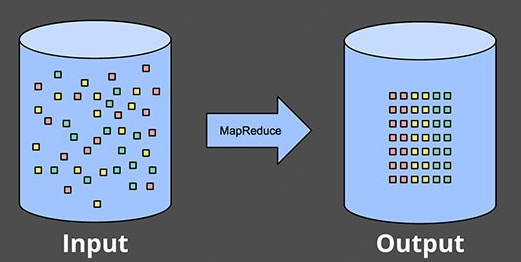
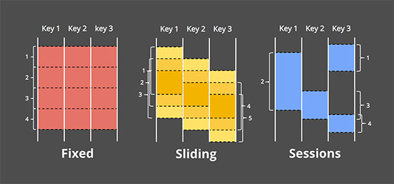

# Streaming 101: 超越批次处理的流处理世界

------

**编者注释**

这是由两部分组成的系列文章中的第一篇，内容涉及数据处理的发展，重点关注流系统，无限制的数据集和大数据的未来， [参见第二篇](https://www.oreilly.com/ideas/the-world-beyond-batch-streaming-102)。

如今，有充分的理由，流数据处理在大数据中已占很大的比重。 其中：

- 企业渴望更及时的数据，而切换到流处理是实现较低延迟的好方法。
- 使用为此类永无止境的数据量设计的系统，可以更轻松地处理在现代业务中越来越普遍的海量无边界数据集
- 随着数据的到达而进行处理可以随着时间的推移更均匀地分散工作负载，从而产生更加一致且可预测的资源消耗

尽管业务推动了人们对流式处理的兴趣激增，但与批处理相比相比，现有的大多数流式处理系统仍相对不成熟，这导致最近在该领域进行了许多激动人心的积极发展。

至少可以说，作为过去五年来在Google从事大规模流系统工作的人[MillWheel](http://research.google.com/pubs/archive/41378.pdf)，[Cloud Dataflow](http://cloud.google.com/dataflow/)，我对这种流媒体精神感到高兴。我还想确保人们理解流式数据系统的所有功能以及如何最好地使用它们，特别是考虑到大多数现有批处理和流传输系统之间仍然存在语义上的差距。为此，O'Reilly邀请我为[Say Goodbye to Batch](http://strataconf.com/big-data-conference-uk-2015/public/schedule/detail/39966)演讲写了我的[“Say Goodbye to Batch”](http://strataconf.com/big-data-conference-uk-2015/public/schedule/detail/39966)。由于我有很多要讲的内容，因此将其分为两篇文章：

1. **Streaming 101**：第一篇文章将介绍一些基本的背景信息，并阐明一些术语，然后深入探讨时间(Time)的详细信息，并对批处理和流式处理的通用数据处理方法进行高级概述。
2. **The Dataflow Model：**第二篇文件将主要介绍cloud Dataflow模型所使用的统一批处理+流处理模型，并通过各种用例集的具体示例来促进理解。之后，我将对现有的批处理和流处理进行简要的语义比较。

## 1. Background

首先，介绍以下三点重要的背景信息，有助于构建后续要讨论的主题：

- **Terminology**：要准确谈论复杂的主题，需要对术语进行精确的定义。 对于某些在当前使用中超载解释的术语，我将尽力明确我在讲这些术语时的意思。
- **Capabilities**：我将谈谈流式数据系统常有的缺点。 我还将提出一个思路，我认为数据处理系统构建者需要采用这种思路，才能满足未来现代数据消费者的需求。
- **Time domains：**将介绍与数据处理相关的两个主要时间领域，展示它们之间的关系，并指出这两个领域带来的一些困难。

### 1.1 **Terminology: What is streaming?**

   在进一步阐述之前，我们首先想一个问题：什么是流？术语“流”现在包含了很多不同的含义，这可能导致我们对流真正是什么、能够做什么产生误解。因此，需要稍微定义下这个术语。

问题在于，很多东西应该采用他们是什么的描述方式(例如，无限数据处理，近似结果等)，而现在是通过已经实现的东西来定义(例如通过已有的流式处理引擎)。术语中缺乏精确的描述，流处理能做什么经常被描述为“流”本身的特性，如近似或推测结果。鉴于精心设计的流式系统与任何现有的批处理引擎一样，能够(技术上更是这样)产生正确、一致、可重复的结果，术语流式数据处理定义为一个非常具体的含义：**一种数据处理无限数据集的方法**。

对于“流”的其他常见用途，这里有几个更精确，描述性的术语：

- **无限数据**

一种不断增长的，本质上无限的数据集。这些通常被称为“流数据”。然而，当应用于数据集时，术语流或批是有问题的，这种数据往往意味着使用某种类型的执行引擎来处理这些数据集。两种类型的数据集之间的关键区别在于现实中它们的有限性，因此最好用表示这种区别的术语来表述它们。因此，将无限的“流”数据集称为无限数据，有限的“批处理”数据集作为有限数据。

- **无限数据处理**

一种持续的数据处理模式，适用于上述类型的无限数据。自从批处理系统最初被构思出来以来，就已经使用批处理引擎的重复运行来处理无限制的数据，相反，精心设计的流系统不仅仅能够处理有限数据上的“批量”工作负载。

- **低延迟，近似和/或推测性结果**

低延迟，近似和/或推测结果通常是与流式引擎联系在一起。事实上，批处理系统传统上没有实现低延迟或推测性的结果。

从这里开始，任何时候使用术语“Streaming”，意思都是设计用于无限数据集的执行引擎。当没有附加任何其他术语时，将明确表示无限数据，无限数据处理或低延迟/近似/推测结果。这些是在Google Dataflow中采用的术语。

## 1.3 流处理被夸大的局限性

接下来，谈一谈流式处理系统可以做什么和不能做什么。流式处理系统长期以来一直被放在提供低延迟，不准确/近似结果的场景里，通常结合批处理系统来提供最终正确的结果，即Lambda架构。

Lambda架构的基本思想是，在批处理系统旁边运行一个流处理系统，它们都执行基本相同的计算。流式处理系统提供低延迟、不准确的结果（由于使用近似算法，或者因为流系统本身不提供严格正确性），所以每过一段时间，批处理系统持续滚动处理并计算出正确的结果，修正流处理系统的计算结果。Lambda最初是由Twitter的Nathan Marz(Apache Storm创始人)提出的，最终是相当成功的。然而维护Lambda系统是一件麻烦：需要构建，配置和维护Pipeline的两个独立庞大系统，然后再将两者的计算结果合并。

[Jay Kreps](https://twitter.com/jaykreps?lang=en)的[Questioning the Lambda Architecture](http://radar.oreilly.com/2014/07/questioning-the-lambda-architecture.html)提出了对Lambda架构的质疑 

设计良好的流处理系统实际上是批处理的功能超集。因此建立一个全面的流处理的系统，把批处理是视作流处理的特例，Flink的设计就是基于此。

流处理取代Lambada架构的历史时刻就要来了，在此之前，需要解决两个问题：

**1. 正确性—与批处理平等的基本要求**

强一致性是正确处理的前提，对于流处理系统来说，想超越批处理系统，这是基本要求。除非真的不关心结果准确与否，否则应避免使用不能提供强一致性的流处理系统。

如果想了解流处理系统中如何实现强一致性，可以参考[MillWheel](http://static.googleusercontent.com/media/research.google.com/en//pubs/archive/41378.pdf)和[Spark Streaming](https://www.cs.berkeley.edu/~matei/papers/2012/hotcloud_spark_streaming.pdf)论文。这两篇论文都花费大量时间讨论一致性。

**2. 时间推理工具—超越批处理的关键**

 对于乱序无限数据流，数据产生的时间和数据真正被处理的时间之间的的偏差很大，用于推理时间的工具至关重要。越来越多的现代数据集体现了这个特点，现有的批处理系统（以及大多数流处理系统）缺乏必要的工具来应对这个问题。剩下的这篇文章，大部分的下一篇文章，将会聚焦于这一点。

 首先，我们将对时间概念有一个基本的了解，之后我们将深入了解不同事件时间偏差的乱序、无限的数据。然后，我们将花费其余的时间来了解使用批量和流处理系统来处理有限和无限数据的常见方法。

## 1.4 Event time vs processing time

要阐述无限数据的处理方式，需要清楚地了解所涉及的时间概念。 在任何数据处理系统中，通常有两个需要关注的时间：

- Event time 事件时间，事件发生的时刻
- Processing time 处理时间  事件在系统中处理的时刻

 并不是所有情况下都需要关心事件的时间，但也有很多情况下需要，例如在时间维度上刻画用户行为，计费应用程序、不同类型的异常检测。

在一个理想的世界中，事件时间和处理时间总是相等的，随着事件在它们发生时被立即处理。然而，现实并不是那样的事件时间和处理时间之间总会存在偏差，而且通常严重受到数据底层输入源，执行引擎和硬件特性的影响。 可能影响偏差水平的因素如下：

- **共享资源限制**，如网络拥塞，网络分区或非专用环境中的共享CPU
- **软件原因**，如分布式系统逻辑，竞争等
- 数据本身的特征，包括Key分配，吞吐量差异或数据混乱度等方面

   在实际中事件时间和处理时间之间的关系，通常如下图中的红线一样。

   斜率为1的黑色虚线表示理想状态下，处理时间和事件时间完全相等;红线代表现实。在这个例子中，系统在处理时间开始时滞后，在中间偏向理想状态，然后再次落后。黑色虚线、红线之间的水平距离是处理时间和事件时间之间的偏差。这种偏差本质上是处理中引入的延迟。

由于事件时间和处理时间之间的映射不是静态的，如果关注数据的产生时间，那么就不能只基于处理时间去处理。大多数流数据处理系统是依赖数据处理时间。为了应对无限数据集的无限性质，流处理系统通常提供了窗口概念。下面将深入讨论窗口，窗口本质上意味着将数据集切分成有限数据集。

如果关注正确性并且希望基于事件时间分析数据，那么就不能使用使用处理时间来定确定窗口边界；在处理时间和事件之间的偏差不可预测、多变的，使用处理时间会导致一些数据划分到错误的窗口中（由于分布式系统的固有滞后，许多类型的输入源的在线/离线特性，等等），导致不正确的结果。在下面的一些例子以及下一篇文章中详细介绍这个问题。

在无限数据处理中，基于事件时间的窗口，无序和可变的时间偏差会导致完整性问题：在处理时间和事件时间之间的偏差完全是不可确定的，如何确定何时给定事件时间X，所有数据都到达了？对于许多数据源，根本无法确定。目前使用的绝大多数数据处理系统都依赖于一些完整性的概念，当将其应用于无限数据集时，会存在一些严重缺陷。

所以，我们需要一套方法，来应对乱序、无限数据集带来的不确定性，而不是尝试将无限数据整理成有限的信息。新数据将到达，旧数据可能会被撤回或更新，我们构建的任何系统都应能够独自应对这些事实，完整性的概念是一种方便的优化方法，而不是语义上的必要性。

   在深入研究如何使用Google Dataflow中使用的数据流模型来构建这样一个系统之前，先来介绍一下一些背景知识：**一般的数据处理模式**。

## 1.5 数据处理模式

下面介绍有限、无限数据的通用处理模式，包含了流处理和批处理。

### 1.5.1 有限数据

处理有限数据是非常简单的，我们都很熟悉，例如Hadoop，在最开始都是为了处理有限数据集而出现的。在下图中，从左边开始，一个混乱无序的数据集，使用数据处理引擎(通常是批处理引擎)运行，如MapReduce，Spark。最后在右侧形成了一个具有可以更方便分析的新的结构化数据集：

尽管实际计算的内容与实际计算结果之间存在无限的可能性，但整体模式非常简单。 更有意思的的是处理无限数据集。 现在来看看通常处理无限数据的各种方式，从传统批处理引擎使用的方法开始，然后结合使用设计用于无限数据的系统，如大多数流处理或微批量引擎。

### 1.5.2 无限数据

#### 无限数据—批处理

   批处理引擎虽然不是为无限数据集处理而设计，但是通过将无限数据集分解成适合于批处理的有限数据集，也可以应用在无限数据集处理中，例如：Spark Streaming的微批次概念；使用Sqoop，Kafka等数据同步工具间隔较短的时间同步到ODS层达到准实时的目的。

##### 固定窗口 Fixed windows

使用批处理引擎的重复运行处理无界数据集的最常见方法是将输入数据分配到固定大小的窗口中，然后将这些窗口中的每一个作为单独的有限数据集进行处理。例如对于日志的输入源，将事件写入目录和文件层次结构，其名称对应于它们对应的窗口，只要基于时间进行shuffle，让时间分配到合适的事件时间窗口中即可。

实际上，大多数系统仍然有一个完整性的问题来处理：如果一些事件由于网络分区而延迟？如果需要从全球收集事件，必须在处理之前首先传输到一个公共的位置？如果事件来自于移动设备，该怎么办？这意味着必须要要有某种方式缓解此类问题(例如，延迟处理，直到确定已收集所有事件，或者在数据迟到时，为给定窗口重新执行整个批处理过程)。

​														**在批处理引擎中基于固定窗口进行无限数据处理**

##### 会话窗口 Sessions

在批处理引擎中，可以使用更复杂的窗口策略，将无限数据集切分的更零碎，例如会话窗口。 会话窗口通常被定义为一个活动周期，超过一定时间不再活动就认为会话窗口中止(例如，针对某一个用户的点击页面的行为)。当使用典型的批处理引擎(Spark已经支持已经支持会话窗口了)计算会话窗口时，通常会遇到会话的数据拆分在2个或多个批次中的情况，如下图中的红色标记所示。 可以通过增加每批次数据量的大小来减少拆分数量，但是以延长的延迟为代价。另一个选择是添加额外的逻辑，以便从以前的运行中删除会话，但代价是复杂性增加。

​														**在经典的批处理引擎中使用固定窗口拆分会话**

#### 无限数据—流处理

   与大多数基于批量的无限数据处理方法的特殊性相反，流系统是为无限数据构建的。如前所述，对于现实世界的许多分布式输入源，不仅要处理无限数据，而且还处理以下问题：

- **事件时间高度无序**

	这意味着如果想在其发生时刻的上下文中分析数据，则需要在Pipeline中进行某种基于时间的shuffle。

- **可变的时间偏差**

	这意味着不能仅仅假设会经常看到给定事件时间X的大部分数据与时间Y的偏差在一定的常数ε内，偏差应该是一个变量

处理具有这些特征的数据时，可以采取一些方法。通常将这些方法分为四组：

- **时间无关**
- **逼近**
- **处理时间窗口**
- **事件时间窗口**

##### 时间无关

在时间基本上无关紧要的情况下使用时间无关的处理 - 即所有相关逻辑都是数据驱动的。由于这种情况下持续的数据输入最为重要，流处理引擎除了满足数据传输的特性外，不需要其他的。因此，基本上所有流处理系统都支持时间无关的使用场景(系统到系统的一致性保证，对关心正确性的人有用)。通过简单地将无限数据切分成任意的有限数据集并且独立地处理这些数据集，批处理系统非常适用于在时间无关的前提下，处理无限数据集。我们将在本节中看几个具体的例子，时间无关的处理的简单明了。

（1）过滤

   一种最基本的时间无关的处理是过滤。 假设正在处理Web流量日志，并且要过滤掉不是源自特定来源的所有流量。 每条记录到达时，检查是否来自某个来源，如果不是则丢弃掉。 由于这种处理只针对单个元素，所以数据源是无限的、无序的以及可变时间偏差这几个因素是无关紧要的。

​																	**过滤无限数据**

（2）内连接Inner-Join

另一个时间无关的例子是内连接inner-join(或散列连接hash-join)。 当两个无限数据源时连接时，当来自两个源的元素到达时，如果只关心连接的结果，则不需要关注时间。 从一个数据源接收1个值，缓存下来，一旦来自另一个源的第2个值到达，将两个值进行关联，然后发出连接之后的记录。在实际中，有一些记录可能没有合适的关联数据进行连接，此时可能需要基于时间进行清理掉旧数据，但是对于很少或没有未完成连接的情况，问题不大。

​																**在无限数据集上进行**

   **外连接outer-join**存在我们已经讨论过的数据完整性问题：一方数据到了，并不能怎么知道另一方数据是否会到达？ 在实际中，很难确定，所以必须使用超时的概念，引入时间，例如**异常监控**。 时间的本质基本上是一种窗口形式，稍后会更仔细地阐述。

（3）近似算法

第二类方法是近似算法，例如近似Top-N，流的K均值等。它们采用无限输入数据源，并提供输出数据。近似算法的优点在于，通过设计，它们的开销比较小，专为无限数据集而设计。缺点是算法本身往往是复杂的（这使得难以引出新的算法），并且它们的近似性质限制了实用性。

   值得注意的是：这些算法通常在其设计中考虑了时间因素（例如，某种内置的衰减策略）。而且由于这些算法一般采用到达时处理元素的策略，所以通常是基于处理时间的。这一点对于可以证明误差边界的近似算法特别重要。如果这些误差范围可证明，是以数据顺序到达的为基础，那么乱序的数据到来时，时间偏差是多变的，算法的误差边界就不再符合要求。

   近似算法是一个很有趣的主题，由于它们本质上是与时间无关的处理（模拟算法本身的时间特征），因此它们非常简单易用，但在此处不会详细介绍。

（4）窗口

   无限数据剩下的两种处理，都是基于不同窗口模式。 在深入不同窗口类型的差异之前，需要明确一下窗口的含义。 窗口对数据源（无限或有限）在时间上进行切分，形成的连续、有限的数据块。 下图显示了三种不同的窗口模式：

​														**固定窗口，滑动窗口与Session窗口**

- **固定窗口**
	   固定窗口将时间分割成具有固定大小时间段。通常（如图8所示），固定窗口均匀的分隔整个数据集，这是对齐窗口的示例。在某些情况下，希望对于数据的不同子集（例如，每个键）进行相移，以随着时间的推移更均匀地扩展窗口完成负载，而不是随着数据变化而是非对齐窗口的示例。

- **滑动窗口**
	   滑动窗口由固定长度和固定时间周期定义。如果时间周期小于长度，则窗口重叠。如果期间等于长度，则等同于固定窗口。如果这个时间周期大于长度，有一些数据就无法分配到窗口中。与固定窗口一样，滑动窗口通常对齐，在某些使用情况下可能会为优化性能而不对齐。注意，图8中的滑动窗口被绘制为给出滑动感;实际上，所有五个窗口将应用于整个数据集。

- **会话窗口**

	​     会话窗口是一种动态窗口，会话由时间序列组成，事件之间的间隔大于某个时间段。会话通常用于分析一个时间段内的用户行为，通过将一系列时间相关的事件(例如，一次观看的视频序列)分组在一起。会话很有意思的，因为他们的长度不能被事先定义，取决于实际数据，是未对齐窗口的典型示例，因为会话在不同的数据子集(例如，不同的用户)之间几乎不相同。

处理时间和事件时间都是我们关注的。 窗口在两种时间类型中都是有意义的，所以我们将详细了解每一个细节，看看它们是如何区别的。 首先从处理时间开始。

##### 基于处理时间的窗口

当基于处理时间划分窗口时，系统将进入数据缓冲窗口中，一直到窗口的末尾时间。例如，在5分钟固定窗口的情况下，系统将缓冲数据，处理时间为5分钟，之后将其在5分钟内收到所有数据视为1个窗口，并将其发送到下游进行处理。处理时间窗口有几个不错的优点：

- 实现非常简单，因为根据时间shuffle数据。 只需缓冲数据，并在窗口关闭时向下游发送。
- 判断窗口的完整性很简单。 由于系统不需要考虑数据延迟问题，窗口结束时就认为，收到所有数据，因此可以对给定的窗口是否完成做出准确的判断
- 如想要根据收到的数据情况推断出数据源的信息，处理时间窗口也很合适。 许多监控方案属于这一类