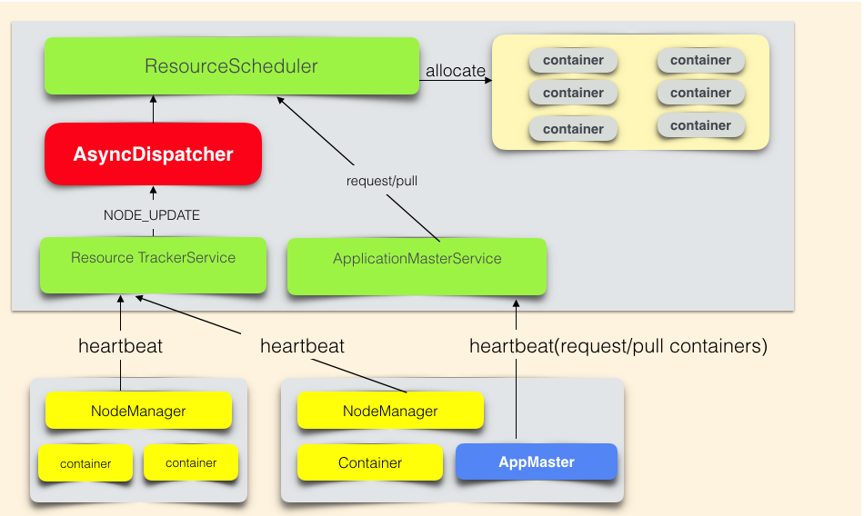
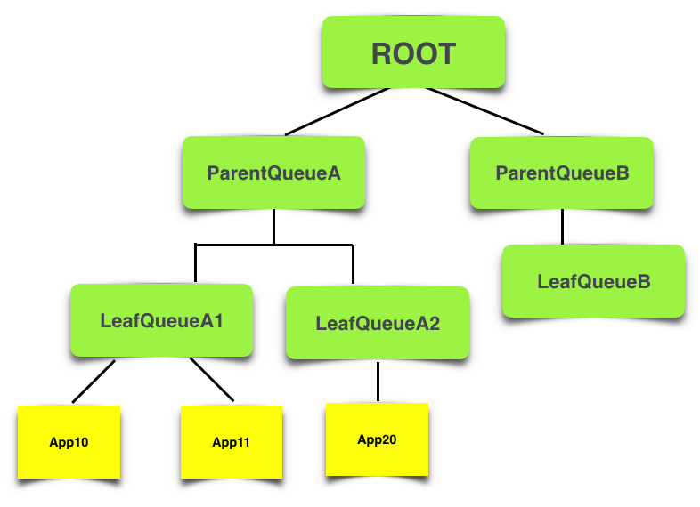
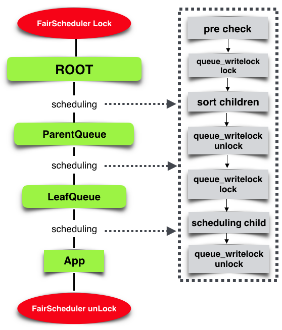
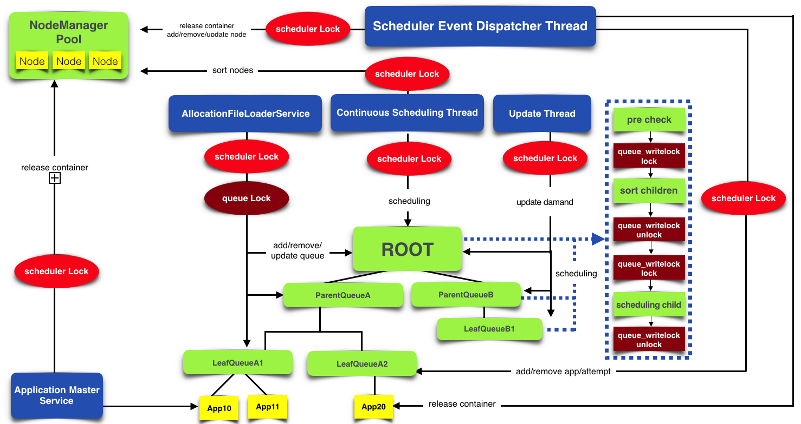
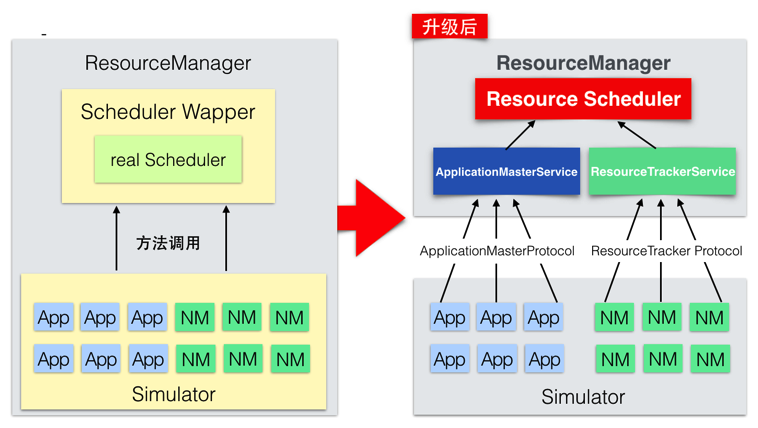
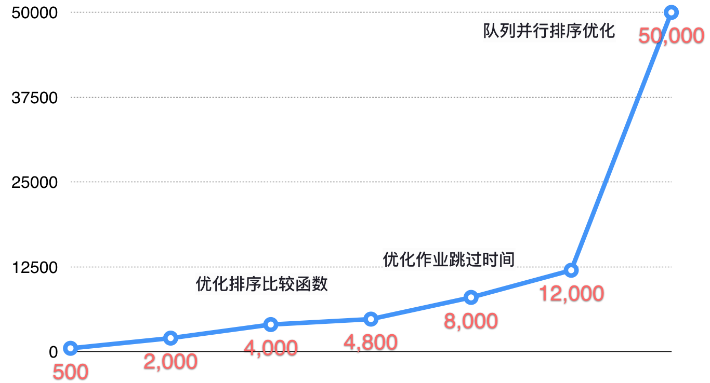
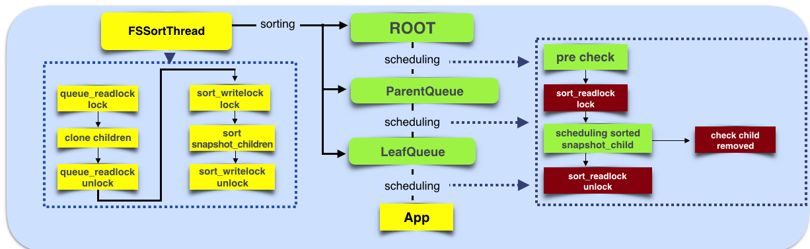

# Hadoop YARN：调度性能优化实践

## 1. 整体架构

### 1.1 YARN架构

YARN负责作业资源调度，在集群中找到满足业务的资源，帮助作业启动任务，管理作业的生命周期。

### 1.2 资源抽象

YARN在cpu，memory这两个资源维度对集群资源做了抽象。

```java
class Resource{
  int cpu;   //cpu核心个数
  int memory-mb; //内存的MB数
}
```

作业向YARN申请资源的请求是：List[ResourceRequest]

```java
class ResourceRequest{
  int numContainers; //需要的container个数
  Resource capability;//每个container的资源
}
```

YARN对作业响应是：List[Container]

```java
class Container{
  ContainerId containerId; //YARN全局唯一的container标示
  Resource capability;  //该container的资源信息
  String nodeHttpAddress; //该container可以启动的NodeManager的hostname
}
```

### 1.3 YARN调度架构



**名词解释**

- ResourceScheduler是YARN的调度器，负责Container的分配。
- AsyncDispatcher是单线程的事件分发器，负责向调度器发送调度事件。
- ResourceTrackerService是资源跟踪服务，主要负责接收处理NodeManager的心跳信息。
- ApplicationMasterService是作业的RPC服务，主要负责接收处理作业的心跳信息。
- AppMaster是作业的程序控制器，负责跟YARN交互获取/释放资源。

**调度流程**

- 作业资源申请过程：AppMaster通过心跳告知YARN资源需求(List[ResourceRequest])，并取回上次心跳之后，调度器已经分配好的资源(List[Container])。
- 调度器分配资源流程是：Nodemanager心跳触发调度器为该NodeManager分配Container。

资源申请和分配是异步进行的。ResourceScheduler是抽象类，需要自行实现。社区实现了公平调度器(FairScheduler)和容量调度器(CapacityScheduler)。大部分公司采用的是公平调度器。

### 1.4 公平调度器

#### 1.4.1 作业的组织方式

在公平调度器中，作业(App)是挂载如下图的树形队列的叶子。



#### 1.4.1 核心调度流程



1. 调度器锁住FairScheduler对象，避免核心数据结构冲突。
2. **调度器选取集群的一个节点(node)**，从树形队列的根节点ROOT开始出发，每层队列都会按照公平策略选择一个子队列，最后在叶子队列按照公平策略选择一个App，为这个App在node上找一块适配的资源。

对于每层队列进行如下流程：

1. 队列预先检查：检查队列的资源使用量是否已经超过了队列的Quota
2. 排序子队列/App：按照公平调度策略，对子队列/App进行排序
3. 递归调度子队列/App

例如，某次调度的路径是ROOT -> ParentQueueA -> LeafQueueA1 -> App11，这次调度会从node上给App11分配Container。

**伪代码**

```java
class FairScheduler{
  /* input：NodeId
   *  output：Resource 表示分配出来的某个app的一个container的资源量
   *  root 是树形队列Queue的根
   */
  synchronized Resource attemptScheduling(NodeId node){
    root.assignContainer(NodeId);
  }
}

class Queue{
  Resource assignContainer(NodeId node){
    if(! preCheck(node) ) return;  //预先检查
      sort(this.children);  //排序
    if(this.isParent){
      for(Queue q: this.children)
        q.assignContainer(node);  //递归调用
    }else{
      for(App app: this.runnableApps)
        app.assignContainer(node);
    }
  }
}

class App{
  Resource assignContainer(NodeId node){
    ......
  }
}
```

#### 公平调度器架构

公平调度器是一个**多线程异步协作的架构**，而为了保证调度过程中数据的一致性，在主要的流程中加入了FairScheduler对象锁。其中核心调度流程是单线程执行的。**这意味着Container分配是串行的，这是调度器存在性能瓶颈的核心原因**。



- scheduler Lock：FairScheduler对象锁
- AllocationFileLoaderService：负责公平策略配置文件的热加载，更新队列数据结构
- Continuous Scheduling Thread：核心调度线程，不停地执行上节的核心调度流程
- Update Thread：更新队列资源需求，执行Container抢占流程等
- Scheduler Event Dispatcher Thread: 调度器事件的处理器，处理App新增，App结束，node新增，node移除等事件

## 2. 性能评估

上文介绍了公平调度器的架构，在大规模的业务压力下，这个系统存在性能问题。从应用层的表现看，作业资源需求得不到满足。从系统模块看，多个模块协同工作，每个模块多多少少都存在性能问题。如何评估系统性能已经可以满足线上业务的需求？如何评估系统的业务承载能力？我们需要找到一个系统的性能目标。因此在谈性能优化方案之前，需要先说一说调度系统性能评估方法。

一般来说，在线业务系统的性能是用该系统能够承载的QPS和响应的TP99的延迟时间来评估，而调度系统与在线业务系统不同的是：调度系统的性能不能用RPC(ResourceManager接收NodeManager和AppMaster的RPC请求)的响应延迟来评估。原因是：这些RPC调用过程跟调度系统的调度过程是异步的，因此不论调度性能多么差，RPC响应几乎不受影响。同理，不论RPC响应多么差，调度性能也几乎不受影响。

### 2.1 业务指标-有效调度

首先从满足业务需求角度分析调度系统的业务指标。调度系统的业务目标是满足业务资源需求。指标是：有效调度(validSchedule)。在生产环境，只要validSchedule达标，我们就认为目前调度器是满足线上业务需求的。

定义validSchedulePerMin表示某一分钟的调度性能达标的情况。达标值为1，不达标值为0。

```java
validPending = min(queuePending, QueueMaxQuota)
if  (usage / total  > 90% || validPending == 0):   validSchedulePerMin = 1 //集群资源使用率高于90%，或者集群有效资源需求为0，这时调度器性能达标。
if (validPending > 0 &&  usage / total < 90%) : validSchedulePerMin = 0;//集群资源使用率低于90%，并且集群存在有效资源需求，这时调度器性能不达标。
```

- validPending表示集群中作业有效的资源需求量
- queuePending表示队列中所有作业的资源需求量
- QueueMaxQuota表示该队列资源最大限额
- usage表示集群已经使用的资源量
- total表示集群总体资源

设置90%的原因是：资源池中的每个节点可能都有一小部分资源因为无法满足任何的资源需求，出现的资源碎片问题。这个问题类似linux内存的碎片问题。由于离线作业的任务执行时间非常短，资源很快可以得到回收。在离线计算场景，调度效率的重要性远远大于更精确地管理集群资源碎片，因此离线调度策略暂时没有考虑资源碎片的问题。

validSchedulePerDay表示调度性能每天的达标率。 `validSchedulePerDay = ΣvalidSchedulePerMin /1440`

目前线上业务规模下，业务指标如下： `validSchedulePerMin > 0.9; validSchedulePerDay > 0.99`

### 2.2 系统性能指标-每秒调度Container数

调度系统的本质是为作业分配Container，因此提出调度系统性能指标CPS–每秒调度Container数。 在生产环境，只要validSchedule达标，表明目前调度器是满足线上业务需求的。而在测试环境，需要关注不同压力条件下的CPS，找到当前系统承载能力的上限，并进一步指导性能优化工作。

CPS是与测试压力相关的，测试压力越大，CPS可能越低。从上文公平调度器的架构可以看到，CPS跟如下信息相关：

- 集群总体资源数；集群资源越多，集群可以并发运行的的Container越多，对调度系统产生越大的调度压力。目前每台物理机的cpu、memory资源量差距不大，因此集群总体资源数主要看集群的物理机节点个数。
- 集群中正在运行的App数；作业数越多，需要调度的信息越多，调度压力越大。
- 集群中的队列个数；队列数越多，需要调度的信息越多，调度压力越大。
- 集群中每个任务的执行时间；任务执行时间越短会导致资源释放越快，那么动态产生的空闲资源越多，对调度系统产生的压力越大。

例如，集群1000个节点，同时运行1000个App，这些App分布在500个Queue上，每个App的每个Container执行时间是1分钟。在这样的压力条件下，调度系统在有大量资源需求的情况下，每秒可以调度1000个Container。那么在这个条件下，调度系统的CPS是1000/s。

### 2.3 调度压力模拟器

在线上环境中，我们可以通过观察上文提到的调度系统的指标来看当前调度性能是否满足业务需求。但我们做了一个性能优化策略，不能直接到在线上环境去实验，因此我们必须有能力在线下环境验证调度器的性能是满足业务需求的，之后才能把实验有效的优化策略推广到线上环境。

那我们在线下也搭建一套跟线上规模一样的集群，是否就可以进行调度器性能优化的分析和研究呢？理论上是可以的，但这需要大量的物理机资源，对公司来说是个巨大的成本。因此我们需要一个调度器的压力模拟器，在不需要大量物理机资源的条件下，能够模拟YARN的调度过程。

社区提供了开源调度器的压力模拟工具–Scheduler Load Simulater(SLS)。



如上图，左侧是开源SLS的架构图，整体都在一个进程中，ResourceManager模块里面有一个用线程模拟的Scheduler。App和NM(NodeManager)都是由线程模拟。作业资源申请和NM节点心跳采用方法调用。

开源架构存在的问题有：

- 模拟大规模APP和NM需要开启大量的线程，导致调度器线程和NM/App的模拟线程争抢cpu资源，影响调度器的评估。
- SLS的Scheduler Wapper中加入了不合理的逻辑，严重影响调度器的性能。
- SLS为了通用性考虑，没有侵入FairScheduler的调度过程获取性能指标，仅仅从外围获取了Queue资源需求，Queue资源使用量，App资源需求，App资源使用量等指标。这些指标都不是性能指标，无法利用这些指标分析系统性能瓶颈。

针对存在的问题，我们进行了架构改造。右侧是改造后的架构图，从SLS中剥离Scheduler Wapper的模拟逻辑，用真实的ResourceManager代替。SLS仅仅负责模拟作业的资源申请和节点的心跳汇报。ResourceManager是真实的，线上生产环境和线下压测环境暴露的指标是完全一样的，因此线上线下可以很直观地进行指标对比。

### 2.4 细粒度监控指标

利用调度压力模拟器进行压测，观察到validSchedule不达标，但依然不清楚性能瓶颈到底在哪里。因此需要细粒度指标来确定性能的瓶颈点。由于调度过程是单线程的，因此细粒度指标获取的手段是侵入FairScheduler，在调度流程中采集关键函数每分钟的时间消耗。目标是找到花费时间占比最多的函数，从而定位系统瓶颈。例如：在preCheck函数的前后加入时间统计，就可以收集到调度过程中preCheck消耗的时间。

基于以上的思路，我们定义了10多个细粒度指标，比较关键的指标有：

- 每分钟父队列preCheck时间
- 每分钟父队列排序时间
- 每分钟子队列preCheck时间
- 每分钟子队列排序时间
- 每分钟为作业分配资源的时间
- 每分钟因为作业无资源需求而花费的时间

## 3. 关键优化点

第一次做压测，给定的压力就是当时线上生产环境峰值的压力情况（1000节点、1000作业并发、500队列、单Container执行时间40秒）。经过优化后，调度器性能提升，满足业务需求，之后通过预估业务规模增长来调整测试压力，反复迭代地进行优化工作。

下图是性能优化时间线，纵轴为调度性能CPS。



### 3.1 优化排序比较函数

在核心调度流程中，第2步是排序子队列。观察细粒度指标，可以很清楚地看到每分钟调度流程总共用时50秒，其中排序时间占用了30秒，占了最大比例，因此首先考虑优化排序时间。

排序本身用的快速排序算法，已经没有优化空间。进一步分析排序比较函数，发现排序比较函数的时间复杂度非常高。

计算复杂度最高的部分是：需要获取队列/作业的资源使用情况(resourceUsage)。原算法中，每2个队列进行比较，需要获取resourceUsage的时候，程序都是现场计算。计算方式是递归累加该队列下所有作业的resourceUsage。这造成了巨大的重复计算量。

优化策略：**将现场计算优化为提前计算**。

提前计算算法：当为某个App分配了一个Container（资源量定义为containerResource），那么递归调整父队列的resourceUsage，让父队列的resourceUsage += containerResource。当释放某个App的一个Container，同样的道理，让父队列resourceUsage -= containerResource。 利用提前计算算法，队列resourceUsage的统计时间复杂度降低到O(1)。

### 3.2 优化作业跳过时间

从上图看，优化排序比较函数后，蓝色的线有明显的增加，从2秒增加到了20秒。这条蓝线指标含义是每分钟调度器跳过没有资源需求的作业花费的时间。从时间占比角度来看，目前优化目标是减少这条蓝线的时间。

分析代码发现，所有队列/作业都会参与调度。但其实很多队列/作业根本没有资源需求，并不需要参与调度。因此优化策略是：**在排序之前，从队列的Children中剔除掉没有资源需求的队列/作业**。

### 3.3 队列并行排序优化

从核心调度流程可以看出，分配每一个Container，都需要进行队列的排序。排序的时间会随着业务规模增加（作业数、队列数的增加）而线性增加。

架构思考：对于公平调度器来说，排序是为了实现公平的调度策略，但资源需求是时时刻刻变化的，每次变化，都会引起作业资源使用的不公平。即使分配每一个Container时都进行排序，也无法在整个时间轴上达成公平策略。

目前公平调度器的公平策略是保证集群在某一时刻资源调度的公平。在整个时间轴上是需要抢占策略来补充达到公平的目标。 因此从时间轴的角度考虑，没有必要在分配每一个Container时都进行排序。

综上分析，优化策略是排序过程与调度过程并行化。要点如下：

1. 调度过程不再进行排序的步骤。
2. 独立的线程池处理所有队列的排序，其中每个线程处理一个队列的排序。
3. 排序之前，通过深度克隆队列/作业中用于排序部分的信息，保证排序过程中队列/作业的数据结构不变。



