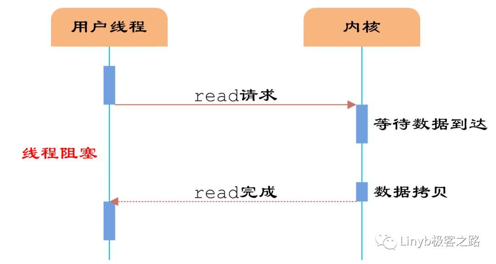
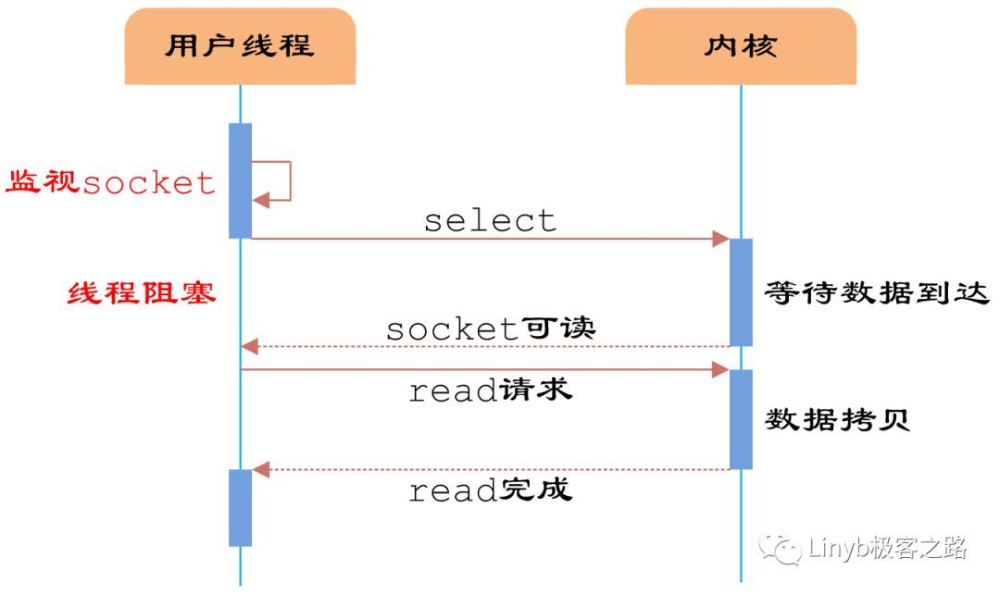
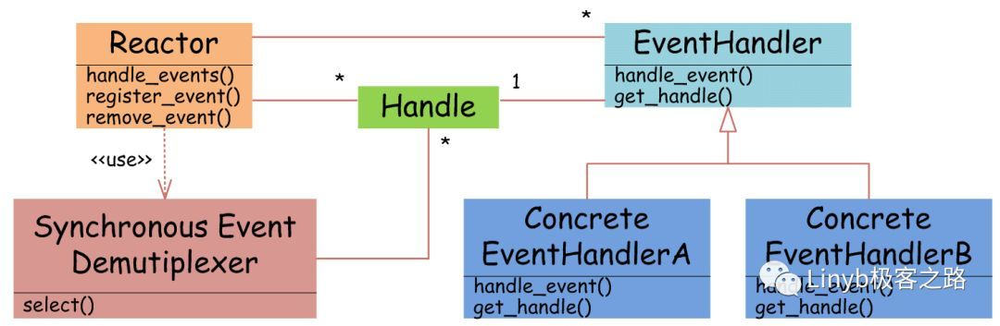
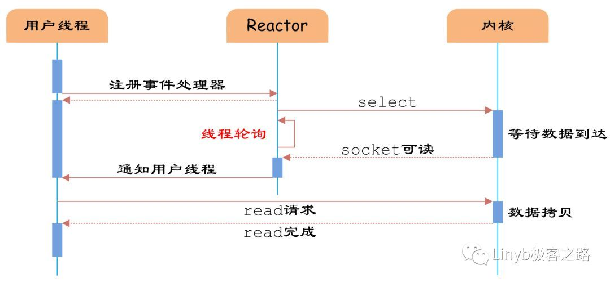
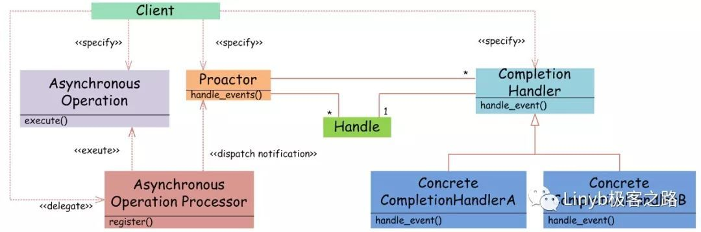
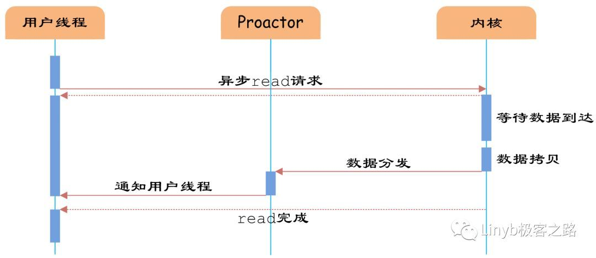

# IO 多路复用机制详解

服务器端编程经常需要构造高性能的 IO 模型，常见的 IO 模型有四种:

- 同步阻塞 IO(Blocking IO)：即传统的 IO 模型
- 同步非阻塞 IO(Non-blocking IO)：默认创建的 socket 都是阻塞的，非阻塞 IO 要求 socket 被设置为 NONBLOCK。注意这里所说的 NIO 并非 Java 的 NIO(New IO)
- IO 多路复用(IO Multiplexing)：经典的 Reactor 设计模式，有时也称为异步阻塞 IO，Java 中的 Selector 和 Linux 中的 epoll 都是这种模型
- 异步 IO(Asynchronous IO)：经典的 Proactor 设计模式，也称为异步非阻塞 IO

异步与同步概念描述的是用户线程与内核的交互方式：同步是指用户线程发起 IO 请求后需要等待或轮询内核 IO 操作完成后才能继续执行；异步是指用户线程发起 IO 请求后仍继续执行，当内核 IO 操作完成后会通知用户线程，或者调用用户线程注册的回调函数。

**阻塞**和**非阻塞**的概念描述的是用户线程调用内核 IO 操作的方式：阻塞是指 IO 操作需要彻底完成后才返回到用户空间；而非阻塞是指 IO 操作被调用后立即返回给用户一个状态值，无需等到 IO 操作彻底完成。

## 1. 同步阻塞 IO

同步阻塞 IO 模型是最简单的 IO 模型，用户线程在内核进行 IO 操作时被阻塞。



用户线程通过系统调用 read 发起 IO 读操作，由用户空间转到内核空间。内核等到数据包到达后，然后将接收的数据拷贝到用户空间，完成 read 操作。

用户线程使用同步阻塞 IO 模型的伪代码描述为：

```java
{
    read(socket, buffer);

    process(buffer);

}
```

用户需要等待 read 将 socket 中的数据读取到 buffer 后，才继续处理接收的数据。整个 IO 请求的过程中，用户线程是被阻塞的，这导致用户在发起 IO 请求时，不能做任何事情，对 CPU 的资源利用率不够。

## 2. 同步非阻塞 IO

同步非阻塞 IO 是在同步阻塞 IO 的基础上，将 socket 设置为 NONBLOCK。这样做用户线程可以在发起 IO 请求后可以立即返回。



由于 socket 是非阻塞的方式，因此用户线程发起 IO 请求时立即返回，但并未读取到任何数据，用户线程需要不断地发起 IO 请求，直到数据到达后，才真正读取到数据，继续执行。

用户线程使用同步非阻塞 IO 模型的伪代码描述为：

```java
{
    while(read(socket, buffer) != SUCCESS){
    }
    process(buffer);
}
```

即用户需要不断地调用 read，尝试读取 socket 中的数据，直到读取成功后，才继续处理接收的数据。整个 IO 请求的过程中，虽然用户线程每次发起 IO 请求后可以立即返回，但是为了等到数据，仍需要不断地轮询、重复请求，消耗了大量的 CPU 的资源。一般很少直接使用这种模型，而是在其他 IO 模型中使用非阻塞 IO 这一特性。

## 3. IO 多路复用

IO 多路复用模型是建立在内核提供的多路分离函数 select 基础之上的，使用 select 函数可以避免同步非阻塞 IO 模型中轮询等待的问题。


如上图所示，用户首先将需要 IO 操作的 socket 添加到 select 中，然后阻塞等待 select 系统调用返回。当数据到达时，socket 被激活，select 函数返回，用户线程真正发起 read 请求，读取数据并继续执行。

从流程上来看，使用 select 函数进行 IO 请求和同步阻塞模型没有太大的区别，甚至还多了添加监视 socket，以及调用 select 函数的额外操作，效率更差。但是，使用 select 以后最大的优势是用户可以在一个线程内同时处理多个 socket 的 IO 请求。用户可以注册多个 socket，然后不断地调用 select 读取被激活的 socket，即可达到在同一个线程内同时处理多个 IO 请求的目的。而在同步阻塞模型中，必须通过多线程的方式才能达到这个目的。

用户线程使用 select 函数的伪代码描述为：

```java
{
  select(socket);
  while(1){
      sockets = select();
      for(socket in sockets) {
          if(can_read(socket)) {
              read(socket, buffer);
              process(buffer);
          }
      }
  }
}
```

while循环前将socket添加到select监视中，然后在while内一直调用select获取被激活的socket，一旦socket可读，便调用read函数将socket中的数据读取出来。

然而，使用select函数的优点并不仅限于此。虽然上述方式允许单线程内处理多个IO请求，但是每个IO请求的过程还是阻塞的（在select函数上阻塞），平均时间甚至比同步阻塞IO模型还要长。如果用户线程只注册自己感兴趣的socket或者IO请求，然后去做自己的事情，等到数据到来时再进行处理，则可以提高CPU的利用率。

IO多路复用模型使用了Reactor设计模式实现了这一机制。



如上图所示，EventHandler抽象类表示IO事件处理器，它拥有IO文件句柄Handle(通过get_handle获取)，以及对Handle的操作handle_event(读/写等)。继承于EventHandler的子类可以对事件处理器的行为进行定制。Reactor类用于管理EventHandler(注册、删除等)，并使用handle_events实现事件循环，不断调用同步事件多路分离器(一般是内核)的多路分离函数select，只要某个文件句柄被激活(可读/写等)，select就返回(阻塞)，handle_events就会调用与文件句柄关联的事件处理器的handle_event进行相关操作。



如图5所示，通过Reactor的方式，可以将用户线程轮询IO操作状态的工作统一交给handle_events事件循环进行处理。用户线程注册事件处理器之后可以继续执行做其他的工作（异步），而Reactor线程负责调用内核的select函数检查socket状态。当有socket被激活时，则通知相应的用户线程（或执行用户线程的回调函数），执行handle_event进行数据读取、处理的工作。由于select函数是阻塞的，因此多路IO复用模型也被称为异步阻塞IO模型。注意，这里的所说的阻塞是指select函数执行时线程被阻塞，而不是指socket。一般在使用IO多路复用模型时，socket都是设置为NONBLOCK的，不过这并不会产生影响，因为用户发起IO请求时，数据已经到达了，用户线程一定不会被阻塞。

IO多路复用是最常使用的IO模型，但是其异步程度还不够“彻底”，因为它使用了会阻塞线程的select系统调用。因此IO多路复用只能称为异步阻塞IO，而非真正的异步IO。

## 4. 异步IO

“真正”的异步IO需要操作系统更强的支持。在IO多路复用模型中，事件循环将文件句柄的状态事件通知给用户线程，由用户线程自行读取数据、处理数据。而在异步IO模型中，当用户线程收到通知时，数据已经被内核读取完毕，并放在了用户线程指定的缓冲区内，内核在IO完成后通知用户线程直接使用即可。

异步IO模型使用了Proactor设计模式实现了这一机制。



Proactor模式和Reactor模式在结构上比较相似，不过在用户（Client）使用方式上差别较大。Reactor模式中，用户线程通过向Reactor对象注册感兴趣的事件监听，然后事件触发时调用事件处理函数。而Proactor模式中，用户线程将AsynchronousOperation（读/写等）、Proactor以及操作完成时的CompletionHandler注册到AsynchronousOperationProcessor。AsynchronousOperationProcessor使用Facade模式提供了一组异步操作API（读/写等）供用户使用，当用户线程调用异步API后，便继续执行自己的任务。AsynchronousOperationProcessor 会开启独立的内核线程执行异步操作，实现真正的异步。当异步IO操作完成时，AsynchronousOperationProcessor将用户线程与AsynchronousOperation一起注册的Proactor和CompletionHandler取出，然后将CompletionHandler与IO操作的结果数据一起转发给Proactor，Proactor负责回调每一个异步操作的事件完成处理函数handle_event。虽然Proactor模式中每个异步操作都可以绑定一个Proactor对象，但是一般在操作系统中，Proactor被实现为Singleton模式，以便于集中化分发操作完成事件。



如上图所示，异步IO模型中，用户线程直接使用内核提供的异步IO API发起read请求，且发起后立即返回，继续执行用户线程代码。不过此时用户线程已经将调用的AsynchronousOperation和CompletionHandler注册到内核，然后操作系统开启独立的内核线程去处理IO操作。当read请求的数据到达时，由内核负责读取socket中的数据，并写入用户指定的缓冲区中。最后内核将read的数据和用户线程注册的CompletionHandler分发给内部Proactor，Proactor将IO完成的信息通知给用户线程（一般通过调用用户线程注册的完成事件处理函数），完成异步IO。

```java
void UserCompletionHandler::handle_event(buffer) {

process(buffer);

}

{

aio_read(socket, new UserCompletionHandler);

}
```

用户需要重写CompletionHandler的handle_event函数进行处理数据的工作，参数buffer表示Proactor已经准备好的数据，用户线程直接调用内核提供的异步IO API，并将重写的CompletionHandler注册即可。

相比于IO多路复用模型，异步IO并不十分常用，不少高性能并发服务程序使用IO多路复用模型+多线程任务处理的架构基本可以满足需求。况且目前操作系统对异步IO的支持并非特别完善，更多的是采用IO多路复用模型模拟异步IO的方式（IO事件触发时不直接通知用户线程，而是将数据读写完毕后放到用户指定的缓冲区中）。Java7之后已经支持了异步IO，感兴趣的读者可以尝试使用。