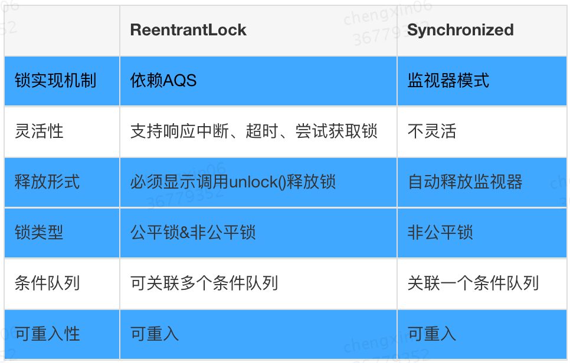
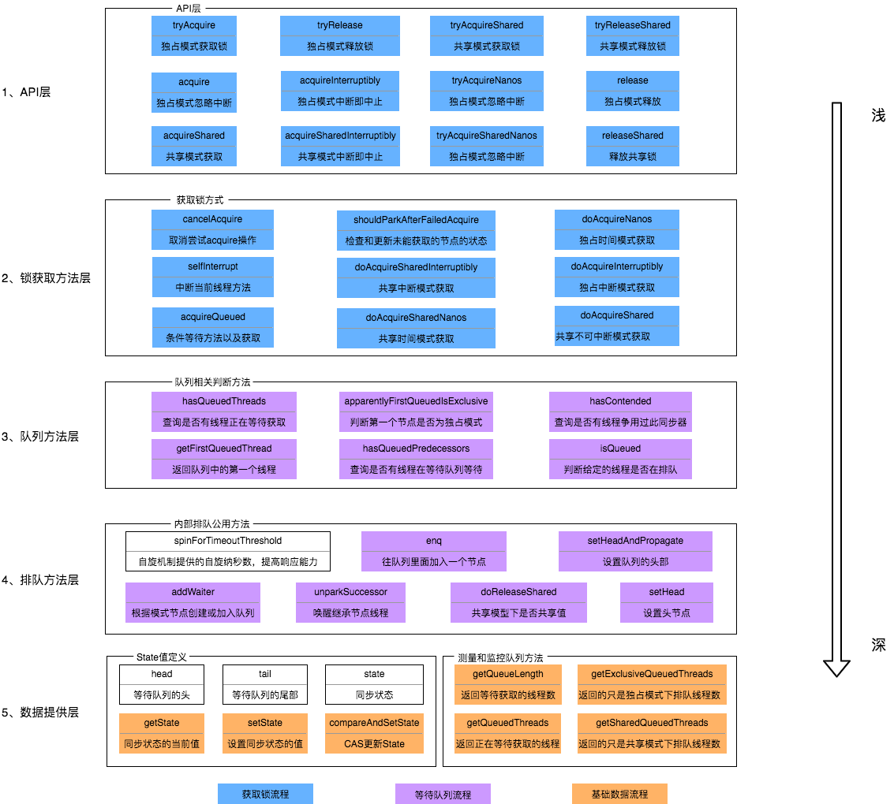
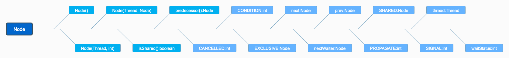
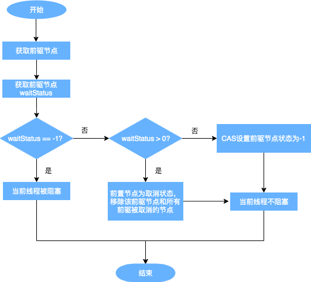

# AQS的原理及应用

文章摘自美团技术沙龙——[从ReentrantLock的实现看AQS的原理及应用](https://tech.meituan.com/2019/12/05/aqs-theory-and-apply.html)

## 前言

Java中的大部分同步类(Lock、Semaphore、ReentrantLock等)都是基于AbstractQueuedSynchronizer(简称为AQS)实现的。AQS是一种提供了原子式管理同步状态、阻塞和唤醒线程功能以及队列模型的简单框架。本文会从应用层逐渐深入到原理层，并通过ReentrantLock的基本特性和ReentrantLock与AQS的关联，来深入解读AQS相关**独占锁**的知识点，同时采取问答的模式来帮助大家理解AQS。由于篇幅原因，本篇文章主要阐述AQS中独占锁的逻辑和Sync Queue，不讲述包含共享锁和Condition Queue的部分(本篇文章核心为AQS原理剖析，只是简单介绍了ReentrantLock，感兴趣同学可以阅读一下ReentrantLock的源码)。


## 1. ReentrantLock

### 1.1 ReentrantLock特性概览

ReentrantLock意思为可重入锁，指的是**一个线程能够对一个临界资源重复加锁**。为了帮助大家更好地理解ReentrantLock的特性，我们先将ReentrantLock跟常用的Synchronized进行比较，其特性如下（蓝色部分为本篇文章主要剖析的点）：



下面通过伪代码，进行更加直观的比较：

```java
// **************************Synchronized的使用方式**************************
// 1.用于代码块
synchronized (this) {}
// 2.用于对象
synchronized (object) {}
// 3.用于方法
public synchronized void test () {}
// 4.可重入
for (int i = 0; i < 100; i++) {
	synchronized (this) {}
}
// **************************ReentrantLock的使用方式**************************
public void test () throw Exception {
	// 1.初始化选择公平锁、非公平锁
	ReentrantLock lock = new ReentrantLock(true);
	// 2.可用于代码块
	lock.lock();
	try {
		try {
			// 3.支持多种加锁方式，比较灵活; 具有可重入特性
			if(lock.tryLock(100, TimeUnit.MILLISECONDS)){ }
		} finally {
			// 4.手动释放锁
			lock.unlock()
		}
	} finally {
		lock.unlock();
	}
}
```

### 1.2 ReentrantLock与AQS的关联

ReentrantLock支持公平锁和非公平锁，，并且ReentrantLock的底层就是由AQS来实现的。那么ReentrantLock是如何通过公平锁和非公平锁与AQS关联起来呢？ 我们着重从这两者的加锁过程来理解一下它们与AQS之间的关系(加锁过程中与AQS的关联比较明显，解锁流程后续会介绍)。

**非公平锁**源码中的加锁流程如下

```java
// java.util.concurrent.locks.ReentrantLock#NonfairSync

// 非公平锁
static final class NonfairSync extends Sync {
	...
	final void lock() {
		if (compareAndSetState(0, 1))
			setExclusiveOwnerThread(Thread.currentThread());
		else
			acquire(1);
		}
  ...
}
```

这块代码的含义为：

- 若通过CAS设置变量State(同步状态)成功，也就是获取锁成功，则将当前线程设置为独占线程。
- 若通过CAS设置变量State(同步状态)失败，也就是获取锁失败，则进入Acquire方法进行后续处理。

第一步很好理解，但第二步获取锁失败后，后续的处理策略是怎么样的呢？这块可能会有以下思考：

**问题1：**某个线程获取锁失败的后续流程是什么呢？有以下两种可能：

- 将当前线程获锁结果设置为失败，获取锁流程结束。这种设计会极大降低系统的并发度(我的理解是：这样会导致频繁的线程切换，因为业务处理流程中获取锁失败一般意味着请求失败)，并不满足我们实际的需求。所以就需要下面这种流程，也就是AQS框架的处理流程
- 存在某种排队等候机制，线程继续等待，仍然保留获取锁的可能，获取锁流程仍在继续

对于问题1的第二种情况，既然说到了排队等候机制，那么就会引出以下几个问题：

1. 排队等候机制就一定会有某种队列形成，这样的队列是什么数据结构呢？
2. 处于排队等候机制中的线程，什么时候可以有机会获取锁呢？
3. 如果处于排队等候机制中的线程一直无法获取锁，还是需要一直等待吗，还是有别的策略来解决这一问题？

带着非公平锁的这些问题，再看下**公平锁源码**中获锁的方式：

```java
// java.util.concurrent.locks.ReentrantLock#FairSync

static final class FairSync extends Sync {
  ...  
	final void lock() {
		acquire(1);
	}
  ...
}
```

看到这块代码，我们可能会存在这种疑问：Lock函数通过Acquire方法进行加锁，但是具体是如何加锁的呢？

结合公平锁和非公平锁的加锁流程，虽然流程上有一定的不同，但是都调用了Acquire方法，而Acquire方法是FairSync和UnfairSync的父类AQS中的核心方法。

对于上边提到的问题，其实在ReentrantLock类源码中都无法解答，而这些问题的答案，都是位于Acquire方法所在的类AbstractQueuedSynchronizer中，也就是本文的核心——AQS。下面我们会对AQS以及ReentrantLock和AQS的关联做详细介绍(相关问题答案会在2.3.5小节中解答)。

## 2. AQS

首先，我们通过下面的架构图来整体了解一下AQS框架：



上图中有颜色的为Method，无颜色的为Attribution。

总的来说，AQS框架共分为五层，自上而下由浅入深，从AQS对外暴露的API到底层基础数据。

当有自定义同步器接入时，只需重写第一层所需要的部分方法即可，不需要关注底层具体的实现流程。当自定义同步器进行加锁或者解锁操作时，先经过第一层的API进入AQS内部方法，然后经过第二层进行锁的获取，接着对于获取锁失败的流程，进入第三层和第四层的等待队列处理，而这些处理方式均依赖于第五层的基础数据提供层。

下面我们会从整体到细节，从流程到方法逐一剖析AQS框架，主要分析过程如下：


### 2.1 原理概览

**AQS核心思想：**如果被请求的共享资源空闲，那么就将当前请求资源的线程设置为有效的工作线程，将共享资源设置为锁定状态；如果共享资源被占用，就需要一定的阻塞等待唤醒机制来保证锁分配。这个机制主要用的是**CLH队列**的变体实现的，将暂时获取不到锁的线程加入到队列中。

**CLH**：Craig、Landin and Hagersten队列，是单向链表，AQS中的队列是CLH变体的虚拟双向队列(FIFO)，**AQS是通过将每条请求共享资源的线程封装成一个节点来实现锁的分配**。

主要原理图如下：


AQS使用一个Volatile的int类型的成员变量来表示同步状态，通过内置的FIFO队列来完成资源获取的排队工作，通过**CAS完成对State值的修改**。

#### 2.1.1 AQS数据结构

先来看下AQS中最基本的数据结构——Node，Node即为上面CLH变体队列中的节点。



解释一下几个方法和属性值的含义：

| 方法和属性值 | 含义                                                         |
| :----------- | :----------------------------------------------------------- |
| waitStatus   | 当前节点在队列中的状态                                       |
| thread       | 表示处于该节点的线程                                         |
| prev         | 前驱指针                                                     |
| predecessor  | 返回前驱节点，没有的话抛出npe                                |
| nextWaiter   | 指向下一个处于CONDITION状态的节点（由于本篇文章不讲述Condition Queue队列，这个指针不多介绍） |
| next         | 后继指针                                                     |

线程两种锁的模式：

| 模式      | 含义                           |
| :-------- | :----------------------------- |
| SHARED    | 表示线程以共享的模式等待锁     |
| EXCLUSIVE | 表示线程正在以独占的方式等待锁 |

waitStatus有下面几个枚举值：

| 枚举      | 含义                                           |
| :-------- | :--------------------------------------------- |
| 0         | 当一个Node被初始化的时候的默认值               |
| CANCELLED | 为1，表示线程获取锁的请求已经取消了            |
| CONDITION | 为-2，表示节点在等待队列中，节点线程等待唤醒   |
| PROPAGATE | 为-3，当前线程处在SHARED情况下，该字段才会使用 |
| SIGNAL    | 为-1，表示线程已经准备好了，就等资源释放了     |

#### 2.1.2 State同步状态

在了解数据结构后，接下来了解一下AQS的同步状态——State。AQS中维护了一个名为state的字段，意为同步状态，是由Volatile修饰的，用于展示当前临界资源的获锁情况。

```java
// java.util.concurrent.locks.AbstractQueuedSynchronizer

private volatile int state;
```

下面提供了几个访问State字段的方法：

| 方法名                                                       | 描述                 |
| :----------------------------------------------------------- | :------------------- |
| protected final int getState()                               | 获取State的值        |
| protected final void setState(int newState)                  | 设置State的值        |
| protected final boolean compareAndSetState(int expect, int update) | 使用CAS方式更新State |

这几个方法都是Final修饰的，说明子类中无法重写它们。我们可以通过修改State字段表示的同步状态来实现多线程的独占模式和共享模式(加锁过程)。


对于我们自定义的同步工具，需要自定义获取同步状态和释放状态的方式，也就是AQS架构图中的第一层：API层。

## 2.2 AQS重要方法与ReentrantLock的关联

从架构图中可以得知，AQS提供了大量用于自定义同步器实现的Protected方法。自定义同步器实现的相关方法也只是为了通过修改State字段来实现多线程的独占模式或者共享模式。自定义同步器需要实现以下方法(ReentrantLock需要实现的方法如下，并不是全部)：

| 方法名                                      | 描述                                                         |
| :------------------------------------------ | :----------------------------------------------------------- |
| protected boolean isHeldExclusively()       | 该线程是否正在独占资源。只有用到Condition才需要去实现它。    |
| protected boolean tryAcquire(int arg)       | 独占方式。arg为获取锁的次数，尝试获取资源，成功则返回True，失败则返回False。 |
| protected boolean tryRelease(int arg)       | 独占方式。arg为释放锁的次数，尝试释放资源，成功则返回True，失败则返回False。 |
| protected int tryAcquireShared(int arg)     | 共享方式。arg为获取锁的次数，尝试获取资源。负数表示失败；0表示成功，但没有剩余可用资源；正数表示成功，且有剩余资源。 |
| protected boolean tryReleaseShared(int arg) | 共享方式。arg为释放锁的次数，尝试释放资源，如果释放后允许唤醒后续等待结点返回True，否则返回False。 |

一般来说，自定义同步器要么是独占方式，要么是共享方式，它们也只需实现tryAcquire-tryRelease、tryAcquireShared-tryReleaseShared中的一种即可。AQS也支持自定义同步器同时实现独占和共享两种方式，如ReentrantReadWriteLock。ReentrantLock是独占锁，所以实现了tryAcquire-tryRelease。

以非公平锁为例，这里主要阐述一下非公平锁与AQS之间方法的关联之处，具体每一处核心方法的作用会在文章后面详细进行阐述。


为了帮助大家理解ReentrantLock和AQS之间方法的交互过程，以非公平锁为例，我们将加锁和解锁的交互流程单独拎出来强调一下，以便于对后续内容的理解。


**加锁**

- 通过ReentrantLock的加锁方法Lock进行加锁操作。
- 会调用到内部类Sync的Lock方法，由于Sync#lock是抽象方法，根据ReentrantLock初始化选择的公平锁(fairSync)和非公平锁(NofairSync)，执行相关内部类的Lock方法，本质上都会执行AQS的Acquire方法。
- AQS的Acquire方法会执行tryAcquire方法，但是由于tryAcquire需要自定义同步器实现，因此执行了ReentrantLock中的tryAcquire方法，由于ReentrantLock是通过公平锁和非公平锁内部类实现的tryAcquire方法，因此会根据锁类型不同，执行不同的tryAcquire。
- tryAcquire是获取锁逻辑，获取失败后，会执行框架AQS的后续逻辑，跟ReentrantLock自定义同步器无关

**解锁**

- 通过ReentrantLock的解锁方法Unlock进行解锁
- Unlock会调用内部类Sync的Release方法，该方法继承于AQS
- Release中会调用tryRelease方法，tryRelease需要自定义同步器实现，tryRelease只在ReentrantLock中的Sync实现，因此可以看出，释放锁的过程，并不区分是否为公平锁
- 释放成功后，所有处理由AQS框架完成，与自定义同步器无关

通过上面的描述，大概可以总结出ReentrantLock加锁解锁时API层核心方法的映射关系。


## 2.3 通过ReentrantLock理解AQS

ReentrantLock中公平锁和非公平锁在底层是相同的，这里以非公平锁为例进行分析。

在非公平锁中，有一段这样的代码：

```java
// java.util.concurrent.locks.ReentrantLock

static final class NonfairSync extends Sync {
	...
	final void lock() {
		if (compareAndSetState(0, 1))
			setExclusiveOwnerThread(Thread.currentThread());
		else
			acquire(1);
	}
  ...
}
```

看一下这个Acquire是怎么写的：

```java
// java.util.concurrent.locks.AbstractQueuedSynchronizer

public final void acquire(int arg) {
	if (!tryAcquire(arg) && acquireQueued(addWaiter(Node.EXCLUSIVE), arg))
		selfInterrupt();
}
```

再看一下tryAcquire方法：

```java
// java.util.concurrent.locks.AbstractQueuedSynchronizer

protected boolean tryAcquire(int arg) {
	throw new UnsupportedOperationException();
}
```

可以看出，这里只是AQS的简单实现，具体获取锁的实现方法是由各自的公平锁和非公平锁单独实现的(例如ReentrantLock)。如果该方法返回了True，则说明当前线程获取锁成功，就不用往后执行了；如果获取失败，就需要加入到等待队列中。下面会详细解释线程是何时以及怎样被加入进等待队列中的。

### 2.3.1 线程加入等待队列

#### 2.3.1.1 加入队列的时机

当执行Acquire(1)时，会通过tryAcquire获取锁。在这种情况下，如果获取锁失败，就会调用addWaiter加入到等待队列中去。

#### 2.3.1.2 加入队列的方式

获取锁失败后，会执行addWaiter(Node.EXCLUSIVE)加入等待队列，具体实现方法如下：

```java
// java.util.concurrent.locks.AbstractQueuedSynchronizer

private Node addWaiter(Node mode) {
	Node node = new Node(Thread.currentThread(), mode);
	// Try the fast path of enq; backup to full enq on failure
	Node pred = tail;
	if (pred != null) {
		node.prev = pred;
		if (compareAndSetTail(pred, node)) {
			pred.next = node;
			return node;
		}
	}
	enq(node);
	return node;
}

private final boolean compareAndSetTail(Node expect, Node update) {
	return unsafe.compareAndSwapObject(this, tailOffset, expect, update);
}
```

主要流程如下：

- 通过当前的线程和锁模式新建一个节点。
- Pred指针指向尾节点Tail。
- 将New中Node的Prev指针指向Pred。
- 通过compareAndSetTail方法，完成尾节点的设置。这个方法主要是对tailOffset和Expect进行比较，如果tailOffset的Node和Expect的Node地址是相同的，那么设置Tail的值为Update的值。

```java
// java.util.concurrent.locks.AbstractQueuedSynchronizer

static {
	try {
		stateOffset = unsafe.objectFieldOffset(AbstractQueuedSynchronizer.class.getDeclaredField("state"));
		headOffset = unsafe.objectFieldOffset(AbstractQueuedSynchronizer.class.getDeclaredField("head"));
		tailOffset = unsafe.objectFieldOffset(AbstractQueuedSynchronizer.class.getDeclaredField("tail"));
		waitStatusOffset = unsafe.objectFieldOffset(Node.class.getDeclaredField("waitStatus"));
		nextOffset = unsafe.objectFieldOffset(Node.class.getDeclaredField("next"));
	} catch (Exception ex) { 
    throw new Error(ex); 
  }
}
```

从AQS的静态代码块可以看出，都是获取一个对象的属性相对于该对象在内存当中的偏移量，这样我们就可以根据这个偏移量在对象内存当中找到这个属性。tailOffset指的是tail对应的偏移量，所以这个时候会将new出来的Node置为当前队列的尾节点。同时，由于是双向链表，也需要将前一个节点指向尾节点。

如果Pred指针是Null（说明等待队列中没有元素），或者当前Pred指针和Tail指向的位置不同（说明被别的线程已经修改），就需要看一下Enq的方法。

```java
// java.util.concurrent.locks.AbstractQueuedSynchronizer

private Node enq(final Node node) {
	for (;;) {
		Node t = tail;
		if (t == null) { // Must initialize
			if (compareAndSetHead(new Node()))
				tail = head;
		} else {
			node.prev = t;
			if (compareAndSetTail(t, node)) {
				t.next = node;
				return t;
			}
		}
	}
}
```

如果没有被初始化，需要进行初始化一个头结点出来。但请注意，初始化的头结点并不是当前线程节点，而是调用了无参构造函数的节点。如果经历了初始化或者并发导致队列中有元素，则与之前的方法相同。其实，addWaiter就是一个在双端链表添加尾节点的操作，需要注意的是，双端链表的头结点是一个无参构造函数的头结点。

总结一下，线程获取锁的时候，过程大体如下：

1. 当没有线程获取到锁时，线程1获取锁成功。
2. 线程2申请锁，但是锁被线程1占有。


**如果再有线程要获取锁，依次在队列中往后排队即可**

hasQueuedPredecessors是公平锁加锁时判断等待队列中是否存在有效节点的方法。如果返回False，说明当前线程可以争取共享资源；如果返回True，说明队列中存在有效节点，当前线程必须加入到等待队列中。

```java
// java.util.concurrent.locks.ReentrantLock

public final boolean hasQueuedPredecessors() {
	// The correctness of this depends on head being initialized
	// before tail and on head.next being accurate if the current
	// thread is first in queue.
	Node t = tail; // Read fields in reverse initialization order
	Node h = head;
	Node s;
	return h != t && ((s = h.next) == null || s.thread != Thread.currentThread());
}
```

看到这里，我们理解一下h != t && ((s = h.next) == null || s.thread != Thread.currentThread());为什么要判断的头结点的下一个节点？第一个节点储存的数据是什么？

> 双向链表中，第一个节点为虚节点，其实并不存储任何信息，只是占位。真正的第一个有数据的节点，是在第二个节点开始的。当h != t时： 如果(s = h.next) == null，等待队列正在有线程进行初始化，但只是进行到了Tail指向Head，没有将Head指向Tail，此时队列中有元素，需要返回True(这块具体见下边代码分析)。如果(s = h.next) != null，说明此时队列中至少有一个有效节点，如果此时s.thread == Thread.currentThread()，说明等待队列的第一个有效节点中的线程与当前线程相同，那么当前线程是可以获取资源的；如果s.thread != Thread.currentThread()，说明等待队列的第一个有效节点线程与当前线程不同，当前线程必须加入进等待队列。

```java
// java.util.concurrent.locks.AbstractQueuedSynchronizer#enq

if (t == null) { // Must initialize
	if (compareAndSetHead(new Node()))
		tail = head;
} else {
	node.prev = t;
	if (compareAndSetTail(t, node)) {
		t.next = node;
		return t;
	}
}
```

节点入队不是原子操作，所以会出现短暂的head != tail，此时Tail指向最后一个节点，而且Tail指向Head。如果Head没有指向Tail(可见5、6、7行)，这种情况下也需要将相关线程加入队列中。所以这块代码是为了解决极端情况下的并发问题。

#### 2.3.1.3 等待队列中线程出队列时机

回到最初的源码：

```java
// java.util.concurrent.locks.AbstractQueuedSynchronizer

public final void acquire(int arg) {
	if (!tryAcquire(arg) && acquireQueued(addWaiter(Node.EXCLUSIVE), arg))
		selfInterrupt();
}
```

上文解释了addWaiter方法，这个方法其实就是把对应的线程以Node的数据结构形式加入到双端队列里，返回的是一个包含该线程的Node。而这个Node会作为参数，进入到acquireQueued方法中。acquireQueued方法可以对排队中的线程进行“获锁”操作。

总的来说，一个线程获取锁失败了，被放入等待队列，acquireQueued会把放入队列中的线程不断去获取锁，直到获取成功或者不再需要获取(中断)。

下面我们从“何时出队列？”和“如何出队列？”两个方向来分析一下acquireQueued源码：

```java
// java.util.concurrent.locks.AbstractQueuedSynchronizer

final boolean acquireQueued(final Node node, int arg) {
	// 标记是否成功拿到资源
	boolean failed = true;
	try {
		// 标记等待过程中是否中断过
		boolean interrupted = false;
		// 开始自旋，要么获取锁，要么中断
		for (;;) {
			// 获取当前节点的前驱节点
			final Node p = node.predecessor();
			// 如果p是头结点，说明当前节点在真实数据队列的首部，就尝试获取锁（别忘了头结点是虚节点）
			if (p == head && tryAcquire(arg)) {
				// 获取锁成功，头指针移动到当前node
				setHead(node);
				p.next = null; // help GC
				failed = false;
				return interrupted;
			}
			// 说明p为头节点且当前没有获取到锁（可能是非公平锁被抢占了）或者是p不为头结点，这个时候就要判断当前node是否要被阻塞（被阻塞条件：前驱节点的waitStatus为-1），防止无限循环浪费资源。具体两个方法下面细细分析
			if (shouldParkAfterFailedAcquire(p, node) && parkAndCheckInterrupt())
				interrupted = true;
		}
	} finally {
		if (failed)
			cancelAcquire(node);
	}
}
```

注：setHead方法是把当前节点置为虚节点，但并没有修改waitStatus，因为它是一直需要用的数据。

```java
// java.util.concurrent.locks.AbstractQueuedSynchronizer

private void setHead(Node node) {
	head = node;
	node.thread = null;
	node.prev = null;
}

// java.util.concurrent.locks.AbstractQueuedSynchronizer

// 靠前驱节点判断当前线程是否应该被阻塞
private static boolean shouldParkAfterFailedAcquire(Node pred, Node node) {
	// 获取头结点的节点状态
	int ws = pred.waitStatus;
	// 说明头结点处于唤醒状态
	if (ws == Node.SIGNAL)
		return true; 
	// 通过枚举值我们知道waitStatus>0是取消状态
	if (ws > 0) {
		do {
			// 循环向前查找取消节点，把取消节点从队列中剔除
			node.prev = pred = pred.prev;
		} while (pred.waitStatus > 0);
		pred.next = node;
	} else {
		// 设置前任节点等待状态为SIGNAL
		compareAndSetWaitStatus(pred, ws, Node.SIGNAL);
	}
	return false;
}
```

parkAndCheckInterrupt主要用于挂起当前线程，阻塞调用栈，返回当前线程的中断状态。

```java
// java.util.concurrent.locks.AbstractQueuedSynchronizer

private final boolean parkAndCheckInterrupt() {
    LockSupport.park(this);
    return Thread.interrupted();
}
```


从上图可以看出，跳出当前循环的条件是当“前置节点是头结点，且当前线程获取锁成功”。为了防止因死循环导致CPU资源被浪费，我们会判断前置节点的状态来决定是否要将当前线程挂起，具体挂起流程用流程图表示如下（shouldParkAfterFailedAcquire流程）：



从队列中释放节点的疑虑打消了，那么又有新问题了：

- shouldParkAfterFailedAcquire中取消节点是怎么生成的呢？什么时候会把一个节点的waitStatus设置为-1？
- 是在什么时间释放节点通知到被挂起的线程呢？

