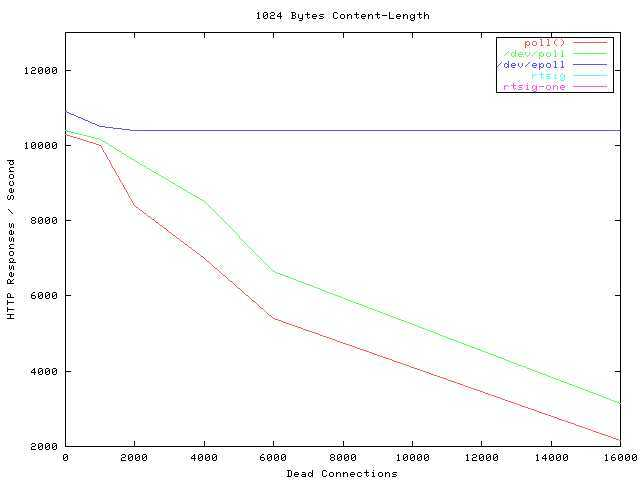
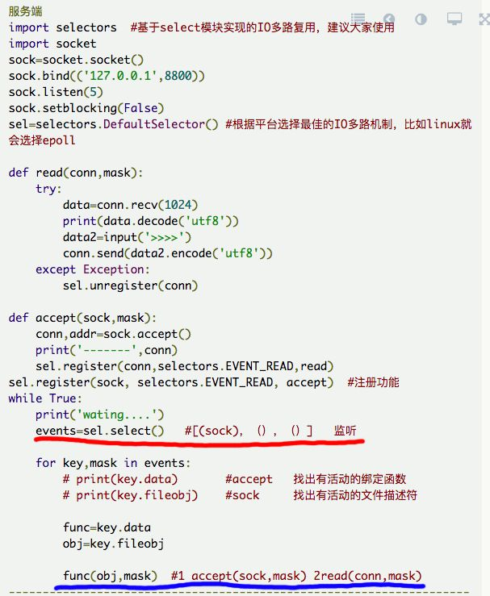
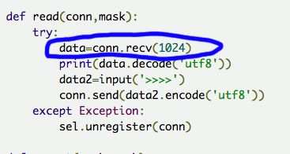

# 事件驱动与协程：基本概念介绍

**协程**是近几年非常流行而且被各种大厂所使用的**微线程技术**。

## 1. 事件驱动

### 1.1 事件驱动简介

事件驱动还有一个更加出名的名字：**IO多路复用**。

事件驱驱动架构由三个基本组件构成，事件、事件处理器、事件循环。事件产生后发送给事件循环，事件循环将每个事件分派给个各个事件处理器。事件A由处理器A处理，事件B将被处理器B处理。

### 1.2 通俗形式描述

参考知乎上答案

- *小张找基友小鹏*

小张第一次来到小鹏的宿舍楼，发现这个宿舍楼有一大堆的楼妈，为啥？因为学校竟然请了一堆楼妈来管理宿舍楼里的每一个宿舍，结果搞得一大堆楼妈唧唧咋咋的，乌烟瘴气。重要的就是学校会给每个楼妈都发工资。小张顿时觉得，这个学校没药救了。

没错，现实中已经没有这种傻逼现象了，学校也不会傻到这种程度为每一个宿舍都请一个楼妈来管理。

- *过了几十年，小张的儿子来找小鹏的儿子*。

为什么Nodejs并发量会那么变态的原因就是这一点：nodejs因为js线程只有一条，为了让程序不会卡住，就一定要把所有的IO变成非阻塞异步，通过回调来告诉用户。为什么Nodejs并发量会那么变态的原因就是这一点：nodejs因为js线程只有一条，为了让程序不会卡住，就一定要把所有的IO变成非阻塞异步，通过回调来告诉用户。

不巧，过了一二十年，小张的儿子和小鹏的儿子也上了同一所学校，小张张要来找小鹏鹏。小张张听了父亲说，这个学校的舍管特别傻逼，会有一堆，能烦死你。

结果小张张来到了宿舍楼，发现现在只有一个楼妈了，哎哟，不错嘛，学校终于没那么傻逼了。但是，这个楼妈比较傻，小张张去问她：小鹏鹏在哪个寝室啊？

她说，我也不知道啊。我带你上去找吧？

于是乎，小张张和楼妈挨个挨个的找宿舍，最终花了半天时间找到了小鹏鹏....（小张张尿了。

- *又过去了差不多20年*

此时，学校已经不是那个学校，张和鹏都挂得差不多了。新生代小春来找小丽，小春来到了这个宿舍，找到了楼妈。

这个楼妈就比较聪明了，每当一个学生入住新宿舍的时候，她就记录下这个人的名字，学号，电话，以及宿舍房号。当小春找小丽的时候，楼妈掏出眼镜，查表，马上就能知道小丽在哪里了，小春几分钟就到达了小丽的宿舍....

**对应到计算机**

- **fork/join thread**

最开始的时候为了实现一个服务器可以支持多个客户端连接，使用fork/join thread等办法，当一个连接来到的时候，就fork/thread一个进程/线程去接收并且处理请求，由于当时网络和电脑限制，所以这个模型一直很好用，过去几十年都没有问题。

- **select函数**

时代发展了，1980年代，计算机网络开始成型，越来越多的用户进行网络连接(其实也没多少)，但是之前的fork/thread模型就不行了，太辣鸡了(**回想一下小张和小鹏与一大堆楼妈的故事**)。

1983年，人们终于意识到了这种傻逼问题，所以发明了一种叫做「**IO多路复用**」的模型(**Select 函数**)，这种模型的好处就是「**没必要开那么多条线程和进程了**」，一个线程一个进程就搞定了。随着计算机业务的增长，这种IO多路复用的模型看似太傻逼了点，回想一下小张张和小鹏鹏：

1. 宿舍楼里有可能有上百间宿舍
2. 为了寻找到其中一间宿舍，你必须得一间一间去找，浪费时间

对应的编程模型就是：一个连接来了，就必须遍历所有已经注册的文件描述符，来找到那个需要处理信息的文件描述符，如果已经注册了几万个文件描述符，那会因为遍历这些已经注册的文件描述符，导致cpu爆炸。

- epoll方法——改进IO多路复用

2002年，互联网时代爆炸，数以千万计的请求在全世界范围内发来发去，服务器大爆炸，人们通过改进「IO多路复用」模型，进一步的优化，发明了一个叫做**epoll的方法**。这个方法就是**小春和小丽故事里聪明的楼妈**。

当年的并发图，震撼人心的并发图。蓝色的线是epoll，**性能几乎不受连接数的影响(dead connections)**。

### 1.3 I/O多路复用没有解决的问题

- 红色的线：会阻塞，进行监听。当有连接来的时候，这个函数就会返回一个events，然后就会进入到蓝色的调用
- 蓝色的调用：如果蓝色的调用，是一个非常快速的函数，那么服务器在这一步就不会阻塞，而是直接回到红色的线那里监听。然而我们知道，func函数就是基本上100%会卡住或者慢！

为什么func函数会卡住呢？原因很简单:

conn.recv是一个「读」函数，在系统同步调用中，一定是等数据全部读完了才会返回，不然就会一直卡在这里，但是这种卡，并不是cpu爆炸，而是「傻等」。

### 1.4 事件驱动配合多线程/多进程

因为处理数据的函数，几乎100%会卡住，只要一卡住，服务器就不能再接收任何信息，只能傻等。于是，我们就可以使用多线程/多进程来执行这个处理数据的函数。

那么核心思想就是：

一个线程（主线程）负责监听和分配需要处理的文件描述符，其他的线程去处理实际的数据逻辑，相互不干扰，从而实现了高并发。

对应傻逼版的故事就是：楼妈（主线程）负责告诉来客（连接），宿舍楼里有谁谁谁，在哪哪哪，然后来客就自己去找宿舍里面的人搅基，楼妈不再管了。

### 1.5 事件驱动配合多线程/多进程都无法解决的问题

或许现在机器性能非常牛x，内存动不动8/16G，轻松几万连接怎么都能搞定了。

回忆一下刚刚的事件驱动非阻塞模型，我们多线程\多进程主要解决的问题就是在连接到来之后，需要并发的去处理func函数，func函数会有几个原因导致他不能一直进行下去：

1. 等待客户端发消息来：你完全不知道客户端什么时候发数据，发完数据，所以线程得等;
2. 数据库读取：数据库保存在硬盘之上，硬盘再快也比内存慢得飞起来，因此从硬盘读数据出来，就会要等；
3. func函数本身就是要去调用另外一个服务器上的数据库/api等等一系列的连环操作，才能获得数据

以上这个几个事情，都会卡住，并不是因为逻辑运行得多慢，cpu有多高，而是因为「IO设备太辣鸡，太缓慢了，因此必须傻等」

提高IO设备的速度不行吗？比如，硬盘我换成固态硬盘之类之类的，是一个解决之道。但是**重点就是线程\进程太重了，每并发一个线程\进程都要消耗内存，加上线程/进程之间的切换，消耗了巨大的性能。**

## 2. 协程

协程的概念是相对多进程或者多线程来说的，他是一种协作式的用户态线程：

1. 与之相对的，线程和进程是以抢占式执行的，意思就是系统帮我们自动快速切换线程和进程来让我们感觉同步运行的感觉，这个切换动作由系统自动完成；
2. 协作式执行说的就是，想要切换线程，必须要用户手动来切换；

协程为什么那么快原因就是因为，无需系统自动切换(系统自动切换会浪费很多的资源)，而协程是用户手动切换，而且是在同一个栈上执行，速度就会非常快而且省资源。

协程只能有一个进程，一个线程在跑，一旦发生IO阻塞，这个程序就会卡住。所以使用协程之前，必须要保证所有的IO都必须是非阻塞的。

### 2.1 所有阻塞IO/非阻塞IO

IO无非就是几种

1. 读硬盘
2. 写硬盘
3. 网络请求

所有的读和写，网络请求接口都要设置成非阻塞式的，当系统内核把这些玩意儿执行完毕以后，再通过回调函数，通知用户处理。在用户空间上来看，就一直保持在一个线程，一个进程之中，因此，这种速率极高。

为什么Nodejs并发量会那么变态的原因就是这一点：nodejs因为js线程只有一条，为了让程序不会卡住，就一定要把所有的IO变成非阻塞异步，通过回调来告诉用户。