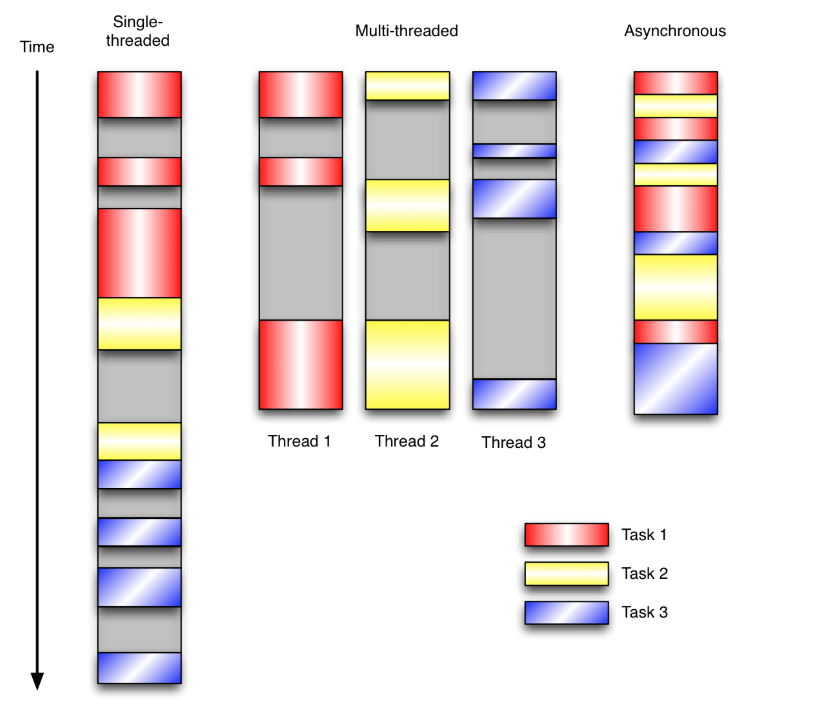

# 事件驱动与消息驱动

## 1. 事件与消息

**事件：**按下鼠标，按下键盘，按下游戏手柄，将U盘插入USB接口，都将产生事件。比如说按下鼠标左键，将产生鼠标左键被按下的事件。

 **消息：**当鼠标被按下，产生了鼠标按下事件，windows侦测到这一事件的发生，随即发出鼠标被按下的消息到消息队列中，这消息附带了一系列相关的事件信息，比如鼠标哪个键被按了，在哪个窗口被按的，按下点的坐标是多少？如此等等。

## 2. 事件驱动和异步IO

通常，我们写服务器处理模型的程序时，有以下几种模型：

- 每收到一个请求，创建一个新的进程，来处理该请求；
- 每收到一个请求，创建一个新的线程，来处理该请求；
- 每收到一个请求，放入一个事件列表，让主进程通过非阻塞I/O方式来处理请求

上面的几种方式，各有千秋：

- 第1中方法，由于创建新的进程的开销比较大，所以，会导致服务器性能比较差,但实现比较简单。
- 第2种方式，由于要涉及到线程的同步，有可能会面临死锁等问题。
- 第3种方式，在写应用程序代码时，逻辑比前面两种都复杂。

综合考虑各方面因素，一般普遍认为第3种方式是大多数网络服务器采用的方式。

### 2.1 UI的事件驱动模型

在UI编程中，常常要对鼠标点击进行相应，首先如何获得鼠标点击呢？

**方式一**

创建一个线程，该线程一直循环检测是否有鼠标点击，那么这个方式有以下几个缺点：

1.  CPU资源浪费，可能鼠标点击的频率非常小，但是扫描线程还是会一直循环检测，这会造成很多的CPU资源浪费；如果扫描鼠标点击的接口是阻塞的呢？
2. 如果是堵塞的，又会出现下面这样的问题，如果我们不但要扫描鼠标点击，还要扫描键盘是否按下，由于扫描鼠标时被堵塞了，那么可能永远不会去扫描键盘；
3. 如果一个循环需要扫描的设备非常多，这又会引来响应时间的问题；

所以，该方式是非常不好的。

**方式二** 事件驱动模型

目前大部分的UI编程都是事件驱动模型，如很多UI平台都会提供onClick()事件，这个事件就代表鼠标按下事件。事件驱动模型大体思路如下：

1. 有一个事件(消息)队列；
2. 鼠标按下时，往这个队列中增加一个点击事件(消息)
3. 有个循环，不断从队列取出事件，根据不同的事件，调用不同的函数，如onClick()、onKeyDown()等；
4. 事件(消息)一般都各自保存各自的处理函数指针，这样，每个消息都有独立的处理函数；

事件驱动编程是一种编程范式，这里程序的执行流由外部事件来决定。它的特点是包含一个事件循环，当外部事件发生时使用回调机制来触发相应的处理。另外两种常见的编程范式是(单线程)同步以及多线程编程。

让我们用例子来比较和对比一下单线程、多线程以及事件驱动编程模型。下图展示了随着时间的推移，这三种模式下程序所做的工作。这个程序有3个任务需要完成，每个任务都在等待I/O操作时阻塞自身。阻塞在I/O操作上所花费的时间已经用灰色框标示出来了。

在单线程同步模型中，任务按照顺序执行。如果某个任务因为I/O而阻塞，其他所有的任务都必须等待，直到它完成之后它们才能依次执行。这种明确的执行顺序和串行化处理的行为是很容易推断得出的。如果任务之间并没有互相依赖的关系，但仍然需要互相等待的话这就使得程序不必要的降低了运行速度。

在多线程版本中，这3个任务分别在独立的线程中执行。这些线程由操作系统来管理，在多处理器系统上可以并行处理，或者在单处理器系统上交错执行。这使得当某个线程阻塞在某个资源的同时其他线程得以继续执行。与完成类似功能的同步程序相比，这种方式更有效率，但程序员必须写代码来保护共享资源，防止其被多个线程同时访问。多线程程序更加难以推断，因为这类程序不得不通过线程同步机制如锁、可重入函数、线程局部存储或者其他机制来处理线程安全问题，如果实现不当就会导致出现微妙且令人痛不欲生的bug。

在事件驱动版本的程序中，3个任务交错执行，但仍然在一个单独的线程控制中。当处理I/O或者其他昂贵的操作时，注册一个回调到事件循环中，然后当I/O操作完成时继续执行。回调描述了该如何处理某个事件。事件循环轮询所有的事件，当事件到来时将它们分配给等待处理事件的回调函数。这种方式让程序尽可能的得以执行而不需要用到额外的线程。事件驱动型程序比多线程程序更容易推断出行为，因为程序员不需要关心线程安全问题。

## 3. 事件驱动与消息驱动

事件模式耦合高，同模块内好用；消息模式耦合低，跨模块好用。事件模式集成其它语言比较繁琐，消息模式集成其他语言比较轻松。事件是侵入式设计，霸占你的主循环；消息是非侵入式设计，将主循环该怎样设计的自由留给用户。如果你在设计一个东西举棋不定，那么你可以参考win32的GetMessage，本身就是一个藕合度极低的接口，又足够自由，接口任何语言都很方便，具体应用场景再在其基础上封装成事件并不是难事，接口耦合较低，即便哪天事件框架调整，修改外层即可，不会伤经动骨。而如果直接实现成事件，那就完全反过来了。

## 4. 消息驱动系统与消息队列

**消息驱动的系统**：系统分为消息队列、消息生产者、消息消费者，生产者负责产生消息，消费者(可能有多个)负责对消息进行处理；

消息队列可使用于消息驱动型应用的数据交互。

 