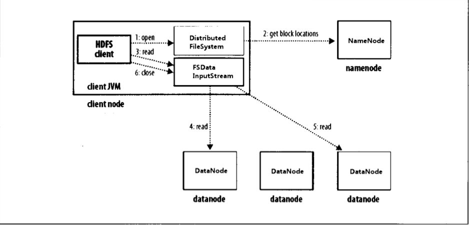

# HDFS文件读取流程

客户端、HDFS、namenode、datanode之间数据流在文件读取时，事件发生顺序如下所示：

（1）客户端通过调用`FileSystem`对象的`open()`方法打开文件，对于HDFS来说这个文件是`DistributedFileSystem`。

（2）`DistributedFileSystem`对象通过RPC来调用`NameNode`，以确定文件起始块的位置。对于每一个块，`namenode`返回存有块副本的所有`datanode`地址。此外，这些`datanode`根据它们与客户端的距离进行排序(根据集群的网络拓扑)。如果客户端本身就是一个`datanode`(比如：在一个`MapReduce`任务中)，并存有相应数据块的副本，该节点就会从本地`datanode`读取数据。

（3）`DistributedFileSystem`类返回一个`FSDataInputStream`(`seek()`方法支持文件定位)给客户端并读取数据，`FSDataInputStream`类封装`DFSInputStream`，该对象管理着DataNode与NameNode的IO。客户端对`DistributedFileSystem`调用`read()`方法，存储着文件起始几个块的`datanode`地址的`DFSInputStream`随即连接距离最近的`datanode`。

（4）通过对数据流反复调用`read()`方法，可以将数据从`DataNode`传输到客户端。到达块末端时，`DFSInputStream`会关闭与该`datanode`的连接；

（5）寻找下一个最佳的`datanode`，读取数据；客户端从流中读取数据时，块是按照打开`DFSInputStream`与`dataNode`新建连接的顺序读取的，它也会根据需要询问`namenode`来检索下一批数据块的`datanode`的位置。

（6）读取完成，对`FSDataInputStream`调用`close()`方法。

在读取数据时，如果`DFSInputStream`在与`dataNode`通信时遇到错误，会尝试从这个块的另外一个最邻近`dataNode`读取数据，也会记住故障`dataNode`，保证以后不会反复读取该节点上的后续块。`DFInputStream`也会通过校验和确认从`dataNode`发来数据是否完成，如果发现损坏块，`DFSInputStream`会试图从其他`dataNode`读取其副本之前通知`nameNode`。

这样设计的**重点是**：`nameNode`告知客户端每个块中最佳的`dataNode`，并让客户端直接连到该datanode检索数据，能使HDFS可扩展到大量的并发客户端，同时，`nameNode`只需要相应块位置的请求，由于数据块信息均存储在内存中，因此相应高效。

