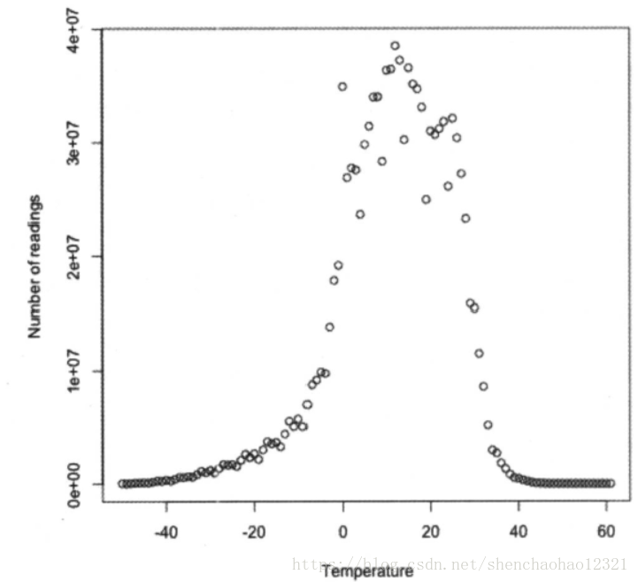
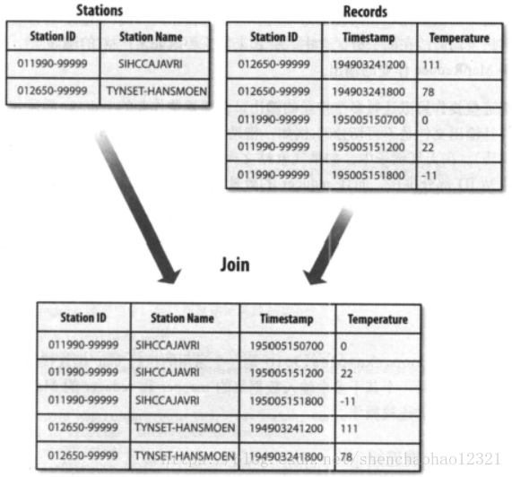

[TOC]

# 第九章 MapReduce特性

本章探讨MapReduce的一些高级特性，其中包括计数器、数据集的排序和连接。

## 9.1 计数器

在许多情况下，用户需要了解待分析的数据，尽管这并非所要执行的分析任务的核心内容。以统计数据集中无效记录数目的任务为例，如果发现无效记录的比例相当高，那么就需要认真思考为何存在如此多无效记录。是所采用的检测程序存在缺陷，还是数据集质量确实很低，包含大量无效记录？如果确定是数据集的质量问 题，则可能需要扩大数据集的规模，以增大有效记录的比例，从而进行有意义的分析。 

计数器是收集作业统计信息的有效手段之一，用于质量控制或应用级统计。计数器还可以辅助诊断系统故障。如果需要将日志信息传输到map或reduce任务，更好的方法通常是尝试传输计数器值以监测某一特定事件是否发生。对于大型分布式作业 而言，使用计数器更为方便。首先，获取计数器值比输出日志更方便，其次，根据计数器值统计特定事件的发生次数要比分析一堆日志文件容易得多。

### 9.1.1 内置计数器

Hadoop为每个作业维护若干个内置计数器，以描述多项指标。例如：某些计数器记录已处理的字节数和记录数，使用户可监控以处理的输入数据量和已产生的输出数据量。

这些内置计数器被划分为若干组，参见表9-1。

​														**表9-1 内置计数器分组**

| 组别                   | 名称/类别                                                    | 参考  |
| ---------------------- | ------------------------------------------------------------ | ----- |
| MapReduce任务计数器    | org.apache.hadoop.mapreduce.TaskCounter                      | 表9-2 |
| 文件系统计数器         | org.apache.hadoop.mapreduce.FiIeSystemCounter                | 表9-3 |
| FiIeInputFormat计数器  | org.apache.hadoop.mapreduce.lib.input.FilelnputFormatCounter | 表9-4 |
| FiIeOutputFormat计数器 | org.apache.hadoop.mapreduce.lib.output.FileOutputFormatCounter | 表9-5 |
| 作业计数器             | org.apache.hadoop.mapreduce.JobCounter                       | 表9-6 |

各组要么包含任务计数器(在任务处理过程中不断更新)，要么包含作业计数器(在作业处理过程中不断更新)。这两种类型将在后续章节中进行介绍。

#### 1. 任务计数器

在执行任务过程中，任务计数器采集任务的相关信息，每个作业的所有任务的结果会被聚集起来。例如：MAP_INPUT_RECORDS计数器统计每个map任务输入记录的总数，并在一个作业的所有map任务上进行聚集，使得最终数字是这个作业的所有输入记录的总数。

任务计数器由其关联的任务维护，并定期发送给Application Master。因此，计数器能够被全局地聚集(参见7.1.5节中对进度和状态更新的介绍)。任务计数器的值每次都是完整传输的，而非传输自上次传输之后的计数值，从而避免由于消息丢失而引发的错误。另外，如果一个任务在作业执行期间失败，则相关计数器的值会减小。

虽然只有当这个作业执行完之后的计数器的值才是完整可靠的，但是部分计数器仍然可以在任务处理过程中提供一些有用的诊断信息，以便由Web页面监控。例如：PHYSICAL_MEMORY_BYTES、VIRTUAL_MEMORY_BYTES和COMMITTED_HEAP_BYTES计数器显示特定任务执行过程中的内存使用变化情况。

内置任务计数器包括在MapReduce任务计数器分组中的计数器(表9-2)以及在文件相关的计数器分组(表9-3，表9-4和表9-5)中的计数器。

​												**表 9-2 内置的MapReduce任务计数器**

| 计数器名称                                         | 说明                                                         |
| -------------------------------------------------- | ------------------------------------------------------------ |
| map输人的记录数(MAP_INPUT_RECORDS）                | 作业中所有map已处理的输人记录数。每次RecordReader读到一条记录并将其传给map的map()函数时，该计数器的值递增 |
| 分片(split)的原始字节数(SPLIT_RAW_BYTES)           | 由map读取的输人-分片对象的字节数。这些对象描述分片元数据(文件的位移和长度)，而不是分片的数据自身，因此总规模是小的 |
| map输出的记录数(MAP_OUTPUT_RECORDS)                | 作业中所有map产生的map输出记录数。每次某一个map 的OutputCollector调用collect()方法时，该计数器的值增加 |
| map输出的字节数(MAP_OUTPUT_BYTES)                  | 作业中所有map产生的未经压缩的输出数据的字节数，每次一个map的OutputCollector调用collect()方法时，该计数器的值增加 |
| map输出的物化字节数(MAP_OUTPUT_MATERIALIZED_BYTES) | map输出后确实写到磁盘上的字节数；若map输出压缩功能被启用，则会在计数器值上反映出来 |
| combine输人的记录数(COMBINE_INPUT_RECORDS)         | 作业中所有combiner(如果有)已处理的输人记录数。combiner的迭代器每次读一个值，该计数器的值增加。注意：本计数器代表combiner已经处理的值的个数，并非不同的键组数（后者并无实所意文，因为对于combiner而言，并不要求每个键对应一个组，详情参见2.4.2节和7.3节 |
| combine输出的记录数(COMBINE_OUTPUT_RECORDS)        | 作业中所有combiner(如果有)已产生的输出记录数。每当一个combiner的OutputCollector调用collect()方法时，该计数器的值增加 |
| reduce输人的组(REDUCE_INPUT_GROUPS）               | 作业中所有reducer已经处理的不同的码分组的个数。每当某一个reducer的reduce()被调用时，该计数器的值增加 |
| reduce输人的记录数(REDUCE_INPUT_RECORDS)           | 作业中所有reducer已经处理的输人记录的个数。每当某个reducer的迭代器读一个值时，该计数器的值增加。如果所有reducer已经处理数完所有输人，則该计数器的值与计数器MAP_OUTPUT_RECORDS的值相同 |
| reduce输出的记录数(REDUCE_OUTPUT_RECORDS）         | 作业中所有map已经产生的reduce输出记录数。每当某个reducer的OutputCollector调用collect()方法时，该计数器的值增加 |
| reduce经过shuffle的字节数(REDUCE_SHUFFLE_BYTES)    | 由shume复制到reducer的map输出的字节数                        |
| 溢出的记录数(SPILLED_RECORDS)                      | 作业中所有map和reduce任务溢出到磁的记录数                    |
| CPU毫秒(CPU_MILLISECONDS)                          | 一个任务的总CPU时间，以毫秒为单位，可由/proc/cpuinfo获取     |
| 物理内存字节数(PHYSICAL_MEMORY_BYTES）             | 一个任务所用的物理内存，以字节数为单位，可由/proc/meminfo获取 |
| 虚拟内存字节数(VIRTUAL_MEMORY_BYTES）              | 一个任务所用虚拟内存的字节数，由/proc/meminfo而'面获取       |
| 有效的堆字节数(COMMITTED_HEAP_BYTES)               | 在JVM中的总有效内存最(以字节为单位)，可由Runtime. getRuntime().totalMemory()获取 |
| GC运行时间毫秒数(GC_TIME_MILLIS)                   | 在任务执行过程中，垃圾收集器(garbage collection）花费的时间(以毫秒为单位)，可由GarbageCollector MXBean. getCollectionTime()获取 |
| 由shuffle传输的map输出数(SHUFFLED_MAPS)            | 由shuffle传输到reducer的map输出文件数，详情参见7.3节         |
| 失敗的shuffle数(FAILED_SHUFFLE)                    | shuffle过程中，发生map输出拷贝错误的次数                     |
| 被合并的map输出数(MERGED_MAP_OUTPUTS）             | shuffle过程中，在reduce端合并的map输出文件数                 |

​												**表9-3 内置文件系统任务计数器**

| 计数器名称                                 | 说明                                                         |
| ------------------------------------------ | ------------------------------------------------------------ |
| 文件系统的读字节数(BYTES_READ）            | 由map任务和reduce任务在各个文件系统中读取的字节数，各个文件系统分别对应一个计数器，文件系统可以是Local、 HDFS、S3等 |
| 文件系统的写字节数(BYTES_WRITTEN）         | 由map任务和reduce任务在各个文件系统中写的字节数              |
| 文件系统读操作的数量(READ_OPS)             | 由map任务和reduce任务在各个文件系统中进行的读操作的数量(例如，open操作，filestatus操作) |
| 文件系统大规模读操作的数最(LARGE_READ_OPS) | 由map和reduce任务在各个文件系统中进行的大规模读操作(例如，对于一个大容量目录进行list操作)的数 |
| 文件系统写操作的数最(WRITE_OPS)            | 由map任务和reduce任务在各个文件系统中进行的写操作的数量(例如，create操作，append操作) |

​													**表9-4 内置的FileInputFormat任务计数器**

| 计数器名称               | 说明                                     |
| ------------------------ | ---------------------------------------- |
| 读取的字节数(BYTES_READ) | 由map任务通过FilelnputFormat读取的字节数 |

​													**表9-5 内置的FileOutputFormat任务计数器**

| 计数器名称                | 说明                                                         |
| ------------------------- | ------------------------------------------------------------ |
| 写的字节数(BYTES_WRITTEN) | 由map任务(针对仅含map的作业)或者reduce任务通过FileOutputFormat写的字节数 |

#### 2. 作业计数器

作业计数器(表9-6)由Application Master维护，因此无需在网络间传输数据。这一点与包括“用户定义的计数器”在内的其他计数器不同。这些计数器都是作业级别的统计量，其值不会随着任务运行而改变。例如，TOTAL_LAUNCHED_MAPS统计在作业执行过程中启动的map任务数，包括失败的map任务。

​												**表9-6 内置的作业计数器**

| 计数器名称                                 | 说明                                                         |
| ------------------------------------------ | ------------------------------------------------------------ |
| 启用的map任务数(TOTAL_LAUNCHED_MAPS）      | 启动的map任务数，包括以“推测执行”方式启动的任务，详情参见7．4.2节 |
| 启用的reduce任务数(TOTAL_LAUNCHED_REDUCES) | 启动的reduce任务数，包括以“推测执行”方式启动的任务           |
| 启用的uber任务数(TOTAL_LAUNCHED_UBERTASKS) | 启用的uber任务数，详情参见7.1节                              |
| uber任务中的map数(NUM_UBER_SUBMAPS)        | 在uber任务中的map数                                          |
| uber任务中的reduce数(NUM_UBER_SUBREDUCES)  | 在über任务中的reduce数                                       |
| 失败的map任务数(NUM_FAILED_MAPS）          | 失败的map任务数，用户可以参见7.2.1节对任务失败的讨论，了解失败原因 |
| 失败的reduce任务数(NUM_FAILED_REDUCES)     | 失败的reduce任务数                                           |
| 失败的uber任务数(NIN_FAILED_UBERTASKS)     | 失败的uber任务数                                             |
| 被中止的map任务数（NUM_KILLED_MAPS）       | 被中止的map任务数，可以参见7.2.1节对任务失败的讨论，了解中止原因 |
| 被中止的reduce任务数(NW_KILLED_REDUCES)    | 被中止的reduce任务数                                         |
| 数据本地化的map任务数(DATA_LOCAL_MAPS）    | 与输人数据在同一节点上的map任务数                            |
| 机架本地化的map任务数(RACK_LOCAL_MAPS)     | 与输人数据在同一机架范围内但不在同一节点上的map任务数        |
| 其他本地化的map任务数(OTHER_LOCAL_MAPS）   | 与输人数据不在同一机架范围内的map任务数。 由于机架之间的带宽资源相对较少，Hadoop会尽量让map任务靠近输人数据执行，因此该计数器值一般比较小。详情参见图2-2 |
| map任务的总运行时间(MILLIS_MAPS)           | map任务的总运行时间，单位毫秒。包括以推测执行方式启动的任务。可参见相关的度量内核和内存使用的计数器(VCORES_MILLIS_MAPS和MB_MILLIS_MAPS） |
| reduce任务的总运行时间(MILLIS_REDUCES)     | reduce任务的总运行时间，单位毫秒。包括以推测执行方式启动的任务。可参见相关的度量内核和内存使用的计数器(VCORES_MILLIS_REÄRES和MB_MILLIS_REUKES) |

### 9.1.2 用户自定义计数器

MapReduce允许用户编写程序来定义计数器，计数器的值可在mapper或reducer中增加，计数器由一个Java枚举(enum)类型来定义，以便对有关的计数器分组。

一个作业可以定义的枚举类型数量不限，各个枚举类型所包含的字段数量也不限，枚举类型的名称即为组的名称，枚举类型的字段就是计数器名称。计数器是全局的，即MapReduce框架将跨所有map和reduce聚集这些计数器，并在作业结束时产生一个最终结果。

在第6章中，我们创建了若干计数器来统计天气数据集中不规范的记录数。范例9·1中的程序对此做了进一步扩展，能统计缺失记录和气温质量代码的分布情况。

**范例9．1，统计最高气温的作业，包括统计气温值缺失的记录、不规范的字段和质量代码**

```java
import java.io.IOException;

import org.apache.hadoop.conf.Configured;
import org.apache.hadoop.io.IntWritable;
import org.apache.hadoop.io.LongWritable;
import org.apache.hadoop.io.Text;
import org.apache.hadoop.mapreduce.Job;
import org.apache.hadoop.mapreduce.Mapper;
import org.apache.hadoop.util.Tool;
import org.apache.hadoop.util.ToolRunner;

// vv MaxTemperatureWithCounters
public class MaxTemperatureWithCounters extends Configured implements Tool {
  
  enum Temperature {
    MISSING,
    MALFORMED
  }
  
  static class MaxTemperatureMapperWithCounters
    extends Mapper<LongWritable, Text, Text, IntWritable> {
    
    private NcdcRecordParser parser = new NcdcRecordParser();
  
    @Override
    protected void map(LongWritable key, Text value, Context context)
        throws IOException, InterruptedException {
      
      parser.parse(value);
      if (parser.isValidTemperature()) {
        int airTemperature = parser.getAirTemperature();
        context.write(new Text(parser.getYear()),
            new IntWritable(airTemperature));
      } else if (parser.isMalformedTemperature()) {
        System.err.println("Ignoring possibly corrupt input: " + value);
        context.getCounter(Temperature.MALFORMED).increment(1);
      } else if (parser.isMissingTemperature()) {
        context.getCounter(Temperature.MISSING).increment(1);
      }
      
      // dynamic counter
      context.getCounter("TemperatureQuality", parser.getQuality()).increment(1);
    }
  }
  
  @Override
  public int run(String[] args) throws Exception {
    Job job = JobBuilder.parseInputAndOutput(this, getConf(), args);
    if (job == null) {
      return -1;
    }
    
    job.setOutputKeyClass(Text.class);
    job.setOutputValueClass(IntWritable.class);

    job.setMapperClass(MaxTemperatureMapperWithCounters.class);
    job.setCombinerClass(MaxTemperatureReducer.class);
    job.setReducerClass(MaxTemperatureReducer.class);

    return job.waitForCompletion(true) ? 0 : 1;
  }
  
  public static void main(String[] args) throws Exception {
    int exitCode = ToolRunner.run(new MaxTemperatureWithCounters(), args);
    System.exit(exitCode);
  }
}
```

将上述程序在完整的数据集上运行一遍：

```sh
hadoop jar hadoop-examples.jar MaxTemperatureWithCounters \
input/ncdc/all output-counters
```

作业成功执行完毕之后会输出各计数器的值(由作业的客户端完成)。以下是一组我们感兴趣的计数器的值。

```
Air Temperature Records
	Malformed = 3
	Missing=66136856
TemperatureQuality
	0=1
	1=973422173
	2=1246032
	4=10764500
	5=158291879
	6=40066
	9=66136858
```

注意，为使得气温计数器的名称可读性更好，使用了Java枚举类型的命名方式（使用下划线作为嵌套类的分隔符），这种方式称为“资源捆绑"，例如本例中为MaxTemperatureCounters_Temperature.properties，该捆绑包含显示名称的映射关系。

#### 1. 动态计数器

上述代码还使用了动态计数器，这是一种不由Java枚举类型定义的计数器。由于Java枚举类型的字段在编译阶段就必须指定，因而无法使用枚举类型动态新建计数器。范例8.1统计气温质量的分布，尽管通过格式规范定义了可以取的值，但相比之下，使用动态计数器来产生实际值更加方便。在该例中，context对象的`getcounter()`方法有两个string类型的输人参数，分别代表组名称和计数器名称：`public Counterget counter(String groupName，String counterName）`。

鉴于Hadoop需先将Java枚举类型转变成String类型，再通过RPC发送计数器值，这两种创建和访问计数器的方法（即使用枚举类型和String类型）事实上是等价的。相比之下，枚举类型易于使用，还提供类型安全，适合大多数作业使用。如果某些特定场合需要动态创建计数器，则可以使用String接口。

#### 2. 获取计数器

除了通过Web界面和命令行（执行mapred job -counter指令）之外，用户还可以使用JavaAPI获取计数器的值。通常情况下，用户一般在作业运行完成、计数器的值已经隐定下来时再获取计数器的值，而JavaAPI还支持在作业运行期间就能够获取计数器的值。范例9·2展示了如何统计整个数据集中气温信息缺失记录的比例。

**范例9.2 统计气温信息缺失记录所占的比例**

```java
mport org.apache.hadoop.conf.Configured;
import org.apache.hadoop.mapreduce.*;
import org.apache.hadoop.util.*;

public class MissingTemperatureFields extends Configured implements Tool {

  @Override
  public int run(String[] args) throws Exception {
    if (args.length != 1) {
      JobBuilder.printUsage(this, "<job ID>");
      return -1;
    }
    String jobID = args[0];
    Cluster cluster = new Cluster(getConf());
    Job job = cluster.getJob(JobID.forName(jobID));
    if (job == null) {
      System.err.printf("No job with ID %s found.\n", jobID);
      return -1;
    }
    if (!job.isComplete()) {
      System.err.printf("Job %s is not complete.\n", jobID);
      return -1;
    }

    Counters counters = job.getCounters();
    long missing = counters.findCounter(
        MaxTemperatureWithCounters.Temperature.MISSING).getValue();
    long total = counters.findCounter(TaskCounter.MAP_INPUT_RECORDS).getValue();

    System.out.printf("Records with missing temperature fields: %.2f%%\n",
        100.0 * missing / total);
    return 0;
  }
  public static void main(String[] args) throws Exception {
    int exitCode = ToolRunner.run(new MissingTemperatureFields(), args);
    System.exit(exitCode);
  }
}
```

首先，以作业ID为输入参数调用`getJob()`方法，从cluster中获取一个Job对象。通过检查返回是否为空来判断是否有一个作业与指定ID相匹配。有多种因素可能导致无法找到一个有效的Job对象，例如，错误地指定了作业ID，或是该作业不再保留在作业历史中。

其次，如果确认该作业已经完成，则调用该Job对象的getcounters()方法会返回一个counters对象，封装了该作业的所有计数器。counters类提供了多个方法用于获取计数器的名称和值。上例调用`findCounter()`方法，它通过一个枚举值来获取气温信息缺失的记录数和被处理的记录数(根据一个内置计数器)。

最后，输出气温信息缺失记录的比例。针对整个天气数据集的运行结果如下所示：

```
hadoop jar hadoop-examples.jar MissingTemperatureFields job_419425e506

Records with missing temperature fields：5.47％
```

## 9.2 排序

排序是MapReduce核心技术。尽管应用本身可能不需要对数据排序，但是仍可能使用MapReduce的排序功能来组织数据。下面将讨论几种不同的数据集排序方法，以及如何控制MapReduce的排序。12.8节介绍了如何对Avro数据进行排序。

## 9.2.1 准备

下面将按气温字段对天气数据集排序，由于气温字段是有符号整数，所以不能将该字段视为Text对象并以字典顺序排序。反之，要用顺序文件存储数据，其lntwritable键代表气温(并且正确排序)，其Text值就是数据行。

范例9-3中的MapReduce作业只包含map任务，它过滤输人数据并移除包含有无效气温的记录。各个map创建并输出一个块压缩的顺序文件。相关指令如下：

```sh
％hadoop jar hadoop-examples.jar SortDataPreprocessor input/ncdc/all input/ncdc/all-seq
```

**范例9-3．该MapReduce程序将天气数据转成SequenceFiIe格式**

```java
public class SortDataPreprocessor extends Configured implements Tool {
  static class CleanerMapper
    extends Mapper<LongWritable, Text, IntWritable, Text> {
    private NcdcRecordParser parser = new NcdcRecordParser();
    @Override
    protected void map(LongWritable key, Text value, Context context)
        throws IOException, InterruptedException {
      parser.parse(value);
      if (parser.isValidTemperature()) {
        context.write(new IntWritable(parser.getAirTemperature()), value);
      }
    }
  }
  
  @Override
  public int run(String[] args) throws Exception {
    Job job = JobBuilder.parseInputAndOutput(this, getConf(), args);
    if (job == null) {
      return -1;
    }
    job.setMapperClass(CleanerMapper.class);
    job.setOutputKeyClass(IntWritable.class);
    job.setOutputValueClass(Text.class);
    job.setNumReduceTasks(0);
    job.setOutputFormatClass(SequenceFileOutputFormat.class);
    SequenceFileOutputFormat.setCompressOutput(job, true);
    SequenceFileOutputFormat.setOutputCompressorClass(job, GzipCodec.class);
    SequenceFileOutputFormat.setOutputCompressionType(job, CompressionType.BLOCK);
    return job.waitForCompletion(true) ? 0 : 1;
  }
  
  public static void main(String[] args) throws Exception {
    int exitCode = ToolRunner.run(new SortDataPreprocessor(), args);
    System.exit(exitCode);
  }
}
```

### 9.2.2 部分排序

如9.1.1所述，在默认情况下。MapReduce根据输入记录的键对数据集排序。范例9-4则是一个变种，它利用`IntWritable`键对`SequenceFile`排序。

**范例9-4 程序调用默认HashPartitioner按lntwritable键排序顺序文件**

```java
public class SortByTemperatureUsingHashPartitioner extends Configured implements Tool {
  @Override
  public int run(String[] args) throws Exception {
    Job job = JobBuilder.parseInputAndOutput(this, getConf(), args);
    if (job == null) {
      return -1;
    }
    job.setInputFormatClass(SequenceFileInputFormat.class);
    job.setOutputKeyClass(IntWritable.class);
    job.setOutputFormatClass(SequenceFileOutputFormat.class);
    SequenceFileOutputFormat.setCompressOutput(job, true);
    SequenceFileOutputFormat.setOutputCompressorClass(job, GzipCodec.class);
    SequenceFileOutputFormat.setOutputCompressionType(job, CompressionType.BLOCK);
    return job.waitForCompletion(true) ? 0 : 1;
  }
  
  public static void main(String[] args) throws Exception {
    int exitCode = ToolRunner.run(new SortByTemperatureUsingHashPartitioner(),args);
    System.exit(exitCode);
  }
}
```

**控制排序顺序**

键的排序顺序是由`RowComparator`控制的，规则如下：

1. 若属性`mapreduce.job.output.key.comparator.class`已经显式设置，或者通过Job类的`setsortcomparatorC1ass()`方法进行设置，则使用该类的实例。
2. 否则，键必须是`writablecomparable`的子类，并使用针对该键类的已登记的`comparator`。
3. 如果还没有已登记的`comparator`，则使用`RawComparator`。`RawComparator`将字节流反序列化为一个对象，再由`WritableComparable`的`compareTo()`方法进行操作。

上述规则彰显了为自定义`writable`类登记`RawComparators`优化版本的重要性，详情可参见5.3.3节介绍的可为提高速变实现一个`RaGmparator`。同时，通过定制`comparator`来重新定义排序顺序也很直观，详情可参见9.2.4节对辅助排序的讨论。

假设采用30个reducer来运行该程序：

```sh
hadoop jar hadoop-examples.jar SortByTemperatureUsingHashPartitioner \
-Dmapreduce.jOb.reduces=30 input/ncdc/all-seq output-hashsort
```

该指令产生30个已排序的输出文件，但是如何将这些小文件合并成一个有序的文件却并非易事。例如，直接将纯文本文件连接起来无法保证全局有序。

幸运的是，许多应用并不强求待处理的文件全局有序。例如，对于通过键进行查找来说，部分排序的文件就已经足够了。范例代码中的`SortByTemperatureToMapFile`类和`LookupRecordsByTemperature`类对这个问题进行了探究。通过使用map文件代替顺序文件，第一时间发现一个键所属的相关分区(使用partitioner)是可能的，然后在map文件分区中执行记录查找操作效率将会更高。

### 9.2.3 全排序

如何使用Hadoop产生一个全局排序的文件？最简单的方法是使用一个分区(a single partitioner)。但该方法在处理大型文件时效率极低，因为一台机器必须处理所有输出文件，从而完全丧失了MapReduce所提供的并行架构优势。

事实上仍有替代方案：

- 首先，创建好一系列排序好的文件；
- 其次，串联这些文件；
- 最后时，生成一个全局排序文件。

要的思路是使用一个partitioner来描述输出的全局排序。例如：可以为上述文件创建4个分区，在第一个分区中，各记录的气温小于-10℃，第二分区的气温介于-10℃和0℃之间，第三个分区的气温在0℃和10℃之间，最后一个分区的气温大于10℃。

该方法的关键点在于如何划分各个分区。理想情况下，各分区所含记录数应该大致相等，使作业的总体执行时间不会受制于个别reduce。在前面提到的分区方案中，各分区的相对大小如下所示。

| 气温范围       | <-10℃ | [-10℃，0℃） | [0℃，10℃） | >10℃ |
| -------------- | ----- | ----------- | ---------- | ---- |
| 记录所占的比例 | 11℃   | 13％        | 17％       | 59％ |

显然，记录没有均匀划分。只有深人了解整个数据集的气温分布才能建立更均匀的分区。写一个MapReduce作业来计算落人各个气温桶的记录数，并不困难。例如，图9-1显示了桶大小为1℃时各桶的分布情况，各点分别对应一个桶。

获得气温分布信息意味着可以建立一系列分布均匀的分区。但由于该操作需要遍历整个数据集，因此并不实用。**通过对键空间进行采样，就可较为均匀地划分数据集**。采样的核心思想是只查看一小部分键，获得键的近似分布，并由此构建分区。幸运的是，Hadoop已经内置若于采样器，不需要用户自己写。

 `InputSampler`类实现了`Sampler`接口，该接口的唯一成员方法(即`getSample`)有两个输入参数(一个InputFormat对象和一个Job对象)，返回一系列样本键：

```java
public interface Sampler<K, V> {
    K[] getSample(InputFormat<K, V> var1, Job var2) throws IOException,InterruptedException;
}
```



​																**图9-1 天气数据集合的气温分布**

该接口通常不直接由客户端调用，而是由`InputSampler`类的静态方法`writePartitionFile()`调用，目的是创建一个顺序文件来存储定义分区的键：

```java
public static <K, V> void writePartitionFile(Job job, InputSampler.Sampler<K, V> sampler) throws IOException,ClassNotFoundException, InterruptedException
```

顺序文件由`TotalOrderPartitioner`使用，为排序作业创建分区，范例9-5整合了上述内容。

**范例9-5．调用TotalOrderPartitioner按IntWritable键对顺序文件进行全局排序**

``` java
public class SortByTemperatureUsingTotalOrderPartitioner extends Configured implements Tool{
  
  @Override
  public int run(String[] args) throws Exception {
    Job job = JobBuilder.parseInputAndOutput(this, getConf(), args);
    if (job == null) {
      return -1;
    }
    job.setInputFormatClass(SequenceFileInputFormat.class);
    job.setOutputKeyClass(IntWritable.class);
    job.setOutputFormatClass(SequenceFileOutputFormat.class);
    SequenceFileOutputFormat.setCompressOutput(job, true);
    SequenceFileOutputFormat.setOutputCompressorClass(job, GzipCodec.class);
    SequenceFileOutputFormat.setOutputCompressionType(job,CompressionType.BLOCK);
    job.setPartitionerClass(TotalOrderPartitioner.class);
    InputSampler.Sampler<IntWritable, Text> sampler =new        InputSampler.RandomSampler<IntWritable, Text>(0.1, 10000, 10);
    InputSampler.writePartitionFile(job, sampler);
    // Add to DistributedCache
    Configuration conf = job.getConfiguration();
    String partitionFile = TotalOrderPartitioner.getPartitionFile(conf);
    URI partitionUri = new URI(partitionFile);
    job.addCacheFile(partitionUri);
    return job.waitForCompletion(true) ? 0 : 1;
  }
  
  public static void main(String[] args) throws Exception {
    int exitCode = ToolRunner.run(new SortByTemperatureUsingTotalOrderPartitioner(), args);
    System.exit(exitCode);
  }
}
```

使用`RandomSampler`以指定的采样率均匀地从一个数据集中选择样本。在本例中，采样率被设为0.1。RamdomSampler的输人参数还包括最大样本数和最大分区(本例中这两个参数分别是10000和10，这也是InputSampler作为应用程序运行时的默认设置)。只要任意一个限制条件满足，即停止采样。采样器在客户端运行，因此，限制分片的下载数量以加速采样器的运行就尤为重要。在实践中，采样器的运行时间仅占作业总运行时间的一小部分。

为了和集群上运行的其他任务共享分区文件，lnputsampler需将其所写的分区文件加到分布式缓存中参见9.4.2节）。

以下方案别以-5.6℃、13.9℃和22.0℃为边界得到4个分区。易知，新方案比旧方案更为均匀。

| 气温范围       | <-5.6℃ | [-5.6℃,13.9℃） | [13.9℃,22.0℃） | >=22.0℃ |
| -------------- | ------ | -------------- | -------------- | ------- |
| 记录所占的比例 | 29％   | 24％           | 23％           | 24％    |

输入数据的特性是决定如何挑选最合适的采样器。以SplitSampler为例，它只采样一个分片中的前n条记录。由于并未从所有分片中广泛采样，该采样器并不适合已经排好序的数据。

`IntervalSample`以一定的间隔定期从分片中选择键，因此对于已排序的数据来说是一个更好的选择。`RandomSampler`是优秀的通用采样器。如果没有采样器可以满足应用需求(记住，采样的目的是创建大小近似相等的一系列分区)，则只能实现Sample接口，自定义采样器。

sampler接口。`InputSampler`类和`TotalOrderPartitioner`类的一个好特性是用户可以自由定义分区数，即reducer的数目。然而，由于TotalOrderPartitioner只用于分区边界均不相同的时候，因而当键空间较小时，设置太大的分区数可能会导致数据冲突。

```sh
％hadoop jar hadoop-examples.jar SortByTemperatureUsingTotalOrderPartitioner\
-Dmapreduce.job.reduces=30 input/ncdc/all-seq output-totalsort
```

该程序输出30个已经内部排好序的分区。且分区$i$中的所有键都小于分区$i+1$中的键。

### 9.2.4 辅助排序

MapReduce框架在记录到达reducer之前按键对记录排序，但键对应的值并没有排序，甚至在不同的执行轮次中，这些值的排序也不固定。因为它们时来自不同的map任务且这些map任务在不同轮次中完成时间各不相同。一般来说，大多数MapReduce程序会避免让reduce函数依赖于值排序，但是，有时也需要通过特定的方法对键进行排序和分组等以实现对值的排序。

例如，考虑如何设计一个MapReduce程序以计算每年的最高气温，如果全部记录均按照气温降序排列，则无需遍历整个数据集即可获得查询结果一一获取各年份的首条记录并忽略剩余记录。尽管该方法并不是最佳方案，但演示了辅助排序的工作机理。

为此，首先构建一个同时包含年份和气温信息的组合键，然后对键值先按年份升序排序，再按气温降序排列：

```
1900 35℃
1900 34℃
1900 34℃

...
1901 36℃
1901 35℃
```

如果仅仅是使用组合键的话，并没有太大的帮助，因为这会导致同一年的记录可能有不同的键，通常这种情况下记录并不会被送到同一个reducer中。例如：(1900，35℃)和(1900，34℃)就可能被送到不同的reducer中。通过设置一个按照键的年份进行分区的patitioner，可以确保同一年的记录会被发送到同一个reducer中。但是，这样做还不够。因为partitioner只保证每一个reducer接受一个年份的所有记录，而在一个分区之内，reducer仍是通过键进行分组的分区：

```
          分区  分组
1900 35℃   |     |
1900 34℃   |     |
1900 34℃   |     |
...
1901 36℃   |     |
1900 35℃   |     |
```

该问题的最终解决方案是进行分组设置。如果reducer中的值按照键的年份进行分组，则一个reducer组将包括同一年份的所有记录。鉴于这些记录已经按气温降序排列，所以各组的首条记录就是这一年的最高气温。

下面对记录按直排序的方法做一个总结:

- 定义包括自然键和自然值的组合键。
- 根据组合键对记录进行排序，即同时用自然键和自然值进行排序。
- 针对组合键进行分区和分组时均只考虑自然键。

#### 1. Java代码

综合起来便得到范例9-6中的源代码，该程序再一次使用了纯文本输人。

**范例9-6，该应用程序通过对键中的气温进行排序来找出最高气温**

```java
public class MaxTemperatureUsingSecondarySort extends Configured implements Tool {
  
  static class MaxTemperatureMapper extends Mapper<LongWritable,Text,IntPair,NullWritable> {
    private NcdcRecordParser parser = new NcdcRecordParser();
    @Override
    protected void map(LongWritable key, Text value, Context context) throws IOException, InterruptedException {
      parser.parse(value);
      if (parser.isValidTemperature()) {
        context.write(new IntPair(parser.getYearInt(),parser.getAirTemperature()), NullWritable.get());
      }
    }
  }
  
  static class MaxTemperatureReducer extends Reducer<IntPair, NullWritable, IntPair, NullWritable> {
    @Override
    protected void reduce(IntPair key, Iterable<NullWritable> values,Context context) throws IOException,InterruptedException {
      context.write(key, NullWritable.get());
    }
  }
  
  // 组合键分区器
  public static class FirstPartitioner extends Partitioner<IntPair, NullWritable> {
    @Override
    public int getPartition(IntPair key, NullWritable value, int numPartitions) {
      // multiply by 127 to perform some mixing
      return Math.abs(key.getFirst() * 127) % numPartitions;
    }
  }
  
  // 组合键排序器
  public static class KeyComparator extends WritableComparator {
    protected KeyComparator() {
      super(IntPair.class, true);
    }
    @Override
    public int compare(WritableComparable w1, WritableComparable w2) {
      IntPair ip1 = (IntPair) w1;
      IntPair ip2 = (IntPair) w2;
      int cmp = IntPair.compare(ip1.getFirst(), ip2.getFirst());
      if (cmp != 0) {
        return cmp;
      }
      return -IntPair.compare(ip1.getSecond(), ip2.getSecond()); //reverse
    }
  }
  
  // 分组器
  public static class GroupComparator extends WritableComparator {
    protected GroupComparator() {
      super(IntPair.class, true);
    }
    @Override
    public int compare(WritableComparable w1, WritableComparable w2) {
      IntPair ip1 = (IntPair) w1;
      IntPair ip2 = (IntPair) w2;
      return IntPair.compare(ip1.getFirst(), ip2.getFirst());
    }
  }
  
  @Override
  public int run(String[] args) throws Exception {
    Job job = JobBuilder.parseInputAndOutput(this, getConf(), args);
    if (job == null) {
      return -1;
    }
    
    job.setMapperClass(MaxTemperatureMapper.class);
    job.setPartitionerClass(FirstPartitioner.class);
    job.setSortComparatorClass(KeyComparator.class);
    job.setGroupingComparatorClass(GroupComparator.class);
    job.setReducerClass(MaxTemperatureReducer.class);
    job.setOutputKeyClass(IntPair.class);
    job.setOutputValueClass(NullWritable.class);
    return job.waitForCompletion(true) ? 0 : 1;
  }
  
  public static void main(String[] args) throws Exception {
    int exitCode = ToolRunner.run(new MaxTemperatureUsingSecondarySort(), args);
    System.exit(exitCode);
  }

}
```

上述mapper中，利用IntPair类定义了一个代表年份和气温的组合键。该类实现了Writable接口。IntPair与TextPair类相似，后者可以参见5.3.3节的相关讨论。由于可以根据各reducer的组合键获得最高气温，因此无需在值上附加其他信息，使用NullWritable即可。根据辅助排序，reducer输出的第一个键就是包含年份和最高气温信息的IntPair对象。IntPair的tostring()方法返回一个以制表符分隔的字符串，因而该程序输出一组由制表符分隔的年份/气温对。

创建一个自定义的partitioner以按照组合键的首字段(年份)进行分区，即FirstPartitioner。为了按照年份(升序)和气温(降序)排列键，使用`setSortComparatorClass()`设置一个自定义键comparator(即KeyComparator)，以抽取字段并执行比较操作。类似的，为了按年份对键进行分组，使用`SetGroupingComparatorClass()`来自定义一个分组comparator，只取键的首字段进行比较。

运行该程序，返回各年的最高气温：

```sh
hadoop jar hadoop-examples.jar MaxTemperatureUsingSecondarySort input/ncdc/all\
output-secondarysort
hadoop fs -cat output-secondarysort/part-* | sort | head

1901   317
1902   244
1903   289
1904   256
```

## 9.3 连接

MapReduce能够执行大型数据集之间的"连接"(join)操作，但是，自己从头写相关的代码来执行非常棘手，除了写MapReduce程序，还可以考虑采用更高级的框架。如：Pig、Hive、Cascading、Cruc或Spark，它们都将连接操作时为整个实现的核心部分。

先简要地描述待解决问题，假设有两个数据集：气象站数据库和天气记录数据集，并考虑如何二合一。一个典型的查询是：输出个气象站的历史信息，同时各行记录也包含气象站的元数据信息，如图9-2所示。

连接操作的具体实现方式取决于数据集的规模及分区方式。如果一个数据集很大（例如天气记录）而另外一个集合很小，以至于可以分发到集群中的每一个节点之中(例如气象站元数据)，则可以执行一个MapReduce作业，将各个气象站的天气记录放到一块(例如，根据气象站ID执行部分排序)，从而实现连接。mapper或reducer根据各气象站ID从较小的数据集合中找到气象站元数据，使元数据能够被写到各条记录之中。该方法将在9，4节中详细介绍，它侧重于将数据分发到集群中节点的机制。



​													**图9-2 两个数据集的内连接**

连接操作如果由mapper执行，则称为"map端连接"；如果由reducer执行，则称为"reduce端连接"。

如果两个数据集的规模均很大，以至于没有哪个数据集可以被完全复制到集群的每个节点，我们仍然可以使用MapReduce来进行连接，至于到底采用map端连接还是reduce端连接，则取决于数据的组织方式。最常见的一个例子便是用户数据库和用户活动日志(例如访问日志)。对于一个热门服务来说，将用户数据库(或日志)分发到所有MapReduce节点中是行不通的。

### 9.3.1 Mapper端连接

在两个大规模输人数据集之间的map端连接会在数据到达map函数之前就执行连接操作。为达到该目的，各map的输人数据必须先分区并且以特定方式排序。各个输人数据集被划分成相同数鼠的分区，并且均按相同的键（连接键）排序。同一键的所有记录均会放在同一分区之中。听起来似乎要求非常严格啲确如此,但这的确合乎MapReduce作业的输出。

利用`org.apache.hadoop.mapreduce.join`包中的`CompositeInputFormat`类来运行一个map端连接。`compositeInputFormat`类的输人源和连接类型（内连接或外连接）可以通过一个连接表达式进行配置，连接表达式的语法简单。详情与示例可参见包文档。

`org.apache.hadoop.examples.join是`一个通用的执行map端连接的命令行程序样例。该例运行一个基于多个输人数据集的mapper和reducer的MapReduce作业，以执行给定的连接操作。

### 9.3.2 reduce端连接

由于reduce端连接并不要求输人数据集符合特定结构，因而reduce端连接比map端连接更为常用。但是，由于两个数据集均需经过MapReduce的shuffle过程，所以reduce端连接的效率往往要低一些。基本思路是mapper为各个记录标记源，并且使用连接键为map输出键，使键相同的记录放在同一个reducer中，以下技术能帮助实现reduce端连接。

#### 1. 多输入

数据集的输人源往往有多种格式，因此可以使用`Multiplelnputs`类（参见8.2.4节）来方便地解析和标注各个源。

#### 2. 辅助排序

如前所述，reduce将从两个源中选出键相同的记录，但这些记录不保证是经过排序的，为了更好地执行连接操作，一个源的数据排列在另一个源的数据前是非常重要的。以天气数据连接为例，对应每个键，气象站记录的值必须是最先看到的，这样reducer能够将气象站名称填到天气记录之中再马上输出。虽然也可以不指定数据传输次序，并将待处理的记录缓存在内存之中，但应该尽量避免这种情况，因为其中任何一组的记录数量可能非常庞大，远远超出reducer的可用内存容量。

9.2.4节介绍如何对reducer所看到的每个键的值进行排序，所以在此也用到了辅助排序技术。

为标记每个记录，使用第5章的TextPair类，包括键(存储气象站ID)和“标记”。在这里，“标记"是一个虚拟的字段，其唯一目的是用于记录的排序，使气象站记录比天气记录先到达。一种简单的做法就是：对于气象站记录，“标记”值为0；对于天气记录，“标记”值为1。范例9-9和范例9-10分别描述了执行该任务的两个mapper类。

**范例9-9，在reduce端连接中，标记气象站记录的mapper。**

```java
public class JoinStationMapper extends Mapper<LongWritable, Text, TextPair, Text> {
  private NcdcStationMetadataParser parser = new NcdcStationMetadataParser();
  @Override
  protected void map(LongWritable key, Text value, Context context) throws IOException, InterruptedException {
    if (parser.parse(value)) {
      context.write(new TextPair(parser.getStationId(), "0"),new Text(parser.getStationName()));
    }
  }
}
```

**范例9-10．在reduce端连接中标记天气记录的mapper**

```java
public class JoinRecordMapper extends Mapper<LongWritable, Text, TextPair, Text> {
  private NcdcRecordParser parser = new NcdcRecordParser();
  @Override
  protected void map(LongWritable key, Text value, Context context) throws IOException, InterruptedException {
    parser.parse(value);
    context.write(new TextPair(parser.getStationId(), "1"), value);
  }
}
```

reducer知道会先接受气象站的记录，因此从其中抽出值，并将其作为后续每条输出记录的一部分写到输出文件。如范例9-11所示。

**范例9-11．用于连接已标记的气象站记录和天气记录的reducer**

```java
public class JoinReducer extends Reducer<TextPair, Text, Text, Text> {
  @Override
  protected void reduce(TextPair key, Iterable<Text> values, Context context) throws IOException,InterruptedException {
    Iterator<Text> iter = values.iterator();
    Text stationName = new Text(iter.next());
    while (iter.hasNext()) {
      Text record = iter.next();
      Text outValue = new Text(stationName.toString() + "\t" + record.toString());
      context.write(key.getFirst(), outValue);
    }
  }
}
```

上述代码假设天气记录的每个气象站ID恰巧与气象站数据集中的一条记录准确匹配。如果该假设不成立，则需要泛化代码，使用另一个TextPair将标记放人值的对象中。reduce()方法在处理天气记录之前，要能够区分哪些记录是气象站名称，检测（和处理）缺失或重复的记录。

将作业连接在一起通过驱动类来完成，如范例9-12所示。这里，关键点在于根据组合键的第一个字段（即气象站 ID)进行分区和分组，即使用一个自定义的partitioner(即KeyPartitioner)和一个自定义的分组comparator(FirstComparator，作为TextPair的嵌套类）。

**范例9-12，对天气记录和气象站名称执行连接操作**

```java
public class JoinRecordWithStationName extends Configured implements Tool {
  
  public static class KeyPartitioner extends Partitioner<TextPair, Text> {
    @Override
    public int getPartition(TextPair key, Text value, int numPartitions) {
      return (key.getFirst().hashCode() & Integer.MAX_VALUE) % numPartitions;
    }
  }
  
  @Override
  public int run(String[] args) throws Exception {
    if (args.length != 3) {
      JobBuilder.printUsage(this, "<ncdc input> <station input> <output>");
      return -1;
    }
    
    Job job = new Job(getConf(), "Join weather records with station names");
    job.setJarByClass(getClass());
    Path ncdcInputPath = new Path(args[0]);
    Path stationInputPath = new Path(args[1]);
    Path outputPath = new Path(args[2]);
    MultipleInputs.addInputPath(job, ncdcInputPath,TextInputFormat.class, JoinRecordMapper.class);
    MultipleInputs.addInputPath(job, stationInputPath,TextInputFormat.class, JoinStationMapper.class);
    FileOutputFormat.setOutputPath(job, outputPath);
    job.setPartitionerClass(KeyPartitioner.class);
    job.setGroupingComparatorClass(TextPair.FirstComparator.class);
    job.setMapOutputKeyClass(TextPair.class);
    job.setReducerClass(JoinReducer.class);
    job.setOutputKeyClass(Text.class);
    return job.waitForCompletion(true) ? 0 : 1;
  }
  
  public static void main(String[] args) throws Exception {
    int exitCode = ToolRunner.run(new JoinRecordWithStationName(), args);
    System.exit(exitCode);
  }
}
```

## 9.4 边数据分布

“边数据”(side data)是作业所需的额外只读数据，以辅助处理主数据集。所面临的挑战在于如何使用所有map或reduce任务(这些任务散布在集群内部)能够方便而高效地使用边数据。

### 9.4.1 利用JobConf来配置作业

Configuration类的各种setter方法能够方便地配置作业的任一键-值对，如果仅需向任务传递少量元数据则非常有用。

在任务中，用户可以通过context类的`getConfiguration()`方法获得配置信息。

一般情况下，基本类型足以应付元数据编码。但对于更复杂的对象，用户要么自己处理序列化工作(这需要实现一个对象与字符串之间的双向转换机制)，要么使用Hadoop提供的Stringifier类。DefaultStringifier使用Hadoop的序列化框架来序列化对象。

但是这种机制会加大Hadoop守护进程的内存开销压力，当几百个作业在系统中同时运行时这种现象尤为突出。因此，这种机制并不适合传输多达几千字节的数据量。每次读取配置时，所有项都被读入到内存(即使暂时不用的属性项也不例外)。

```java
public class SideData extends Configured implements Tool{
 
	static class SideDataMapper extends Mapper<LongWritable, Text, Text, Text>{
		String sideDataValue = "";
		@Override
		protected void setup(Mapper<LongWritable, Text, Text, Text>.Context context)
				throws IOException, InterruptedException {
			sideDataValue = context.getConfiguration().get("sideData_test_key");
		}
		
		@Override
		protected void map(LongWritable key, Text value, Mapper<LongWritable, Text, Text, Text>.Context context)
				throws IOException, InterruptedException {
			context.write(value, new Text(sideDataValue));
		}
	}
	
	public int run(String[] args) throws Exception {
 
		Configuration configuration = new Configuration();
		configuration.set("sideData_test_key", "sideData_test_value");
		Job job = Job.getInstance(configuration);
		job.setJobName("SideData");
		job.setJarByClass(getClass());
		
		job.setMapperClass(SideDataMapper.class);
		
		job.setMapOutputKeyClass(Text.class);
		job.setMapOutputValueClass(Text.class);
		
		job.setNumReduceTasks(0);
		
		FileInputFormat.addInputPath(job, new Path(args[0]));
		FileOutputFormat.setOutputPath(job, new Path(args[1]));
		
		return job.waitForCompletion(true) ? 0 : 1;
	}
 
	public static void main(String[] args) {
		try {
			String[] params = new String[] {
					"hdfs://fz/user/hdfs/MapReduce/data/sideData/job/input",
					"hdfs://fz/user/hdfs/MapReduce/data/sideData/job/output"
					};
			int exitCode = ToolRunner.run(new SideData(), params);
			System.exit(exitCode);
		} catch (Exception e) {
			e.printStackTrace();
		}
	}	
}
```

### 9.4.2 分布式缓存

在与作业配置中序列化边数据的技术相比，Hadoop分布式缓存机制更受青睐，它能够在任务运行过程中及时地将文件和存档复制到任务节点以供使用。为了节约网络带宽，在每一个作业中，各个文件通常只需复制到一个节点一次。

#### 1. 用法

对于使用GenericOptionsParser的工具来说，用户可以使用-files选项指定待分发的文件，文件内容包括：以逗号间隔开的URI列表。文件可以存在放本地文件系统，HDFS或其他Hadoop可读的文件系统。如果尚未指定文件系统，则这些文件被默认是本地的。

用户可以使用`-archives`选项向自己的任务中复制存档文件(JAR文件、ZIP文件、tar文件和gzipped tar文件)，这些文件会被解档到任务节点。-libjars选项会把JAR文件添加到mapper和reducer任务的类路径中。如果作业JAR文件并非包含很多库JAR文件，这点会很有用。

以下指定显示如何使用分布式缓存来共享元数据文件，从而得到气象站的名称：

```sh
% hadoop jar hadoop-examples.jar \
	MaxTemperatureByStationNameUsingDistributedCacheFile \
	-files input/ncdc/metadata/stations-fixed-with.txt input/ncdc/all/output
```

该命令将本地文件stations-fixed-with.txt复制到任务节点，从而可以查找气象站名称。范例9-13描述了类MaxTemperatureByStationNameUsingDistributedCacheFile。

```java
public class MaxTemperatureByStationNameUsingDistributedCacheFile extends Configured implements Tool{
  
  	static Logger logger = 	    Logger.getLogger(MaxTemperatureByStationNameUsingDistributedCacheFile.class);
    static enum StationFile{STATION_SIZE};
  
    static class StationTemperatureMapper extends Mapper<LongWritable, Text, Text, IntWritable>{
		private NcdcRecordParser parser = new NcdcRecordParser();
		@Override
		protected void map(LongWritable key, Text value, Mapper<LongWritable, Text, Text, IntWritable>.Context context)
				throws IOException, InterruptedException {
			parser.parse(value.toString());
			if (parser.isValidTemperature()) {
				context.write(new Text(parser.getStationId()), new IntWritable(parser.getTemperature()));
			}
		}
	}
  
  static class MaxTemperatureReducerWithStationLookup extends Reducer<Text, IntWritable, Text, IntWritable>{
		private NcdcStationMetadata metadata;
		
		@Override
		protected void setup(Reducer<Text, IntWritable, Text, IntWritable>.Context context)
				throws IOException, InterruptedException {
			metadata = new NcdcStationMetadata();
			File file = new File("stations-fixed-width.txt");
			metadata.initialize(file);
		context.getCounter(StationFile.STATION_SIZE).setValue(metadata.getStationMap().size());
		}
		
		@Override
		protected void reduce(Text key, Iterable<IntWritable> values,Reducer<Text, IntWritable, Text, IntWritable>.Context context) throws IOException, InterruptedException {
			String stationName = metadata.getStationName(key.toString());
			int maxValue = Integer.MIN_VALUE;
			for (IntWritable value : values) {
				maxValue = Math.max(maxValue, value.get());
			}
			context.write(new Text(stationName), new IntWritable(maxValue));
		}
	}
  
  public int run(String[] args) throws Exception {
		Job job = Job.getInstance(getConf());
		job.setJobName("MaxTemperatureByStationNameUsingDistributedCacheFile");
		job.setJarByClass(getClass());
		
		job.setMapperClass(StationTemperatureMapper.class);
		job.setMapOutputKeyClass(Text.class);
		job.setMapOutputValueClass(IntWritable.class);
		
		job.setReducerClass(MaxTemperatureReducerWithStationLookup.class);
		job.setOutputKeyClass(Text.class);
		job.setOutputValueClass(IntWritable.class);
		
		FileInputFormat.setInputPaths(job, new Path(args[0]));
		FileOutputFormat.setOutputPath(job, new Path(args[1]));
		
		return job.waitForCompletion(true) ? 0 : 1;
	}
  
  public static void main(String[] args) {
		try {
			String[] params = new String[] {
					"hdfs://fz/user/hdfs/MapReduce/data/sideData/distributedCache/input",
					"hdfs://fz/user/hdfs/MapReduce/data/sideData/distributedCache/output"
					};
			int exitCode = ToolRunner.run(new MaxTemperatureByStationNameUsingDistributedCacheFile(), params);
			System.exit(exitCode);
		} catch (Exception e) {
			e.printStackTrace();
		}
	}

}
```

```java
public class NcdcStationMetadata {
 
	/**
	 * 存放气象站ID和name
	 */
	private Map<String, String> stationMap = new HashMap<String, String>();
	
	
	public Map<String, String> getStationMap() {
		return stationMap;
	}
 
	public void setStationMap(Map<String, String> stationMap) {
		this.stationMap = stationMap;
	}
 
	/**
	 * 根据ID获取name
	 * @param stationId
	 * @return
	 */
	public String getStationName(String stationId) {
		return stationMap.get(stationId);
	}
	
	/**
	 * 解析
	 * @param value
	 */
	public boolean parse(String value) {
		String[] values = value.split(",");
		if (values.length >= 2) {
			String stationId = values[0];
			String stationName = values[1];
			if (null == stationMap) {
				stationMap = new HashMap<String, String>();
			}
			stationMap.put(stationId, stationName);
			return true;
		}
		return false;
	}
	
	/**
	 * 解析气象站数据文件
	 * @param file
	 */
	public void initialize(File file) {
		
		BufferedReader reader=null;
		String temp=null;
		try{
			reader=new BufferedReader(new FileReader(file));
			System.out.println("------------------start------------------");
			while((temp=reader.readLine())!=null){
				System.out.println(temp);
				parse(temp);
			}
			System.out.println("------------------end------------------");
		}
		catch(Exception e){
			e.printStackTrace();
		}
		finally{
			if(reader!=null){
				try{
					reader.close();
				}
				catch(Exception e){
					e.printStackTrace();
				}
			}
		}
 
	}
	
}
```

该程序通过气象站查找最高气温，因此mapper(StationTemperatureMapper)仅输出(气象站ID，气温)对。对于combiner，重用MaxTemperatureReducer来为map端的map输出分组获得最高气温。reducer则有所不同，不仅要查找最高气温，还需要根据缓存文件查找气象站名称。

该程序调用reducer的setup()方法获取缓存文件，输入参数是文件的原始名称，文件的路径与任务的工作目录相同。

#### 2. 工作机制

当用户启动一个作业，Hadoop会把由-files、-archives和-libjars等选项所指定的文件复制到分布式文件系统(一般是HDFS)之中。接着，在任务运行之前，YARN中NodeManager将文件从分布式文件系统复制到本地磁盘(缓存)使任务能够访问文件。此时，这些文件就被视为本地化了。从任务的角度看，这些文件就已经在那儿了(它并不关心这些文件是否来自HDFS)。此外，由-libjars指定的文件会在任务启动前添加到任务的类路径(classpath)中。

YARN中的节点管理器NodeManager为缓存中的文件各维护一个计数器来统计这些文件的被使用情况。当任务即将运行时，该任务所使用的所有文件的对应计数器值增1；当任务执行完毕之后，这些计数器值均减1.当相关计数器值为0时，表明该文件没有被任何任务使用，可以从缓存中移除。缓存的容量是有限的(默认10GB)，因此需要经常删除无用的文件以腾出空间来装载新文件。缓存大小可以通过属性`local.cache.size`进行配置，以字节为单位。

尽管该机制并不确保在同一个Worker节点上运行的同一作业的后续任务肯定能在缓存中找到文件，但是成功的概率相当大。原因在于作业的多个任务在调度之后几乎同时开始运行，因此，不会有足够多的其他作业在运行而导致原始任务的文件从缓存中被删除。

文件存放在nodeManager的`${mapred.local.dir}/taskTracker/archive`目录下。但是应用程序不必知道这一点，因为这些文件同时以符号链接的方式指向任务的工作目录。

#### 3. 分布式缓存API

由于可以通过GenericOptionsParser间接使用分布式缓存，大多数应用不需要使用分布式缓存API。然而如果没有使用GenericOptionsParser，那么可以使用Job中的API将对象放进分布式缓存。API包括两部分：将数据放到缓存中的方法，以及从缓存中读取数据的方法。

```java
public void addCacheFile(URI uri)
public void addCacheArchive(URI uri)
public void setCacheFiles(URI[] files)
public void setCacheArchives(URI[] archives)
public void addFileToClassPath(Path file)
public void addArchiveToClassPath(Path archive)
```

在缓存中可以存放两类对象：文件(files)和存档(archives)。文件被直接放置在任务节点上，而存档则会被解档之后再将具体文件放置在任务节点上。每种对象类型都包含三种方法：

- addCacheXXX()：将文件或存档添加到分布式缓存
- setCacheXXXs()：向分布式缓存中添加一组文件或存档(之前调用所生成的集合将被替换)
- addXXXToClassPath()：将文件或存档添加到MapReduce任务的类路径

表9-7对上述API方法与GenericOptionsParser选项(详见表6-1)做了一个比较。

​															**表9-7 分布式缓存API**

| Job的API名称                                          | GenericOptionsParser的等价选项  | 说明                                                         |
| ----------------------------------------------------- | ------------------------------- | ------------------------------------------------------------ |
| addCacheFile(URI uri)setCacheFiles(URI[] files)       | -files file1,file2,...          | 将文件添加到分布式缓存，以备将来被复制到任务节点             |
| addCacheArchive(URI uri)setCacheArchives(URI[] files) | -archives archive1,archive2,... | 将存档添加到分布式缓存，以备将来被复制到任务节点，并在节点解档 |
| addFileToClassPath(Path file)                         | -libjars jar1,jar2,...          | 将文件添加到分布式缓存，以备将来被复制到MapReduce任务的类路径中。文件并不会被解档，因此适合向类路径添加JAR文件 |
| addArchiveToClassPath(Path archive)                   | 无                              | 将存档添加到分布式缓存，以备将来解档、添蜘R的类路径中。当想向类路径添加目录和文件时，这种方式比较有用，因为用户可以创建一个包含指定文件的存档。此外，用户也可以创建一个JAR文件，并使用addFileToClassPath()，效果相同 |

add和set方法中的输人参数URI是指在作业运行时位于共享文件系统中的（一组）文件。而GenericOptionsParser选项（例如-files）所指定的文件可以是本地文件，如果是本地文件的话，则会被复制到默认的共享文件系统（一般是HDFS)。

这也是使用JavaAPI和使用GenericOptionsParser的关键区别：JavaAPI的add和方法不会将指定文件复制到共享文件系统中，但GenericOptionsParser会这样做。

从任务中获取分布式缓存文件在工作机理上和以前是一样的：通过名称访问本地化的文件，如范例9-13中所示。之所以起作用，是因为MapReduce总会在任务的工作目录和添加到分布式缓存中的每个文件或存档之间建立符号化链接。存档被解档后就能使用嵌套的路径访问其中的文件。

## 9.5 MapReduce类库

Hadoop还为mapper和reducer提供了一个包含了常用函数的库。表9-8简要描述了这些类。

​															**表9-8．MapReduce库的类**

| 的名称                                                       | 描述                                                         |
| ------------------------------------------------------------ | ------------------------------------------------------------ |
| ChainMapper,ChainReducer                                     | 在一个mapper中运行多个mapper，再运行一个reducer，随后在一个reducer中运行多个mapper。（符号表示：M+RM*，其中M是mapper，R是reducer.）与运行多个MapReduce作业相比，该方案能够显著降低磁盘I/O开销 |
| FieldSelectionMapReduce（旧版API)：FieldSelectionMapper和FieldSelectionReducer（新版API) | 能从输人键和值中选择字段（类似Unix的cut命令),并输出键和值的mapper和reducer |
| IntSumReducer，LongSumReducer                                | 对各键的所有整数值执行求和操作的reducer                      |
| InverseMapper                                                | 一个能交换键和值的mapper                                     |
| MultithreadedMapper                                          | 一个能在多个独立线程中分别并发运行mapper的mapr（或者旧版API中的maprunner).该技术对于非CPU受限的mapper比较有用 |
| TokenCounterMapper                                           | 将输人值分解成独立的单词（使用Java的stringTokenizer)并输出每个单词和计数值1的mapper |
| RegexMapper                                                  | 检查输人值是否匹配某正則表达式，输出匹配字符串和计数为1的mapper |

