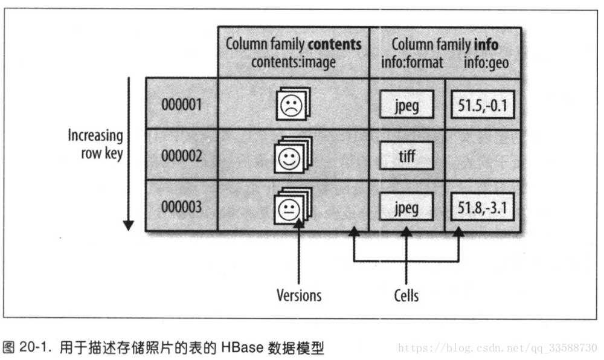
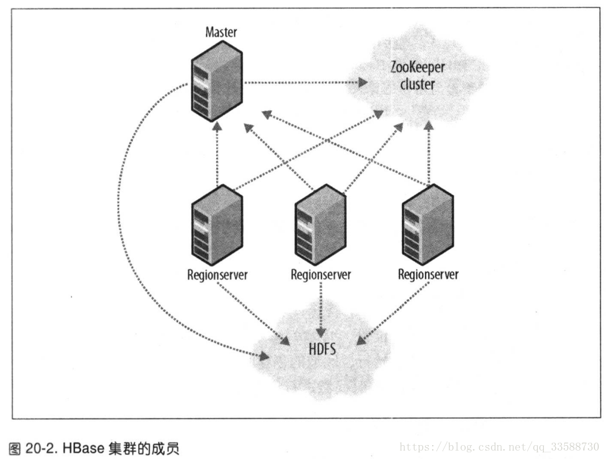

# 第二十章 关于HBase

## 20.1 HBase基础

HBase是一个在HDFS上开发的面向列的分布式数据库。如果需要实时地随机访问超大规模数据集，就可以使用HBase这一Hadoop应用。

虽然数据库存储和检索的实现是可以选择很多不同的策略，但是绝大多数解决办法，特别是关系型数据库技术的变种，不是为大规模可伸缩的分布式处理设计的，很多厂商提供了复制(replication)和分区(partitioning)解决方案，让数据库能够从单个节点上扩展出去(例如：MySQL的主从复制技术)，但是这些附加技术大多属于"事后"的解决方法，而且非常难以安装和维护，并且这些解决方法常常需要牺牲一些重要的RDBMS特性，在一个“扩展的”RDBMS上，连接、复杂查询、触发器、视图以及外键约束这些功能要么运行开销大，要么根本无法使用。

HBase从另一个方面来解决可伸缩性问题。它自底向上地进行构建，能够简单地通过增加节点来达到线性扩展。HBase并不是关系型数据库，它不支持SQL。在特定的问题空间，它能能够做RDBMS不能做的事：在廉价硬件构成的集群上管理超大规模的稀疏表。

HBase的一个典型应用事webtable，一个以网页URL为主键的表，其中包含爬取的页面和页面属性(例如语言和MIME类型)。webtable非常大，行数可以达到十亿级之级。在webtable上连续运行用于批处理分析和解析的MapReduce作业，能够获取相关的统计信息，增加验证的MIME类型列以提供搜索引擎进行索引的解析后的文本内容。同时，表格还会被以不同运行速度的爬取器随机访问，并随机更新其中的行，在用户点击访问网站的缓存页面时，需要实时地将这些被随机访问的页面提供给他们。

## 20.2 概念

### 20.2.1 数据模型的“旋风之旅”

应用把数据存放在带标签的表中。表由行和列组成。表格的单元格由行和列的坐标交叉决定，是有版本的。默认情况下，版本号是自动分配，为HBase插入单元格的时间戳，单元格内容是未解释的字节数组。例如：图20-1所示为用于存储照片的HBase表。



表中行的键也是字节数组。所以理论上，任何数据都可以通过表示为字符串或将二进制形式转化为长整型或直接对数据结构进行序列化，来作为键值。表中的行根据行的键值(也就是表的主键)进行排序。排序根据字节序进行，对所有表的访问都需要通过主键。

------

HBase不支持表中的其他列建立索引(也称为辅助索引)。不过，有几种策略可用于支持辅助索引提供的查询类型，每种策略在存储空间、处理负载和查询执行时间之间存在不同的利弊权衡。

------

行中的列被分成 **列族(column family)**。同一个列族的所有成员具有相同的前缀。因此，像列info:format和info:geo都是列族info的成员。而contents:image则是属于contens族。列族的前缀必须由 **可打印(printable)**字符组成。而修饰性的结尾字符，即列族修饰符，可以为任意字节。列族和修饰符之间始终以冒号(:)分隔。

一个表的列族必须作为表模式定义的一部分预先给出，但是新的列族成员可以随时按需要加入。例如：只要目标表中已经有了列族info，那么客户端就可以在更新时提供新的列info:camera，并存储它的值。

物理上，所有的列族都一起存放在文件系统中。所以，虽然前面把HBase描述为一个面向列的存储器，但实际上更准确的说法是：它是一个面向列族的存储器。由于调优和存储都是在列族这个层次上进行的，所以最好使用所有列族成员都有相同的访问模式(access pattern)和大小特征。对于存储照片的表，由与图像数据比较大，因而跟较小的元数据分别存储在不同的列族中。

换而言之，HBase表和RDBMS中的表类似，只不过它的单元格有版本，行是排序的，而只要列族预先存在，客户端随时可以把列添加到列族中去。

#### 1. 区域

HBase自动把表水平划分为区域。每个区域由表中行的子集构成，每个区域由他所属的表，它所包含的第一行及其最后一行（不包括最后一行）来表示。一开始，一个表只有一个区域，但随着区域开始变大，等到它超出设定的大小阈值，所有加载的数据都放在原始区域所在的那台服务器上，随着表变大，区域的个数也会增加。区域是HBase集群上分布数据的最小单位。用这种方式，一个因为太大而无法放在单台服务器上的表会被放在服务器集群上，其中每个节点都负责管理所有区域的一个子集，表加载也是用这种方法把数据分布到各个节点。在线的所有区域依次排列就构成了表的所有内容。

#### 2. 加锁

无论对行进访问的事务牵涉多少列，对行的更新都是原子的，这使得“加锁模型(locking model)”变得简单。

### 20.2.2 实现

正如HDFS和YARN是由客户端、从属机(slave)和协调主控机(master)构成——HDFS的namenode和datanode；YARN的ResourceManager和NodeManager。一个Master节点协调管理一个或多个regionServer从属机(参见图20-2)。HBase主控机(master)负责启动一个全新的安装，把区域分配给注册的regionServer，恢复regionServer的故障，master负载很轻，regionServer负责零个或多个区域的管理以及影响客户端的读/写请求。regionServer还负责区域的划分并通知HBase Master有了新的子区域(daughter region)，这样以来，主控机就可以把父区域设为离线，并用子区域替换父区域。



HBase依赖于Zookeeper实例，默认情况下，它管理一个Zookeeper实例，作为集群的“权威机构”，也可以通过配置来使用已有的Zookeeper集群。Zookeeper负责管理诸如hbase:meta目录表的位置以及当前集群主控机地址等重要信息。如果在区域分配的过程中有服务器奔溃，就可以通过Zookeeper来进行分配的协调。在Zookeeper上管理分配事务的状态有助于在恢复时能够从崩溃服务器遗留的状态开始继续分配。启动一个客户端连接到HBase集群的连接时，客户端必须至少拿到集群所传递的Zookeeper集合体的位置，这样，客户端才能访问Zookeeper的层次结构，从而了解集群的属性，例如：服务器的位置。

与通过`$HADOOP/etc/hadoop/slaves`文件查看datanode和节点管理器列表一样，regionserver从属机节点列表在HBase的`/conf/regionserver`s文件中。启动和结束服务的脚本和Hadoop类似，使用相同的基于SSH的机制来运行远程命令。HBase集群的站点配置在HBase的`/conf/hbase-site.xml`和`/conf/hbase-env.sh`文件中。格式与Hadoop父项目中对应的格式相同(参见第10章)。

------

对于HBase和Hadoop上相同的服务或类型，HBase实际上会直接使用或继承Hadoop的实现。在无法直接使用或继承时，HBase会尽量遵循Hadoop的模型。例如，HBase使用Hadoop Configuration系统，所以它们的配置文件格式相同。

------

HBase通过Hadoop文件系统API来持久化存储数据。多数人使用HDFS作为存储来运行HBase。但是，默认情况下，除非另行指明，HBase会将存储写入本地文件系统。默认情况下，HBase会将存储写在本地文件系统。

#### 运行中的HBase

HBase内部保留名为hbase:meta的特殊目录表(catalog table)。它们维护着当前集群上所有区域的列表，状态和位置。hbase:meta表中的项使用使用区域名作为键，区域名由所属区域的表明、区域的起始行、区域的创建时间以及对其整体进行的MD5哈希值(即对表名、起始行、创建的时间戳进行哈希后的结果)组成。

例如，表TestTable中起始行为xyz的区域的名称如下：

```
TestTable,xyz,1279729913622.1b6el76fb8d8aa88fd4ab6bc80247ece.
```

在表明，起始行，时间戳中间用逗号分隔。MD5哈希值则使用前后两个句号包围。

如前所述，行的键是排序的，因此要找到一个特定行所在区域只要在目录表中找到第一个键大于或等于给定行键的项即可。区域变化时，即分裂、禁用\启用(disable/enable)、删除、为负载均衡重新部署区域由于regionServer崩溃而重新部署区域时，目录表会更新，这样，集群上所有区域的状态信息就能保持是最新的。

新连接到Zookeeper集群上的客户端首先查找hbase:meta的位置，然后客户端通过查找合适的hbase:meta区域来获取用户空间区域所在节点及其位置。接着客户度就可以直接和管理那个区域的regionServer进行交互。

每个行操作可能要访问三次远程节点，为了节省这些代价，客户端会缓存它们遍历hbase:meta时获取的信息。不仅有位置信息，还有用户空间区域开始行和结束行。这样，不需要访问hbase:meta表也能得知区域的存放位置，客户端在碰到错误之前会一直使用所缓存的项，当发生错误时，即区域被移动了，客户端会再去查看hbase:meta获取区域的新位置。如果hbase:meta区域也被移动了，客户端会重新查找。

达到RegionServer的写操作首先追加到提交日志(commit log)中，然后加入内存中的memstore。如果metastore满，它的内容会被刷入(flash)文件系统。

提交日志存放在HDFS中，因此即使一个regionServer崩溃，提交日志仍然可用。如果发现一个regionserver不能访问(通常因为服务器的znode在Zookeeper中过期)，主控机会根据区域对死掉的regionserver的提交日志进行分割到其他节点。重新分配后，在打开并使用死掉的regionserver的区域之前，这些区域会找到属于它们的从被分割提交日志中得到的文件，其中包含还没有被持久化存储的更新。这些更新会被其他节点重做(replay)使区域恢复到服务器失败前的状态。

在读数据时首先查看区域的内存memstore，如果在内存里的memsotre中找到了需要的版本，查询结束，否则需要按照次序从新到旧检查磁盘上的“刷新文件”(flush file)，直到找到满足查询的版本或所有刷新文件被遍历为止。

有一个后台进程负责在刷新文件个数达到一个阈值时压缩它们，它把多个文件重新写入一个文件。这是因为读操作检查的文件越少，它的执行效率越高。在压缩时，进程会清理掉超出规模所设最大值的版本以及删除单元格或标示单元格为过期。在regionServer上，另外有一个独立的进程监控着刷新文件的大小，一旦文件大小超出预先设定的最大值，便对区域进行分割。

## 20.3 安装

详见大数据体系软件安装：单机版&集群版。

## 20.4 客户端

和HBase集群进行交互，有很多不同的客户端可以选择。

