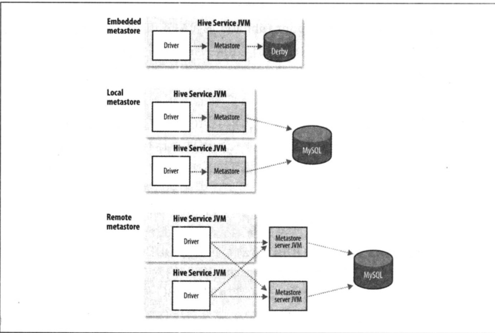
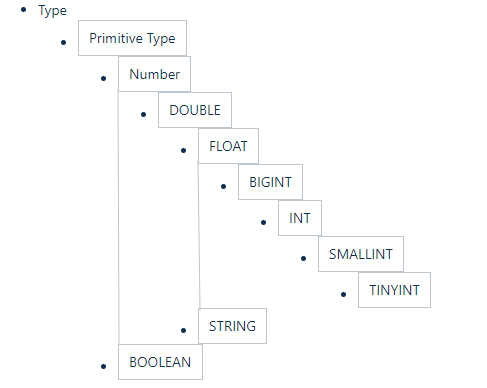
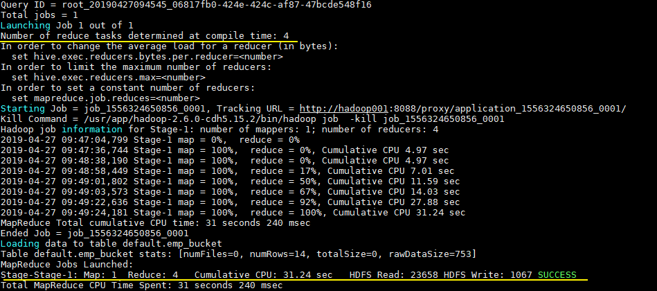

# 第十七章 关于Hive

HIve是一个构建在Hadoop上的数据仓库框架，其设计目的是让精通SQL技能但是编程较弱的数据分析师能够对存放在HDFS中的大规模数据集执行查询。目前，很多组织将Hive作为一个通用的，可伸缩的数据处理平台。

SQL适用于分析任务，不适合用来开发复杂的机器学习算法。其特点如下：

1. 简单、容易上手 (提供了类似 sql 的查询语言 hql)，使得精通 sql 但是不了解 Java 编程的人也能很好地进行大数据分析；
2. 灵活性高，可以自定义用户函数 (UDF) 和存储格式；
3. 为超大的数据集设计的计算和存储能力，集群扩展容易;
4. 统一的元数据管理，可与 presto／impala／sparksql 等共享数据；
5. 执行延迟高，不适合做数据的实时处理，但适合做海量数据的离线处理。

## 17.1 安装Hive

Hive一般在工作站上运行，把SQL查询站换位一系列在Hadoop集群上运行的作业，Hive把数据组织为表，通过这种方式为存储在HDFS上的数据赋予结构，元数据存储在metastore数据库中。

安装Hive非常简单，首先必须在本地安装和集群上相同版本的Hadoop。

**Tips Hive能和哪些版本的Hadoop共同工作**

每个Hive的发布版本都会被设计为能够和多个版本的Hadoop共同工作，一般而言，Hive支持Hadoop最新发布的稳定版本以及之前的老版本。

**1. 下载解压Hive**

下载所需版本的 Hive，这里我下载版本为 `cdh5.15.2`。下载地址：http://archive.cloudera.com/cdh5/cdh/5/

```shell
# 下载后进行解压
tar -zxvf hive-1.1.0-cdh5.15.2.tar.gz
```

**2. 配置环境变量**

```shell
vim /etc/profile
```

添加环境变量：

```shell
export HIVE_HOME=/usr/app/hive-1.1.0-cdh5.15.2
export PATH=$HIVE_HOME/bin:$PATH
```

使得配置的环境变量立即生效：

```shell
source /etc/profile
```

**3. 修改配置**

**(1) hive-env.sh**

进入安装目录下的 `conf/` 目录，拷贝 Hive 的环境配置模板 `flume-env.sh.template`

```shell
cp hive-env.sh.template hive-env.sh
```

修改 `hive-env.sh`，指定 Hadoop 的安装路径：

```shell
HADOOP_HOME=${your HADOOP_HOME}
```

**(2) hive-site.xml**

新建 hive-site.xml 文件，内容如下，主要是配置存放元数据的 MySQL 的地址、驱动、用户名和密码等信息：

```xml
<?xml version="1.0"?>
<?xml-stylesheet type="text/xsl" href="configuration.xsl"?>

<configuration>
  <property>
    <name>javax.jdo.option.ConnectionURL</name>
    <value>jdbc:mysql://hadoop001:3306/hadoop_hive?createDatabaseIfNotExist=true</value>
  </property>
  
  <property>
    <name>javax.jdo.option.ConnectionDriverName</name>
    <value>com.mysql.jdbc.Driver</value>
  </property>
  
  <property>
    <name>javax.jdo.option.ConnectionUserName</name>
    <value>root</value>
  </property>
  
  <property>
    <name>javax.jdo.option.ConnectionPassword</name>
    <value>root</value>
  </property>

</configuration>
```

**4. 拷贝数据库驱动**

将 MySQL 驱动包拷贝到 Hive 安装目录的 `lib` 目录下, MySQL 驱动的下载地址为：https://dev.mysql.com/downloads/connector/j/ , 在本仓库的[resources](https://github.com/heibaiying/BigData-Notes/tree/master/resources) 目录下我也上传了一份，有需要的可以自行下载。

**5. 初始化元数据库**

- 当使用的 hive 是 1.x 版本时，可以不进行初始化操作，Hive 会在第一次启动的时候会自动进行初始化，但不会生成所有的元数据信息表，只会初始化必要的一部分，在之后的使用中用到其余表时会自动创建；

- 当使用的 hive 是 2.x 版本时，必须手动初始化元数据库。初始化命令：

	```shell
	# schematool 命令在安装目录的 bin 目录下，由于上面已经配置过环境变量，在任意位置执行即可
	schematool -dbType mysql -initSchema
	```

这里我使用的是 CDH 的 `hive-1.1.0-cdh5.15.2.tar.gz`，对应 `Hive 1.1.0` 版本，可以跳过这一步。

**6. 启动**

由于已经将 Hive 的 bin 目录配置到环境变量，直接使用以下命令启动，成功进入交互式命令行后执行 `show databases` 命令，无异常则代表搭建成功。

```shell
hive
```

在 Mysql 中也能看到 Hive 创建的库和存放元数据信息的表


### Hive的Shell环境

Hive的shell环境是用户和Hive交互，发出HiveSQL命令的主要方式。HiveQL是HIve的查询语言。

第一次启动Hive时，可以通过列出Hive的表来检查Hive是否正常工作

```shell
hive > show tables;
OK
Time token: 0.473 seconds
```


使用-f选项可以运行指定文件的命令。

```hive
hive -f xxx.sql
```

相对于较短的脚本，可以使用-e选项在行内嵌入命令，此时不需要结束的分号。

```shell
hive -e 'select * from table'
```

## 17.2 示例

使用Hive查询数据集，步骤如下：

1. 把数据加载到Hive管理的存储，可以是本地，也可以是HDFS。

	```sql
	CREATE TABLE records (year STRING, temperature INT, quality INT)
	ROW FORMATE DELIMITED
		FILEDS TERMINATED BY '\t';
	```

	第一行声明一个records表，包含三列：year、temperature、quality，必须指明每列数据类型。第二行ROW FORMATE声明数据文件的每一行是由制表符分隔的文本，Hive按照这一格式读取数据：每行三个字段，分别对应于表中的三列，字段间使用制表符分割，每行以换行符分割。

2. 向Hive输入数据

	```sql
	load data local inpath "/usr/file/emp.txt" overwrite into table emp;
	```

	这一指令表示将指定的本地温江放入其仓库目录中，这只是个简单的文件系统操作，并不解析文件或把他存储为内部数据库格式，因为Hive并不强制使用人格特定文件格式，文件以原样逐字存储。

	在Hive的仓库目录中，表存储为目录，仓库目录由选项hive.metastore.warehouse.dir控制，默认值为：/usr/hive/warehouse。

3. 使用HQL语句操作数据

	```sql
	hive> select year, MAX(tempereture) from records where temperature != 9999 and quality in (0,1,4,5,9) Group by year;
	```

## 17.3 运行Hive

本节介绍运行Hive的一些实用技术，包括如何设置Hive使其能运行在Hadoop集群和共享的metastore上。

### 17.3.1 配置Hive

与Hadoop类似，Hive使用XML配置文件进行设置，配置文件为hivesite.xml，在conf目录下，通过这个文件，可以设置每次运行Hive时使用的选项。

可以通过四种方式对 Hive 的相关属性进行配置，分别介绍如下：

**1. 默认配置文件**

Hive默认值和Hadoop默认文件(core-default.xml、hdfs-default.xml、mapred-default.xml、yarn -site.xml)

**2. 自定义配置文件**

使用配置文件指定的配置是永久有效的。Hive 有以下三个可选的配置文件：

- hive-site.xml ：Hive 的主要配置文件；
- hivemetastore-site.xml： 关于元数据的配置；
- hiveserver2-site.xml：关于 HiveServer2 的配置。

****

**3. hiveconf**

在启动命令行 (Hive CLI / Beeline) 的时候使用 `--hiveconf` 指定配置，这种方式指定的配置作用于整个 Session。

```sh
hive -hiveconf fs.default=hdfs://localhost \
		 -hiveconf mapreduce.framework.name=yarn \
```

**4. set**

交互式环境下 (Hive CLI / Beeline)，使用 set 命令指定。这种设置的作用范围也是 Session 级别的，配置对于执行该命令后的所有命令生效。set 兼具设置参数和查看参数的功能。如下：

```sh
set hive.exec.scratchdir=/tmp/mydir;
No rows affected (0.025 seconds)
set hive.exec.scratchdir;
+----------------------------------+--+
|               set                |
+----------------------------------+--+
| hive.exec.scratchdir=/tmp/mydir  |
+----------------------------------+--+
```

配置的优先顺序如下 (由低到高)：
		hive-site.xml- >hivemetastore-site.xml`- > `hiveserver2-site.xml` - >` -- hiveconf`- > `set`

**执行引擎**

Hive的原始设计时以MapReduce作为执行引擎，目前，Hive的执行引擎还包括Apache Tez，此外Hive对Spark的支持也在开发中。Tez和Spark都是通用有向无环图 (DAG)引擎，比MapReduce更加灵活，性能更为优越。通过属性hive.execution.engine来控制。

**日志记录**

可以在本地文件系统的${java.io.tmpdir}/{user.name}/hive.log中找到Hive的错误日志。日志的配置放在conf/hive-log4j.properties中或者使用命令：hive -hiveconf hive.root.logger=DEBUG,console

### 17.3.2 Hive服务

Hive的shell环境只是Hive命令提供的其中一项服务，可以在运行时使用--service选项指明要使用哪种服务，hive --service help可以获得可用的服务列表：

- cli  Hive的命令行接口(Shell环境)，这是默认服务
- hivServer2 让Hive以提供Thrift服务的服务器形式运行，允许用不同语言编写的客户端进行访问，hiveserver2在支持认证和多用户并发方面比原始的hiveserver有很大改进。使用Thrift、JDBC和ODBC连接器的客户端需要运行Hive服务器和Hive通信，通过设置**hive.server2.thrift.port**属性来指明服务器监听的端口号。
- beeline 以嵌入方式工作的Hive命令接口，类似于常规的CLI或者使用JDBC连接到的一个hiveServer2进程。
- hwi Hive的Web接口，在没有安装任何客户端软件的情况下，这个简单的Web接口可以代替CLI
- jar 运行类路径中同时包含hadoop和hive类java程序的简便方法
- metastore 默认情况下，metastore和Hive服务运行在同一个进程里，使用这个服务可以让metastore作为一个单独(远程)进程运行，通过设置METASTORE_PORT环境变量指定服务器监听端口。

**Hive客户端**

如果以服务器方式运行Hive(hive --service hiveserver2)，可以在应用程序中以不同的机制连接到服务器：

- Thrift客户端 

	Hive服务器提供Thrift服务的运行，因此支持Thrift的编程语言都可以与之交互。

- JDBC驱动

	Hive提供了Type 4的JDBC驱动，定义在org.apache.hadoop.hive.jdbc.HiveDriver类中。在以jdbc:hive2://host:port/dbname形式配置JDBC URI以后，Java应用程序可以在指定主机和端口连接在另一个进程中运行的Hive服务器。

Beeline CLI使用JDBC驱动与Hive通信。

- ODBC通信 

	Hive的ODBC驱动允许支持ODBC协议的应用程序连接到Hive

Hive客户端与服务之间的联系如图17-1所示。


​																		**图17-1 Hive体系结构**

### 17.3.3 MeteStore

metastore是Hive元数据的集中存放池。metastore包括两部分：服务和后台数据的存储。默认情况下，metastore服务和Hive服务运行在同一个JVM中，它包含一个内嵌的以本地磁盘作为存储的Derby数据库实例，称为内嵌metastore配置(embedded metastore configuration)，如图17-2所示：



Hive metastore的三种方式：

- 内嵌metastore配置：Hive入门最简单的方法，但是每次只有一个内嵌Derby数据库可以访问磁盘上的数据库文件，每次只能为每个metastore打开一个Hive会话；
- 本地metastore配置：使用独立数据库支持多会话(多用户)，metastore服务和Hive服务仍然运行在同一个进程中，但是连接另一个进程中的数据库，在同一台机器上或远程机器上。
- 远程metastore配置：多个metastore服务器和Hive服务运行在不同的进程中，这样，数据库可以完全设置于防火墙后，客户端不需要数据库凭据(用户名和密码)，提供了更好的可管理性和安全。

任何JDBC兼容的数据库都可以通过表17-1列出的javax.jdo.option.*配置属性来供metastore使用：

| 属性名称                              | 类型          | 默认值                                        | 描述                                                         |
| ------------------------------------- | ------------- | --------------------------------------------- | ------------------------------------------------------------ |
| Hive.metastore.warehouse.dir          | URI           | /usr/hive/warehouse                           | 相对于f s.default.name的目录，存储托管表                     |
| Hive.metastore.uris                   | 逗号分隔的URI |                                               | 默认用当前metastore，或连接URI指定的一个或多个远程metastore服务 |
| Javax.jdo.option.ConnectionURL        | URI           | Jdbc:derby:databaseName=mestore b;create=true | metasore数据库的JDBC URI                                     |
| Javax.jdo.option.ConnectionDriverName | String        | org.apache.derby.jdbc.EmbeddedDriver          | JDBC驱动器类名                                               |
| Javax.jdo.option.ConnectionUserName   | String        | APP                                           | JDBC用户名                                                   |
| Javax.jdo.option.ConnectionPassword   | String        | mine                                          | JDBC密码                                                     |

对于独立的metastore，MySQL是比较常见选择，此时属性设置为：

```xml
Javax.jdo.option.ConnectionURL=jdbc:mysql//host/dbname?createDatabaseIfNotExist=true
Javax.jdo.option.ConnectionDriverName=com.mysql.jdbc.Driver
Javax.jdo.option.ConnectionUserName=${mysql_usernmae}
Javax.jdo.option.ConnectionPassword=${mysql_password}
```

将 MySQL 驱动包拷贝到 Hive 安装目录的 `lib` 目录下。

## 17.4 Hive与传统数据库相比

### 17.4.1 读时模式与写时模式

在传统数据库中，表模式是在数据加载时强制确定的，若加载时发现数据不符合模式，则拒绝加载数据，因为数据在写入数据库时对照模式进行检查，这一设计称为**写时模式(schema on wirte)**。

Hive对数据的验证不在写入时进行，而在查询时进行，称为**读时模式(schema on read)**。

读时模式加载数据非常迅速，因为不需要读取数据来进行解析，再进行序列化并以数据可内部格式存入粗盘，数据加载操作仅仅是**文件的复制或移动**。

写时模式有利于提升查询性能，因为数据库可以对列进行索引，并对数据进行压缩，但是加载数据时间较长。

### 17.4.2 更新、事务和索引

更新、事务和索引是传统数据库最重要的特性。Hive被设计为用MapReduce操作hdfs数据，全表扫描是常态操作，而表更新则是通过把数据变换后放入新表实现的。

随着Hive版本迭代，现支持Inster INTO语句为表添加新的数据文件，UPDATE、DELETE更新和删除操作。HDFS不提供就地文件更新，因此插入、更新和删除操作引起的一切变化都被保存在一个较小的增量文件中，由metastore后台运行的MapReduce作业会定期将这些增量文件合并到**基表文件**中。

Hive还引入表级(table-level)锁和分区级(partition-level)锁，可以防止一个进程删除另一个进程读取的表数据。默认未启用锁。

Hive的索引分为两类：紧凑（compact）索引和位图（bitmap）索引：

1）**紧凑索引存储每个值的hdfs块号**，因此存储不会占用很多空间，且值被聚集存储于相近行的情况，索引仍然有效

2）**位图索引使用压缩的位集合来高效存储具有某个特征值的行**，这种索引适用于具有较少可能值的列。

### 17.4.3 其他SQL-on-Hadoop技术

针对Hive的局限性，Clousdera Impala是升级的交互式SQL引擎，Impala在性能上比基于MapReduce的是Hive要高出一个数量级。

其他几个著名的开源Hive替代技术包括：FaceBook Presto、Apache Drill、Spark SQL。

## 17.5 HiveQL

Hive的SQL方言被称为HQL，是SQL-92、MySQL和Orale SQL语言的混合体。表17-2给出了sql与HiveQL较高层次的比较：

表17-2 SQL与HiveQL的概要比较

| 特性                     | sql                  | HiveQL                           |
| ------------------------ | -------------------- | -------------------------------- |
| 更新                     | insert update delete | insert                           |
| 事务                     | 支持                 | 支持（表级和分区级）             |
| 索引                     | 支持                 | 支持                             |
| 延迟                     | 亚秒级               | 分钟级                           |
| 函数                     | 支持                 | 支持                             |
| 多表插入                 | 不支持               | 支持                             |
| create table as select * | 有些支持             | 支持                             |
| 选择                     | SQL-92               | FRom子句中只能有一个表或视图     |
| 连接                     | SQL-92               | 内连接，外链接，半连接，映射连接 |
| 子查询                   | 任何子句             | 只能在FROM子句中                 |
| 视图                     | 可更新               | 只读                             |
| 扩展点                   | 用户定义函数         | 用户定义函数                     |
|                          | 存储过程             | MapReduce脚本                    |

### 17.5.1 数据类型

Hive支持原子和复杂数据类型，原子类型包括：**tinyint，smallint，int，bigint**，**float，double**，**boolean，string，binary，timestamp**；复杂类型包括：**array、map、struct**。

​															**表17-3 Hive数据类型**

| 大类                                    | 类型                                                         |
| --------------------------------------- | ------------------------------------------------------------ |
| **Integers（整型）**                    | TINYINT—1 字节的有符号整数 SMALLINT—2 字节的有符号整数 INT—4 字节的有符号整数 BIGINT—8 字节的有符号整数 |
| **Boolean（布尔型）**                   | BOOLEAN—TRUE/FALSE                                           |
| **Floating point numbers（浮点型）**    | FLOAT— 32位单精度浮点型 DOUBLE—64位双精度浮点型              |
| **Fixed point numbers（定点数）**       | DECIMAL—用户自定义任意精度定点数，比如 DECIMAL(7,2)          |
| **String types（字符串）**              | STRING—指定字符集的变长字符序列(最大2GB) VARCHAR—具有最大长度限制的字符序列 CHAR—固定长度的字符序列。 |
| **Date and time types（日期时间类型）** | TIMESTAMP — 储存精度为纳秒级时间戳     TIMESTAMP WITH LOCAL TIME ZONE — 时间戳，纳秒精度      DATE—日期类型，包括：年月日三部分； Hive提供了在Hive时间戳、Unix时间戳、字符串之间转换的UDF |
| **Binary types（二进制类型）**          | BINARY—变长二进制字节序列                                    |

| 类型       | 描述                                                         | 示例                                   |
| ---------- | ------------------------------------------------------------ | -------------------------------------- |
| **STRUCT** | 类似于对象，是字段的集合，字段的类型可以不同，可以使用 `名称.字段名` 方式进行访问 | STRUCT ('xiaoming', 12 , '2018-12-12') |
| **MAP**    | 键值对的集合，可以使用 `名称[key]` 的方式访问对应的值        | map('a', 1, 'b', 2)                    |
| **ARRAY**  | 数组是一组具有相同类型和名称的变量的集合，可以使用 `名称[index]` 访问对应的值 | ARRAY('a', 'b', 'c', 'd')              |

### 17.5.2 操作与函数

Hive提供了普通SQL操作符，包括：关系操作符；控制判断(x is NULL)；匹配模式：(x LIKE 'a%')，算数操作符，以及逻辑操作符(如：X or Y)。

Hive内置函数分为：数学和统计函数、字符串函数、日期函数(用于操作表示日期的字符串)、条件函数、聚集函数、以及处理XML的Xpath函数和JSON函数。

**类型转换**

原子类型数据形成一个Hive函数和操作符表达式进行隐式类型转换的层次。例如：如果一个表达式要使用INT，那么TINYINT会被转换为INT。具体转换层次结构如下图所示：任何数值类型都可以隐式转换为范围更广的类型或者文本类型(STRING、VARCHAR、CHAR)，额外注意的是：按照类型层次结构允许将 STRING 类型隐式转换为 DOUBLE 类型。



但是Hive不会进行反向转换，会返回错误，除非使用CAST操作。

## 17.6 表

Hive的表在逻辑上由存储的数据和表述表中数据形式的相关元数据组成。数据一般存放在HDFS中，但是也可以存放在任何Hadoop文件系统中；元数据存放在关系型数据库中。

**多数据库/模式支持**

很多关系型数据库提供了多个命名空间(namespace)支持，这样，用户和应用就可以被隔离到不同的数据库或模式中。Hive也提供了了命名空间的支持，使用`CREATE DATABASE dbname`、`USE dbname`、`DROP DATABASE dbname`操作命名空间。通过dbname.tablename来完全限定一张表。如果未指明数据库，则使用default数据库中的表。

### 17.6.1 托管表和外部表

在Hive创建表的时候，默认情况下创建**托管表(managed table)**，Hive负责管理数据，Hive将数据移入它的仓库目录(warehouse directory)。另一种选择是创建一个**外部表(external table)**，Hive到仓库目录之外的位置访问数据。

这两种表的区别表现在LOAD和DROP命名的语义上：

- **托管表**加载数据，将数据移至仓库目录。

	```sql
	CREARE TABLE managed_table (dummy STRING);
	LOAD DATA INPUTPATH '/usr/tom/data.txt' INTO table managed_table;
	```

	把文件`hdfs://usr/tom/data.txt`移动到Hive的managed_table表的仓库目录中，即`hdfs://user/hive/warehouse/managed_table`。

- 外部表加载数据，不会将数据移动到数据仓库目录，使用EXTERNAL关键字显示创建表。

	```sql
	CREARE EXTERNAL TABLE managed_table (dummy STRING);
	LOAD DATA INPUTPATH '/usr/tom/data.txt' INTO table managed_table;
	```

- 托管表删除数据，元数据（metadata）和文件一起被删除。

	```sql
	DROP TABLE managed_table
	```

- 外部表仅删除元数据。

**如何选择创建表的方式**

多数情况下，这两种方式无太大区别，一个经验法则：如果所有的处理操作都由Hive完成，应该使用托管表；如果要使用Hive和其他工具来处理同一个数据集，应该使用外部表。普遍的做法是：**把存放在HDFS上的初始数据集作为外部表进行使用**，然后用Hive加工处理数据，将结果作为托管表存储。

**Hive数据加载的数据正确性**

托管表与外部表的数据加载操作实际上是文件系统的文件移动或重命名，定义时不会检查外部文件是否存在与文件内数据与Hive表元数据对应关系，如果不匹配，直到查询时才会知道。如果数据异常，未能被正确解析，则select查询未缺失字段返回空值。

### 17.6.2 分区和桶

Hive把表组织称分区(partition)，这是一种根据分区列(partition column，如日期)的值对表进行粗略划分的机制，使用分区可以加快数据分片(slice)的查询速度。

表或分区可以进一步划分为桶(bucket)，它会为数据提供额外的结构以获得更高效的查询处理。例如：根据用户ID来划分桶，可以在用户集合的随机样本上快速计算基于用户的查询。

**1. 分区**

以分区常用情况为例。考虑日志文件的每条记录都包含一个时间戳，按照日期分区，同一天的记录就会被存放在同一个分区中，当处理日期相关的操作会变得非常高效，因为只需要扫描操作日期范围内的分区文件。**PS：分区不会影响大范围的执行，我们仍然可以查询跨多个分区的整个数据集**。

Hive表支持多个维度分区。例如根据日期对日志进行分区外，还可以根据日志级别、国别等对每个分区进行**子分区(subpartition)** 。

分区是在创建表的时候用PARTITIONED BY定义。对于上述情况，分区表创建语句：

```sql
CREATE TABLE logs(ts BIGINT, line STRING)
PARTITIONED BY (dt STRING, country STRING)
```

在加载数据到分区表的时候，需要显式指定分区：

```sql
LOAD DATA LOCAL INPUTPATH 'input/hive/partitions/file1'
INTO TABLE logs PARTITION(dt="2020-02-28", country="th")
```

在文件系统级别，分区只是表目录下嵌套的子目录，目录结构如下：

```
/user/hive/warehouse/logs
|————dt=2020-02-28/
|    |————country=th
		 |    |————file1
		 |    |————file2
		 |____country=us
		 			|____file3
|_____dt=2020-02-29
			|————country=th
		 	|    |————file4
      |____country=us
		 			 |____file5
```

日志表有两个日期分区：2020-02-28和2020-02-29，分别对应子目录dt=2020-02-28和dt=2020-02-29；两个国家th和us，分别对应嵌套子目录：country=th和country=us，数据文件存放在底层目录中。

**SHOW PARTITON**命令可以查看分区。

```
hive>show partiton
dt=2020-02-28/country=th
dt=2020-02-28/country=us
dt=2020-02-29/country=th
dt=2020-02-29/country=us
```

**注意：**PARTITONED BY子句中的列定义是表中正式的列，称为**分区列(partiton column)**，但是，数据文件并不包含这些列的值，因为它们源于目录名。

**2. 桶**

Hive 提供了一种更加细粒度的数据拆分方案：分桶表 (bucket Table)。把表划分成桶的主要有两个原因：

**第一个原因：**分区提供了一个隔离数据和优化查询的可行方案，但是并非所有的数据集都可以形成合理的分区，分区的数量也不是越多越好，过多的分区条件可能会导致很多分区上没有数据。同时 Hive 会限制动态分区可以创建的最大分区数，用来避免过多分区文件对文件系统产生负担。

第二个理由是数据采样更加高效，在处理大规模数据集时，在开发和修改查询阶段，对数据集均匀采样，在小规模数据集上开发与调试。

Hive使用CLUSTERED BY子句来指定划分桶所用的列和要划分桶的个数，分桶表会将指定列的值进行哈希散列，并对 bucket（桶数量）取余，然后存储到对应的 bucket（桶）中。

```sql
CREATE TABLE bucketed_users(id INT, name STRING)
CLUSTERED BY (id) SORTED BY(id ASC) INTO 4 BUCKETS --按照员工id散列到四个 bucket 中
```

直接使用 `Load` 语句向分桶表加载数据，数据时可以加载成功的，但是数据并不会分桶。

这是由于分桶的实质是对指定字段做了 hash 散列然后存放到对应文件中，这意味着向分桶表中插入数据是必然要通过 MapReduce，且 Reducer 的数量必须等于分桶的数量。由于以上原因，分桶表的数据通常只能使用 CTAS(CREATE TABLE AS SELECT) 方式插入，因为 CTAS 操作会触发 MapReduce。加载数据步骤如下：

- **设置强制分桶**

	```sql
	set hive.enforce.bucketing = true; --Hive 2.x 不需要这一步
	```

	在 Hive 0.x and 1.x 版本，必须使用设置 `hive.enforce.bucketing = true`，表示强制分桶，允许程序根据表结构自动选择正确数量的 Reducer 和 cluster by column 来进行分桶。

- **CTAS导入数据**

	```sql
	INSERT INTO TABLE user_bucket SELECT *  FROM users;
	```

	可以从执行日志看到 CTAS 触发 MapReduce 操作，且 Reducer 数量和建表时候指定 bucket 数量一致：

	

bucket(桶) 本质上就是表目录下的具体文件，查看分桶文件，文件名是Hive根据Hash值创建的

```sh
hadoop fs -ls /user/hive/warehouse/user_bucket;

000000_0
000001_0
000002_0
000003_0
```

每个桶里包含的文件如下：

```sh
hadoop fs -cat /user/hive/warehouse/user_bucket/000000_0

0 nat
4 ann
```

使用TABLESAMPLE对表进行采样，**桶的个数从1开始计数**：

```sql
SELECT * FROM user_bucket TABLESAMPLE(BUCKET 1 OUT OF 4 ON id);

0 nat
4 ann
```

**分区表和分桶表结合使用**

分区表和分桶表的本质都是将数据按照不同粒度进行拆分，从而使得在查询时候不必扫描全表，只需要扫描对应的分区或分桶，从而提升查询效率。两者可以结合起来使用，从而保证表数据在不同粒度上都能得到合理的拆分。下面是 Hive 官方给出的示例：

```sql
CREATE TABLE page_view_bucketed(
	viewTime INT, 
  userid BIGINT,
  page_url STRING, 
  referrer_url STRING,
  ip STRING )
PARTITIONED BY(dt STRING)
CLUSTERED BY(userid) SORTED BY(viewTime) INTO 32 BUCKETS
ROW FORMAT DELIMITED
FIELDS TERMINATED BY '\001'
COLLECTION ITEMS TERMINATED BY '\002'
MAP KEYS TERMINATED BY '\003'
STORED AS SEQUENCEFILE;
```

此时导入数据时需要指定分区：

```sql
INSERT OVERWRITE page_view_bucketed
PARTITION (dt='2009-02-25')
SELECT * FROM page_view WHERE dt='2009-02-25';
```

### 17.6.3 存储格式

Hive从两个维度对表的存储进行管理，分别是**行格式(row format)**和**文件格式(file format)**，行格式指行和一行中的字读如何存储，行格式的定义由SerDe(序列化与反序列化工具)定义。

当作为反序列化工具，即查询表时，SerDe将把文件中字节形式的数据行反序列化为Hive内部操作数据行使用的对象形式，使用序列化工具时，也就是执行INSERT或CTAS时，表的SerDe会把Hive的数据行内部表示形式序列化成字节流并写到输出文件中。

文件格式指一行中字段容器的格式，最简单的格式是纯文本文件，也可以使用面向行和面向列的二进制格式。

**1. 默认存储格式：分隔的文本**

如果在创建表时，没有使用 **ROW FORMAT**或者 **STORED AS**子句，那么Hive所使用的默认格式是分隔文本，每行(line)存储一个数据行(row)。

当数据存储在文本文件中，必须按照一定格式区别行和列，如使用逗号作为分隔符的 CSV 文件 (Comma-Separated Values) 或者使用制表符作为分隔值的 TSV 文件 (Tab-Separated Values)。但此时也存在一个缺点，就是正常的文件内容中也可能出现逗号或者制表符。

所以 Hive 默认使用了几个平时很少出现的字符，这些字符一般不会作为内容出现在文件中。Hive 默认的行和列分隔符如下表所示。

| 分隔符          | 描述                                                         |
| --------------- | ------------------------------------------------------------ |
| **\n**          | 对于文本文件来说，每行是一条记录，所以可以使用换行符来分割记录 |
| **^A (Ctrl+A)** | 分割字段 (列)，在 CREATE TABLE 语句中也可以使用八进制编码 `\001` 来表示 |
| **^B**          | 用于分割 ARRAY 或者 STRUCT 中的元素，或者用于 MAP 中键值对之间的分割， 在 CREATE TABLE 语句中也可以使用八进制编码 `\002` 表示 |
| **^C**          | 用于 MAP 中键和值之间的分割，在 CREATE TABLE 语句中也可以使用八进制编码 `\003` 表示 |

实际上Hive支持8级分隔符，分别对应ASCII编码的$1,2,\dots,8$，但是只允许重载前三个。

使用示例如下：

```sql
CREATE TABLE page_view(viewTime INT, userid BIGINT)
 ROW FORMAT DELIMITED
   FIELDS TERMINATED BY '\001'
   COLLECTION ITEMS TERMINATED BY '\002'
   MAP KEYS TERMINATED BY '\003'
 STORED AS SEQUENCEFILE;
```

`create TABLE ...`等价于下面语句：

```sql
CREATE TABLE ... (...)
 ROW FORMAT DELIMITED
   FIELDS TERMINATED BY '\001'
   COLLECTION ITEMS TERMINATED BY '\002'
   MAP KEYS TERMINATED BY '\003'
   LINES TERMINATED BY '\n'
 STORED AS TEXTFILE;
```

**Tips 嵌套数据结构的分隔符**

前面对分隔符的描述对一般情况下的平面数据结构，即只包含原子数据类型的复杂数据类型是没问题的，但是对于嵌套数据类型(如：array( array()) )，嵌套的层级决定分隔符的使用。例如：对于数组嵌套数组，外层数组使用Control-B分隔符，内层则使用分隔符列表的下一个Control—C分隔符。

Hive内部使用LazySimpleSerDe的SerDe来处理分隔符和面向行的MapReduce文本输入和输出格式。Lazy指的是SerDe对字段的反序列化是延迟处理的，只有在访问字段时才会进行反序列化。但是，由于文本以冗长的形式存放，所以存储结构并不紧凑。

**2. 二进制序列化格式：顺序文件、Avro文件、Parquet文件、RCFile和ORCFile**

二进制格式的使用方法非常简单，只需要通过CREATE TABLE语句中的SORTED AS子句做相应声明。二进制格式可以划分为两大类：面向行的格式和面向列的格式。一般来说，面向列的存储格式对与只需要访问表中一小部分列的查询比较有效；面向行的存储格式适用于同时处理一行中很多列的情况。

Hive支持的文件存储格式如下表所述：

| 格式             | 说明                                                         |
| ---------------- | ------------------------------------------------------------ |
| **TextFile**     | 存储为纯文本文件。 这是 Hive 默认的文件存储格式。这种存储方式数据不做压缩，磁盘开销大，数据解析开销大。 |
| **SequenceFile** | SequenceFile 是 Hadoop API 提供的一种二进制文件，它将数据以<key,value>的形式序列化到文件中。这种二进制文件内部使用 Hadoop 的标准的 Writable 接口实现序列化和反序列化。它与 Hadoop API 中的 MapFile 是互相兼容的。Hive 中的 SequenceFile 继承自 Hadoop API 的 SequenceFile，不过它的 key 为空，使用 value 存放实际的值，这样是为了避免 MR 在运行 map 阶段进行额外的排序操作。 |
| **RCFile**       | RCFile 文件格式是 FaceBook 开源的一种 Hive 的文件存储格式，首先将表分为几个行组，对每个行组内的数据按列存储，每一列的数据都是分开存储。 |
| **ORC Files**    | ORC 是在一定程度上扩展了 RCFile，是对 RCFile 的优化。        |
| **Avro Files**   | Avro 是一个数据序列化系统，设计用于支持大批量数据交换的应用。它的主要特点有：支持二进制序列化方式，可以便捷，快速地处理大量数据；动态语言友好，Avro 提供的机制使动态语言可以方便地处理 Avro 数据。 |
| **Parquet**      | Parquet 是基于 Dremel 的数据模型和算法实现的，面向分析型业务的列式存储格式。它通过按列进行高效压缩和特殊的编码技术，从而在降低存储空间的同时提高了 IO 效率。 |

通常在创建表的时候使用 `STORED AS` 参数指定：

```sql
CREATE TABLE page_view(viewTime INT, userid BIGINT)
 ROW FORMAT DELIMITED
   FIELDS TERMINATED BY '\001'
   COLLECTION ITEMS TERMINATED BY '\002'
   MAP KEYS TERMINATED BY '\003'
 STORED AS SEQUENCEFILE;
```

各个存储文件类型指定方式如下：

- STORED AS TEXTFILE
- STORED AS SEQUENCEFILE
- STORED AS ORC
- STORED AS PARQUET
- STORED AS AVRO
- STORED AS RCFILE

### 17.6.4 创建表

**建表语法**

```sql
CREATE [TEMPORARY] [EXTERNAL] TABLE [IF NOT EXISTS] [db_name.]table_name     --表名
[(col_name data_type [COMMENT col_comment],
    ... [constraint_specification])]  --列名 列数据类型
[COMMENT table_comment]   --表描述
[PARTITIONED BY (col_name data_type [COMMENT col_comment], ...)]  --分区表分区规则
[
   CLUSTERED BY (col_name, col_name, ...) 
   [SORTED BY (col_name [ASC|DESC], ...)] INTO num_buckets BUCKETS
]  --分桶表分桶规则
[SKEWED BY (col_name, col_name, ...) ON ((col_value, col_value, ...), (col_value, col_value, ...), ...)  
   [STORED AS DIRECTORIES] 
]  --指定倾斜列和值
[
   [ROW FORMAT row_format]    
   [STORED AS file_format]
     | STORED BY 'storage.handler.class.name' [WITH SERDEPROPERTIES (...)]  
]  -- 指定行分隔符、存储文件格式或采用自定义存储格式
[LOCATION hdfs_path]  -- 指定表的存储位置
[TBLPROPERTIES (property_name=property_value, ...)]  --指定表的属性
[AS select_statement];   --从查询结果创建表
```

**内部表**

```sql
 CREATE TABLE emp(
    empno INT,
    ename STRING,
    job STRING,
    mgr INT,
    hiredate TIMESTAMP,
    sal DECIMAL(7,2),
    comm DECIMAL(7,2),
    deptno INT)
    ROW FORMAT DELIMITED FIELDS TERMINATED BY "\t";
```

**外部表**

```sql
CREATE EXTERNAL TABLE emp_external(
    empno INT,
    ename STRING,
    job STRING,
    mgr INT,
    hiredate TIMESTAMP,
    sal DECIMAL(7,2),
    comm DECIMAL(7,2),
    deptno INT)
    ROW FORMAT DELIMITED FIELDS TERMINATED BY "\t"
    LOCATION '/hive/emp_external';
```

使用 `desc format table` 命令可以查看表的详细信息。

**分区表**

```sql
CREATE EXTERNAL TABLE emp_partition(
    empno INT,
    ename STRING,
    job STRING,
    mgr INT,
    hiredate TIMESTAMP,
    sal DECIMAL(7,2),
    comm DECIMAL(7,2)
    )
    PARTITIONED BY (deptno INT)   -- 按照部门编号进行分区
    ROW FORMAT DELIMITED FIELDS TERMINATED BY "\t"
    LOCATION '/hive/emp_partition';
```

**分桶表**

```sql
 CREATE EXTERNAL TABLE emp_bucket(
    empno INT,
    ename STRING,
    job STRING,
    mgr INT,
    hiredate TIMESTAMP,
    sal DECIMAL(7,2),
    comm DECIMAL(7,2),
    deptno INT)
    CLUSTERED BY(empno) SORTED BY(empno ASC) INTO 4 BUCKETS  --按照员工编号散列到四个 bucket 中
    ROW FORMAT DELIMITED FIELDS TERMINATED BY "\t"
    LOCATION '/hive/emp_bucket';
```

**倾斜表**

通过指定一个或者多个列经常出现的值（严重偏斜），Hive 会自动将涉及到这些值的数据拆分为单独的文件。在查询时，如果涉及到倾斜值，它就直接从独立文件中获取数据，而不是扫描所有文件，这使得性能得到提升。

```sql
CREATE EXTERNAL TABLE emp_skewed(
    empno INT,
    ename STRING,
    job STRING,
    mgr INT,
    hiredate TIMESTAMP,
    sal DECIMAL(7,2),
    comm DECIMAL(7,2)
    )
    SKEWED BY (empno) ON (66,88,100)  --指定 empno 的倾斜值 66,88,100
    ROW FORMAT DELIMITED FIELDS TERMINATED BY "\t"
    LOCATION '/hive/emp_skewed';   
```

**临时表**

临时表仅对当前 session 可见，临时表的数据将存储在用户的暂存目录中，并在会话结束后删除。如果临时表与永久表表名相同，则对该表名的任何引用都将解析为临时表，而不是永久表。临时表还具有以下两个限制：

- 不支持分区列；
- 不支持创建索引。

```sql
CREATE TEMPORARY TABLE emp_temp(
    empno INT,
    ename STRING,
    job STRING,
    mgr INT,
    hiredate TIMESTAMP,
    sal DECIMAL(7,2),
    comm DECIMAL(7,2)
    )
    ROW FORMAT DELIMITED FIELDS TERMINATED BY "\t";
```

### 17.6.5 导入数据

导入数据有以下几种方式：

- **Load Data：**通过把文件复制或移动在Hive数据仓库目录中，从而把数据导入Hive的表；
- **INSERT：**把数据从一个Hive表填充到另一个；
- **CTAS：**CTAS是Create TABLE...AS SELECT...的缩写，在创建表的时候使用；

**1. INSTER语句**

```sql
INSERT OVERWRITE TABLE target
SELECT column1, column2 FROM source
```

对于分区表，可以使用PARTITION子句来指明数据插入分区：

```sql
INSERT OVERWRITE TABLE TARGET
PARTITION (dt="2020-03-01")
SELECT column1, column2 FROM source
```

OVERWRITE关键字表示对数据的覆盖和重写。

**2. 多表插入**

在HiveSQL中，可以把INSERT语句倒过来，把FROM子句放在最前面：

```sql
FROM soucre
INSERT OVERWRITE TABLE target
SELECT col1,col2
```

 可以在一个查询中使用多个INSERT子句，这种多表插入方法比使用多个单独INSERT语句更为高效，因为只需要扫描一遍源表就可以生成多个不相交的输出。

```sql
FROM RESOURCE2 
INSERT OVERWRITE TABLE ststtion_by_year
SELECT year, COUNT(DISTINCT station)
GROUP BY year
INSERT OVERWRITE TABLE records_by_year
SELECT year, COUNT(1)
GROUP BY year
INSERT OVERWRITE TABLE goods_records_by_year
SELECT year, COUNT(1)
where temperture != 999 AND quality IN(0,2,4,5,6)
GROUP BY year
```

这里只有一个源表resource2，有三个结果表存放针对源表三个不同的查询。

**3. CREATE TABLE AS SELECT**

新表的列定义是从SELECT子句所检索的列导出的，与target表的列数据类型一一对应。

```sql
CREATE TABLE target
AS
SELECT col1,col2 FROM source
```

CTAS操作是原子的，如果SELECT查询失败，则不会创建新表。

**4. 复制表结构**

```sql
CREATE [TEMPORARY] [EXTERNAL] TABLE [IF NOT EXISTS] [db_name.]table_name  --创建表表名
   LIKE existing_table_or_view_name  --被复制表的表名
   [LOCATION hdfs_path]; --存储位置
```

示例：

```sql
CREATE TEMPORARY EXTERNAL TABLE  IF NOT EXISTS  emp_co  LIKE emp
```

### 17.6.6 表的修改

由于Hive使用读时模式，所以创建表后，可以非常灵活的支持表修改。

- 重命名表名：

	语法：

	```sql
	ALTER TABLE table_name RENAME TO new_table_name;
	```

	示例：

	```sql
	ALERT TABLE source REMANE TO TARGET
	```

	对于内部表，更新表的元数据，并将数据目录移动到新名称所对应的目录下。外部表只更新元数据。

- 修改列定义：

	语法：

	```sql
	ALTER TABLE table_name [PARTITION partition_spec] CHANGE [COLUMN] col_old_name col_new_name column_type
	  [COMMENT col_comment] [FIRST|AFTER column_name] [CASCADE|RESTRICT]
	```

	示例：

	```sql
	ALERT TABLE target ADD COLUMNS (col3, STRING)
	
	-- 修改字段名和类型
	ALTER TABLE emp_temp CHANGE empno empno_new INT;
	 
	-- 修改字段 sal 的名称 并将其放置到 empno 字段后
	ALTER TABLE emp_temp CHANGE sal sal_new decimal(7,2)  AFTER ename;
	
	-- 为字段增加注释
	ALTER TABLE emp_temp CHANGE mgr mgr_new INT COMMENT 'this is column mgr';
	```

	新的列col3添加在已有的非分区列的后面，数据文件并没有被更新，因此原来的查询会为col3返回null，这是因为Hive不允许更新已有的记录。常见做法是创建一个定义了新列的表，然后用SELECT语句把数据填充进去。

### 17.6.7 表的丢弃

DROP TABLE语句删除表的数据和元数据。

```sql
DROP TABLE [IF EXISTS] table_name [PURGE]; 
```

- 内部表：不仅会删除表的元数据，同时会删除 HDFS 上的数据；
- 外部表：只会删除表的元数据，不会删除 HDFS 上的数据；
- 删除视图引用的表时，不会给出警告（但视图已经无效了，必须由用户删除或重新创建）。

TRUNCATE TABLE语句用于删除表内所有数据，但是保留表的定义。

```sql
-- 清空整个表或表指定分区中的数据
TRUNCATE TABLE table_name [PARTITION (partition_column = partition_col_value,  ...)];
```

### 17.6.8 其他命令

 **Describe**

查看数据库：

```sql
DESCRIBE|Desc DATABASE [EXTENDED] db_name;  --EXTENDED 是否显示额外属性
```

查看表：

```sql
DESCRIBE|Desc [EXTENDED|FORMATTED] table_name --FORMATTED 以友好的展现方式查看表详情
```

**查看数据库列表**

```sql
-- 语法
SHOW (DATABASES|SCHEMAS) [LIKE 'identifier_with_wildcards'];

-- 示例：
SHOW DATABASES like 'hive*';
```

LIKE 子句允许使用正则表达式进行过滤，但是 SHOW 语句当中的 LIKE 子句只支持 `*`（通配符）和 `|`（条件或）两个符号。例如 `employees`，`emp *`，`emp * | * ees`，所有这些都将匹配名为 `employees` 的数据库。

**查看表的列表**

```sql
-- 语法
SHOW TABLES [IN database_name] ['identifier_with_wildcards'];

-- 示例
SHOW TABLES IN default;
```

**查看视图列表**

```sql
SHOW VIEWS [IN/FROM database_name] [LIKE 'pattern_with_wildcards'];   --仅支持 Hive 2.2.0 +
```

**查看表的分区列表**

```sql
SHOW PARTITIONS table_name;
```

**查看表/视图的创建语句**

```sql
SHOW CREATE TABLE ([db_name.]table_name|view_name);
```

## 17.7 查询数据

### 17.7.1 单表查询

**SELECT**

```sql
-- 查询表中全部数据
SELECT * FROM emp;
```

 **WHERE**

```sql
-- 查询 10 号部门中员工编号大于 7782 的员工信息 
SELECT * FROM emp WHERE empno > 7782 AND deptno = 10;
```

 **DISTINCT**

Hive 支持使用 DISTINCT 关键字去重。

```sql
-- 查询所有工作类型
SELECT DISTINCT job FROM emp;
```

**分区查询**

分区查询 (Partition Based Queries)，可以指定某个分区或者分区范围。

```sql
-- 查询分区表中部门编号在[20,40]之间的员工
SELECT emp_ptn.* FROM emp_ptn
WHERE emp_ptn.deptno >= 20 AND emp_ptn.deptno <= 40;
```

**LIMIT**

```sql
-- 查询薪资最高的 5 名员工
SELECT * FROM emp ORDER BY sal DESC LIMIT 5;
```

**GROUP BY**

Hive 支持使用 GROUP BY 进行分组聚合操作。

```sql
set hive.map.aggr=true;

-- 查询各个部门薪酬综合
SELECT deptno,SUM(sal) FROM emp GROUP BY deptno;
```

`hive.map.aggr` 控制程序如何进行聚合。默认值为 false。如果设置为 true，Hive 会在 map 阶段就执行一次聚合。这可以提高聚合效率，但需要消耗更多内存。

**ORDER AND SORT**

可以使用 ORDER BY 或者 Sort BY 对查询结果进行排序，排序字段可以是整型也可以是字符串：如果是整型，则按照大小排序；如果是字符串，则按照字典序排序。ORDER BY 和 SORT BY 的区别如下：

- 使用 ORDER BY 时会有一个 Reducer 对全部查询结果进行排序，可以保证数据的全局有序性；
- 使用 SORT BY 时只会在每个 Reducer 中进行排序，这可以保证每个 Reducer 的输出数据是有序的，但不能保证全局有序。

由于 ORDER BY 的时间可能很长，如果你设置了严格模式 (hive.mapred.mode = strict)，则其后面必须再跟一个 `limit` 子句。

> 注 ：hive.mapred.mode 默认值是 nonstrict ，也就是非严格模式。

```sql
-- 查询员工工资，结果按照部门升序，按照工资降序排列
SELECT empno, deptno, sal FROM emp ORDER BY deptno ASC, sal DESC;
```

**HAVING**

可以使用 HAVING 对分组数据进行过滤。

```sql
-- 查询工资总和大于 9000 的所有部门
SELECT deptno,SUM(sal) FROM emp GROUP BY deptno HAVING SUM(sal)>9000;
```

**DISTRIBUTE BY**

默认情况下，MapReduce 程序会对 Map 输出结果的 Key 值进行散列，并均匀分发到所有 Reducer 上。如果想要把具有相同 Key 值的数据分发到同一个 Reducer 进行处理，这就需要使用 DISTRIBUTE BY 字句。

需要注意的是，DISTRIBUTE BY 虽然能保证具有相同 Key 值的数据分发到同一个 Reducer，但是不能保证数据在 Reducer 上是有序的。情况如下：

把以下 5 个数据发送到两个 Reducer 上进行处理：

```
k1
k2
k4
k3
k1
```

Reducer1 得到如下乱序数据：

```
k1
k2
k1
```

Reducer2 得到数据如下：

```
k4
k3
```

如果想让 Reducer 上的数据时有序的，可以结合 `SORT BY` 使用 (示例如下)，或者使用下面我们将要介绍的 CLUSTER BY。

```sql
-- 将数据按照部门分发到对应的 Reducer 上处理
SELECT empno, deptno, sal FROM emp DISTRIBUTE BY deptno SORT BY deptno ASC;
```

**CLUSTER BY**

如果 `SORT BY` 和 `DISTRIBUTE BY` 指定的是相同字段，且 SORT BY 排序规则是 ASC，此时可以使用 `CLUSTER BY` 进行替换，同时 `CLUSTER BY` 可以保证数据在全局是有序的。

```sql
SELECT empno, deptno, sal FROM emp CLUSTER  BY deptno ;
```

### 17.7.2 多表联结查询

Hive 支持内连接，外连接，左外连接，右外连接，笛卡尔连接，这和传统数据库中的概念是一致的，可以参见下图。

**需要特别强调：**JOIN 语句的关联条件必须用 ON 指定，不能用 WHERE 指定，否则就会先做笛卡尔积，再过滤，这会导致你得不到预期的结果 (下面的演示会有说明)。


**INNER JOIN**

```sql
-- 查询员工编号为 7369 的员工的详细信息
SELECT e.*,d.* FROM 
emp e JOIN dept d
ON e.deptno = d.deptno 
WHERE empno=7369;

--如果是三表或者更多表连接，语法如下
SELECT a.val, b.val, c.val FROM a JOIN b ON (a.key = b.key1) JOIN c ON (c.key = b.key1)
```

**LEFT OUTER JOIN**

LEFT OUTER JOIN 和 LEFT JOIN 是等价的。

```sql
-- 左连接
SELECT e.*,d.*
FROM emp e LEFT OUTER  JOIN  dept d
ON e.deptno = d.deptno;
```

**RIGHT OUTER JOIN**

```sql
--右连接
SELECT e.*,d.*
FROM emp e RIGHT OUTER JOIN  dept d
ON e.deptno = d.deptno;
```

**FULL OUTER JOIN**

```sql
SELECT e.*,d.*
FROM emp e FULL OUTER JOIN  dept d
ON e.deptno = d.deptno;
```

**LEFT SEMI JOIN**

LEFT SEMI JOIN （左半连接）是 IN/EXISTS 子查询的一种更高效的实现。

- JOIN 子句中右边的表只能在 ON 子句中设置过滤条件;
- 查询结果只包含左边表的数据，所以只能 SELECT 左表中的列。

```sql
-- 查询在纽约办公的所有员工信息
SELECT emp.*
FROM emp LEFT SEMI JOIN dept 
ON emp.deptno = dept.deptno AND dept.loc="NEW YORK";

--上面的语句就等价于
SELECT emp.* FROM emp
WHERE emp.deptno IN (SELECT deptno FROM dept WHERE loc="NEW YORK");
```

**JOIN**

笛卡尔积连接，这个连接日常的开发中可能很少遇到，且性能消耗比较大，基于这个原因，如果在严格模式下 (hive.mapred.mode = strict)，Hive 会阻止用户执行此操作。

```sql
SELECT * FROM emp JOIN dept;
```

### 17.7.3 Join优化

**STREAMTABLE**

在多表进行联结的时候，如果每个 ON 字句都使用到共同的列（如下面的 `b.key`），此时 Hive 会进行优化，将多表 JOIN 在同一个 map / reduce 作业上进行。同时假定查询的最后一个表（如下面的 c 表）是最大的一个表，在对每行记录进行 JOIN 操作时，它将尝试将其他的表缓存起来，然后扫描最后那个表进行计算。因此用户需要保证查询的表的大小从左到右是依次增加的。

```sql
SELECT a.val, b.val, c.val FROM a JOIN b ON (a.key = b.key) JOIN c ON (c.key = b.key)
```

用户并非需要总是把最大的表放在查询语句的最后面，Hive 提供了 `/*+ STREAMTABLE() */` 标志，用于标识最大的表，示例如下：

```sql
SELECT /*+ STREAMTABLE(d) */  e.*,d.* 
FROM emp e JOIN dept d
ON e.deptno = d.deptno
WHERE job='CLERK';
```

**MAPJOIN**

如果所有表中只有一张表是小表，那么 Hive 把这张小表加载到内存中。这时候程序会在 map 阶段直接拿另外一个表的数据和内存中表数据做匹配，由于在 map 就进行了 JOIN 操作，从而可以省略 reduce 过程，这样效率可以提升很多。Hive 中提供了 `/*+ MAPJOIN() */` 来标记小表，示例如下：

```sql
SELECT /*+ MAPJOIN(d) */ e.*,d.* 
FROM emp e JOIN dept d
ON e.deptno = d.deptno
WHERE job='CLERK';
```

## 17.8 视图

### 17.8.1 视图简介

Hive 中的视图和 RDBMS 中视图的概念一致，都是一组数据的逻辑表示，本质上就是一条 SELECT 语句的结果集。视图是纯粹的逻辑对象，没有关联的存储 (Hive 3.0.0 引入的物化视图除外)，当查询引用视图时，Hive 可以将视图的定义与查询结合起来，例如将查询中的过滤器推送到视图中。