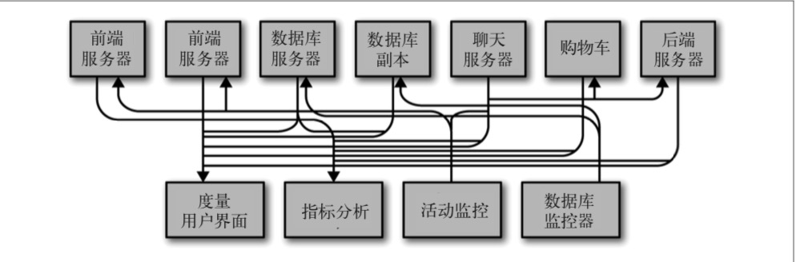
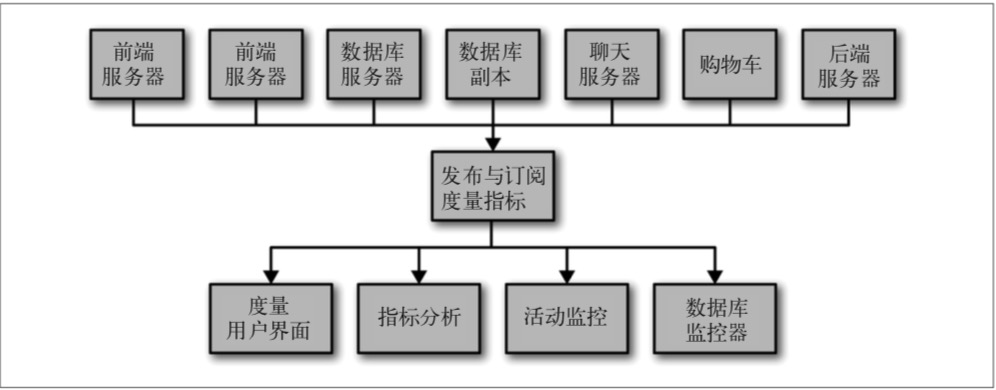
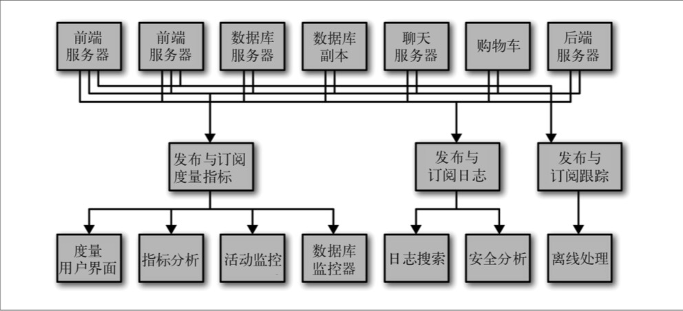
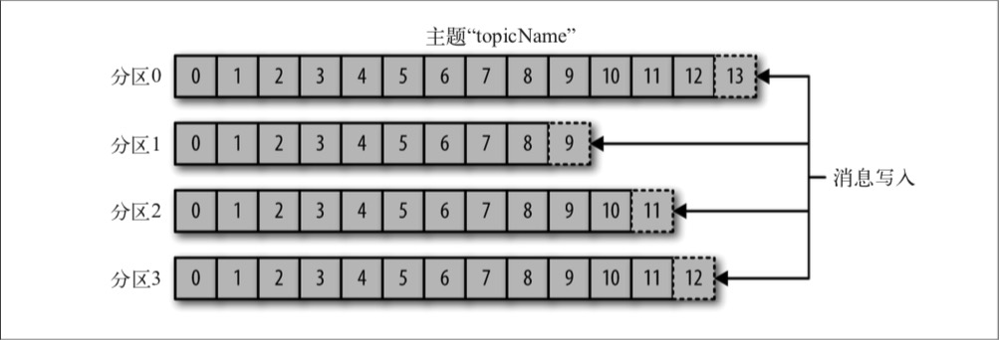
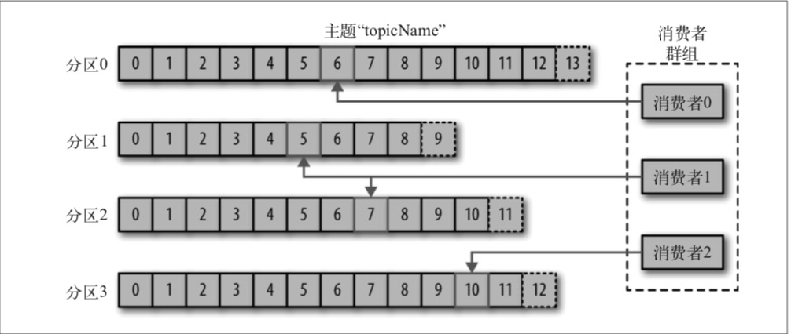
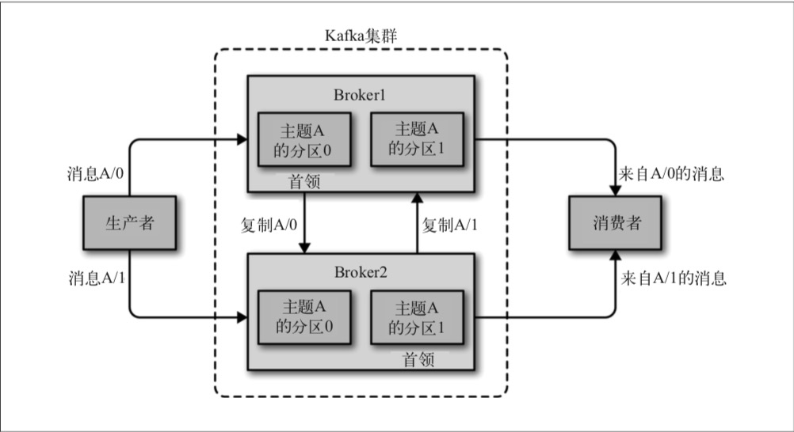
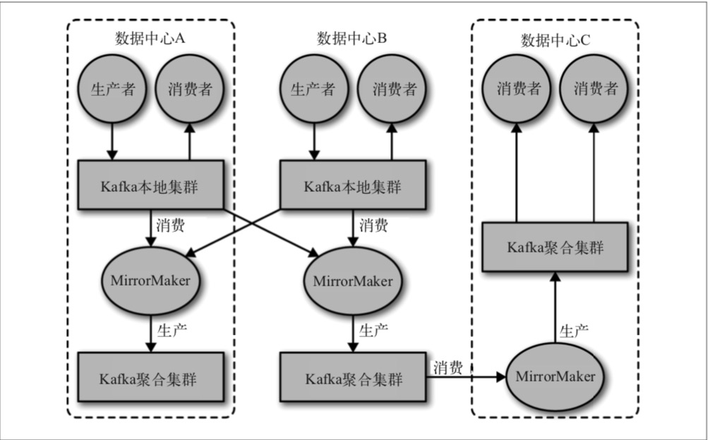
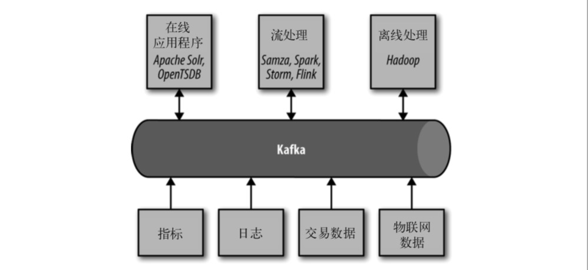

# 第一章 初识Kafka

## 1.1 发布与订阅消息系统

在正式讨论 Apache Kafka(以下简称 Kafka)之前，先来了解发布与订阅消息系统的概念， 并认识这个系统的重要性。数据(消息)的发送者(发布者)不会直接把消息发送给接收 者，这是发布与订阅消息系统的一个特点。发布者以某种方式对消息进行分类，接收者(订阅者)订阅它们，以便接收特定类型的消息。发布与订阅系统一般会有一个broker，也就是发布消息的中心点。

### 1.1.1 如何开始

发布与订阅消息系统的大部分应用场景都是从一个简单的消息队列或一个进程间通道开始的。例如，你的应用程序需要往别处发送监控信息，可以直接在你的应用程序和另一个可 以在仪表盘上显示度量指标的应用程序之间建立连接，然后通过这个连接推送度量指标， 如图 1-1 所示。

​																		**图 1-1:单个直连的度量指标发布者**

这是刚接触监控系统时简单问题的应对方案。过了不久，你需要分析更长时间片段的度量 指标，而此时的仪表盘程序满足不了需求，于是，你启动了一个新的服务来接收度量指 标。该服务把度量指标保存起来，然后进行分析。与此同时，你修改了原来的应用程序， 把度量指标同时发送到两个仪表盘系统上。现在，你又多了 3 个可以生成度量指标的应用 程序，它们都与这两个服务直接相连。而你的同事认为最好可以对这些服务进行轮询以便 获得告警功能，于是你为每一个应用程序增加了一个服务器，用于提供度量指标。再过一 阵子，有更多的应用程序出于各自的目的，都从这些服务器获取度量指标。这时的架构看 起来就像图 1-2 所示的那样，节点间的连接一团糟。

​																	**图 1-2:多个直连的度量指标发布者**

这时，技术债务开始凸显出来，于是你决定偿还掉一些。你创建了一个独立的应用程序， 用于接收来自其他应用程序的度量指标，并为其他系统提供了一个查询服务器。这样，之 前架构的复杂度被降低到图 1-3 所示的那样。那么恭喜你，你已经创建了一个基于发布与 订阅的消息系统。

​																			**图 1-3:度量指标发布与订阅系统**

### 1.1.2 独立的队列系统

在你跟度量指标打得不可开交的时候，你的一个同事也正在跟日志消息奋战。还有另一个 同事正在跟踪网站用户的行为，为负责机器学习开发的同事提供信息，同时为管理团队生 成报告。你和同事们使用相同的方式创建这些系统，解耦信息的发布者和订阅者。图 1-4 所示的架构包含了 3 个独立的发布与订阅系统。

​																					**图 1-4:多个发布与订阅系统**

这种方式比直接使用点对点的连接(图 1-2)要好得多，但这里有太多重复的地方。公司因此要为数据队列维护多个系统，每个系统又有各自的缺陷和不足。而且，接下来可 能会有更多的场景需要用到消息系统。此时，真正需要的是一个单一的**集中式发布订阅系统**，它可以用来发布通用类型的数据，其规模可以随着公司业务的增长而增长。

## 1.2 Kafka登场

Kafka就是为了解决上述问题而设计的一款基于发布与订阅的消息系统。它一般被称为 “分布式提交日志”或者“分布式流平台”。文件系统或数据库提交日志用来提供所有事务 的持久记录，通过重放这些日志可以重建系统的状态。同样地，Kafka 的数据是按照一定 顺序持久化保存的，可以按需读取。此外，Kafka 的数据分布在整个系统里，具备数据故障保护和性能伸缩能力。

### 1.2.1 消息和批次

Kafka 的数据单元被称为**消息**。如果在使用 Kafka 之前已经有数据库使用经验，那么可以把消息看成是数据库里的一个“数据行”或一条“记录”。消息由字节数组组成，所以对于Kafka来说，消息里的数据没有特别的格式或含义。消息可以有一个可选的元数据， 也就是键。键也是一个字节数组，与消息一样，对于Kafka 来说也没有特殊的含义。当消息以一种可控的方式写入不同的分区时，会用到键。最简单的例子就是为键生成一个一致性散列值，然后使用散列值对主题分区数进行取模，为消息选取分区。这样可以保证具有相同键的消息总是被写到相同的分区上。第 3 章将详细介绍键的用法。这样就是为什么要使用唯一键来区分发送消息。

为了提高效率，消息被分批次写入Kafka。批次就是一组消息，这些消息属于同一个主题和分区。如果每一个消息都单独穿行于网络，会导致大量的网络开销，把消息分成**批次传输可以减少网络开销**。不过，这要在**时间延迟和吞吐量之间作出权衡**：批次越大，单位时 间内处理的消息就越多，单个消息的传输时间就越长。批次数据会被压缩，这样可以提升数据的传输和存储能力，但要做更多的计算处理。

### 1.2.2 模式

对于 Kafka 来说，消息不过是晦涩难懂的字节数组，所以有人建议用一些额外的结构来 定义消息内容，让它们更易于理解。根据应用程序的需求，**消息模式(schema)**有许多可用的选项。像 JSON 和 XML 这些简单的系统，不仅易用，而且可读性好。不过，它们 缺乏强类型处理能力，不同版本之间的兼容性也不是很好。Kafka的许多开发者喜欢使用Apache Avro，它最初是为Hadoop开发的一款序列化框架。Avro提供了一种紧凑的序列化格式，模式和消息体是分开的，当模式发生变化时，不需要重新生成代码;它还支持强类型和模式进化，其版本既向前兼容，也向后兼容。

数据格式的一致性对于 Kafka 来说很重要，它消除了消息读写操作之间的耦合性。如果读写操作紧密地耦合在一起，消息订阅者需要升级应用程序才能同时处理新旧两种数据格式。在消息订阅者升级了之后，消息发布者才能跟着升级，以便使用新的数据格式。新的应用程序如果需要使用数据，就要与消息发布者发生耦合，导致开发者需要做很多繁杂 的工作。定义良好的模式，并把它们存放在公共仓库，可以方便我们理解 Kafka 的消息结构。第 3 章将详细讨论模式和序列化。

### 1.2.3 主题和分区

Kafka 的消息通过**主题**进行分类。主题就好比数据库的表，或者文件系统里的文件夹。主题可以被分为若干个**分区**，一个分区就是一个提交日志。消息以追加的方式写入分区，然 后以**先入先出的顺序读取**。要注意，由于一个主题一般包含好几个分区，因此无法在整个主 题范围内保证消息的顺序，但可以保证消息在单个分区内的顺序。图 1-5 所示的主题有 4 个分区，消息被追加写入每个分区的尾部。Kafka通过分区来实现消息冗余和伸缩性，分区可以分布在不同的服务器上，也就是说，一个主题可以横跨多个服务器，以此来提供比单个服务器更强大的性能。

​																		**图 1-5:包含多个分区的主题表示**

同产会使用**流**这个词来描述 Kafka 这类系统的数据。很多时候，人们把一个主题的数据看成一个流，不管它有多少个分区。流是一组从生产者移动到消费者的数据。当论流式处理时，一般都是这样描述消息的。Kafka Streams、Apache Samza 和 Storm 这些框架以实时的方式处理消息，也就是所谓的流式处理。我们可以将流式处理与离线处理进行比较，比如 Hadoop 就是被设计用于在稍后某个时刻处理大量的数据。第11章将会介绍流 式处理。

### 1.2.4 生产者与消费者

Kafka 的客户端就是 Kafka 系统的用户，它们被分为两种基本类型：**生产者和消费者**。除此之外，还有其他高级客户端 API——用于数据集成的**Kafka Connect API**和用于流式处理的**Kafka Streams**。这些高级客户端API使用生产者和消费者作为内部组件，提供了高级的功能。

**生产者**创建消息。在其他发布与订阅系统中，生产者可能被称为发布者或写入者。一般情况下，一个消息会被发布到一个特定的主题上。生产者在默认情况下把消息均衡分布到主题的所有分区上，而并不关心特定消息会被写到哪个分区。不过，在某些情况下，生产者会把消息直接写到指定的分区。这通常是通过消息键和分区器来实现的，分区器为键生成一个散列值，并将其映射到指定的分区上。这样可以保证包含同一个键的消息会被写到同一个分区上。生产者也可以使用自定义的分区器，根据不同的业务规则将消息映射到分区。第 3 章将详细介绍生产者。

**消费者**拉取消息，在其他发布与订阅系统中，消费者可能被称为**订阅者或读者**。消费者订阅一个或多个主题，并按照消息生成的顺序读取它们。消费者通过检查消息的偏移量来区分已经读取过的消息。偏移量是另一种元数据，它是一个不断递增的整数值，在创建消息 时，Kafka会把它添加到消息里。在给定的分区里，每个消息的偏移量都是唯一的。消费者把每个分区最后读取的消息偏移量保存在 Zookeeper或Kafka上，如果消费者关闭或重启，它的读取状态不会丢失。

消费者是消费者群组的一部分，也就是说，会有一个或多个消费者共同读取一个主题。**群组保证每个分区只能被一个消费者使用**。图 1-6 所示的群组中，有 3 个消费者同时读取一个主题。其中的两个消费者各自读取一个分区，另外一个消费者读取其他两个分区。消费者与分区之间的映射通常被称为**消费者对分区的所有权关系**。

通过这种方式，消费者可以消费包含大量消息的主题。而且，如果一个消费者失效，群组里的其他消费者可以接管失效消费者的工作。第 4 章将详细介绍消费者和消费者群组。

​																		**图 1-6:消费者群组从主题读取消息**

### 1.2.5 Broker集群

一个独立的Kafka服务器被称为broker。broker 接收来自生产者的消息，为消息设置偏移量，并提交消息到磁盘保存。broker为消费者提供服务，对读取分区的请求作出响应，返回已经提交到磁盘上的消息。根据特定的硬件及其性能特征，单个broker可以轻松处理数 千个分区以及每秒百万级的消息量。

broker是集群的组成部分。每个集群都有一个broker同时充当了集群控制器的角色(自动 从集群的活跃成员中选举出来)。控制器负责管理工作，包括将**分区分配给 broker**和**监控broker**。在集群中，一个分区从属于一个 broker，该 broker 被称为分区的首领。一个分区可以分配给多个broker，这个时候会发生分区复制(见图 1-7)。这种复制机制为分区提供了消息冗余，如果有一个broker失效，其他 broker可以接管领导权。不过，相关的消费者和生产者都要重新连接到新的首领。第6章将详细介绍集群的操作，包括分区复制。

​																				**图 1-7:集群里的分区复制**

保留消息(在一定期限内)是Kafka 的一个重要特性。Kafka broker 默认的消息保留策略 是这样的：要么保留一段时间(比如7天)，要么保留到消息达到一定大小的字节数(比如1GB)。当消息数量达到这些上限时，旧消息就会过期并被删除，所以在任何时刻，可用消息的总量都不会超过配置参数所指定的大小。主题可以配置自己的保留策略，可以将消息保留到不再使用它们为止。例如，用于跟踪用户活动的数据可能需要保留几天，而应用程序的度量指标可能只需要保留几个小时。可以通过配置把主题当作紧凑型日志，只有最后一个带有特定键的消息会被保留下来。这种情况对于变更日志类型的数据来说比较适 用，因为人们只关心最后时刻发生的那个变更。

### 1.2.6 多集群

随着 Kafka 部署数量的增加，基于以下几点原因，最好使用多个集群。

- 数据类型分离
- 安全需求隔离
- 多数据中心(灾难恢复)

如果使用多个数据中心，就需要在它们之间复制消息。这样，在线应用程序才可以访问到 多个站点的用户活动信息。例如，如果一个用户修改了他们的资料信息，不管从哪个数据 中心都应该能看到这些改动。或者多个站点的监控数据可以被聚集到一个部署了分析程序 和告警系统的中心位置。不过，Kafka 的消息复制机制只能在单个集群里进行，不能在多个集群之间进行。

Kafka 提供了一个叫作 MirrorMaker 的工具，可以用它来实现集群间的消息复制。 MirrorMaker 的核心组件包含了一个生产者和一个消费者，两者之间通过一个队列相连。

消费者从一个集群读取消息，生产者把消息发送到另一个集群上。图 1-8 展示了一个使 用 MirrorMaker 的例子，两个“本地”集群的消息被聚集到一个“聚合”集群上，然后将 该集群复制到其他数据中心。不过，这种方式在创建复杂的数据管道方面显得有点力不从 心。第 7 章将详细讨论这些案例。

​																						**图 1-8:多数据中心架构**

## 1.3 为什么选择Kafka

基于发布与订阅的消息系统那么多，为什么 Kafka 会是一个更好的选择呢?

### 1.3.1 多个生产者

Kafka 可以无缝地支持多个生产者，不管客户端在使用单个主题还是多个主题。所以它很 适合用来从多个前端系统收集数据，并以统一的格式对外提供数据。例如，一个包含了多 个微服务的网站，可以为页面视图创建一个单独的主题，所有服务都以相同的消息格式向 该主题写入数据。消费者应用程序会获得统一的页面视图，而无需协调来自不同生产者的数据流。

### 1.3.2 多个消费者

除了支持多个生产者外，Kafka 也支持多个消费者从一个单独的消息流上读取数据，而且 消费者之间互不影响。这与其他队列系统不同，其他队列系统的消息一旦被一个客户端读 取，其他客户端就无法再读取它。另外，多个消费者可以组成一个群组，它们共享一个消息流，并保证整个群组对每个给定的消息只处理一次。

### 1.3.3 基于磁盘的数据存储

Kafka不仅支持多个消费者，还允许消费者非实时地读取消息，这要归功于Kafka的数据保留特性。消息被提交到磁盘，根据设置的保留规则进行保存。每个主题可以设置单独的保留规则，以便满足不同消费者的需求，各个主题可以保留不同数量的消息。消费者可能会因为处理速度慢或突发的流量高峰导致无法及时读取消息，而持久化数据可以保证数据不会丢失。消费者可以在进行应用程序维护时离线一小段时间，而无需担心消息丢失或堵塞在生产者端。消费者可以被关闭，但消息会继续保留在 Kafka里。消费者可以从上次中断的地方继续处理消息。

### 1.3.4 伸缩性

为了能够轻松处理大量数据，Kafka 从一开始就被设计成一个具有灵活伸缩性的系统。用 户在开发阶段可以先使用单个 broker，再扩展到包含 3 个 broker 的小型开发集群，然后随 着数据量不断增长，部署到生产环境的集群可能包含上百个 broker。对在线集群进行扩展 丝毫不影响整体系统的可用性。也就是说，一个包含多个broker的集群，即使个别 broker 失效，仍然可以持续地为客户提供服务。要提高集群的容错能力，需要配置较高的复制系数。第6章将讨论关于复制的更多细节。

### 1.3.5 高性能

上面提到的所有特性，让 Kafka 成为了一个高性能的发布与订阅消息系统。通过横向扩展 生产者、消费者和 broker，Kafka 可以轻松处理巨大的消息流。在处理大量数据的同时， 它还能保证**亚秒级的消息延迟**。

## 1.4 数据生态系统

已经有很多应用程序加入到了数据处理的大军中。我们定义了输入和应用程序，负责生成数据或者把数据引入系统。我们定义了输出，它们可以是度量指标、报告或者其他类型的数据。我们创建了一些循环，使用一些组件从系统读取数据，对读取的数据进行处理，然 后把它们导到数据基础设施上，以备不时之需。数据类型可以多种多样，每一种数据类型 可以有不同的内容、大小和用途。

Kafka 为数据生态系统带来了循环系统(即数据流通过kafka流入应用，经过处理后再写入到kafka中)，如图 1-9 所示。它在基础设施的各个组件之间传递消息，为所有客户端提供一致的接口。当与提供消息模式的系统集成时，生产者和消费者之间不再有紧密的耦合，也不需要在它们之间建立任何类型的直连。我们可以根据业务 需要添加或移除组件，因为生产者不再关心谁在使用数据，也不关心有多少个消费者。

​																					**图 1-9:大数据生态系统**

### 1.4.1 使用场景

**活动跟踪(埋点)**

Kafka 最初的使用场景是跟踪用户的活动。网站用户与前端应用程序发生交互，前端应用程序生成用户活动相关的消息。这些消息可以是一些静态的信息，比如页面访问次数和点击量，也可以是一些复杂的操作，比如添加用户资料。这些消息被发布到一个或多个主题 上，由后端应用程序负责读取。这样，我们就可以生成报告，为机器学习系统提供数据， 更新搜索结果，或者实现其他更多的功能。

**传递消息**

Kafka 的另一个基本用途是传递消息。应用程序向用户发送通知(比如邮件)就是通过传递消息来实现的。这些应用程序组件可以生成消息，而不需要关心消息的格式，也不需要关心消息是如何被发送的。一个公共应用程序会读取这些消息，对它们进行处理:

- 格式化消息(也就是所谓的装饰); 
- 将多个消息放在同一个通知里发送; 
- 根据用户配置的首选项来发送数据。

使用公共组件的好处在于，不需要在多个应用程序上开发重复的功能，而且可以在公共组件上做一些有趣的转换，比如把多个消息聚合成一个单独的通知(多个数据流的简单合并)，而这些工作是无法在其他地方完成的。

**度量指标和日志记录**

Kafka 也可以用于收集应用程序和系统度量指标以及日志。Kafka 支持多个生产者的特性在 这个时候就可以派上用场。应用程序定期把度量指标发布到 Kafka 主题上，监控系统或告 警系统读取这些消息。Kafka 也可以用在像Hadoop这样的离线系统上，进行较长时间片段的数据分析，比如年度增长走势预测。日志消息也可以被发布到Kafka主题上，然后被路由到专门的日志搜索系统(比如 Elasticsearch)或安全分析应用程序。更改目标系统(比如日志存储系统)不会影响到前端应用或聚合方法，这是Kafka的另一个优点。

**提交日志**

Kafka 的基本概念来源于提交日志，所以使用Kafka作为提交日志是件顺理成章的事。我们可以把数据库的更新(BinLog日志)发布到 Kafka 上，应用程序通过监控事件流来接收数据库的实时更新。这种变更日志流也可以用于把数据库的更新复制到远程系统上，或者合并多个应用程序的更新到一个单独的数据库视图上。数据持久化为变更日志提供了缓冲区，也就是说， 如果消费者应用程序发生故障，可以通过重放这些日志来恢复系统状态。另外，**紧凑型日志主题只为每个键保留一个变更数据**，所以可以长时间使用，不需要担心消息过期问题。

**流处理**

流处理是又一个能提供多种类型应用程序的领域。可以说，它们提供的功能与Hadoop里的map和reduce有点类似，只不过它们操作的是实时数据流，而 Hadoop 则处理更长时间片段的数据，可能是几个小时或者几天，Hadoop 会对这些数据进行批处理。通过使用流 式处理框架，用户可以编写小型应用程序来操作Kafka消息，比如计算度量指标，为其他应用程序有效地处理消息分区，或者对来自多个数据源的消息进行转换。第 11 章将通过其他案例介绍流处理。

