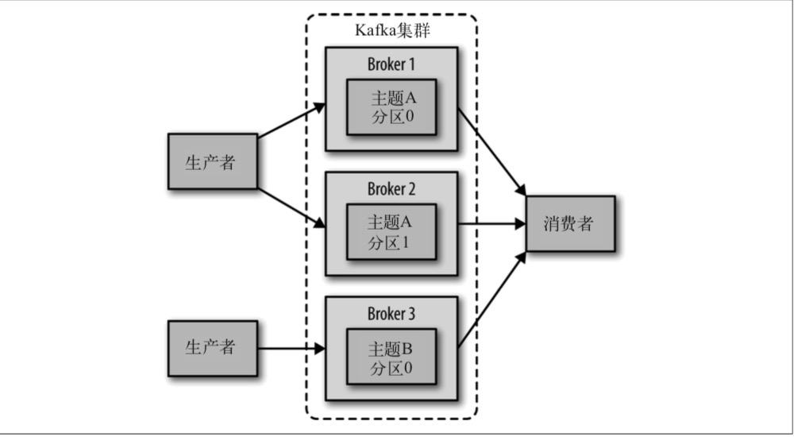

# 第二章 安装Kafka

## 2.3 broker配置

Kafka 发行包里自带的配置样本可以用来安装单机服务，但并不能满足大多数安装场景的 要求。Kafka 有很多配置选项，涉及安装和调优的方方面面。不过大多数调优选项可以使 用默认配置，除非你对调优有特别的要求。

### 2.3.1 常规配置

有一些配置选项，在单机安装时可以直接使用默认值，但在部署到其他环境时要格外小 心。这些参数是单个服务器最基本的配置，它们中的大部分需要经过修改后才能用在集群里。

**1. broker.Id**

每个 broker 都需要有一个标识符，使用 broker.id 来表示。它的默认值是0，也可以被设置成其他任意**整数**。这个值在整个 Kafka 集群里必须是唯一的。这个值可以任意选定，如果 出于维护的需要，可以在服务器节点间交换使用这些 ID。建议把它们设置成与机器名具有 相关性的整数，这样在进行维护时，将 ID 号映射到机器名就没那么麻烦了。例如，如果 机器名包含唯一性的数字(比如 host1.example.com、host2.example.com)，那么用这些数字来设置 broker.id 就再好不过了。

**2. port**

如果使用配置样本来启动Kafka，它会监听**9092端口**。修改port配置参数可以把它设置成其他任意可用的端口。要注意，如果使用1024以下的端口，需要使用root权限启动Kafka，不过不建议这么做。

**3. zookeeper.connect**

用于保存broker元数据的Zookeeper地址是通过zookeeper.connect来指定的。 `localhost:2181`表示这个 Zookeeper是运行在本地的218 端口上。该配置参数是用冒号分隔的一组 hostname:port/path 列表，每一部分的含义如下:

- hostname 是 Zookeeper 服务器的机器名或 IP 地址;
- port是客户端的连接端口
- /path是可选的Zookeeper路径，作为Kafka集群的chroot环境。如果不指定，默认使用根路径。如果指定的chroot路径不存在，broker会在启动的时候创建它。

------

**为什么使用 chroot 路径**

在 Kafka 集群里使用 chroot路径(zookeeper客户端命名空间)是一种最佳实践。Zookeeper 群组可以共享 给其他应用程序，即使还有其他 Kafka 集群存在，也不会产生冲突。最好是 在配置文件里指定一组 Zookeeper 服务器，用分号把它们隔开。一旦有一个 Zookeeper 服务器宕机，broker 可以连接到 Zookeeper 群组的另一个节点上。

------

**4. log.dirs**

Kafka 把所有消息都保存在磁盘上，存放这些日志片段的目录是通过 log.dirs 指定的。它是 一组用逗号分隔的本地文件系统路径。如果指定了多个路径，那么 broker 会根据“最少使 用”原则，把同一个分区的日志片段保存到同一个路径下。要注意，broker 会往拥有最少数目分区的路径新增分区，而不是往拥有最小磁盘空间的路径新增分区。

**5. num.recovery.threads.per.data.dir**

对于如下 3 种情况，Kafka 会使用可配置的线程池来处理日志片段:

- 服务器正常启动，用于打开每个分区的日志片段;
- 服务器崩溃后重启，用于检查和截短每个分区的日志片段; 
- 服务器正常关闭，用于关闭日志片段。

默认情况下，每个日志目录只使用一个线程。因为这些线程只是在服务器启动和关闭时会 用到，所以完全可以设置大量的线程来达到并行操作的目的。特别是对于包含大量分区的服务器来说，一旦发生崩溃，在进行恢复时使用并行操作可能会省下数小时的时间。设置 此参数时需要注意，所配置的数字对应的是 log.dirs 指定的单个日志目录。也就是说，如果 num.recovery.threads.per.data.dir 被设为8，并且log.dir指定了3个路径，那么总共需要 24 个线程。

**6. auto.create.topics.enable**

默认情况下，Kafka 会在如下几种情形下自动创建主题:

- 当一个生产者开始往主题写入消息时;
- 当一个消费者开始从主题读取消息时;
- 当任意一个客户端向主题发送元数据请求时。

很多时候，这些行为都是非预期的。而且，根据 Kafka 协议，如果一个主题不先被创建， 根本无法知道它是否已经存在。如果显式地创建主题，不管是手动创建还是通过其他配置系统来创建，都可以把 auto.create.topics.enable 设为 false。

### 2.3.2 主题的默认配置

Kafka 为新创建的主题提供了很多默认配置参数。可以通过管理工具(将在第 9 章介绍) 为每个主题单独配置一部分参数，比如分区个数和数据保留策略。服务器提供的默认配置可以作为基准，它们适用于大部分主题。

**1. num.partitions**

num.partitions 参数指定了新创建的主题将包含多少个分区。如果启用了主题自动创建功能(该功能默认是启用的)，主题分区的个数就是该参数指定的值。该参数的默认值是 1。 要注意，我们可以**增加主题分区的个数，但不能减少分区的个数**。所以，如果要让一个主 题的分区个数少于 num.partitions 指定的值，需要手动创建该主题(将在第 9 章讨论)。

第1章已经提到，Kafka 集群通过分区对主题进行横向扩展，所以当有新的 broker 加入 集群时，可以通过分区个数来实现集群的负载均衡。当然，这并不是说，在存在多个主题的情况下(它们分布在多个 broker 上)，为了能让分区分布到所有 broker 上，主题分区的 个数必须要大于 broker 的个数。不过，拥有大量消息的主题如果要进行负载分散，就需要大量的分区。

------

**如何选定分区数量**

为主题选定分区数量并不是一件可有可无的事情，在进行数量选择时，需要 考虑如下几个因素。

- 主题需要达到多大的**吞吐量**?例如，是希望每秒钟写入100KB还是1GB?
- 从**单个分区读取数据的最大吞吐量**是多少？每个分区一般都会有一个消费者，如果你知道消费者将数据写入数据库的速度不会超过每秒50MB，那么你也该知道，从一个分区读取数据的吞吐量不需要超过每秒 50MB。
- 可以通过类似的方法估算生产者向单个分区写入数据的吞吐量，不过生产者的速度一般比消费者快得多，所以最好**为生产者多估算一些吞吐量**。
- 每个broker包含的分区个数、可用的磁盘空间和网络带宽。
- 如果消息是按照不同的键来写入分区的，那么为已有的主题新增分区就会很困难。
- 单个broker对分区个数是有限制的，因为分区越多，占用的内存越多，完成首领选举需要的时间也越长。

------

很显然，综合考虑以上几个因素，你需要很多分区，但不能太多。如果你估算出主题的吞吐量和消费者吞吐量，可以用主题吞吐量除以消费者吞吐量算出分区的个数。也就是说， 如果每秒钟要从主题上写入和读取1GB的数据，并且每个消费者每秒钟可以处理50MB的数据，那么至少需要20个分区。这样就可以让20个消费者同时读取这些分区，从而达 到每秒钟 1GB 的吞吐量。

如果不知道这些信息，那么根据经验，把分区的大小限制在 25GB 以内可以得到比较理想的效果。

**2. log.retention.ms**

Kafka通常根据时间来决定数据可以被保留多久。默认使用 log.retention.hours 参数来配置时间，默认值为168小时，也就是一周。除此以外，还有其他两个参数`log.retention. minutes` 和`log.retention.ms`。这 3 个参数的作用是一样的，都是决定消息多久以后会被删 除，不过还是推荐使用 log.retention.ms。如果指定了不止一个参数，Kafka 会优先使用 具有最小值的那个参数。

------

**根据时间保留数据和最后修改时间**

根据时间保留数据是通过**检查磁盘上日志片段文件的最后修改时间**来实现的。一般来说，最后修改时间指的就是日志片段的关闭时间，也就是文件里最后一个消息的时间戳。不过，如果使用管理工具在服务器间移动分区，最后修改时间就不准确了。时间误差可能导致这些分区过多地保留数据。在第9章讨论分区移动时会提到更多这方面的内容。

------

**3. log.retention.bytes**

另一种方式是通过保留的消息字节数来判断消息是否过期。它的值通过参数`log. retention.bytes`来指定，**作用在每一个分区上**。也就是说，如果有一个包含 8 个分区的主题，并且 log.retention.bytes 被设为1GB，那么这个主题最多可以保留8GB 的数据。所以，当主题的分区个数增加时，整个主题可以保留的数据也随之增加。

------

**根据字节大小和时间保留数据**

如果同时指定了`log.retention.bytes`和`log.retention.ms`(或者另一个时间参数)，只要任意一个条件得到满足，消息就会被删除。例如，假设 log. retention.ms 设置为86400000ms(也就是 1 天)，log.retention.bytes设置 为1000000000K(也就是1GB)，如果消息字节总数在不到一天的时间就超过了1GB，那么多出来的部分就会被删除。相反，如果消息字节总数小于1GB，那么一天之后这些消息也会被删除，尽管分区的数据总量小于1GB。

------

**4. log.segment.bytes**

以上的设置都作用在**日志片段**上，而不是作用在单个消息上。当消息到达 broker 时，它们被追加到分区的当前日志片段上。当日志片段大小达到`log.segment.bytes`指定的上限(**默认是1GB**)时，当前日志片段就会被关闭，一个新的日志片段被打开。如果一个日志 片段被关闭，就开始等待过期。这个参数的值越小，就会越频繁地关闭和分配新文件，从而降低磁盘写入的整体效率。

如果主题的消息量不大，那么如何调整这个参数的大小就变得尤为重要。例如，如果一个主题每天只接收 100MB 的消息，而 log.segment.bytes使用默认设置，那么需要10天时间才能填满一个日志片段。因为在日志片段被关闭之前消息是不会过期的，所以如果 `log. retention.ms`被设为604800000ms(也就是 1 周)，那么日志片段最多需要 17 天才会过期。 这是因为关闭日志片段需要10天的时间，而根据配置的过期时间，还需要再保留7天时 间(要等到日志片段里的最后一个消息过期才能被删除)。

------

**使用时间戳获取偏移量**

日志片段的大小会影响使用时间戳获取偏移量。在使用时间戳获取日志偏移量时，Kafka会检查分区里最后修改时间大于指定时间戳的日志片段(已经被关闭的)，该日志片段的前一个文件的最后修改时间小于指定时间戳。然后，Kafka返回该日志片段(也就是文件名)开头的偏移量。对于使用时间戳获取偏移量的操作来说，日志片段越小，结果越准确。

------

**5. log.segment.ms**

另一个可以控制日志片段关闭时间的参数是`log.segment.ms`，它指定了多长时间之后日 志片段会被关闭。就像log.retention.bytes 和`log.retention.ms`这两个参数一样，log. segment.bytes 和 log.retention.ms 这两个参数之间也不存在互斥问题。日志片段会在大小或时间达到上限时被关闭，就看哪个条件先得到满足。**默认情况下，log.segment.ms 没有设定值，所以只根据大小来关闭日志片段**。

------

**基于时间的日志片段对磁盘性能的影响**

在使用基于时间的日志片段时，要着重考虑并行关闭多个日志片段对磁盘性能的影响。如果多个分区的日志片段永远不能达到大小的上限，就会发生这种情况，因为 broker 在启动之后就开始计算日志片段的过期时间，对于那些数据量小的分区来说，日志片段的关闭操作总是同时发生。

------

**6. message.max.bytes**

broker通过设置message.max.bytes参数来限制单个消息的大小，默认值是1000000K，也就是1MB。如果生产者尝试发送的消息超过这个大小，不仅消息不会被接收，还会收到broker返回的错误信息。跟其他与字节相关的配置参数一样，该参数指的是**压缩后的消息 大小**，也就是说，只要压缩后的消息小于 message.max.bytes 指定的值，消息的实际大小可以远大于这个值。

这个值对性能有显著的影响。值越大，那么负责处理网络连接和请求的线程就需要花越多的时间来处理这些请求。它还会增加磁盘写入块的大小，从而影响IO吞吐量。

------

**在服务端和客户端之间协调消息大小的配置**

消费者客户端设置的`fetch.message.max.bytes`必须与服务器端设置的消息大小进行协调。如果这个值比 message.max.bytes 小，那么消费者就无法读取比较大的消息，导致出现消费者被阻塞的情况。在为集群里的broker配置replica.fetch.max.bytes参数时，也遵循同样的原则。

------

## 2.4 硬件选择

为 Kafka 选择合适的硬件更像是一门艺术。Kafka 本身对硬件没有特别的要求，它可以运 行在任何系统上。不过，如果比较关注性能，那么就需要考虑几个会影响整体性能的因素：**磁盘吞吐量和容量、内存、网络和 CPU**。在确定了性能关注点之后，就可以在预算范 围内选择最优化的硬件配置。

### 2.4.1 磁盘吞吐量

生产者客户端的性能直接受到服务器端磁盘吞吐量的影响。生产者生成的消息必须被提交到服务器保存，大多数客户端在发送消息之后会一直等待，直到至少有一个服务器确认消 息已经成功提交为止。也就是说，**磁盘写入速度越快，生成消息的延迟就越低**。

在考虑硬盘类型对磁盘吞吐量的影响时，是选择传统的机械硬盘(HDD)还是固态硬盘 (SSD)，我们可以很容易地作出决定。固态硬盘的查找和访问速度都很快，提供了最好的性能。机械硬盘更便宜，单块硬盘容量也更大。在同一个服务器上使用多个机械硬盘，可以设置多个数据目录，或者把它们设置成磁盘阵列，这样可以提升机械硬盘的性能。其他方面的因素，比如磁盘特定的技术(串行连接存储技术或 SATA)，或者磁盘控制器的质量，都会影响吞吐量。

### 2.4.2 磁盘容量

磁盘容量是另一个值得讨论的话题。需要多大的磁盘容量取决于需要保留的消息数量。如 果服务器每天会收到 1TB 消息，并且保留 7 天，那么就需要 7TB 的存储空间，而且还要 为其他文件提供至少 10% 的额外空间。除此之外，还需要提供缓冲区，用于应付消息流量 的增长和波动。

在决定扩展 Kafka 集群规模时，存储容量是一个需要考虑的因素。通过让主题拥有多个分区，集群的总流量可以被均衡到整个集群，而且如果单个 broker 无法支撑全部容量，可以 让其他 broker 提供可用的容量。存储容量的选择同时受到集群复制策略的影响(将在第6章讨论更多的细节)。

### 2.4.3 内存

除了磁盘性能外，服务器端可用的内存容量是影响客户端性能的主要因素。磁盘性能影响 生产者，而内存影响消费者。消费者一般从分区尾部读取消息，如果有生产者存在，就紧 跟在生产者后面。在这种情况下，消费者读取的消息会直接存放在系统的页面缓存里，这 比从磁盘上重新读取要快得多。

运行 Kafka的JVM不需要太大的内存，剩余的系统内存可以用作页面缓存，或者用来缓 存正在使用中的日志片段。这也就是为什么不建议把 Kafka 同其他重要的应用程序部署 在一起的原因，它们需要共享页面缓存，最终会降低 Kafka 消费者的性能。

### 2.4.4 网络

网络吞吐量决定了 Kafka 能够处理的最大数据流量。它和磁盘存储是制约Kafka扩展规模的主要因素。Kafka支持多个消费者，造成流入和流出的网络流量不平衡，从而让情况变得更加复杂。对于给定的主题，一个生产者可能每秒钟写入1MB数据，但可能同时有多个消费者瓜分网络流量。其他的操作，如集群复制(在第6章介绍)和镜像(在第8章介绍)也会占用网络流量。如果网络接口出现饱和，那么集群的复制出现延时就在所难免， 从而让集群不堪一击。

### 2.4.5 CPU

与磁盘和内存相比，Kafka对计算处理能力的要求相对较低，不过它在一定程度上还是会影响整体的性能。客户端为了优化网络和磁盘空间，会对消息进行压缩。**服务器需要对消息进行批量解压，设置偏移量，然后重新进行批量压缩，再保存到磁盘上**。这就是Kafka对计算处理能力有所要求的地方。不过不管怎样，这都不应该成为选择硬件的主要考虑因素。

## 2.5 云端Kafka

Kafka 一般被安装在云端，比如亚马逊网络服务(Amazon Web Services，AWS)。AWS 提供了很多不同配置的实例，我们要根据 Kafka的性能优先级来选择合适的实例。**可以先从要保留数据的大小开始考虑，然后考虑生产者方面的性能**。如果要求低延迟，那么就需要专门为I/O优化过的使用固态硬盘的实例，否则，使用配备了临时存储的实例就可以了。 选好存储类型之后，再选择CPU和内存就容易得多。

实际上，如果使用 AWS，一般会选择 m4 实例或 r3 实例。m4 实例允许较长时间地保留数 据，不过磁盘吞吐量会小一些，因为它使用的是弹性块存储。r3 实例使用固态硬盘，具有 较高的吞吐量，但保留的数据量会有所限制。如果想两者兼顾，那么需要升级成 i2 实例或 d2 实例，不过它们的成本要高得多。

## 2.6 Kafka集群

单个 Kafka 服务器足以满足本地开发或 POC 要求，不过集群也有它的强大之处。使用集群最大的好处是可以**跨服务器进行负载均衡**，再则就是可以使用**复制功能来避免因单点故障造成的数据丢失**。在维护 Kafka 或底层系统时，使用集群可以确保为客户端提供高可用 性。本节只是介绍如何配置 Kafka 集群，第6章将介绍更多关于数据复制的内容。

​																	**图2-2 一个简单的 Kafka 集群**

