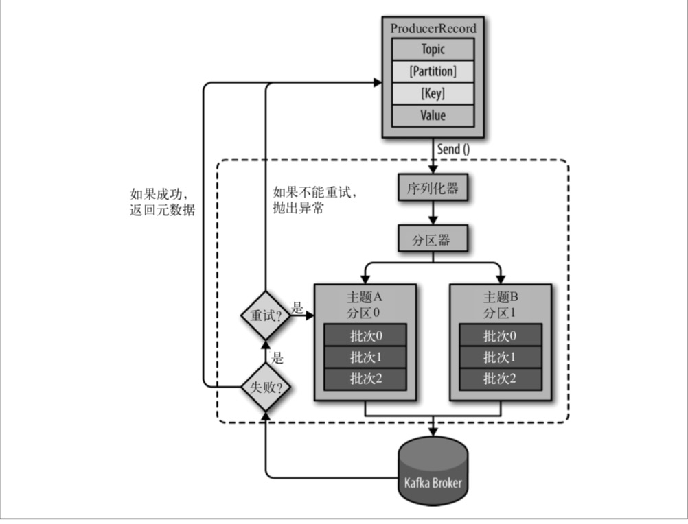

# 第三章 Kafka生产者——向Kafka写入数据

不管是把 Kafka 作为**消息队列、消息总线还是数据存储平台**来使用，总是需要有一个可以往 Kafka 写入数据的生产者和一个可以从 Kafka 读取数据的消费者，或者一个兼具两种角色的应用程序。

例如，在一个信用卡事务处理系统里，有一个客户端应用程序，它可能是一个在线商店， 每当有支付行为发生时，它负责把事务发送到 Kafka 上。另一个应用程序根据规则引擎检 查这个事务，决定是批准还是拒绝。批准或拒绝的响应消息被写回 Kafka，然后发送给发 起事务的在线商店。第三个应用程序从 Kafka 上读取事务和审核状态，把它们保存到数据库，随后分析师可以对这些结果进行分析，或许还能借此改进规则引擎。

开发者们可以使用 Kafka 内置的客户端 API 开发 Kafka 应用程序。

在这一章，我们将从Kafka生产者的设计和组件讲起，学习如何使用 Kafka 生产者。我们 将演示如何创建 KafkaProducer 和 ProducerRecords 对象、如何将记录发送给 Kafka，以及如何处理从 Kafka 返回的错误，然后介绍用于控制生产者行为的重要配置选项，最后深入探讨如何使用不同的分区方法和序列化器，以及如何自定义序列化器和分区器。

## 3.1 生产者概览

一个应用程序在很多情况下需要往 Kafka 写入消息:记录用户的活动(用于审计和分析)、 记录度量指标、保存日志消息、记录智能家电的信息、与其他应用程序进行异步通信、缓 冲即将写入到数据库的数据，等等。

多样的使用场景意味着多样的需求:是否每个消息都很重要?是否允许丢失一小部分消 息?偶尔出现重复消息是否可以接受?是否有严格的延迟和吞吐量要求?

在之前提到的信用卡事务处理系统里，消息丢失或消息重复是不允许的，可以接受的延迟 最大为 500ms，对吞吐量要求较高——我们希望每秒钟可以处理一百万个消息。

保存网站的点击信息是另一种使用场景。在这个场景里，允许丢失少量的消息或出现少量 的消息重复，延迟可以高一些，只要不影响用户体验就行。换句话说，只要用户点击链接 后可以马上加载页面，那么我们并不介意消息要在几秒钟之后才能到达 Kafka 服务器。吞 吐量则取决于网站用户使用网站的频度。

不同的使用场景对生产者 API 的使用和配置会有直接的影响。
 尽管生产者 API 使用起来很简单，但消息的发送过程还是有点复杂的。图 3-1 展示了向

Kafka 发送消息的主要步骤。



​																					**图 3-1:Kafka 生产者组件图**

我们从创建一个 ProducerRecord 对象开始，ProducerRecord 对象需要包含目标主题和要发送的内容。我们还可以指定键或分区。在发送 ProducerRecord 对象时，生产者要先把键和值对象序列化成字节数组，这样它们才能够在网络上传输。

接下来，数据被传给分区器。如果之前在 ProducerRecord 对象里指定了分区，那么分区器就不会再做任何事情，直接把指定的分区返回。如果没有指定分区，那么分区器会根据 ProducerRecord 对象的键来选择一个分区。选好分区以后，生产者就知道该往哪个主题和 分区发送这条记录了。紧接着，这条记录被添加到一个记录批次里，这个批次里的所有消 息会被发送到相同的主题和分区上。有一个独立的线程负责把这些记录批次发送到相应的 broker 上。

服务器在收到这些消息时会返回一个响应。如果消息成功写入 Kafka，就返回一个 RecordMetaData 对象，它包含了**主题和分区信息，以及记录在分区里的偏移量**。如果写入失败，则会返回一个错误。生产者在收到错误之后会尝试重新发送消息，几次之后如果还 是失败，就返回错误信息。

## 3.2 创建Kafka生产者

要往 Kafka 写入消息，首先要创建一个生产者对象，并设置一些属性。Kafka 生产者有 3个必选的属性。

**bootstrap.servers**
 该属性指定 broker 的地址清单，地址的格式为 host:port。清单里不需要包含所有的 broker 地址，生产者会从给定的 broker 里查找到其他 broker 的信息。不过建议至少要 提供两个 broker 的信息，一旦其中一个宕机，生产者仍然能够连接到集群上。

**key.serializer**

broker 希望接收到的消息的键和值都是字节数组。生产者接口允许使用参数化类型，因此可以把 Java 对象作为键和值发送给 broker。这样的代码具有良好的可读性，不过生 者需要知道如何把这些 Java 对象转换成字节数组。key.serializer 必须被设置为一 个实现了 org.apache.kafka.common.serialization.Serializer 接口的类，生产者会使用这个类把键对象序列化成字节数组。Kafka 客户端默认提供了ByteArraySerializer(这个只做很少的事情)、StringSerializer 和 IntegerSerializer，因此，如果你只使用常见的几种 Java 对象类型，那么就没必要实现自己的序列化器。要注意，key. serializer 是必须设置的，就算你打算只发送值内容。

**value.serializer**

与 key.serializer 一样，value.serializer 指定的类会将值序列化。如果键和值都是字符串，可以使用与 key.serializer 一样的序列化器。如果键是整数类型而值是字符串， 那么需要使用不同的序列化器。

下面的代码片段演示了如何创建一个新的生产者，这里只指定了必要的属性，其他使用默 认设置。

```java
private Properties kafkaProps = new Properties(); ➊
kafkaProps.put("bootstrap.servers", "broker1:9092,broker2:9092");
kafkaProps.put("key.serializer", "org.apache.kafka.common.serialization.StringSerializer"); ➋
kafkaProps.put("value.serializer","org.apache.kafka.common.serialization.StringSerializer");
producer = new KafkaProducer<String, String>(kafkaProps); ➌  
```

➊ 新建一个 Properties 对象。

➋ 因为我们打算把键和值定义成字符串类型，所以使用内置的 StringSerializer。

➌ 在这里创建了一个新的生产者对象，并为键和值设置了恰当的类型，然后把Properties对象传给它。

这个接口很简单，通过配置生产者的不同属性就可以很大程度地控制它的行为。Kafka 的文档涵盖了所有的配置参数，我们将在这一章的后面部分介绍其中几个比较重要的参数。

实例化生产者对象后，接下来就可以开始发送消息了。发送消息主要有以下 3 种方式：

- 发送并忘记(fire-and-forget)：我们把消息发送给服务器，但并不关心它是否正常到达。大多数情况下，消息会正常到 达，因为 Kafka 是高可用的，而且生产者会自动尝试重发。不过，使用这种方式有时候 也会丢失一些消息。
- 同步发送：使用 send() 方法发送消息，它会返回一个 Future 对象，调用 get() 方法进行等待， 就可以知道消息是否发送成功。
- 异步发送：调用 send() 方法，并指定一个回调函数，服务器在返回响应时调用该函数。

本章的所有例子都使用单线程，但其实生产者是可以使用多线程来发送消息的。刚开始的时候可以使用单个消费者和单个线程。如果需要更高的吞吐量，可以在生产者数量不变的前提下增加线程数量。如果这样做还不够，可以增加生产者数量。