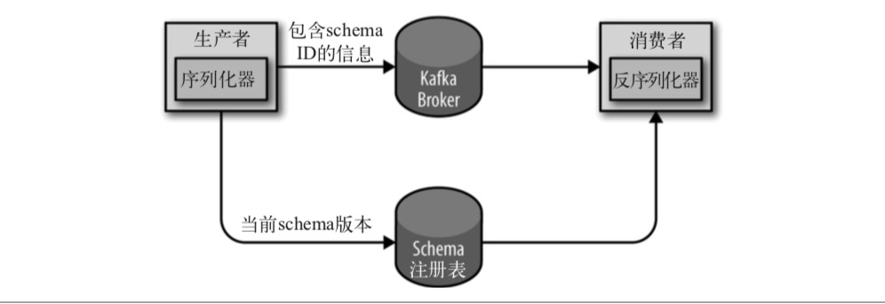

# 第三章 Kafka生产者——向Kafka写入数据

不管是把 Kafka 作为**消息队列、消息总线还是数据存储平台**来使用，总是需要有一个可以往 Kafka 写入数据的生产者和一个可以从 Kafka 读取数据的消费者，或者一个兼具两种角色的应用程序。

例如，在一个信用卡事务处理系统里，有一个客户端应用程序，它可能是一个在线商店， 每当有支付行为发生时，它负责把事务发送到 Kafka 上。另一个应用程序根据规则引擎检 查这个事务，决定是批准还是拒绝。批准或拒绝的响应消息被写回 Kafka，然后发送给发 起事务的在线商店。第三个应用程序从 Kafka 上读取事务和审核状态，把它们保存到数据库，随后分析师可以对这些结果进行分析，或许还能借此改进规则引擎。

开发者们可以使用 Kafka 内置的客户端 API 开发 Kafka 应用程序。

在这一章，我们将从Kafka生产者的设计和组件讲起，学习如何使用 Kafka 生产者。我们 将演示如何创建 KafkaProducer 和 ProducerRecords 对象、如何将记录发送给 Kafka，以及如何处理从 Kafka 返回的错误，然后介绍用于控制生产者行为的重要配置选项，最后深入探讨如何使用不同的分区方法和序列化器，以及如何自定义序列化器和分区器。

## 3.1 生产者概览

一个应用程序在很多情况下需要往 Kafka 写入消息:记录用户的活动(用于审计和分析)、 记录度量指标、保存日志消息、记录智能家电的信息、与其他应用程序进行异步通信、缓 冲即将写入到数据库的数据，等等。

多样的使用场景意味着多样的需求:是否每个消息都很重要?是否允许丢失一小部分消 息?偶尔出现重复消息是否可以接受?是否有严格的延迟和吞吐量要求?

在之前提到的信用卡事务处理系统里，消息丢失或消息重复是不允许的，可以接受的延迟 最大为 500ms，对吞吐量要求较高——我们希望每秒钟可以处理一百万个消息。

保存网站的点击信息是另一种使用场景。在这个场景里，允许丢失少量的消息或出现少量 的消息重复，延迟可以高一些，只要不影响用户体验就行。换句话说，只要用户点击链接 后可以马上加载页面，那么我们并不介意消息要在几秒钟之后才能到达 Kafka 服务器。吞 吐量则取决于网站用户使用网站的频度。

不同的使用场景对生产者 API 的使用和配置会有直接的影响。
 尽管生产者 API 使用起来很简单，但消息的发送过程还是有点复杂的。图 3-1 展示了向

Kafka 发送消息的主要步骤。


​																					**图 3-1:Kafka 生产者组件图**

我们从创建一个 ProducerRecord 对象开始，ProducerRecord 对象需要包含目标主题和要发送的内容。我们还可以指定键或分区。在发送 ProducerRecord 对象时，生产者要先把键和值对象序列化成字节数组，这样它们才能够在网络上传输。

接下来，数据被传给分区器。如果之前在 ProducerRecord 对象里指定了分区，那么分区器就不会再做任何事情，直接把指定的分区返回。如果没有指定分区，那么分区器会根据 ProducerRecord 对象的键来选择一个分区。选好分区以后，生产者就知道该往哪个主题和 分区发送这条记录了。紧接着，这条记录被添加到一个记录批次里，这个批次里的所有消 息会被发送到相同的主题和分区上。有一个独立的线程负责把这些记录批次发送到相应的 broker 上。

服务器在收到这些消息时会返回一个响应。如果消息成功写入 Kafka，就返回一个 RecordMetaData 对象，它包含了**主题和分区信息，以及记录在分区里的偏移量**。如果写入失败，则会返回一个错误。生产者在收到错误之后会尝试重新发送消息，几次之后如果还 是失败，就返回错误信息。

## 3.2 创建Kafka生产者

要往 Kafka 写入消息，首先要创建一个生产者对象，并设置一些属性。Kafka 生产者有 3个必选的属性。

**bootstrap.servers**
 该属性指定 broker 的地址清单，地址的格式为 host:port。清单里不需要包含所有的 broker 地址，生产者会从给定的 broker 里查找到其他 broker 的信息。不过建议至少要 提供两个 broker 的信息，一旦其中一个宕机，生产者仍然能够连接到集群上。

**key.serializer**

broker 希望接收到的消息的键和值都是字节数组。生产者接口允许使用参数化类型，因此可以把 Java 对象作为键和值发送给 broker。这样的代码具有良好的可读性，不过生 者需要知道如何把这些 Java 对象转换成字节数组。key.serializer 必须被设置为一 个实现了 org.apache.kafka.common.serialization.Serializer 接口的类，生产者会使用这个类把键对象序列化成字节数组。Kafka 客户端默认提供了ByteArraySerializer(这个只做很少的事情)、StringSerializer 和 IntegerSerializer，因此，如果你只使用常见的几种 Java 对象类型，那么就没必要实现自己的序列化器。要注意，key. serializer 是必须设置的，就算你打算只发送值内容。

**value.serializer**

与 key.serializer 一样，value.serializer 指定的类会将值序列化。如果键和值都是字符串，可以使用与 key.serializer 一样的序列化器。如果键是整数类型而值是字符串， 那么需要使用不同的序列化器。

下面的代码片段演示了如何创建一个新的生产者，这里只指定了必要的属性，其他使用默 认设置。

```java
private Properties kafkaProps = new Properties(); ➊
kafkaProps.put("bootstrap.servers", "broker1:9092,broker2:9092");
kafkaProps.put("key.serializer", "org.apache.kafka.common.serialization.StringSerializer"); ➋
kafkaProps.put("value.serializer","org.apache.kafka.common.serialization.StringSerializer");
producer = new KafkaProducer<String, String>(kafkaProps); ➌  
```

➊ 新建一个 Properties 对象。

➋ 因为我们打算把键和值定义成字符串类型，所以使用内置的 StringSerializer。

➌ 在这里创建了一个新的生产者对象，并为键和值设置了恰当的类型，然后把Properties对象传给它。

这个接口很简单，通过配置生产者的不同属性就可以很大程度地控制它的行为。Kafka 的文档涵盖了所有的配置参数，我们将在这一章的后面部分介绍其中几个比较重要的参数。

实例化生产者对象后，接下来就可以开始发送消息了。发送消息主要有以下 3 种方式：

- 发送并忘记(fire-and-forget)：我们把消息发送给服务器，但并不关心它是否正常到达。大多数情况下，消息会正常到达，因为 Kafka 是高可用的，而且生产者会自动尝试重发。不过，使用这种方式有时候也会丢失一些消息。
- 同步发送：使用 send() 方法发送消息，它会返回一个 Future 对象，调用 get() 方法进行等待， 就可以知道消息是否发送成功。
- 异步发送：调用 send() 方法，并指定一个回调函数，服务器在返回响应时调用该函数。

本章的所有例子都使用单线程，但其实生产者是可以使用多线程来发送消息的。刚开始的时候可以使用单个消费者和单个线程。如果需要更高的吞吐量，可以在生产者数量不变的前提下增加线程数量。如果这样做还不够，可以增加生产者数量。

## 3.3 发送消息到Kafka

最简单的消息发送方式如下所示：

```java
 ProducerRecord<String, String> record = new ProducerRecord<>("CustomerCountry", "Precision Products",
"France"); ➊
try { 
  producer.send(record); ➋
} catch (Exception e) { 
  e.printStackTrace(); ➌
}
```

➊ 生产者的 send() 方法将 ProducerRecord 对象作为参数，所以我们要先创建一个 ProducerRecord 对象。ProducerRecord 有多个构造函数，稍后我们会详细讨论。这里使 用其中一个构造函数，它需要目标主题的名字和要发送的键和值对象，它们都是字符 串。键和值对象的类型必须与序列化器和生产者对象相匹配。

➋ 我们使用生产者的 send() 方法发送 ProducerRecord 对象。从生产者的架构图里可以看 到，消息先是被放进缓冲区，然后使用单独的线程发送到服务器端。send() 方法会返回一个包含 RecordMetadata 的 Future 对象，不过因为我们会忽略返回值，所以无法知 道消息是否发送成功。如果不关心发送结果，那么可以使用这种发送方式。比如，记录 Twitter 消息日志，或记录不太重要的应用程序日志。

➌ 我们可以忽略发送消息时可能发生的错误或在服务器端可能发生的错误，但在发送消 息之前，生产者还是有可能发生其他的异常。这些异常有可能是 SerializationException (说明序列化消息失败)、BufferExhaustedException 或 TimeoutException(说明缓冲区已满)，又或者是 InterruptException(说明发送线程被中断)。

### 3.3.1 同步发送消息

最简单的同步发送消息方式如下所示。

```java
ProducerRecord<String, String> record =new ProducerRecord<>("CustomerCountry", "Precision Products", "France");
try {
	producer.send(record).get(); ➊
} catch (Exception e) { 
  e.printStackTrace(); ➋
}
```

➊ 在这里，producer.send() 方法先返回一个 Future 对象，然后调用 Future 对象的 get() 方法等待 Kafka 响应。如果服务器返回错误，get() 方法会抛出异常。如果没有发生错误，我们会得到一个RecordMetadata对象，可以用它获取消息的偏移量。

➋ 如果在发送数据之前或者在发送过程中发生了任何错误，比如 broker 返回了一个不允许重发消息的异常或者已经超过了重发的次数，那么就会抛出异常。我们只是简单地把异常信息打印出来。

KafkaProducer 一般会发生两类错误。其中一类是**可重试错误**，这类错误可以通过重发消息来解决。比如对于连接错误，可以通过再次建立连接来解决，“无主(no leader)”错误则可以通过重新为分区选举首领来解决。**KafkaProducer可以被配置成自动重试**，如果在多次重 试后仍无法解决问题，应用程序会收到一个重试异常。**另一类错误无法通过重试解决**，比如“消息太大”异常。对于这类错误，KafkaProducer 不会进行任何重试，直接抛出异常。

### 3.3.2 异步发送消息

假设消息在应用程序和 Kafka 集群之间一个来回需要 10ms。如果在发送完每个消息后都等待回应，那么发送100个消息需要1秒。但如果只发送消息而不等待响应，那么发送 100 个消息所需要的时间会少很多。大多数时候，我们并不需要等待响应——尽管 Kafka 会把目标主题、分区信息和消息的偏移量发送回来，但对于发送端的应用程序来说不是必需的。不过在遇到消息发送失败时，我们需要抛出异常、记录错误日志，或者把消息写入 “错误消息”文件以便日后分析。

为了在异步发送消息的同时能够对异常情况进行处理，生产者提供了回调支持。下面是使用回调的一个例子。

```java
private class DemoProducerCallback implements Callback {➊ 
    @Override
    public void onCompletion(RecordMetadata recordMetadata, Exception e) {
    if (e != null) {
      e.printStackTrace(); ➋ 
    }
  } 
}
ProducerRecord<String, String> record =
new ProducerRecord<>("CustomerCountry", "Biomedical Materials", "USA"); ➌
producer.send(record, new DemoProducerCallback()); ➍
```

➊ 为了使用回调，需要一个实现了 org.apache.kafka.clients.producer.Callback 接口的 类，这个接口只有一个 onCompletion 方法。

➋ 如果 Kafka 返回一个错误，onCompletion 方法会抛出一个非空(non null)异常。这里 我们只是简单地把它打印出来，但是在生产环境应该有更好的处理方式。

➌ 记录与之前的一样。

➍ 在发送消息时传进去一个回调对象

------

**顺序保证**

**Kafka 可以保证同一个分区里的消息是有序的**。也就是说，如果生产者按照一定的顺序发送消息，broker 就会按照这个顺序把它们写入分区，消费者也 会按照同样的顺序读取它们。在某些情况下，顺序是非常重要的。例如，往 一个账户存入 100 元再取出来，这个与先取钱再存钱是截然不同的!不过， 有些场景对顺序不是很敏感。

如果把 retries 设为非零整数，同时把max.in.flight.requests.per.connection设为比1大的数，那么，如果第一个批次消息写入失败，而第二个批次写入成功，broker会重试写入第一个批次。如果此时第一个批次也写入成功，那 么两个批次的顺序就反过来了。

**严格有序设置**

一般来说，如果某些场景要求消息是有序的，那么消息是否写入成功也是 很关键的，所以不建议把 retries 设为 0。可以把 `max.in.flight.requests. per.connection`设为 1，这样在生产者尝试发送第一批消息时，就不会有其他的消息发送给 broker。不过这样会严重影响生产者的吞吐量，所以只有在对消息的顺序有严格要求的情况下才能这么做。

------

## 3.5 序列化器

我们已经在之前的例子里看到，创建一个生产者对象必须指定序列化器。我们已经知道如 何使用默认的字符串序列化器，Kafka 还提供了整型和字节数组序列化器，不过它们还不足以满足大部分场景的需求。到最后，我们需要序列化的记录类型会越来越多。

接下来演示如何开发自己的序列化器，并介绍 Avro 序列化器作为推荐的备选方案

### 3.5.1 自定义序列化器

如果发送到 Kafka 的对象不是简单的字符串或整型，那么可以使用序列化框架来创建消息 记录，如 Avro、Thrift 或 Protobuf，或者使用自定义序列化器。我们强烈建议使用**通用的序列化框架**。不过，为了了解序列化器的工作原理，也为了说明为什么要使用序列化框 架，让我们一起来看看如何自定义一个序列化器。

假设你创建了一个简单的类来表示一个客户:

```java
public class Customer {
  private int customerID;
  private String customerName;
  public Customer(int ID, String name) {
    this.customerID = ID;
    this.customerName = name;
    public int getID() {
      return customerID;
    }
    public String getName() {
      return customerName;
    } 
}
```

现在我们要为这个类创建一个序列化器，它看起来可能是这样的:

```java
import org.apache.kafka.common.errors.SerializationException;
import java.nio.ByteBuffer;
import java.util.Map;
public class CustomerSerializer implements Serializer<Customer> {
  @Override
  public void configure(Map configs, boolean isKey) {
    // 不做任何配置 }
    @Override
    /**
Customer对象被序列化成:
表示customerID的4字节整数 表示customerName长度的4字节整数(如果customerName为空，则长度为0) 表示customerName的N个字节
*/
    public byte[] serialize(String topic, Customer data) {
      try {
        byte[] serializedName;
        int stringSize;
        if (data == null)
          return null;
        else {
          if (data.getName() != null) {
            serializedName = data.getName().getBytes("UTF-8");
            stringSize = serializedName.length;
          } else {
            serializedName = new byte[0];
            stringSize = 0;
          }
        }
        ByteBuffer buffer = ByteBuffer.allocate(4 + 4 + stringSize);
        buffer.putInt(data.getID());
        buffer.putInt(stringSize);
        buffer.put(serializedName);
        return buffer.array();
      } catch (Exception e) {
        throw new SerializationException("Error when serializing Customer to
                                         byte[] " + e);
      } 
   }
   @Override
   public void close() {
   // 不需要关闭任何东西
   } 
}
```

只要使用这个 CustomerSerializer，就可以把消息记录定义成 ProducerRecord<String, Customer>，并且可以直接把 Customer 对象传给生产者。这个例子很简单，不过代码看起 来太脆弱了——如果我们有多种类型的消费者，可能需要把 customerID 字段变成长整型， 或者为 Customer 添加 startDate 字段，这样就会出现新旧消息的兼容性问题。在不同版 本的序列化器和反序列化器之间调试兼容性问题着实是个挑战——你需要比较原始的字节数组。更糟糕的是，如果同一个公司的不同团队都需要往 Kafka 写入 Customer 数据，那 么他们就需要使用相同的序列化器，如果序列化器发生改动，他们几乎要在同一时间修改代码。

基于以上几点原因，我们不建议使用自定义序列化器，而是使用已有的序列化器和反序列 化器，比如 JSON、Avro、Thrift 或 Protobuf。下面我们将会介绍 Avro，然后演示如何序列化 Avro 记录并发送给 Kafka。

### 3.5.2 使用Avro序列化

Apache Avro(以下简称 Avro)是一种与编程语言无关的序列化格式。Doug Cutting 创建了这个项目，目的是提供一种共享数据文件的方式。

Avro 数据通过与语言无关的 schema 来定义。schema 通过 JSON 来描述，数据被序列化成二进制文件或 JSON 文件，不过一般会使用二进制文件。Avro 在读写文件时需要用到 schema，schema 一般会被内嵌在数据文件里。

Avro 有一个很有意思的特性是，当负责写消息的应用程序使用了新的 schema，负责读消息的应用程序可以继续处理消息而无需做任何改动，这个特性使得它特别适合用在像 Kafka 这样的消息系统上。

假设最初的 schema 是这样的:

```json
{"namespace": "customerManagement.avro",
      "type": "record",
      "name": "Customer",
      "fields": [
        {"name": "id", "type": "int"},
        {"name": "name", "type": "string"},
        {"name": "faxNumber", "type": ["null", "string"], "default": "null"} ➊
      ] 
}
```

➊ id 和 name 字段是必需的，faxNumber 是可选的，默认为 null。

假设我们已经使用了这个 schema 几个月的时间，并用它生成了几个太字节的数据。现在，

我们决定在新版本里做一些修改。因为在 21 世纪不再需要 faxNumber 字段，需要用 email字段来代替它。 新的 schema 如下:

```json
{"namespace": "customerManagement.avro",
       "type": "record",
       "name": "Customer",
       "fields": [
         {"name": "id", "type": "int"},
         {"name": "name",  "type": "string"},
         {"name": "email", "type": ["null", "string"], "default": "null"}
       ] 
}
```

更新到新版的 schema 后，旧记录仍然包含 faxNumber 字段，而新记录则包含 email 字段。 部分负责读取数据的应用程序进行了升级，那么它们是如何处理这些变化的呢?

在应用程序升级之前，它们会调用类似 getName()、getId() 和 getFaxNumber() 这样的方 法。如果碰到使用新 schema 构建的消息，getName() 和 getId() 方法仍然能够正常返回， 但 getFaxNumber() 方法会返回 null，因为消息里不包含传真号码。

在应用程序升级之后，getEmail() 方法取代了 getFaxNumber() 方法。如果碰到一个使用旧 schema 构建的消息，那么 getEmail() 方法会返回 null，因为旧消息不包含邮件地址。

现在可以看出使用 Avro 的好处了:我们修改了消息的 schema，但并没有更新所有负责读 取数据的应用程序，而这样仍然不会出现异常或阻断性错误，也不需要对现有数据进行大 幅更新。

不过这里有以下两个需要注意的地方。

- 用于写入数据和读取数据的 schema 必须是相互兼容的。Avro 文档提到了一些兼容性 原则。
- 反序列化器需要用到用于写入数据的 schema，即使它可能与用读取数据的 schema 不 一样。Avro 数据文件里就包含了用于写入数据的 schema，不过在 Kafka 里有一种更好的处理方式，下一小节我们会介绍它。

### 3.5.3 在Kafka里使用Avro

Avro 的数据文件里包含了整个 schema，不过这样的开销是可接受的。但是如果在每条 Kafka 记录里都嵌入 schema，会让记录的大小成倍地增加。不过不管怎样，在读取记录时仍然需要用到整个 schema，所以要先找到 schema。我们遵循通用的结构模式并使用“schema 注册表”来达到目的。schema 注册表并不属于 Kafka，现在已经有一些开源的 schema 注册表实现。在这个例子里，我们使用的是 Confluent Schema Registry。该注册表的代码可以在 GitHub 上找到，你也可以把它作为 Confluent 平台的一部分进行安装。如果你决定使用这个注册表，可以参考它的文档。

我们把所有写入数据需要用到的 schema 保存在注册表里，然后在记录里引用 schema 的标 识符。负责读取数据的应用程序使用标识符从注册表里拉取 schema 来反序列化记录。**序列化器和反序列化器分别负责处理 schema 的注册和拉取**。Avro 序列化器的使用方法与其他序列化器是一样的。



​													**图 3-2:Avro 记录的序列化和反序列化流程图**

下面的例子演示了如何把生成的 Avro 对象发送到 Kafka(关于如何使用 Avro 生成代码请参考 Avro 文档):

```java
Properties props = new Properties();
props.put("bootstrap.servers", "localhost:9092");
props.put("key.serializer","io.confluent.kafka.serializers.KafkaAvroSerializer");
props.put("value.serializer","io.confluent.kafka.serializers.KafkaAvroSerializer"); ➊ 
props.put("schema.registry.url", schemaUrl); ➋
String topic = "customerContacts";
Producer<String, Customer> producer = new KafkaProducer<String,Customer>(props); ➌
// 不断生成事件，直到有人按下Ctrl+C组合键 
while (true) {
    Customer customer = CustomerGenerator.getNext();
    System.out.println("Generated customer " + customer.toString());
    ProducerRecord<String, Customer> record = new ProducerRecord<>(topic, customer.getId(), customer); ➍ 
    producer.send(record); ➎
}
```

➊ 使用 Avro 的 KafkaAvroSerializer 来序列化对象。注意，AvroSerializer 也可以处理原语，这就是我们以后可以使用字符串作为记录键、使用客户对象作为值的原因。

➋ schema.registry.url 是一个新的参数，指向 schema 的存储位置。

➌ Customer 是生成的对象。我们会告诉生产者 Customer 对象就是记录的值。

➍ 实例化一个 ProducerRecord 对象，并指定 Customer 为值的类型，然后再传给它一个Customer 对象。

➎ 把 Customer 对象作为记录发送出去，KafkaAvroSerializer 会处理剩下的事情。

如果你选择使用一般的 Avro 对象而非生成的 Avro 对象该怎么办?不用担心，这个时候你只需提供 schema 就可以了:

```java
Properties props = new Properties();
props.put("bootstrap.servers", "localhost:9092");
props.put("key.serializer","io.confluent.kafka.serializers.KafkaAvroSerializer"); ➊ props.put("value.serializer","io.confluent.kafka.serializers.KafkaAvroSerializer"); props.put("schema.registry.url", url); ➋
String schemaString = "{\"namespace\": \"customerManagement.avro\",
  \"type\": \"record\", " + ➌
  "\"name\": \"Customer\"," +
  "\"fields\": [" +
  "{\"name\": \"id\", \"type\": \"int\"}," +
  "{\"name\": \"name\", \"type\": \"string\"}," +
  "{\"name\": \"email\", \"type\": [\"null\",\"string
  \"], \"default\":\"null\" }" +
  "]}";
Producer<String, GenericRecord> producer = new KafkaProducer<String, GenericRecord>(props); ➍
Schema.Parser parser = new Schema.Parser();
Schema schema = parser.parse(schemaString);
for (int nCustomers = 0; nCustomers < customers; nCustomers++) {
  String name = "exampleCustomer" + nCustomers;
  String email = "example" + nCustomers + "@example.com";
  GenericRecord customer = new GenericData.Record(schema); ➎ 
  customer.put("id", nCustomers);
  customer.put("name", name);
  customer.put("email", email);
  ProducerRecord<String, GenericRecord> data = new ProducerRecord<String, name, customer);
  producer.send(data);
}  
```

➊ 仍然使用同样的 KafkaAvroSerializer。➋ 提供同样的 schema 注册表 URI。

➌ 这里需要提供 Avro schema，因为我们没有使用 Avro 生成的对象。

➍ 对象类型是 Avro GenericRecord，我们通过 schema 和需要写入的数据来初始化它。

➎ProducerRecord 的值就是一个 GenericRecord 对象，它包含了 schema 和数据。序列化器知道如何从记录里获取 schema，把它保存到注册表里，并用它序列化对象数据。

## 3.6 分区

在之前的例子里，ProducerRecord 对象包含了目标主题、键和值。Kafka 的消息是一个个 键值对，ProducerRecord 对象可以只包含目标主题和值，键可以设置为默认的 null，不 过大多数应用程序会用到键。键有两个用途:可以作为消息的附加信息，也可以用来 决定消息该被写到主题的哪个分区。拥有相同键的消息将被写到同一个分区。也就是说，如果一个进程只从一个主题的分区读取数据(第 4 章会介绍更多细节)，那么具有相同键的所有记录都会被该进程读取。要创建一个包含键值的记录，只需像下面这样创建 ProducerRecord 对象：

```java
ProducerRecord<Integer, String> record = new ProducerRecord<>("CustomerCountry", "Laboratory Equipment", "USA");
```

如果要创建键为 null 的消息，不指定键就可以了：

```java
ProducerRecord<Integer, String> record = new ProducerRecord<>("CustomerCountry", "USA"); ➊
```

➊ 这里的键被设为 null。

如果键值为 null，并且使用了默认的分区器，那么记录将被随机地发送到主题内各个可用的分区上。分区器使用轮询(Round Robin)算法将消息均衡地分布到各个分区上。

如果键不为空，并且使用了默认的分区器，那么 Kafka 会对键进行散列(使用 Kafka 自己的散列算法，即使升级 Java 版本，散列值也不会发生变化)，然后根据散列值把消息映射到特定的分区上。这里的关键之处在于，同一个键总是被映射到同一个分区上，所以在进行映射时，我们会使用主题所有的分区，而不仅仅是可用的分区。这也意味着，如果写入数据的分区是不可用的，那么就会发生错误。但这种情况很少发生。我们将在第 6 章讨论 Kafka 的复制功能和可用性。

只有在不改变主题分区数量的情况下，键与分区之间的映射才能保持不变。举个例子，在 分区数量保持不变的情况下，可以保证用户 045189 的记录总是被写到分区 34。在从分 区读取数据时，可以进行各种优化。不过，一旦主题增加了新的分区，这些就无法保证 了——旧数据仍然留在分区 34，但新的记录可能被写到其他分区上。如果要使用键来映射 分区，那么最好在创建主题的时候就把分区规划好(第 2 章介绍了如何确定合适的分区数量)，而且永远不要增加新分区。

**实现自定义分区策略**

我们已经讨论了默认分区器的特点，它是使用次数最多的分区器。不过，除了散列分区之 外，有时候也需要对数据进行不一样的分区。假设你是一个 B2B 供应商，你有一个大客 户，它是手持设备 Banana 的制造商。Banana 占据了你整体业务 10% 的份额。如果使用默 认的散列分区算法，Banana 的账号记录将和其他账号记录一起被分配给相同的分区，导致 这个分区比其他分区要大一些。服务器可能因此出现存储空间不足、处理缓慢等问题。我们需要给 Banana 分配单独的分区，然后使用散列分区算法处理其他账号。

下面是一个自定义分区器的例子:

```java
import org.apache.kafka.clients.producer.Partitioner;
import org.apache.kafka.common.Cluster;
import org.apache.kafka.common.PartitionInfo;
import org.apache.kafka.common.record.InvalidRecordException;
import org.apache.kafka.common.utils.Utils;
public class BananaPartitioner implements Partitioner {
	public void configure(Map<String, ?> configs) {} ➊
  public int partition(String topic, Object key, byte[] keyBytes,Object value, byte[] valueBytes,Cluster  						cluster) {
  List<PartitionInfo> partitions = cluster.partitionsForTopic(topic);
	int numPartitions = partitions.size();
	if ((keyBytes == null) || (!(key instanceOf String))) ➋ throw new InvalidRecordException("We expect all     					messages o have customer name as key")
	if (((String) key).equals("Banana"))
			return numPartitions; // Banana总是被分配到最后一个分区
	// 其他记录被散列到其他分区
	return (Math.abs(Utils.murmur2(keyBytes)) % (numPartitions - 1)) 
  }
  public void close() {}
}
```

➊Partitioner 接口包含了 configure、partition 和 close 这 3 个方法。这里我们只实现 partition 方法，不过我们真不应该在 partition 方法里硬编码客户的名字，而应该通 过 configure 方法传进来。

➋ 我们只接受字符串作为键，如果不是字符串，就抛出异常。

## 3.8 总结

我们以一个生产者示例开始了本章的内容——使用 10 行代码将消息发送到 Kafka。然后我们在代码中加入错误处理逻辑，并介绍了同步和异步两种发送方式(发送回调函数)。接下来，我们介绍了 生产者的一些重要配置参数以及它们对生产者行为的影响。我们还讨论了用于控制消息格 式的序列化器，并深入探讨了 Avro——一种在 Kafka 中得到广泛应用的序列化方式。最后，我们讨论了 Kafka 的分区机制，并给出了一个自定义分区的例子。

现在我们已经知道如何向 Kafka 写入消息，在第 4 章，我们将学习如何从 Kafka 读取消息。