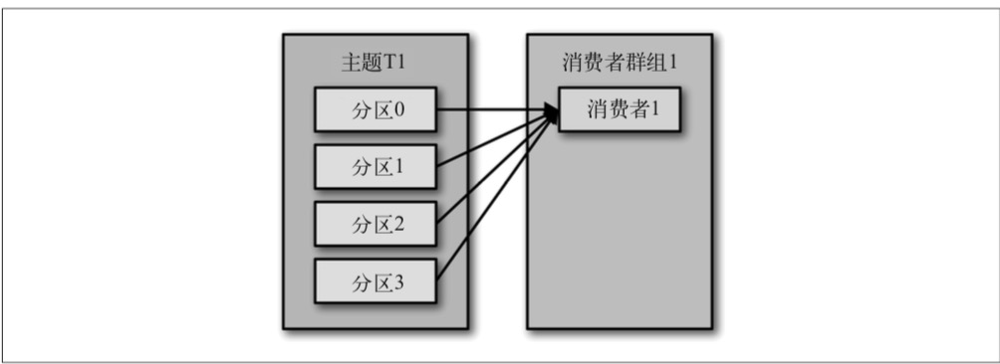
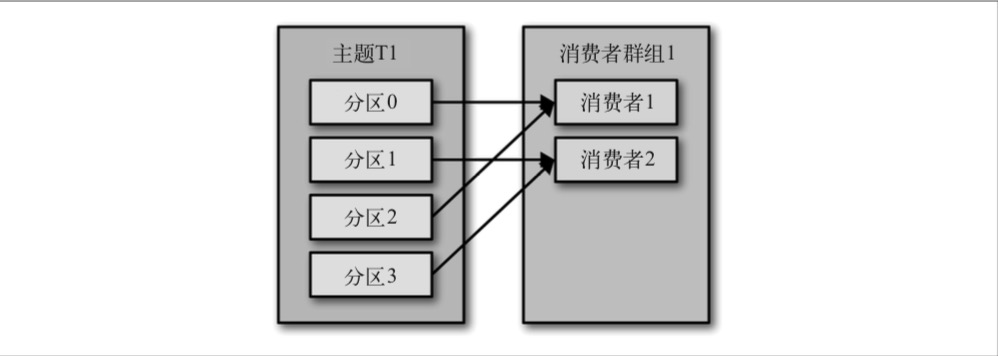
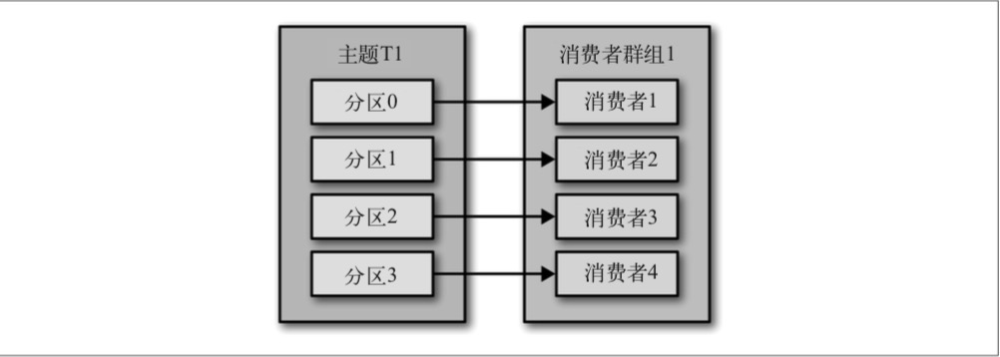
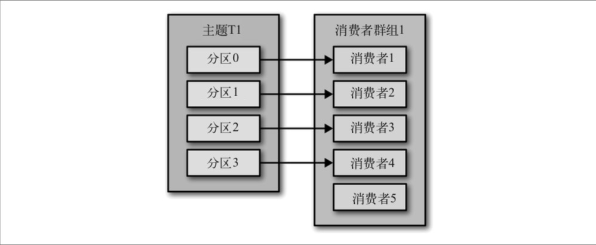
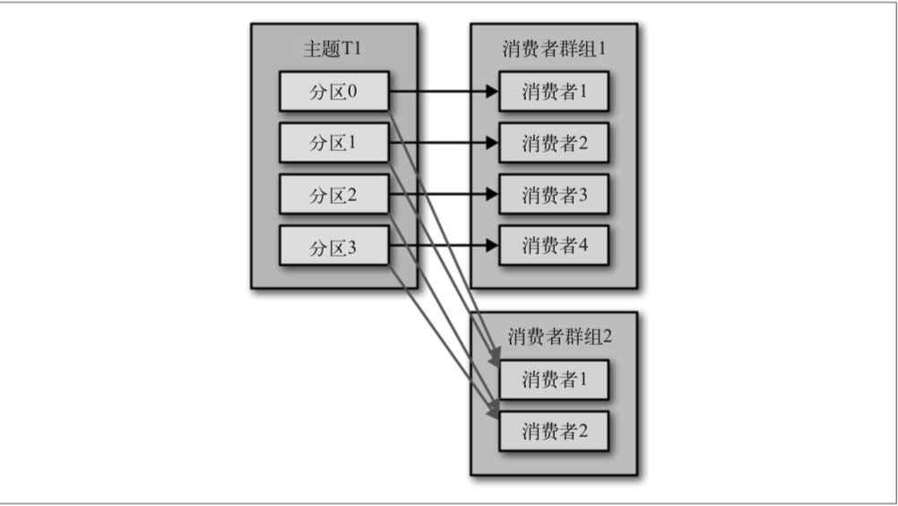

# 第四章 Kafka消费者——从Kafka读取数据

应用程序使用 KafkaConsumer 向 Kafka 订阅主题，并从订阅的主题上接收消息。从 Kafka 读取数据不同于从其他消息系统读取数据，它涉及一些独特的概念和想法。如果不先理解 这些概念，就难以理解如何使用消费者 API。所以我们接下来先解释这些重要的概念，然 后再举几个例子，演示如何使用消费者 API 实现不同的应用程序。

##4.1 KafkaConsumer概念

要想知道如何从 Kafka 读取消息，需要先了解消费者和消费者群组的概念。以下章节将解释这些概念。

### 4.1.1 消费者和消费者群组

假设我们有一个应用程序需要从一个 Kafka 主题读取消息并验证这些消息，然后再把它们 保存起来。应用程序需要创建一个消费者对象，订阅主题并开始接收消息，然后验证消息 并保存结果。过了一阵子，生产者往主题写入消息的速度超过了应用程序验证数据的速 度，这个时候该怎么办?如果只使用单个消费者处理消息，应用程序会远跟不上消息生成 的速度。显然，此时很有必要对消费者进行横向伸缩。就像多个生产者可以向相同的主题 写入消息一样，我们也可以**使用多个消费者从同一个主题读取消息，对消息进行分流**。

Kafka 消费者从属于消费者群组。一个群组里的消费者订阅的是同一个主题，每个消费者接收主题一部分分区的消息。

假设主题 T1 有 4 个分区，我们创建了消费者 C1，它是群组G1里唯一的消费者，我们用它订阅主题 T1。消费者 C1 将收到主题 T1 全部 4 个分区的消息，如图 4-1 所示。



​																		**图 4-1:1 个消费者收到 4 个分区的消息**

如果在群组 G1 里新增一个消费者 C2，那么每个消费者将分别从两个分区接收消息。我们假设消费者 C1 接收分区 0 和分区 2 的消息，消费者 C2 接收分区 1 和分区 3 的消息，如图 4-2 所示。



​																	**图 4-2:2 个消费者收到 4 个分区的消息**
 如果群组 G1 有 4 个消费者，那么每个消费者可以分配到一个分区，如图 4-3 所示。



​																		**图 4-3:4 个消费者收到 4 个分区的消息**

如果我们往群组里添加更多的消费者，超过主题的分区数量，那么有一部分消费者就会被闲置，不会接收到任何消息，如图 4-4 所示。



​																			**图 4-4:5 个消费者收到 4 个分区的消息**

往群组里增加消费者是横向伸缩消费能力的主要方式。**Kafka 消费者经常会做一些高延迟的操作**，比如把数据写到数据库或 HDFS，或者使用数据进行比较耗时的计算。在这些情况下，单个消费者无法跟上数据生成的速度，所以可以增加更多的消费者，让它们分担负 载，每个消费者只处理部分分区的消息，这就是横向伸缩的主要手段。我们有必要为主题创建大量的分区，在负载增长时可以加入更多的消费者。不过要注意，不要让消费者的数量超过主题分区的数量，多余的消费者只会被闲置。第 2 章介绍了如何为主题选择合适的分区数量。

除了通过增加消费者来横向伸缩单个应用程序外，还经常出现多个应用程序从同一个主题读取数据的情况。实际上，Kafka 设计的主要目标之一，就是要让 Kafka 主题里的数据能 够满足企业各种应用场景的需求。在这些场景里，每个应用程序可以获取到所有的消息， 而不只是其中的一部分。只要保证每个应用程序有自己的消费者群组，就可以让它们获取到主题所有的消息。不同于传统的消息系统，横向伸缩 Kafka 消费者和消费者群组并不会对性能造成负面影响。

在上面的例子里，如果新增一个只包含一个消费者的群组 G2，那么这个消费者将从主题 T1 上接收所有的消息，与群组 G1 之间互不影响。群组 G2 可以增加更多的消费者，每个 消费者可以消费若干个分区，就像群组 G1 那样，如图 4-5 所示。总的来说，群组 G2 还是 会接收到所有消息，不管有没有其他群组存在。

简而言之，为每一个需要获取一个或多个主题全部消息的应用程序创建一个消费者群组， 然后往群组里添加消费者来伸缩读取能力和处理能力，**群组里的每个消费者只处理一部分消息(部分分区的消息)**。



​																	**图 4-5:两个消费者群组对应一个主题**

### 4.1.2 消费者群组和分区再均衡

我们已经从上一个小节了解到，群组里的消费者共同读取主题的分区。一个新的消费者加入群组时，它读取的是原本由其他消费者读取的消息。当一个消费者被关闭或发生崩溃时，它就离开群组，原本由它读取的分区将由群组里的其他消费者来读取。在主题发生变化时，比如管理员添加了新的分区，会发生分区重分配。

分区的所有权从一个消费者转移到另一个消费者，这样的行为被称为再均衡。再均衡非常 重要，它为消费者群组带来了高可用性和伸缩性(我们可以放心地添加或移除消费者)， 不过在正常情况下，我们并不希望发生这样的行为。在**再均衡期间**，消费者无法读取消息，造成整个群组一小段时间的不可用。另外，当分区被重新分配给另一个消费者时，消费者当前的读取状态会丢失，它有可能还需要去刷新缓存，在它重新恢复状态之前会拖慢应用程序。我们将在本章讨论如何进行安全的再均衡，以及如何避免不必要的再均衡。

消费者通过向被指派为群组协调器的 broker(不同的群组可以有不同的协调器)发送心跳 来维持它们和群组的从属关系以及它们对分区的所有权关系。只要消费者以正常的时间 间隔发送心跳，就被认为是活跃的，说明它还在读取分区里的消息。**消费者会在轮询消息(为了获取消息)或提交偏移量时发送心跳**。如果消费者停止发送心跳的时间足够长，会 话就会过期，群组协调器认为它已经死亡，就会触发一次再均衡。

如果一个消费者发生崩溃，并停止读取消息，群组协调器会等待几秒钟，确认它死亡了才 会触发再均衡。在这几秒钟时间里，死掉的消费者不会读取分区里的消息。在清理消费者时，消费者会通知协调器它将要离开群组，协调器会立即触发一次再均衡，尽量降低处理停顿。在本章的后续部分，我们将讨论一些用于控制发送心跳频率和会话过期时间的配置参数，以及如何根据实际需要来配置这些参数。

------

**心跳行为在最近版本中的变化**

在 0.10.1 版本里，Kafka 社区引入了一个独立的心跳线程，可以在轮询消息的空档发送心跳。这样一来，发送心跳的频率(也就是消费者群组用于检测发生崩溃的消费者或不再发送心跳的消费者的时间)与消息轮询的频率(由处理消息所花费的时间来确定)之间就是相互独立的。在新版本的 Kafka 里，可以指定消费者在离开群组并触发再均衡之前可以有多长时间不进行消息轮询，这样可以避免出现活锁(livelock)，比如有时候应用程序并没有崩溃，只是由于某些原因导致无法正常运行。这个配置与session.timeout.ms 是相互独立的，后者用于控制检测消费者发生崩溃的时间和停止 发送心跳的时间。

本章的剩余部分将会讨论使用旧版本 Kafka 会面临的一些问题，以及如何解决这些问 题。本章还包括如何应对需要较长时间来处理消息的情况的讨论，这些与 0.10.1 或更 高版本的 Kafka 没有太大关系。如果你使用的是较新版本的 Kafka，并且需要处理耗费较长时间的消息，只需要加大` max.poll.interval.ms `的值来增加轮询间隔的时长。

**分配分区是怎样的一个过程**

当消费者要加入群组时，它会向群组协调器发送一个 JoinGroup 请求。第一 个加入群组的消费者将成为“群主”。群主从协调器那里获得群组的成员列 表(列表中包含了所有最近发送过心跳的消费者，它们被认为是活跃的)， 并负责给每一个消费者分配分区。它使用一个实现了 PartitionAssignor 接 口的类来决定哪些分区应该被分配给哪个消费者。

Kafka 内置了两种分配策略，在后面的配置参数小节我们将深入讨论。分配完毕之后，群主把分配情况列表发送给群组协调器，协调器再把这些信息发送给所有消费者。每个消费者只能看到自己的分配信息，只有群主知道群组里所有消费者的分配信息。这个过程会在每次再均衡时重复发生。

## 4.2 创建Kafka消费者

在读取消息之前，需要先创建一个 KafkaConsumer 对象。创建 KafkaConsumer 对象与创建 KafkaProducer 对象非常相似——把想要传给消费者的属性放在 Properties 对象里。本章后续部分会深入讨论所有的属性。在这里，我们只需要使用 3 个必要的属性:`bootstrap. servers`、`key.deserializer` 和 `value.deserializer`。

第1个属性 bootstrap.servers 指定了 Kafka集群的连接字符串。 它的用途与在 KafkaProducer 中的用途是一样的，可以参考第 3 章了解它的详细定义。另外两个属性 key. deserializer 和 value.deserializer 与生产者的 serializer 定义也很类似，不过它们不是使用指定的类把 Java 对象转成字节数组，而是使用指定的类把字节数组转成 Java 对象(反序列化)。

第 4 个属性 group.id 不是必需的，不过我们现在姑且认为它是必需的。它指定了 KafkaConsumer 属于哪一个消费者群组。创建不属于任何一个群组的消费者也是可以的，只 是这样做不太常见，在本书的大部分章节，我们都假设消费者是属于某个群组的。

面的代码片段演示了如何创建一个 KafkaConsumer 对象:

```java
Properties props = new Properties();
props.put("bootstrap.servers", "broker1:9092,broker2:9092");
props.put("group.id", "CountryCounter");
props.put("key.deserializer","org.apache.kafka.common.serialization.StringDeserializer");
props.put("value.deserializer","org.apache.kafka.common.serialization.StringDeserializer");
KafkaConsumer<String, String> consumer = new KafkaConsumer<String,String>(props);
```

如果在第 3 章看过如何创建生产者，就应该很熟悉上面的这段代码。我们假设消费的键和 值都是字符串类型，所以使用的是内置的 StringDeserializer，并且使用字符串类型创建 了 KafkaConsumer 对象。唯一不同的是新增了 group.id 属性，它指定了消费者所属群组的 名字。