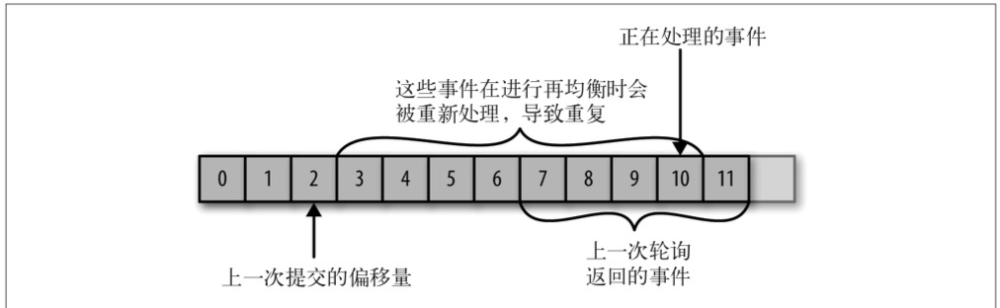
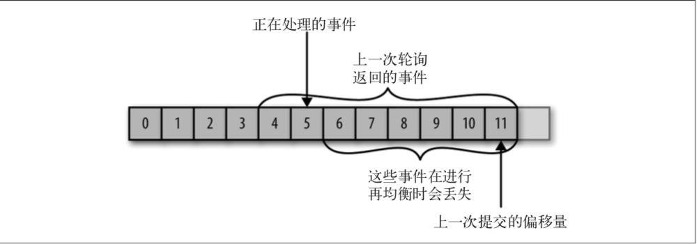

# 第四章 Kafka消费者——从Kafka读取数据

应用程序使用 KafkaConsumer 向 Kafka 订阅主题，并从订阅的主题上接收消息。从 Kafka 读取数据不同于从其他消息系统读取数据，它涉及一些独特的概念和想法。如果不先理解 这些概念，就难以理解如何使用消费者 API。所以我们接下来先解释这些重要的概念，然 后再举几个例子，演示如何使用消费者 API 实现不同的应用程序。

##4.1 KafkaConsumer概念

要想知道如何从 Kafka 读取消息，需要先了解消费者和消费者群组的概念。以下章节将解释这些概念。

### 4.1.1 消费者和消费者群组

假设我们有一个应用程序需要从一个 Kafka 主题读取消息并验证这些消息，然后再把它们 保存起来。应用程序需要创建一个消费者对象，订阅主题并开始接收消息，然后验证消息 并保存结果。过了一阵子，生产者往主题写入消息的速度超过了应用程序验证数据的速 度，这个时候该怎么办?如果只使用单个消费者处理消息，应用程序会远跟不上消息生成 的速度。显然，此时很有必要对消费者进行横向伸缩。就像多个生产者可以向相同的主题 写入消息一样，我们也可以**使用多个消费者从同一个主题读取消息，对消息进行分流**。

Kafka 消费者从属于消费者群组。一个群组里的消费者订阅的是同一个主题，每个消费者接收主题一部分分区的消息。

假设主题 T1 有 4 个分区，我们创建了消费者 C1，它是群组G1里唯一的消费者，我们用它订阅主题 T1。消费者 C1 将收到主题 T1 全部 4 个分区的消息，如图 4-1 所示。


​																		**图 4-1:1 个消费者收到 4 个分区的消息**

如果在群组 G1 里新增一个消费者 C2，那么每个消费者将分别从两个分区接收消息。我们假设消费者 C1 接收分区 0 和分区 2 的消息，消费者 C2 接收分区 1 和分区 3 的消息，如图 4-2 所示。


​																	**图 4-2:2 个消费者收到 4 个分区的消息**
 如果群组 G1 有 4 个消费者，那么每个消费者可以分配到一个分区，如图 4-3 所示。


​																		**图 4-3:4 个消费者收到 4 个分区的消息**

如果我们往群组里添加更多的消费者，超过主题的分区数量，那么有一部分消费者就会被闲置，不会接收到任何消息，如图 4-4 所示。


​																			**图 4-4:5 个消费者收到 4 个分区的消息**

往群组里增加消费者是横向伸缩消费能力的主要方式。**Kafka 消费者经常会做一些高延迟的操作**，比如把数据写到数据库或 HDFS，或者使用数据进行比较耗时的计算。在这些情况下，单个消费者无法跟上数据生成的速度，所以可以增加更多的消费者，让它们分担负 载，每个消费者只处理部分分区的消息，这就是横向伸缩的主要手段。我们有必要为主题创建大量的分区，在负载增长时可以加入更多的消费者。不过要注意，不要让消费者的数量超过主题分区的数量，多余的消费者只会被闲置。第 2 章介绍了如何为主题选择合适的分区数量。

除了通过增加消费者来横向伸缩单个应用程序外，还经常出现多个应用程序从同一个主题读取数据的情况。实际上，Kafka 设计的主要目标之一，就是要让 Kafka 主题里的数据能 够满足企业各种应用场景的需求。在这些场景里，每个应用程序可以获取到所有的消息， 而不只是其中的一部分。只要保证每个应用程序有自己的消费者群组，就可以让它们获取到主题所有的消息。不同于传统的消息系统，横向伸缩 Kafka 消费者和消费者群组并不会对性能造成负面影响。

在上面的例子里，如果新增一个只包含一个消费者的群组 G2，那么这个消费者将从主题 T1 上接收所有的消息，与群组 G1 之间互不影响。群组 G2 可以增加更多的消费者，每个 消费者可以消费若干个分区，就像群组 G1 那样，如图 4-5 所示。总的来说，群组 G2 还是 会接收到所有消息，不管有没有其他群组存在。

简而言之，为每一个需要获取一个或多个主题全部消息的应用程序创建一个消费者群组， 然后往群组里添加消费者来伸缩读取能力和处理能力，**群组里的每个消费者只处理一部分消息(部分分区的消息)**。


​																	**图 4-5:两个消费者群组对应一个主题**

### 4.1.2 消费者群组和分区再均衡

我们已经从上一个小节了解到，群组里的消费者共同读取主题的分区。一个新的消费者加入群组时，它读取的是原本由其他消费者读取的消息。当一个消费者被关闭或发生崩溃时，它就离开群组，原本由它读取的分区将由群组里的其他消费者来读取。在主题发生变化时，比如管理员添加了新的分区，会发生分区重分配。

分区的所有权从一个消费者转移到另一个消费者，这样的行为被称为再均衡。再均衡非常 重要，它为消费者群组带来了高可用性和伸缩性(我们可以放心地添加或移除消费者)， 不过在正常情况下，我们并不希望发生这样的行为。在**再均衡期间**，消费者无法读取消息，造成整个群组一小段时间的不可用。另外，当分区被重新分配给另一个消费者时，消费者当前的读取状态会丢失，它有可能还需要去刷新缓存，在它重新恢复状态之前会拖慢应用程序。我们将在本章讨论如何进行安全的再均衡，以及如何避免不必要的再均衡。

消费者通过向被指派为群组协调器的 broker(不同的群组可以有不同的协调器)发送心跳 来维持它们和群组的从属关系以及它们对分区的所有权关系。只要消费者以正常的时间 间隔发送心跳，就被认为是活跃的，说明它还在读取分区里的消息。**消费者会在轮询消息(为了获取消息)或提交偏移量时发送心跳**。如果消费者停止发送心跳的时间足够长，会 话就会过期，群组协调器认为它已经死亡，就会触发一次再均衡。

如果一个消费者发生崩溃，并停止读取消息，群组协调器会等待几秒钟，确认它死亡了才 会触发再均衡。在这几秒钟时间里，死掉的消费者不会读取分区里的消息。在清理消费者时，消费者会通知协调器它将要离开群组，协调器会立即触发一次再均衡，尽量降低处理停顿。在本章的后续部分，我们将讨论一些用于控制发送心跳频率和会话过期时间的配置参数，以及如何根据实际需要来配置这些参数。

------

**心跳行为在最近版本中的变化**

在 0.10.1 版本里，Kafka 社区引入了一个独立的心跳线程，可以在轮询消息的空档发送心跳。这样一来，发送心跳的频率(也就是消费者群组用于检测发生崩溃的消费者或不再发送心跳的消费者的时间)与消息轮询的频率(由处理消息所花费的时间来确定)之间就是相互独立的。在新版本的 Kafka 里，可以指定消费者在离开群组并触发再均衡之前可以有多长时间不进行消息轮询，这样可以避免出现活锁(livelock)，比如有时候应用程序并没有崩溃，只是由于某些原因导致无法正常运行。这个配置与session.timeout.ms 是相互独立的，后者用于控制检测消费者发生崩溃的时间和停止 发送心跳的时间。

本章的剩余部分将会讨论使用旧版本 Kafka 会面临的一些问题，以及如何解决这些问 题。本章还包括如何应对需要较长时间来处理消息的情况的讨论，这些与 0.10.1 或更 高版本的 Kafka 没有太大关系。如果你使用的是较新版本的 Kafka，并且需要处理耗费较长时间的消息，只需要加大` max.poll.interval.ms `的值来增加轮询间隔的时长。

**分配分区是怎样的一个过程**

当消费者要加入群组时，它会向群组协调器发送一个 JoinGroup 请求。第一 个加入群组的消费者将成为“群主”。群主从协调器那里获得群组的成员列 表(列表中包含了所有最近发送过心跳的消费者，它们被认为是活跃的)， 并负责给每一个消费者分配分区。它使用一个实现了 PartitionAssignor 接 口的类来决定哪些分区应该被分配给哪个消费者。

Kafka 内置了两种分配策略，在后面的配置参数小节我们将深入讨论。分配完毕之后，群主把分配情况列表发送给群组协调器，协调器再把这些信息发送给所有消费者。每个消费者只能看到自己的分配信息，只有群主知道群组里所有消费者的分配信息。这个过程会在每次再均衡时重复发生。

## 4.2 创建Kafka消费者

在读取消息之前，需要先创建一个 KafkaConsumer 对象。创建 KafkaConsumer 对象与创建 KafkaProducer 对象非常相似——把想要传给消费者的属性放在 Properties 对象里。本章后续部分会深入讨论所有的属性。在这里，我们只需要使用 3 个必要的属性:`bootstrap. servers`、`key.deserializer` 和 `value.deserializer`。

第1个属性 bootstrap.servers 指定了 Kafka集群的连接字符串。 它的用途与在 KafkaProducer 中的用途是一样的，可以参考第 3 章了解它的详细定义。另外两个属性 key. deserializer 和 value.deserializer 与生产者的 serializer 定义也很类似，不过它们不是使用指定的类把 Java 对象转成字节数组，而是使用指定的类把字节数组转成 Java 对象(反序列化)。

第 4 个属性 group.id 不是必需的，不过我们现在姑且认为它是必需的。它指定了 KafkaConsumer 属于哪一个消费者群组。创建不属于任何一个群组的消费者也是可以的，只 是这样做不太常见，在本书的大部分章节，我们都假设消费者是属于某个群组的。

面的代码片段演示了如何创建一个 KafkaConsumer 对象:

```java
Properties props = new Properties();
props.put("bootstrap.servers", "broker1:9092,broker2:9092");
props.put("group.id", "CountryCounter");
props.put("key.deserializer","org.apache.kafka.common.serialization.StringDeserializer");
props.put("value.deserializer","org.apache.kafka.common.serialization.StringDeserializer");
KafkaConsumer<String, String> consumer = new KafkaConsumer<String,String>(props);
```

如果在第 3 章看过如何创建生产者，就应该很熟悉上面的这段代码。我们假设消费的键和 值都是字符串类型，所以使用的是内置的 StringDeserializer，并且使用字符串类型创建 了 KafkaConsumer 对象。唯一不同的是新增了 group.id 属性，它指定了消费者所属群组的名字。

## 4.3 订阅主题

创建好消费者之后，下一步可以开始订阅主题了。subscribe() 方法接受一个主题列表作为参数，使用起来很简单:

```java
consumer.subscribe(Collections.singletonList("customerCountries"));
```

为了简单起见，我们创建了一个只包含单个元素的列表，主题的名字叫作“customerCountries”。

我们也可以在调用 subscribe() 方法时传入一个正则表达式。正则表达式可以匹配多个主题，如果有人创建了新的主题，并且主题的名字与正则表达式匹配，那么会立即触发一次 再均衡，消费者就可以读取新添加的主题。如果应用程序需要读取多个主题，并且可以处 理不同类型的数据，那么这种订阅方式就很管用。在 Kafka 和其他系统之间复制数据时， 使用正则表达式的方式订阅多个主题是很常见的做法。

要订阅所有与 test 相关的主题，可以这样做:

```java
consumer.subscribe("test.*");
```

## 4.4 轮询

消息轮询是消费者 API 的核心，通过一个简单的轮询向服务器请求数据。一旦消费者订阅了主题，轮询就会处理所有的细节，包括群组协调、分区再均衡、发送心跳和获取数据， 开发者只需要使用一组简单的 API 来处理从分区返回的数据。消费者代码的主要部分如下 所示：

```java
try {
  while (true) { ➊
    ConsumerRecords<String, String> records = consumer.poll(100); ➋ 
    for (ConsumerRecord<String, String> record : records) ➌
    {
    log.debug("topic = %s, partition = %s, offset = %d, customer = %s,
              country = %s\n",
              record.topic(), record.partition(), record.offset(),
              record.key(), record.value());
    int updatedCount = 1;
    if (custCountryMap.countainsValue(record.value())) {
      updatedCount = custCountryMap.get(record.value()) + 1;
    }
    custCountryMap.put(record.value(), updatedCount)
    JSONObject json = new JSONObject(custCountryMap);
    System.out.println(json.toString(4)) ➍ 
    }
	}
} finally {
  consumer.close(); ➎ 
}
```

➊ 这是一个无限循环。消费者实际上是一个长期运行的应用程序，它通过持续轮询向 Kafka 请求数据。稍后我们会介绍如何退出循环，并关闭消费者。

➋ 这一行代码非常重要。就像鲨鱼停止移动就会死掉一样，消费者必须持续对 Kafka 进 行轮询，否则会被认为已经死亡，它的分区会被移交给群组里的其他消费者。传给 poll() 方法的参数是一个超时时间，用于控制 poll() 方法的阻塞时间(在消费者的缓 冲区里没有可用数据时会发生阻塞)。如果该参数被设为 0，poll() 会立即返回，否则 它会在指定的毫秒数内一直等待 broker 返回数据。

➌ poll() 方法返回一个记录列表。每条记录都包含了记录所属主题的信息、记录所在分 区的信息、记录在分区里的偏移量，以及记录的键值对。我们一般会遍历这个列表，逐条处理这些记录。poll() 方法有一个超时参数，它指定了方法在多久之后可以返回， 不管有没有可用的数据都要返回。超时时间的设置取决于应用程序对响应速度的要求， 比如要在多长时间内把控制权归还给执行轮询的线程。

➍ 把结果保存起来或者对已有的记录进行更新，处理过程也随之结束。在这里，我们的目 的是统计来自各个地方的客户数量，所以使用了一个散列表来保存结果，并以 JSON 的 格式打印结果。在真实场景里，结果一般会被保存到数据存储系统里。

 ➎在退出应用程序之前使用 close() 方法关闭消费者。网络连接和 socket 也会随之关闭， 并立即触发一次再均衡，而不是等待群组协调器发现它不再发送心跳并认定它已死亡， 因为那样需要更长的时间，导致整个群组在一段时间内无法读取消息。

轮询不只是获取数据那么简单。在第一次调用新消费者的 poll() 方法时，它会负责查找 GroupCoordinator，然后加入群组，接受分配的分区。如果发生了再均衡，整个过程也是 在轮询期间进行的。当然，心跳也是从轮询里发送出去的。所以，我们要确保在轮询期间 所做的任何处理工作都应该尽快完成。

------

**线程安全**

在同一个群组里，我们无法让一个线程运行多个消费者，也无法让多个线 程安全地共享一个消费者。按照规则，**一个消费者使用一个线程**。如果要在同一个消费者群组里运行多个消费者，需要让每个消费者运行在自己 的线程里。最好是把消费者的逻辑封装在自己的对象里，然后使用 Java 的 ExecutorService 启动多个线程，使每个消费者运行在自己的线程上。 Confluent 的博客(https://www.confluent.io/blog/)上有一个教程介绍如何处 理这种情况。

## 4.5 消费者的配置

到目前为止，我们学习了如何使用消费者 API，不过只介绍了几个配置属性——bootstrap. servers、group.id、key.deserializer 和 value.deserializer。Kafka 的文档列出了所有与消费者相 关的配置说明。大部分参数都有合理的默认值，一般不需要修改它们，不过有一些参数与消费者的性能和可用性有很大关系。接下来介绍这些重要的属性。

### 1. fetch.min.bytes

该属性指定了消费者从服务器获取记录的最小字节数。broker 在收到消费者的数据请求时， 如果可用的数据量小于 fetch.min.bytes 指定的大小，那么它会等到有足够的可用数据时才把它返回给消费者。这样可以降低消费者和 broker 的工作负载，因为它们在主题不是很 活跃的时候(或者一天里的低谷时段)就不需要来来回回地处理消息。如果没有很多可用数据，但消费者的 CPU 使用率却很高，那么就需要把该属性的值设得比默认值大。如果 消费者的数量比较多，把该属性的值设置得大一点可以降低 broker 的工作负载。

### 2. fetch.max.wait.ms

我们通过 fetch.min.bytes 告诉 Kafka，等到有足够的数据时才把它返回给消费者。而 feth. max.wait.ms 则用于指定 broker 的等待时间，默认是 500ms。如果没有足够的数据流入 Kafka，消费者获取最小数据量的要求就得不到满足，最终导致 500ms 的延迟。如果要降低潜在的延迟(为了满足 SLA)，可以把该参数值设置得小一些。如果 fetch.max.wait.ms 被设 为 100ms，并且 fetch.min.bytes 被设为 1MB，那么 Kafka 在收到消费者的请求后，要么返 回 1MB 数据，要么在 100ms 后返回所有可用的数据，就看哪个条件先得到满足。

### 3. max.partition.fetch.bytes

该属性指定了服务器从每个分区里返回给消费者的最大字节数。它的默认值是 1MB，也就是说，KafkaConsumer.poll() 方法从每个分区里返回的记录最多不超过 max.partition. fetch.bytes 指定的字节。如果一个主题有 20 个分区和 5 个消费者，那么每个消费者需要 至少 4MB 的可用内存来接收记录。在为消费者分配内存时，可以给它们多分配一些，因为如果群组里有消费者发生崩溃，剩下的消费者需要处理更多的分区。max.partition. fetch.bytes 的值必须比 broker 能够接收的最大消息的字节数(通过 max.message.size 属 性配置)大，否则消费者可能无法读取这些消息，导致消费者一直挂起重试。在设置该属性时，另一个需要考虑的因素是消费者处理数据的时间。消费者需要频繁调用 poll() 方法来避免会话过期和发生分区再均衡，如果单次调用 poll() 返回的数据太多，消费者需要更多的时间来处理，可能无法及时进行下一个轮询来避免会话过期。如果出现这种情况，可以把 max.partition.fetch.bytes 值改小，或者延长会话过期时间。

### 4. session.timeout.ms

该属性指定了消费者在被认为死亡之前可以与服务器断开连接的时间，默认是 3s。如 果消费者没有在 session.timeout.ms 指定的时间内发送心跳给群组协调器，就被认为已经死亡，协调器就会触发再均衡，把它的分区分配给群组里的其他消费者。该属性与 heartbeat.interval.ms 紧密相 关。heartbeat.interval.ms 指 定了 poll() 方 法 向 协 调 器 发送心跳的频率，session.timeout.ms 则指定了消费者可以多久不发送心跳。所以，一 般需要同时修改这两个属性，heartbeat.interval.ms 必须比 session.timeout.ms 小，一 般是 session.timeout.ms 的三分之一。如果 session.timeout.ms 是 3s，那么 heartbeat. interval.ms 应该是 1s。把 session.timeout.ms 值设得比默认值小，可以更快地检测和恢 复崩溃的节点，不过长时间的轮询或垃圾收集可能导致非预期的再均衡。把该属性的值设 置得大一些，可以减少意外的再均衡，不过检测节点崩溃需要更长的时间。

### 5. auto.offset.reset

该属性指定了消费者在读取一个没有偏移量的分区或者偏移量无效的情况下(因消费者长 时间失效，包含偏移量的记录已经过时并被删除)该作何处理。它的默认值是 latest，意思是说，在偏移量无效的情况下，消费者将从最新的记录开始读取数据(在消费者启动之 后生成的记录)。另一个值是 earliest，意思是说，在偏移量无效的情况下，消费者将从起始位置读取分区的记录。

### 6. enable.auto.commit

我们稍后将介绍几种不同的提交偏移量的方式。该属性指定了消费者是否自动提交偏移量，默认值是 true。为了尽量避免出现重复数据和数据丢失，可以把它设为 false，由自己控制何时提交偏移量。如果把它设为 true，还可以通过配置 auto.commit.interval.ms 属性来控制提交的频率。

### 7. partition.assignment.strategy

我们知道，分区会被分配给群组里的消费者。PartitionAssignor 根据给定的消费者和主 题，决定哪些分区应该被分配给哪个消费者。Kafka 有两个默认的分配策略。

**Range**

该策略会把主题的若干个连续的分区分配给消费者。假设消费者 C1 和消费者 C2 同时 订阅了主题 T1 和主题 T2，并且每个主题有 3 个分区。那么消费者 C1 有可能分配到这 两个主题的分区 0 和分区 1，而消费者 C2 分配到这两个主题的分区 2。因为每个主题拥有奇数个分区，而分配是在主题内独立完成的，第一个消费者最后分配到比第二个消费者更多的分区。只要使用了 Range 策略，而且分区数量无法被消费者数量整除，就会出现这种情况。

**RoundRobin**

该策略把主题的所有分区逐个分配给消费者。如果使用 RoundRobin 策略来给消费者 C1 和消费者 C2 分配分区，那么消费者 C1 将分到主题 T1 的分区 0 和分区 2 以及主题 T2 的分区 1，消费者 C2 将分配到主题 T1 的分区 1 以及主题 T2 的分区 0 和分区 2。一般来说，如果所有消费者都订阅相同的主题(这种情况很常见)，RoundRobin 策略会给所有消费者分配相同数量的分区(或最多就差一个分区)。

通过设置partition.assignment.strategy来选择分区策略。默认使用的是 org. apache.kafka.clients.consumer.RangeAssignor，这个类实现了 Range 策略，也可以改成 org.apache.kafka.clients.consumer.RoundRobinAssignor。还可以使用自定义策略，在这种情况下，partition.assignment.strategy 属性的值就是自定义类的名字。

### 8. client.id

该属性可以是任意字符串，broker 用它来标识从客户端发送过来的消息，通常被用在日志、 度量指标和配额里。

### 9. max.poll.records

该属性用于控制单次调用 call() 方法能够返回的记录数量，可以帮你控制在轮询里需要处理的数据量。

### 10. receive.buffer.bytes 和 send.buffer.bytes

socket 在读写数据时用到的 TCP 缓冲区也可以设置大小。如果它们被设为 -1，就使用操作系统的默认值。如果生产者或消费者与 broker 处于不同的数据中心内，可以适当增大这些值，因为跨数据中心的网络一般都有比较高的延迟和比较低的带宽。

## 4.6 提交和偏移量

每次调用 poll() 方法，它总是返回由生产者写入 Kafka 但还没有被消费者读取过的记录， 我们因此可以追踪到哪些记录是被群组里的哪个消费者读取的。之前已经讨论过，Kafka 不会像其他 JMS 队列那样需要得到消费者的确认，这是 Kafka 的一个独特之处。相反，消 费者可以使用 Kafka 来追踪消息在分区里的位置(偏移量)。

我们把更新分区当前位置的操作叫作**提交**。

那么消费者是如何提交偏移量的呢?消费者往一个叫作 _consumer_offset 的特殊主题发送 消息，消息里包含每个分区的偏移量。如果消费者一直处于运行状态，那么偏移量就没有 什么用处。不过，如果消费者发生崩溃或者有新的消费者加入群组，就会触发再均衡，完 成再均衡之后，每个消费者可能分配到新的分区，而不是之前处理的那个。为了能够继续之前的工作，消费者需要读取每个分区最后一次提交的偏移量，然后从偏移量指定的地方继续处理。

如果提交的偏移量小于客户端处理的最后一个消息的偏移量，那么处于两个偏移量之间的消息就会被重复处理，如图 4-6 所示。



​												**图 4-6:提交的偏移量小于客户端处理的最后一个消息的偏移量**

如果提交的偏移量大于客户端处理的最后一个消息的偏移量，那么处于两个偏移量之间的消息将会丢失，如图 4-7 所示。



​												**图 4-7:提交的偏移量大于客户端处理的最后一个消息的偏移量**

所以，处理偏移量的方式对客户端会有很大的影响。

KafkaConsumer API 提供了很多种方式来提交偏移量。

### 4.6.1 自动提交

最简单的提交方式是让消费者自动提交偏移量。如果 enable.auto.commit 被设为 true，那么每过 5s，消费者会自动把从 poll() 方法接收到的最大偏移量提交上去。提交时间间隔由 auto.commit.interval.ms 控制，默认值是 5s。与消费者里的其他东西一样，自动提交 也是在轮询里进行的。消费者每次在进行轮询时会检查是否该提交偏移量了，如果是，那么就会提交从上一次轮询返回的偏移量。

不过，在使用这种简便的方式之前，需要知道它将会带来怎样的结果。

假设我们仍然使用默认的 5s 提交时间间隔，在最近一次提交之后的 3s 发生了再均衡，再均衡之后，消费者从最后一次提交的偏移量位置开始读取消息。这个时候偏移量已经落后了 3s，所以在这 3s 内到达的消息会被重复处理。可以通过修改提交时间间隔来更频繁地提交偏移量，减小可能出现重复消息的时间窗，不过这种情况是无法完全避免的。

在使用自动提交时，每次调用轮询方法都会把上一次调用返回的偏移量提交上去，它并不知道具体哪些消息已经被处理了，所以在再次调用之前最好确保所有当前调用返回的消息都已经处理完毕(在调用 close() 方法之前也会进行自动提交)。一般情况下不会有什么问 题，不过在处理异常或提前退出轮询时要格外小心。

自动提交虽然方便，不过并没有为开发者留有余地来避免重复处理消息。

### 4.6.2 提交当前偏移量

大部分开发者通过控制偏移量提交时间来消除丢失消息的可能性，并在发生再均衡时减少重复消息的数量。消费者 API 提供了另一种提交偏移量的方式，开发者可以在必要的时候提交当前偏移量，而不是基于时间间隔。

把 auto.commit.offset 设为 false，让应用程序决定何时提交偏移量。使用 commitSync() 提交偏移量最简单也最可靠。这个 API 会提交由 poll() 方法返回的最新偏移量，提交成功后马上返回，如果提交失败就抛出异常。

要记住，commitSync() 将会提交由 poll() 返回的最新偏移量，所以在处理完所有记录后要 确保调用了 commitSync()，否则还是会有丢失消息的风险。如果发生了再均衡，从最近一批消息到发生再均衡之间的所有消息都将被重复处理。

下面是我们在处理完最近一批消息后使用 commitSync() 方法提交偏移量的例子。

```java
while (true) {
  ConsumerRecords<String, String> records = consumer.poll(100);
  for (ConsumerRecord<String, String> record : records)
  {
    System.out.printf("topic = %s, partition = %s, offset =
                      %d, customer = %s, country = %s\n",
                      record.topic(), record.partition(),
                      record.offset(), record.key(), record.value()); ➊
  }
  try {
    consumer.commitSync(); ➋
  } catch (CommitFailedException e) {
    log.error("commit failed", e) ➌ }
}
```

➊ 我们假设把记录内容打印出来就算处理完毕，这个是由应用程序根据具体的使用场景来 决定的。

➋ 处理完当前批次的消息，在轮询更多的消息之前，调用 commitSync() 方法提交当前批次最新的偏移量。

➌ 只要没有发生不可恢复的错误，commitSync() 方法会一直尝试直至提交成功。如果提交失败，我们也只能把异常记录到错误日志里。

