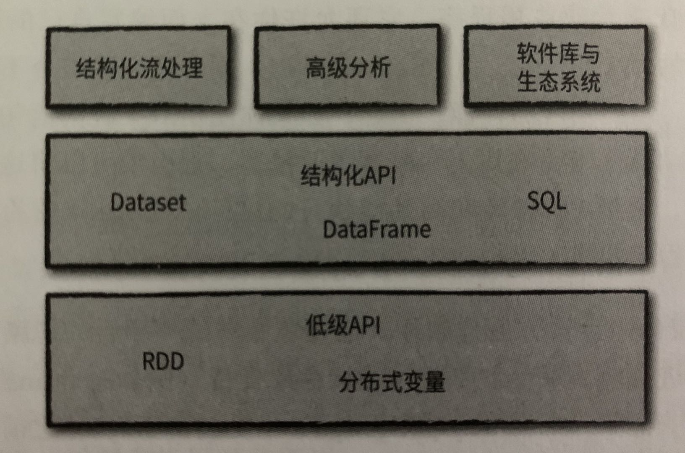

#  第一章 Spark是什么

Apache Spark是一个在集群上运行的统一就按引擎以及一组并行数据处理软件库。Spark支持多种常用的编程语言(Python,Java,Scala和R)，提供SQL、流处理、机器学习等多种任务的软件库。既可以在单台计算机上运行，也可以在数千台服务器组成的集群上运行。

图1-1 展示了Spark向终端用户提供的所有组件和软件库

 

## 1. Apache Spark的设计哲学

Apache Spark作为统一计算引擎和大数据处理软件库的集成，下面细分以下它的关键组件。

### 1.1 统一平台

Spark的主要目标是为了编写大数据应用程序提供统一的平台，统一是什么意思呢？Spark通过统一计算引擎和一套统一的API，支持广泛的数据分析任务，从简单的数据加载，到SQL查询，再到机器学习和流式计算。这一目标背后的驱动原因是，真实世界的数据分析任务，不论是Jupyter NoteBook这种交互式的分析工具，还是用于生产应用的传统软件开发，都结合了许多不同的处理类型和软件库。

Spark的统一API使得这些任务更容易编写且更加高效。首先，Spark提供了一致的，可组合的API，可以使用这些API来构建应用程序，或使用代码片段亦或是从现有的库来构建应用程序，还允许编写自己的数据分析库。但是，可组合的API还是不够，利用Spark的API，用户还可以组合不同库和函数来优化用户程序，从而实现高性能。例如：如果使用SQL查询语句来加载数据，然后使用Spark的ML库评估其上的机器学习模型，则引擎可以将这些步骤合并为一次数据扫描。通用API设计和高性能执行设计，使得Spark称为开发交互式程序和产生应用程序的强大平台。

在Spark之前，没有任何开源系统试图为并行数据处理提供这一统一引擎，这意味着用户必须拼凑多套API和多个系统来开发应用程序(例如：机器学习任务，使用Hive进行数据ETL操作，写入宽表，然后调用机器学习库进行建模与评估)。随着Spark的不断发展与完善，本书的重点之一是Spark 2.0中定义的“结构化API”(DataFrame、Dataset和SQL)，以帮助进一步优化用户应用程序。

### 1.2 计算引擎

在Spark致力于统一平台的同时，也专注于计算引擎。Spark从存储系统加载数据并对其执行计算，加载结束时不负责永久存储，可以将多重持久化存储系统与Spark集合使用，包括云存储(如Azure存储和Amazon S3)、分布式文件系统(如Apache Hadoop)、键值存储系统(如Apache Cassandra)，以及消息队列系统(如Apache Kafka)

但是，Spark本身不负责持久化数据，也不偏向于使用某一特定存储系统，主要原因是大多数数据已近存在与混合存储系统中，而要移动这些数据的费用非常高，因此Spark专注于对数据执行计算，而不考虑数据存储于何处。Spark努力使这些存储系统让用户使用起来大致相似，这样应用程序无需但是数据存储对数据处理的影响。

Spark对计算的关注使其不同于早期的大数据软件平台，例如Apache Hadoop，Hadoop包括一个存储系统(HDFS, 专用于普通服务器集群进行低成本存储而设计)和计算系统(MapReduce)。它们紧密集成在一起。但是，这种设计导致无法独立运行HDFS的MapReduce系统。更重要的是，这种选择也让用户编写访问其他存储的应用程序更加困难。尽管Spark在Hadoop存储上运行良好，但现在它也广泛应用于除Hadoop外的存储系统，例如公有云或流式处理程序。

------

**FQA**

**Q1**:MapReduce数据源是否只有HDFS？

并非只有HDFS，还可以读取/写入HBase、Amazon S3，Azure Blob Storage，Aliyun OSS。

------

### 1.3 配套的软件库

Spark最后一个组件是它的软件库，这与Spark的设计理念一脉相承，即构建一个统一的引擎，为通用数据分析任务提供一个统一的API。Spark不仅支持引擎附带的标准库，同时也支持由客源社区以第三方包形式发布的大量外部库。Spark的标准库实际上已经称为一系列开源项目的集成：Spark核心引擎本身自第一次发布意外几乎没什么变化，但是配套的软件库越来越强大，提供越来越多的功能。

Spark包括：SQL和处理结构化数据的库(Spark SQL)、机器学习库(MLlib)、流处理库(Spark Streaming和structured Streaming)，以及图分析(GraphX)的库。除这些库外，还有数百种开源的外部库，包括各种存储系统连机器和机器学习算法，详见spark-packages.org。

## 2. 背景：大数据问题

为什么我们迫切需要用于大数据分析的新计算引擎和编程模型？与许多计算领域的新趋势一样，这是由于计算机应用和硬件技术背后的商业趋势变化所导致的。

在计算机发展的很长一段时间里，计算机每天都会因为处理器速度的提高而变得更快：每年新处理器的运行速度可能比上一年更快。因此，在不对其代码进行任何更改的情况下，应用程序每年都会变得更快。这种趋势导致了庞大而成熟的应用程序生态系统，而其中大部分应用程序之被设计为在单个处理器上运行。随着时间的推移，这些应用程序也促使了处理器速度的提高，并要求支持更多的计算量和处理更大的数据量。

不幸的是，这种硬件发展趋势在2005年左右停止了：由于硬盘散热的限制，硬件开发人员停止了制造更快单个处理器的思路，并转向为增加更多的相同计算能力的并行CPU计算核心，这种变化意味着要修改应用程序以支持并行计算，以便更快运行，着促使了Apache Spark等新编程模型的出现。

更重要的是，虽然在2005年，处理器的性能增速减缓了，但是数据存储和数据采集技能的发展并没有减缓。存储1TB数据的成本每14个月下降两次，对于各种规模的企业来说，这意味着存储大量数据的成本非常便宜。因此，许多数据采集技术(传感器、摄像头、公共数据集等)不断发展，成本持续降低或分辨率持续提高。

最终的结果是我们的世界发展成了一个数据采集非常便宜的世界，但是处理它需要大规模的并行计算，通常是在集群上进行，这个新世界里，过去50年开发的软件无法自动扩展为并行程序，数据处理领域的传统编程模型无法被自动并行化，因此需要一种新的编程模型。Hadoop MapReduce和Apache Spark在这种新形势下应运而生。

## 3. Spark历史

Apache Spark来源于加州大学伯克利分校2009的Spark研究项目，并发表了“Spark：cluster Computing with Woring Sets"的论文。当时Hadoop MapReduce是运行在计算机集群上的主要并行计算引擎，是第一个在数千个节点上运行并行数据处理的开源系统。Hadoop MapReduce的主要缺点之一是：无法对数据进行多次迭代处理。

在Spark研究小组与Hadoop用户的交流中，有两件事很确定：

- 集群计算具有巨大潜力
- MapReduce引擎构建大型应用程序即具有挑战性又低效，例如：经典的机器学习算法可能需要对数据进行10次或20次迭代计算，而在MapReduce中，每次迭代都必须通过一个MapReduce作业来完成，必须在分布式集群上重新读取全部数据并单独启动一次作业

为了解决该问题，Spark团队首先设计了一个基于**函数式编程API**，可以简洁地表达多种计算步骤的应用程序，然后，通过一个新的计算引擎实现了这个API，该计算引擎可以跨多个计算步骤执行高效的**内存数据共享**。

Spark第一个版本仅支持批处理应用程序，但是很快又发现了另一类重要应用：交互式处理处理和即席(ad_hoc)查询。通过简单地将Scala解释器插入Spark，该项目可以提供一个高可用的交互式系统，用于在数百台机器上运行查询。

通过初始版本的发布，很快清楚意识到，Spark最强大的功能来自于心的软件库，因此该项目开始遵循当今“标准库”方法，开始开发MLlib、Spark Streaming和Graph X，并确保这些API具有高度的相互操作性，使用户可以在用一个引擎中编写多种端到端的大数据应用程序。

Apache Spark2014年发布了Spark 1.0，在2016年发布了Spark 2.0，并继续定期发布，为项目带来新功能。

最后，Spark可组合API的核心思想也在不断完善。早期版本的Spark很大程度上只定义了API的操作功能，即Java对象集合的map和reduce等并行操作。从1.0开始，添加了Spark SQL，一种用于处理结构化数据(具有固定鹅湖数据格式且与Java的内存表示无关的数据表)的新API，利用对输入数据格式和用户代码的了解，Spark SQL进一步优化了相关软件库和API的性能。之后，增加了大量针对结构化数据的新API，包括DataFrame、机器学习管道和结构化流处理(一个高级别的自动优化的流处理API)。在本书中，将用大量的篇幅来解释这些大多已经可被用于生产应用的下一代API。

