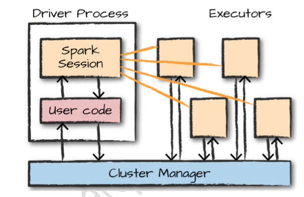
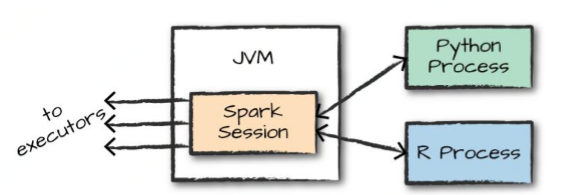
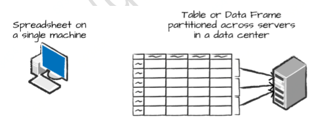
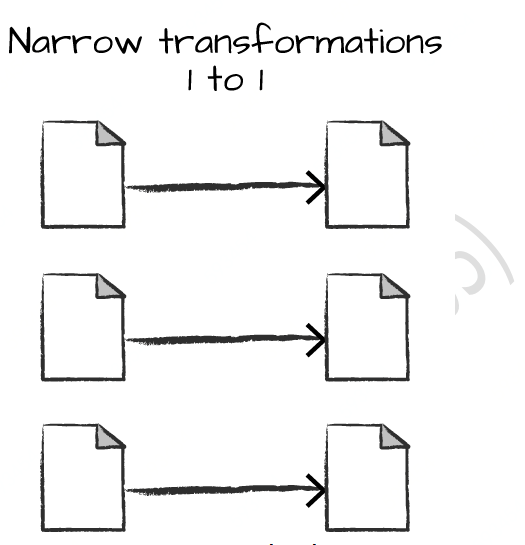
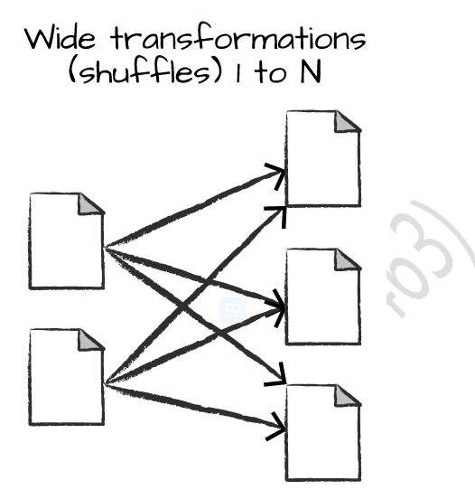
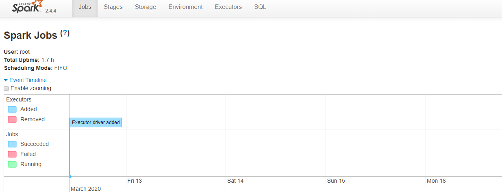
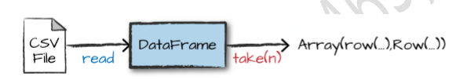
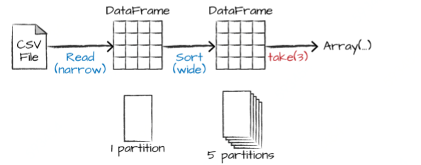
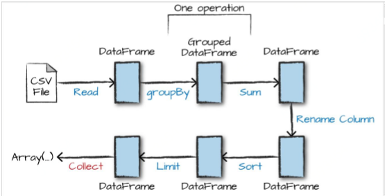

[TOC]

# 第二章 Spark浅析

本章对 Spark 进行了一个简要的介绍，将介绍集群的核心架构、Spark 应用程序和使用DataFrames和SQL的 Spark 的结构化API。

## 2.1 Spark基本架构

单个机器没有足够的能力和资源来执行大量的信息(或者用户可能没有时间等待计算完成)。计算机的集群或组，将许多计算机的资源集合在一起，能够像使用一台计算机一样使用所有的累积资源。一组机器本身并不强大，需要一个框架来协调它们之间的 工作。Spark就是这样的框架，它管理和协调跨集群计算机上的数据执行任务。

Spark 将用于执行任务的集群交由集群管理器管理，如 Spark Standalone 集群管理器、 YARN 集群管理器、Mesos 集群管理器。客户端向这些集群管理器提交 Spark应用程序，资源管理器为应用程序提供资源，保证应用完成。

### 2.1.1 Spark应用程序

Spark应用程序由一个dirver进程(驱动器程序)和一组Executor进程组成。driver进程负责运行main函数，此进程位于Spark集群中的一个节点上。负责三件事：

- 维护有关Spark应用程序的信息；
- 相应用户的程序或输入；
- 分析、分配和调度Executor工作；

driver程序是 Spark 应用程序的核心，并在应用程序的生命周期内维护所有相关信息。 Executor进程实际执行driver分配给它们的工作，每个executor负责两件事: 

- 执行驱动器分配的代码；
- 将启动器Driver的计算状态报告给驱动节点；

图 2-1 演示了集群管理器(cluster manager)如何控制物理机器并分配资源给 spark 应用程序与执行器。集群管理器可以是四个核心集群管理器之一：Spark Standalone cluster manager、YARN、Kubermetas或Mesos。可以同时在集群上运行多个 Spark 应用程序。



​																**图2-1 Spark应用程序组成**

在图 2-1 中，可以看到左边的驱动程序和右边的四个执行器。在这个图中，我们忽略了集群节点的概念。用户可以通过配置指定每个节点上有多少个执行器。 

Spark除了集群cluster模式外，还具有本地local模式。driver驱动程序和executor执行器是简单的进程，这意味着它们可以在集群或者同一台机器上运行。local模式下，driver和executor以线程的方式在本地计算机上运行。

以下是关于Spark应用程序需要了解的几点：

- Spark使用一个集群管理器来跟踪可用的资源
- 驱动器进程负责执行驱动器命令来完成给定任务

执行器大部分时候都运行Spark代码，但是驱动器可以通过多种不同语言来调用Spark API来驱动。

## 2.2 Spark API多语言支持

Spark API的多语言支持使允许使用多种编程语言运行 Spark 代码。在很大程度上，Spark 在每种语言中都提供了一些核心的“概念”，这些概念被转换成在机器集群上运行的Spark 代码。如果只使用结构化 API，那么所有语言都具有类似的性能特征。

**Scala**

Spark主要使用Scala编写，也是Spark的默认语言，本书大部分地方都将使用Spark代码示例。

**Java**

**Python**

Python几乎支持所有Scala支持的结构。

**SQL**

**R**

图 2-2 给出了这种关系的简单说明。 



每个语言 API 都维护相同的核心概念(第一章描述的设计理念)。用户可以使用 SparkSession 对象，这是运行 Spark 代码的入口点。在基于Python或R使用Spark时，不会编写显式的JVM 指令; 相反，编写Python和R代码可以来调用SparkSession，Spark将它们转换为可以在jvm上运行的代码。 

### Spark’s APIs

Spark有两个基本的API集：low-level的非结构化API以及higher-level的高级结构化API。

## 2.3 启动Spark

当开始编写 Spark 应用程序时，需要一种方法来将用户命令和数据发送给 spark，让其计算结果。首先需要创建一个 `SparkSession`，老版本是创建一个`SparkContext`。

 **注意：**启动 Spark 的本地模式，意味着运行`./bin/spark-shell `访问 Scala 控制台以启动交互式会话。还可以使用`./bin/pyspark`启动 Python 控制台。这将启动一个交互式 Spark 应用程序。还有一个方式，可以提交独
立的应用程序到 Spark，称为 `Spark -submit`，这样就可以提交一个预编译的应用程序到 spark 集群。

当在交互模式中启动 Spark 时，相当于隐式地创建一个 `SparkSession `来管理 Spark 应用程序。如果通过一个独立的应用程序启动时，则必须显式地在应用程序代码中创建`SparkSession `对象。

## 2.4 SparkSession

用户通过一个名为 `SparkSession `的驱动程序控制Spark应用程序。SparkSession实例是Spark在集群中执行用户定义操作的方式。在 Scala 和Python 中，当启动控制台时，SparkSession被实例化为spark变量，可以直接使用，Scala或Python 中的SparkSession: 

**Python**

```shell
___ _____/ /__
    _\ \/ _ \/ _ `/ __/  '_/
   /__ / .__/\_,_/_/ /_/\_\   version 2.4.4
      /_/

Using Python version 3.6.8 (default, Aug  7 2019 17:28:10)
SparkSession available as 'spark'.
>>> spark
<pyspark.sql.session.SparkSession object at 0x7f3fc935b7b8>
```

**scala**

```shell
Spark context Web UI available at http://master:4040
Spark context available as 'sc' (master = local, app id = local-1583979777475).
Spark session available as 'spark'.
Welcome to
      ____              __
     / __/__  ___ _____/ /__
    _\ \/ _ \/ _ `/ __/  '_/
   /___/ .__/\_,_/_/ /_/\_\   version 2.4.4
      /_/
         
Using Scala version 2.11.12 (Java HotSpot(TM) 64-Bit Server VM, Java 1.8.0_231)
Type in expressions to have them evaluated.
Type :help for more information.

scala> spark
res0: org.apache.spark.sql.SparkSession = org.apache.spark.sql.SparkSession@5aec151b
```

使用Spark创建一系列数字，这一系列数字就像电子表格中的一个命名列：

**Scala**

```scala
scala> val myRange=spark.range(1000).toDF("number");
myRange: org.apache.spark.sql.DataFrame = [number: bigint]
```

 **Python**

```python
>>> myrange=spark.range(1000).toDF("number");
>>> myrange
DataFrame[number: bigint]
```

这一系列数字代表一个分布式集合，当在一个集群上运行时，这个范围的每个部分都存在于一个不同的 executor 上。

## 2.5 DataFrame

DataFrame是最常见的结构化API，表示包含行和列的数据表，定义列和列类型的列表称为schema模式。可以将DataFrames看做指定列的电子表格。

Spark 有几个核心抽象: Dataset、DataFrame、SQL 表和弹性分布式数据集(RDDs)。这些不同的抽象都表示数据的分布式集合。最简单和最有效的是 DataFrame，它在所有语言中都可用。

图 2-3 说明了基本的区别：位于一台计算机上的电子表格，存在一个特定位置上。而`Spark DataFrame `可以跨越数千台计算机。把数据放在一台以上电脑上的原因如下：

- 数据太大而无法存储在一台机器上；
- 一台机器上执行计算花费时间太长 。



​														**图2-3 单机DataFrames与Spark DataFrames**

`DataFrame` 的概念并不是 Spark 特有的。R和 Python都有类似的概念。然而，Python/R DataFrames(有一些例外)存在于一台机器上，而不是多台机器上。这限制了给定的 `DataFrame `只能使用某一台特定机器上存在的资源。因为 Spark 具有 Python接口，很容易将 `Pandas(Python) DataFrames`、`R DataFrames` 转换为
`Spark DataFrames`。 

### 2.5.1 数据分区

为了使每个Executor执行器并行执行任务，Spark将数据分解成多个数据块，这些数据块称为**partition(分区)**。分区是位于集群中的一台物理机器上的多行数据的集合，DataFrame 的分区表示了在执行过程中数据是如何在机器集群中物理分布的。如果只有一个分区，即使有数千个Executor执行器，Spark也只有一个执行器在处理数据。如果有多个分区，但只有一个Executor执行器，Spark仍然只有一个执行器在处理数据，因为只有一个计算资源单位。 

注意：在使用DataFrame时，大部分时候不必手动或单独操作分区。只需指定数据的高级转换操作，然后Spark决定此工作如何在集群上执行

## 2.6 转换操作

在 Spark 中，核心数据结构是不可变的，这意味着它们在创建之后无法更改。可以使用Transformation操作对核心数据结构转换，生成新的核心数据结构。

例如，执行查找转换操作：

**Scala**

```scala
val divisBy2 = myRange.where("number % 2 = 0") 
```

**Python**

```python
divisBy2 = myRange.where("number % 2 = 0") 
```

**注意：**这些返回没有输出。这是因为只声明了一个抽象转换 where。Spark 将不会对`Transformation`进行操作，直到调用一个 action 操作，这被称为Spark **lazy**特性(延迟加载)。

转换操作时Spark表达业务逻辑的核心，有两类转换操作：第一类是指窄依赖关系的转换操作，第二类是指宽依赖关系的转换操作。

**窄依赖转换(Narrow Transformation)**

窄依赖的转换是每个输入数据分区仅决定一个输出分区的转换。在前面的代码片段中，where语句制定了一个窄依赖关系，其中一个分区最多只会对一个输出分区有影响。如图 2-4 所示：



​												**图2-4 窄依赖(Narrow Transformation)**

**宽依赖转换(Wide Transformation)**

宽依赖的转换，一个输入数据分区决定了多个输出分区。这种宽依赖关系的转换经常被称为洗牌(sheffle)操作，它会在整个集群中执行相互转换分区数据的功能。如果是窄依赖转换，Spark将自动执行流水线处理，它们将全部在内存中执行。而宽依赖的shuffle操作不同，在执行shuffle操作时，Spark将结果写入磁盘。

图 2-5显示宽依赖转换： 



​														**图2-5 Wide Transformation**

### 2.6.1 Lazy Evaluation

惰性评估(Lazy Evaluation)意味着 Spark将等到绝对需要时才执行一些计算指令。在 Spark中，不会在执行某个转换操作时立即修改数据，而是构建一个作用到原始数据的转换计划。Spark首先会将这个计划编译为可以在集群中高效运行的流水线式的物理执行计划，然后等待最后时刻才执行代码。这会带来众多好处，因为Spark可以优化这个从输入端到输出端的数据流。

Lazy Evaluation优点：避免加载和处理不需要的数据。例如，构建一个大型的 Spark 作业，但在最后指定一个过滤器，只需要从源数据中获取一行。最有效的执行方式是访问所需要的单个记录。Spark 实际上是通过自动将过滤器向下推来优化它的。 

## 2.7 Actions

`transformation `转换允许Spark构建逻辑转换计划。为了触发计算，需要运行一个 `action`操作。`action `操作指示 `Spark `通过执行一系列 `transformation`转换计算结果。

有三种类型的action操作：

- 在控制台中查看数据的action操作； 
- 在某个语言中将数据汇集为原生对象的action操作；
- 输出到第三方存储系统的 action 操作；

最简单的action 操作是 count，它给出了 DataFrame 中记录的总数：

```
	divisBy2.count()
```

下面介绍一个指定动作操作的例子：启动了一个Spark Job，运行过滤器filter转换(一个窄依赖转换)，然后是一个聚合操作(宽依赖转换)，再在每个分区基础上执行计数；最后通过collect操作将分区的结果汇集到一起，生成某个语言的一个原生对象。

## 2.8 Spark UI

可以通过 Spark web UI 监视作业的进度。如果在本地模式下运行，Spark UI在driver节点的4040端口上可用。可以通过http://localhost:4040访问Spark Web UI。Spark UI上显示了Spark作业的运行状态、执行环境和集群状态的信息。可应用于性能调优和代码调试。图 2-6 展示了一个Spark job状态的UI示例。 



## 2.9 Spark完整示例

这一节中，将用一个现实的例子来巩固在本章中所学到的所有内容，并逐步解释在幕后发生的事情。将用Spark 来分析美国运输统计局的一些飞行数据。 

Spark可以从大量数据源中读取数据或写入数据。为了读取这些数据，需要使用与SparkSession所关联的DataFrameReader对象，还需要指定文件格式以及设置其他任何选项。在本例中，将执行一种被称作模式推理的操作。即让Spark猜测DataFrame的模式。示例如下：

```python
spark = SparkSession.builder.appName("simpleExample").getOrCreate()
fightData2015 = spark.read
				# Spark对DataFrame的schema(模式)进行推理猜测，然后根据Spark可用类型解析行中的类型
				.options("inferSchema", "true")
				.options("header", "true") # 指定第一行是文件的头
        .csv("/data/flight-data/csv/*.csv")
```

每个 DataFrames(在 Scala 和 Python中)都有一组列，但是数据行数不确定。行数不确定的原因是读取数据是一个transformation操作，因此也是一个惰性操作。Spark只查看了几行数据，试图猜测每个列应该是什么类型。图 2-7 提供了将被读入DataFrame 的 CSV文件的示例，然后将其转换为本地数组或行列表。 



​															**图2-7  DataFrame读取csv文件**

对DataFrames进行转换操作，根据 count 列对数据进行排序：

```python
flightData2015_sorted = flightData2015.sort("count")
```

当调用sort时，数据不会发生任何变化，因为它只是一个转换，通过转换之前的DataFrame来返回新的DataFrame。但是，可以看到Spark正在构建一个计划，通过explain查看计划，可以看到 spark将如何跨集群执行这个计划。 

```python
flightData2015_sorted_explain = flightData2015.sort("count").explain()

== Physical Plan ==
*(2) Sort [count#12 ASC NULLS FIRST], true, 0
+- Exchange rangepartitioning(count#12 ASC NULLS FIRST, 5)
   +- *(1) FileScan csv [DEST_COUNTRY_NAME#10,ORIGIN_COUNTRY_NAME#11,count#12] Batched: false, Format: CSV, Location: InMemoryFileIndex[file:/opt/spark_learn_data/Spark_The_Definitive_Guide/flight_data/csv/2015-summ..., PartitionFilters: [], PushedFilters: [], ReadSchema: struct<DEST_COUNTRY_NAME:string,ORIGIN_COUNTRY_NAME:string,count:int>
```

可以从上到下阅读解释计划，顶部是最终结果，底部是数据的来源。查看每行的第一个关键字。将会看到 sort，exchange和 FileScan。因为数据排序实际上是一个宽依赖转换，因为位于不同分区中的数据行需要相互比较。

默认情况下，当执行shuffle 时，Spark会输出200 个 shuffle 分区。现在设为 5，以减少来自shuffle的输出分区的数量：

```python
spark.conf.set("spark.sql.shuffle.partitions", "5")
flightData2015.sort("count").take(2)
```

图 2-9 演示了这个操作，除了逻辑转换之外，还包括物理分区计数。 



​													**图2-9 操作逻辑转换与物理分区**

Spark构建的转换的逻辑计划为 DataFrame 定义了一个血统关系，以便在任何给定的时间点，Spark都知道如何通过执行之前在相同输入数据上执行的所有操作来重新计算任何分区。这是 Spark 编程模型-函数式编程的核心，当数据的转换保持不变时，相同的输入总是会导致相同的输出。 

### 2.9.1 DataFrame和SQL

上一节中介绍了一个简单的转换操作，现在通过一个更复杂的转换继续介绍如何使用DataFrame和SQL。不管什么语言，Spark以完全相同的方式执行转换操作。可以使用SQL或DataFrames(基于R、Python、Scala 或 Java)中表达业务逻辑，Spark将在实际执行代码之前，将该逻辑编译成到底层计划(explain解释计划中看到)。使用 Spark SQL，可以将任何DataFrame注册为表或视图(临时表)，并使用纯SQL 查询它。在编写SQL查询或编写 DataFrame代码之间没有性能差异，它们都“编译”成相同的底层计划。 

将任何 DataFrame 转换为一个表或视图：

```sql
flightData2015.createOrReplaceTempView("flight_data_2015") 
```

```python
flightData2015.show()
+--------------------+-------------------+-----+
|   DEST_COUNTRY_NAME|ORIGIN_COUNTRY_NAME|count|
+--------------------+-------------------+-----+
|       United States|            Romania|   15|
|       United States|            Croatia|    1|
|       United States|            Ireland|  344|
|               Egypt|      United States|   15|
|       United States|              India|   62|
|       United States|          Singapore|    1|
|       United States|            Grenada|   62|
|          Costa Rica|      United States|  588|
|             Senegal|      United States|   40|
|             Moldova|      United States|    1|
|       United States|       Sint Maarten|  325|
|       United States|   Marshall Islands|   39|
|              Guyana|      United States|   64|
|               Malta|      United States|    1|
|            Anguilla|      United States|   41|
|             Bolivia|      United States|   30|
|       United States|           Paraguay|    6|
|             Algeria|      United States|    4|
|Turks and Caicos ...|      United States|  230|
|       United States|          Gibraltar|    1|
+--------------------+-------------------+-----+
```

对DataFrames和SQL分别执行转换操作，并查看执行计划：

```python
sqlWay = spark.sql("""
    select DEST_COUNTRY_NAME, count(1)
    FROM flight_data_2015
    GROUP BY DEST_COUNTRY_NAME
""")
dataFramesWay = flightData2015.groupBy("DEST_COUNTRY_NAME").count()
sqlWay.explain()

== Physical Plan ==
*(2) HashAggregate(keys=[DEST_COUNTRY_NAME#10], functions=[count(1)])
+- Exchange hashpartitioning(DEST_COUNTRY_NAME#10, 5)
   +- *(1) HashAggregate(keys=[DEST_COUNTRY_NAME#10], functions=[partial_count(1)])
      +- *(1) FileScan csv [DEST_COUNTRY_NAME#10] Batched: false, Format: CSV, Location: InMemoryFileIndex[file:/opt/spark_learn_data/Spark_The_Definitive_Guide/flight_data/csv/2015-summ..., PartitionFilters: [], PushedFilters: [], ReadSchema: struct<DEST_COUNTRY_NAME:string>

dataFramesWay.explain()
                            
== Physical Plan ==
*(2) HashAggregate(keys=[DEST_COUNTRY_NAME#10], functions=[count(1)])
+- Exchange hashpartitioning(DEST_COUNTRY_NAME#10, 5)
   +- *(1) HashAggregate(keys=[DEST_COUNTRY_NAME#10], functions=[partial_count(1)])
      +- *(1) FileScan csv [DEST_COUNTRY_NAME#10] Batched: false, Format: CSV, Location: InMemoryFileIndex[file:/opt/spark_learn_data/Spark_The_Definitive_Guide/flight_data/csv/2015-summ..., PartitionFilters: [], PushedFilters: [], ReadSchema: struct<DEST_COUNTRY_NAME:string>
                         
```

从DataFrames和SQL执行计划对比结果：在编写 SQL 查询或编写 DataFrame 代码之间没有性能差异。

执行一个复杂的聚合SQL：

```python
maxSql = spark.sql(""" select DEST_COUNTRY_NAME, sum(count) as destination_total FROM flight_data_2015 GROUP BY DEST_COUNTRY_NAME ORDER BY sum(count) DESC LIMIT 5""")

maxSql.show()

+-----------------+-----------------+
|DEST_COUNTRY_NAME|destination_total|
+-----------------+-----------------+
|    United States|           411352|
|           Canada|             8399|
|           Mexico|             7140|
|   United Kingdom|             2025|
|            Japan|             1548|
+-----------------+-----------------+

maxDataFrame=flightData2015.groupBy("DEST_COUNTRY_NAME").sum("count").withColumnRenamed("sum(count)", "destination_total").sort(desc("destination_total")).limit(5)

+-----------------+-----------------+
|DEST_COUNTRY_NAME|destination_total|
+-----------------+-----------------+
|    United States|           411352|
|           Canada|             8399|
|           Mexico|             7140|
|   United Kingdom|             2025|
|            Japan|             1548|
+-----------------+-----------------+

```

查看执行计划，现在有 7 个步骤可以回到源数据。

```python
maxDataFrame.explain()

== Physical Plan ==
TakeOrderedAndProject(limit=5, orderBy=[destination_total#102L DESC NULLS LAST], output=[DEST_COUNTRY_NAME#10,destination_total#102L])
+- *(2) HashAggregate(keys=[DEST_COUNTRY_NAME#10], functions=[sum(cast(count#12 as bigint))])
   +- Exchange hashpartitioning(DEST_COUNTRY_NAME#10, 5)
      +- *(1) HashAggregate(keys=[DEST_COUNTRY_NAME#10], functions=[partial_sum(cast(count#12 as bigint))])
         +- *(1) FileScan csv [DEST_COUNTRY_NAME#10,count#12] Batched: false, Format: CSV, Location: InMemoryFileIndex[file:/opt/spark_learn_data/Spark_The_Definitive_Guide/flight_data/csv/2015-summ..., PartitionFilters: [], PushedFilters: [], ReadSchema: struct<DEST_COUNTRY_NAME:string,count:int>
```

图 2-10 显示了“代码”中执行的步骤。真正的执行计划(在 explain 中可见)，与图 2-10 所示不同，因为物理执行进行了优化。执行计划是一个有向无环图(DAG)的 transformation，每一个 transformation 都产生一个新的不可变的 DataFrame，通过调用一个 action操作来生成结果。 



​														**图2-10 Spark逻辑执行计划**

（1）第一步是读取数据。之前定义了 DataFrame，但是，Spark 实际上并没有读取它，直到在 DataFrame 上调用了一个 action，或者从原始 DataFrame 派生出一个action。 

（2）第二步是分组；当调用 groupBy，最终使用`org.apache.spark.sql.RelationalGroupedDataset`，用于 DataFrame 分组指定但需要用户指定一个聚合,才能进一步查询。

（3）第三步是指定聚合。

（4）第四步是简单的重命名。使用 withColumnRenamed 方法，它接受两个参数，原始列名和新的列名。此时仍然不会执行计算：这只是另一个 transformation 转换! 

（5）第五步对数据进行排序。

（6）第六步指定一个 limit。这只是指定在最后的 DataFrame 中返回前 5 个值，而不是返回所有数据。 

（7）第七步action 操作。现在，开始真正收集 DataFrame 的结果，Spark 将返回正在执行的语言中的列表或数组。

对比物流执行计划，可以看出与“概念性计划”并不相符，但所有的部分都在那里。可以看到 limit 语句以及 orderBy(在第一行中)。还可以看到我们的聚合是如何在两个阶段中发生的。

## 2.10 结论

本章介绍了 Apache Spark 的基本知识。我们讨论了 transformation 和 action，以及Spark 如何延迟执行 DAG的转换，以优化 DataFrames 的执行计划。还讨论了如何将数据组织成 partition 分区，为处理更复杂的转换设置 stage 阶段。