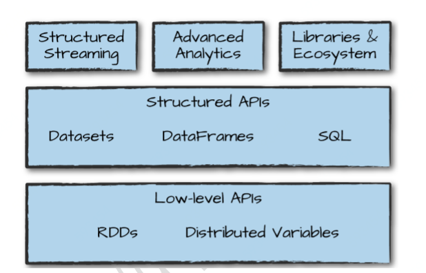

# 第三章 Spark工具集介绍

第二章介绍了Spark的核心概念，包括Spark结构化API的transformation和action操作。这些简单的概念是学习Apache Spark生态系统中众多工具库的基础，如图3-1所示，Spark除了提供这些低级API和结构化API，还包括一系列标准库来提供额外的功能。



​															**图3-1 Spark APi与标准类库**

Spark库支持各种不同的任务，包括图分析、机器学习、流处理，以及提供于其他计算系统和存储系统进行集成的能力等。本章介绍了Spark所提供的大部分功能，主要包括以下内容: 

- 使用Spark-submit运行应用程序
- Dataset：类型安全的结构化数据API
- 结构化流处理
- 机器学习与高级分析
- 弹性分布式数据集(RDD)：Spark的低级API
- SparkR
- 第三方软件包生态系统

## 3.1 运行生产应用程序

Spark简化了开发和构建大数据处理程序的过程，Spark还可以通过内置的命令行工具spark-submit轻松地将测试级别的交互式程序转化为生产级别的应用程序。Spark-submit将应用程序代码发送到集群并启动执行，应用程序将一致运行，直到它退出(完成任务)或遇到错误。程序可以在Spark所有支持集群管理器(standalone、Mesos和yarn)下运行。 

spark-submit提供了几个控制项，可以指定应用程序需要的资源，以及应用程序的运行方式和运行参数等。

可以使用Spark支持的任何语言中编写应用程序，然后提交执行。最简单的示例是在本地机器上运行应用程序：

```sh
./bin/spark-submit \
  --class org.apache.spark.examples.SparkPi \
  --master local \
  ./examples/jars/spark-examples_2.11-2.2.0.jar 10
```

--class指定要运行的JAR包和启动类

运行Python：

```sh
./bin/spark-submit \
  --master local \
  ./examples/src/main/python/pi.py 10
```

通过更改Spark-submit的master参数，可以将应用程序提交到Spark的standalone集群资源管理器、Mesos或Yarn。

## 3.2 Dataset：类型安全的结构化API

Datesets是Spark结构化API的类型安全版本。用于在Java和Scala中编写静态类型的代码。Dataset API在Python和R中不可用，因为这些语言是动态类型的。

前一章节好的DataFrame是一个分布式的类型为Row的对象集合，它可以存储多种类型的表格数据。Dataset API让用户可以用Java/Scala类定义DataFrame中的每条记录，并将其作为类型对象的集合来操作，类似于Java ArrayList或Scala Seq。Dataset中可用API是类型安全的，这意味着Dataset中的对象不会被视为与出事定义的类不同的另一个类。这使得Dataset在编写大型应用程序时尤其有效。这样的话多个软件工程师可以通过协商好的接口进行交互。

Dataset类通过内部包含的对象类型进行参数化，如Java中的`Dataset<T>`和Scala中的`Dataset[T]`将仅包含T类的对象。从类型需要Spark 2.0开始，受支持的类型遵循Jva的Bean模式，或是Scala的case类。之所以这些类型需要受到限制，是因为Spark要能够自动分析类型T，并未Dataset中的表格数据创建适当的模式。

Dataset另一优点是：只有在需要或想要时才能使用它们。例如，在下面的示例中，将定义自己的数据类型，并通过任意map和filter函数对其进行操作。在完成操作之后，Spark可以自动地将它转换为DataFrame，并且可以通过使用Spark包含的数百个函数来进一步操作它。这使得它很容易下降到较低的级别，在必要时执行类型安全编码；也可以升级到更高级的SQL进行更快速的分析。下面是一个小示例，演示如何使用类型安全函数和DataFrame类SQL表达式来快速编写业务逻辑：

```scala
case class Flight(DEST_COUNTRY_NAME: String,
                  ORIGIN_COUNTRY_NAME: String,
                  count: BigInt)
val flightsDF = spark.read
  .parquet("/data/flight-data/parquet/2010-summary.parquet/")
val flights = flightsDF.as[Flight]
```

最后一个优点是，当在Dataset上调用collect或take时，它将会手机Dataset中合适类型的对象，而不是DataFrame的Row对象。这样很容易地保证类型安全，并以分布式和本地方式安全地执行操作，而无需更改代码：

```scala
flights
  .filter(flight_row => flight_row.ORIGIN_COUNTRY_NAME != "Canada")
  .map(flight_row => flight_row)
  .take(5)

flights
  .take(5)
  .filter(flight_row => flight_row.ORIGIN_COUNTRY_NAME != "Canada")
  .map(fr => Flight(fr.DEST_COUNTRY_NAME, fr.ORIGIN_COUNTRY_NAME, fr.count + 5))
```

## 3.3 Structured Streaming

Structured Streaming是用于流处理的高级API，适用于Spark 2.2之后的版本。可以像在批处理模式下一样，使用Spark的结构化API执行结构化流处理，并以流式方式运行它们，使用结构化流处理可以减少延迟并允许增量处理。最重要的是，它可以让你快速地从流式系统中提取有价值的信息，而几乎不需要更改代码。可以按照传统批处理作业的模式进行设计，然后将其转换为流式作业，即增量处理数据。

看一个简单的例子，说明开始使用结构化流是多么容易。将使用一个零售数据集(https://github.com/databricks/Spark-The-Definitive-Guide/tree/master/data/retail-data)，该数据集有特定的日期和时间供我们使用。将使用按天分组的文件，其中一个文件表示一天的数据。

首先将它放在这种格式中，以模拟不同进程以一致和规则的方式生成的数据，并发送到一个位置，在那里使用Structured Streaming作业将读取这些数据。

```csv
InvoiceNo,StockCode,Description,Quantity,InvoiceDate,UnitPrice,CustomerID,Country
536365,85123A,WHITE HANGING HEART T-LIGHT HOLDER,6,2010-12-01 08:26:00,2.55,17...
536365,71053,WHITE METAL LANTERN,6,2010-12-01 08:26:00,3.39,17850.0,United Kin...
536365,84406B,CREAM CUPID HEARTS COAT HANGER,8,2010-12-01 08:26:00,2.75,17850...
```

首先按照静态数据集的处理方法来进行分析，并创建一个DataFrame来执行此操作，还将从这个静态数据集创建一个Schema模式。

**Scala实现**

```scala
val staticDataFrame = spark.read.format("csv")
  .option("header", "true")
  .option("inferSchema", "true")
  .load("/data/retail-data/by-day/*.csv")

staticDataFrame.createOrReplaceTempView("retail_data")
val staticSchema = staticDataFrame.schema
```

**Python实现**

```python
staticDataFrame = spark.read.format("csv")\
  .option("header", "true")\
  .option("inferSchema", "true")\
  .load("/data/retail-data/by-day/*.csv")

staticDataFrame.createOrReplaceTempView("retail_data")
staticSchema = staticDataFrame.schema
```

由于使用的是时间序列数据，所以在此之前需要强调如何对数据进行分组和聚合操作。在本例中，将查看给定客户(CustomerId)进行大量采购的时间。例如，添加一个total cost列，看看客户花费最多的那个日期。

`window()`函数理日期和时间戳的有用工具，包含聚合中每天的所有数据。是数据中时间序列的一个窗口。代码示例如下：

**Scala**

```scala
import org.apache.spark.sql.functions.{window, column, desc, col}
staticDataFrame
  .selectExpr(
    "CustomerId",
    "(UnitPrice * Quantity) as total_cost",
    "InvoiceDate")
  .groupBy(
    col("CustomerId"), window(col("InvoiceDate"), "1 day"))
  .sum("total_cost")
  .show(5)
```

**Python**

```python
from pyspark.sql.functions import window, column, desc, col
staticDataFrame\
  .selectExpr(
    "CustomerId",
    "(UnitPrice * Quantity) as total_cost",
    "InvoiceDate")\
  .groupBy(
    col("CustomerId"), window(col("InvoiceDate"), "1 day"))\
  .sum("total_cost")\
  .show(5)
```

输出结果如下：

```
+----------+--------------------+------------------+
|CustomerId|              window|   sum(total_cost)|
+----------+--------------------+------------------+
|   17450.0|[2011-09-20 00:00...|          71601.44|
...
|      null|[2011-12-08 00:00...|31975.590000000007|
+----------+--------------------+------------------+
```

流式处理代码与批处理代码实际上几乎没有什么变化。最大的变化是使用readStream而不是read，另外maxFilesPerTrigger选项，指定应该一次读入的文件数。这是为了更好演示数据流，在生产场景中，这可能会被忽略。

**Scala**

```scala
val streamingDataFrame = spark.readStream
    .schema(staticSchema)
    .option("maxFilesPerTrigger", 1)
    .format("csv")
    .option("header", "true")
    .load("/data/retail-data/by-day/*.csv")
```

**Python**

```python
streamingDataFrame = spark.readStream
    .schema(staticSchema)
    .option("maxFilesPerTrigger", 1)
    .format("csv")
    .option("header", "true")
    .load("/data/retail-data/by-day/*.csv")
```

对流数据执行与之前对静态DataFrame一样的业务逻辑(按照时间窗口统计花费)，流式数据的批处理逻辑：

**scala**

```scala
val purchaseByCustomerPerHour = streamingDataFrame
  .selectExpr(
    "CustomerId",
    "(UnitPrice * Quantity) as total_cost",
    "InvoiceDate")
  .groupBy(
    $"CustomerId", window($"InvoiceDate", "1 day"))
  .sum("total_cost")
```

**Python**

```python
purchaseByCustomerPerHour = streamingDataFrame\
  .selectExpr(
    "CustomerId",
    "(UnitPrice * Quantity) as total_cost",
    "InvoiceDate")\
  .groupBy(
    col("CustomerId"), window(col("InvoiceDate"), "1 day"))\
  .sum("total_cost")
```

这仍然是一个惰性操作，因此需要调用流操作来开始执行此数据流。

流式处理与批处理的action操作有所不同，因为首先要将流数据缓存到某个地方，而不是像对静态数据那样直接调用count函数(对流数据没有任何意义)。流数据将被缓存到一个内存上的数据表里。在每次被触发器触发后更新这个内存缓存。在这个例子中，之前设置的maxFilesPerTigger选项每次读完一个文件后都会被触发，Spark将基于新读入的文件更新内存数据表的内容，这样的话，聚合操作可以使用维护着历史数据中的最大值。

**Scala**

```scala
purchaseByCustomerPerHour.writeStream
    .format("memory") // memory代表将表存储内存
    .queryName("customer_purchases") //存入内存的表名
    .outputMode("complete") // complete表示保存表中所有记录
    .start()
```

**Python**

```python
# in Python
purchaseByCustomerPerHour.writeStream\
    .format("memory")\
    .queryName("customer_purchases")\
    .outputMode("complete")\
    .start()
```

当启动流处理时，可以运行查询来调试计算结构，查看我们的计算结果是否已经被写入结果接收器。

```
spark.sql("""
  SELECT *
  FROM customer_purchases
  ORDER BY `sum(total_cost)` DESC
  """)
  .show(5)
```

会注意到，输出表格的内容会随着读入更多的数据而发生实时变化。在处理完每个文件后，结果可能会根据 数据发生改变，也可能不会。因为要根据客户购买能力对客户进行分组。将处理结果输出到控制台：

```python
purchaseByCustomerPerHour.writeStream
    .format("console")
    .queryName("customer_purchases_2")
    .outputMode("complete")
    .start()
```

不应该在生产中使用这两种流式数据处理方法。注意这个时间窗口是基于事件事件的，而不是Spark处理数据的时间，在新的结构化流处理解决这个问题以前，这个是Spark缺点之一。

## 3.3 机器学习与高级数据分析

Spark的另一个流行方面是它能够使用一个内置的机器学习算法库MLlib来执行大规模的机器学习。MLlib允许对数据进行预处理、数据清洗、数据整理、模型训练和按比例进行预测。甚至可以使用在MLlib中训练的模型在结构化流中进行预测。Spark提供了一个复杂的机器学习API，用于执行各种机器学习任务，从分类到回归，从聚类到深度学习。本节中，将使用K-Means聚类算法进行一些演示。

**K-Means聚类算法**

𝘬-Means是一种聚类算法，其中K个中心在数据中随机分配。然后将最接近该点的点“指定”给类，并计算指定点的中心。这个中心点叫做质心。然后，标记离质心最近的点为该质心的类，并将质心移到该点簇的新中心。在有限的迭代集重复这个过程，或者直到收敛（中心点停止改变）。

MLlib中的机器学习算法要求将数据表示为数值。当前的数据由各种不同的类型表示，包括时间戳、整数和字符串。因此需要把这些数据转换成一些数值表示。在本例中，将使用几个DataFrames transofrmtion来操作日期数据：

```python
staticDataFrame.printSchema()

root
 |-- InvoiceNo: string (nullable = true)
 |-- StockCode: string (nullable = true)
 |-- Description: string (nullable = true)
 |-- Quantity: integer (nullable = true)
 |-- InvoiceDate: timestamp (nullable = true)
 |-- UnitPrice: double (nullable = true)
 |-- CustomerID: double (nullable = true)
 |-- Country: string (nullable = true)
```

**Scala**

```scala
import org.apache.spark.sql.functions.date_format
val preppedDataFrame = staticDataFrame
  .na.fill(0)
  .withColumn("day_of_week", date_format($"InvoiceDate", "EEEE"))
  .coalesce(5)
```

**Python**

```python
from pyspark.sql.functions import date_format, col
preppedDataFrame = staticDataFrame\
  .na.fill(0)\
  .withColumn("day_of_week", date_format(col("InvoiceDate"), "EEEE"))\
  .coalesce(5)
```

还需要将数据分为训练集和测试集。在本例中，将在某个购买发生的日期之前手动执行此操作；但是，也可以使用MLlib的 transformation api通过TrainValidationSplit或CrossValidator创建训练集和测试集（将在第六部分详细介绍）：

**Scala**

```scala
val trainDataFrame = preppedDataFrame.where("InvoiceDate < '2011-07-01'")
val testDataFrame = preppedDataFrame.where("InvoiceDate >= '2011-07-01'")
```

**Python**

```python
trainDataFrame = preppedDataFrame.where("InvoiceDate < '2011-07-01'")
testDataFrame = preppedDataFrame.where("InvoiceDate >= '2011-07-01'")
```

K-Means聚类的代码示例：

**Scala**

```scala
import org.apache.spark.ml.feature.OneHotEncoder
import org.apache.spark.ml.feature.StringIndexer
import org.apache.spark.ml.feature.VectorAssembler
import org.apache.spark.ml.Pipeline
import org.apache.spark.ml.clustering.KMeans


val encoder = new OneHotEncoder().setInputCol("day_of_week_index")
  .setOutputCol("day_of_week_encoded")

val vectorAssembler = new VectorAssembler()
  .setInputCols(Array("UnitPrice", "Quantity", "day_of_week_encoded"))
  .setOutputCol("features")

val transformationPipeline = new Pipeline()
  .setStages(Array(indexer, encoder, vectorAssembler))

val fittedPipeline = transformationPipeline.fit(trainDataFrame)

val transformedTraining = fittedPipeline.transform(trainDataFrame)

transformedTraining.cache()

val kmeans = new KMeans()
  .setK(20)
  .setSeed(1L)

val kmModel = kmeans.fit(transformedTraining)
kmModel.computeCost(transformedTraining)
val transformedTest = fittedPipeline.transform(testDataFrame)
kmModel.computeCost(transformedTest)
```

**Python**

```python
from pyspark.ml.feature import StringIndexer
from pyspark.ml.feature import OneHotEncoder
from pyspark.ml.feature import VectorAssembler
from pyspark.ml import Pipeline
from pyspark.ml.clustering import KMeans


indexer = StringIndexer().setInputCol("day_of_week").setOutputCol("day_of_week_index")

encoder = OneHotEncoder().setInputCol("day_of_week_index")
  .setOutputCol("day_of_week_encoded")

vectorAssembler = VectorAssembler().setInputCols(["UnitPrice", "Quantity", 		        "day_of_week_encoded"]).setOutputCol("features")

fittedPipeline = transformationPipeline.fit(trainDataFrame)
transformedTraining = fittedPipeline.transform(trainDataFrame)
kmModel = kmeans.fit(transformedTraining)
kmModel.computeCost(transformedTraining)
transformedTest = fittedPipeline.transform(testDataFrame)
kmModel.computeCost(transformedTest)
```

## 3.4 弹性数据集(RDD)：Spark的低级API

Spark包含许多低级API，允许通过弹性分布式数据集(RDD)对任意Java和Python对象进行操作。实际上，Spark中的所有内容都构建在RDD之上。DataFrame操作构建在RDD之上，并向下编译到这些较低级别的工具，以方便和非常高效的分布式执行。有时可能会使用RDD，特别是在读取或操作原始数据时，但是在大多数情况下，应该坚持使用结构化API。RDD的级别低于数据帧，因为它们向最终用户暴露物理执行特性(如分区)。

可能会使用RDD来并行化已经存储在驱动器机器内存中的原始数据。例如：并行化一些简单数字并创建一个DataFrame。可以将RDD转换为DataFrame

RDD在Scala和Python中都有。用户不应该为了执行许多任务而大量使用RDD，除非维护的是旧的Spark代码。新版Spark中处理一些非常原始的未处理和非结构化数据之外，应该使用RDD而不是结构化api。

## 3.5 Spark的生态系统和软件包

Spark最棒的部分之一是社区创建的包和工具生态系统。随着这些工具的成熟和广泛应用，其中一些工具甚至进入了核心Spark项目。数量超过300个或更多的软件包经常被添加。可以在Spark-Packages.org上找到Spark包的最大索引，在那里任何用户都可以发布到此包存储库。还有许多其他的项目和包可以找到，例如，在GitHub上。