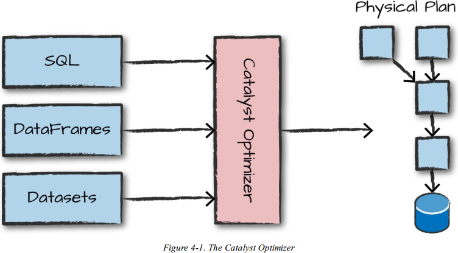

# 第四章 结构化API概述

本节深入探讨Spark结构化API，结构化API是一种处理各种数据的工具，从非结构化的日志文件到半结构化的 CSV文件和高度结构化的 Parquet 文件。这些 API引用了分布式收集 API的三种核心类型: 

- Datasets
- DataFrames
- SQL tables 和 views 

大多数结构化 api 都适用于批处理和流计算。在本章中，将介绍应该理解的基本概念: 

- 类型化和非类型化的 api(及其差异); 
- 核心术语是什么; 
- Spark 如何实际使用结构化 API 数据流并在集群上执行它。 

Spark 是一个分布式编程模型，用户可以在其中指定 transformation。多个 transformation 构建一个有向无环图(DAG)，一个action开始执行DAG过程，作为一个单一的Job作业，将它拆分为多个stages阶段和task任务，以便在整个集群中执行。transformation 和 actioin 操作的逻辑结构是 DataFrames 和 Dataset。

## 4.1 DataFrames和Dataset

DataFrame和Dataset是分布式的类似于表的集合，具有定义好的行和列。每个列必须具有与所有其他列相同的行数，可以使用null来指定缺失值，并且每个列都有类型信息，这些信息必须与集合中的每一行一致。DataFrame 和 Dataset代表着不可变的，延迟计算的计划，这些计划指定应用于驻留在某个位置的数据以生成一
些输出的操作。

表和视图基本上与 DataFrames 相同。只是针对表和视图执行 SQL，而不是 DataFrame代码。为了给DataFrame定义添加一些更具体的特性，需要定义分布式集合中存储的数据类型的方式—schema。

## 4.2 Schema

 schemas定义了 DataFrame 的列名和类型。可以手动定义 schemas模式或从数据源读取 schemas模式(通常称为读模式)。Schemas包含列类型，用于声明什么位置存储了什么类型的数据。 

## 4.3  Spark结构化 API中的类型概述 

Spark 实际上是它自己的编程语言。在内部，Spark 使用一种名为 Catalyst 的引擎，在计划和处理计算任务的过程中，维护自己的类型信息。在这样的过程中，打开了各种各样的执行优化，从而产生了显著的差异。Spark 类型直接映射到 Spark 维护的不同语言 API，在 Scala、Java、Python、SQL 和 R 中都存在一个查找表。。即使从Python或 R中使用 Spark 的结构化 API，我们的大多数操作都将严格地使用 Spark 类型，而不是Python 类型。例如，以下代码不会在 Scala 或 Python中执行加法;它实际上只是在 Spark中执行加法:

```python
df = spark.range(500).toDF("number") 
df.select(df["number"] + 10) 
```

这个加法操作之所以会发生，是因为Spark会将用输入语言编写的表达式转换为 Spark 的内部 Catalyst 表示相同类型的信息。然后它会对转换后的内部表示进行操作。 

### 4.3.1 对比DataFrames与Datasets

本质上，在结构化的 API中，还有两个 API：“untyped”DataFrames 和“typed”Datasets。说 DataFrames 是 untyped 的，这是不准确的；它们有类型，但是 Spark 完全维护它们，并且只检查这些类型是否与运行时模式中指定的类型一致；Datasets检查类型是否符合编译时的规范。Dataset 只适用于 Java 虚拟机(JVM)的语言(Scala 和 Java)，并且指定带有 case 类或 Java bean 的类型。 

对于 Spark(在 Scala，Java中)，DataFrames 只是 Row 类型的 Datasets。“Row”类型是 Spark 对其优化的数据格式的内部表示。这种格式可以进行高效的计算。因为不是使用 JVM 类型（这可能会有 GC 垃圾收集和对象实例化成本），Spark 操作自己的内部数据格式操作，不会产生这些成本。

### 4.3.2 Columns

columns表示一个简单的类型，如 integer 或 string，复杂类型，如 array 或 map，或null。Spark 将跟踪所有这些类型的信息，并提供多种方式对 columns进行转换。在第 5 章中广泛讨论了 columns，但是在大多数情况下，可以将 Spark Column 类型看作是表中的列。 

### 4.3.3 Rows

Row只是表示数据的一条记录。DataFrame 中的每条数据记录必须是Row 类型。可以从 SQL、弹性分布式数据集(RDDs)、数据源或手动创建这些 Rows。

```python
spark.range(2).collect() 
```

#### 4.3.4 Spark Types 

Spark 有大量的内部类型表示，对于不同的语言(Scala，Java，Python)Spark有与Spark 类型相匹配。

**Java**

| **Data type** | **Value type in Java**                                       | **API to access or create a data type**                      |
| :------------ | :----------------------------------------------------------- | :----------------------------------------------------------- |
| ByteType      | byte or Byte                                                 | DataTypes. ByteType                                          |
| ShortType     | short or Short                                               | DataTypes. ShortType                                         |
| IntegerType   | int or Integer                                               | DataTypes. IntegerType                                       |
| LongType      | long or Long                                                 | DataTypes. LongType                                          |
| FloatType     | float or Float                                               | DataTypes. FloatType                                         |
| DoubleType    | double or Double                                             | DataTypes. DoubleType                                        |
| DecinialType  | java .math.BigDecimal                                        | DataTypes.createDecinialType() DataTypes.createDecinialType(precision, scale). |
| StringType    | String                                                       | DataTypes. StringType                                        |
| BmaryType     | byte[]                                                       | DataTypes. BinaryType                                        |
| BooleanType   | boolean or Boolean                                           | DataTypes. BooleanType                                       |
| TimestampType | java. sqL Timestamp                                          | DataTypes.TimestampType                                      |
| DateType      | java.sqLDate                                                 | DataTypes. DateType                                          |
| ArrayType     | java.utiLList                                                | DataTypes.createArrayType(elementType). Note: The value of contamsNull will be true. DataTypes.createArrayType(elementType, contamsNull). |
| MapType       | java.util.Map                                                | DataTypes.createMapType(keyType, vahieType). Note: The value of valueContainsNull will be true. 注意：valueContainsNull的值将为true。 DataTypes.createMapType(keyType, vahieType, vahieContainsNull) |
| StructType    | org.apache.spark.sql.Row                                     | DataTypes.createStructType(fieIds). Note: fields is a List or an array of StructFields. Also, two fields with the same name are not alfowed. 注意：字段是StructField的列表或数组。同样，两个同名字段也不被允许。 |
| StructField   | The value type in Java of the data type of this field (for example, int for a StructField with the data type IntegerType) Java中此字段的数据类型的值类型（例如，数据类型为IntegerType的StructField的int） | DataTypes.createStructField(name, dataType, nullable)        |

**Python**

| **Data type** | **Value type in Python**                                     | **API to access or create a data type**                      |
| :------------ | :----------------------------------------------------------- | :----------------------------------------------------------- |
| ByteType      | int or long. Note: Numbers will be converted to 1-byte signed integer numbers at runtime. Ensure that numbers are within the range of-128 to 127. int或long。注意：数字将在运行时转换为1字节有符号整数。确保数字在-128到127的范围内。 | ByteType()                                                   |
| ShortType     | int or long. Note: Numbers will be converted to 2-byte signed integer numbers at runtime. Ensure that numbers are within the range of-32768 to 32767. int或long。注意：数字将在运行时转换为2字节有符号整数。确保数字在-32768到32767的范围内。 | ShortType()                                                  |
| IntegerType   | int or long. Note: Python has a lenient definition of “integer.” Numbers that are too large will be rejected by Spark SQL if you use the `IntegerType()`. It’s best practice to use LongType. int或long。注意：Python的宽泛定义是“整数”。如果您使用`IntegerType()`，则太大的数字将被Spark SQL拒绝。最佳做法是使用LongType。 | Integerlype()                                                |
| LongType      | long. Note: Numbers will be converted to 8-byte signed integer numbers at runtime. Ensure that numbers are within the range of-9223372036854775808 to 9223372036854775807. Otherwise, convert data to decimaLDecimal and use DecimaFlype. long。注意：数字将在运行时转换为8字节有符号整数。确保数字在-9223372036854775808到9223372036854775807之间。否则，将数据转换为decimaLDecimal并使用DecimaFlype。 | Longlype()                                                   |
| FloatType     | float. Note: Numbers will be converted to 4-byte single-precision floating-point numbers at runtime. float。注意：数字将在运行时转换为4字节单精度浮点数。 | FloatType()                                                  |
| DoubleType    | float                                                        | DoubleType()                                                 |
| DecimalType   | decimalDecimal                                               | DecimalTypeO                                                 |
| StringType    | string                                                       | StringType()                                                 |
| BinaryType    | bytearray                                                    | BinaryType()                                                 |
| BooleanType   | bool                                                         | BooleanType()                                                |
| llmestamplype | datetime.datetime                                            | TlmestampTypeO                                               |
| DateType      | datetime.date                                                | DateType()                                                   |
| ArrayType     | list, tuple, or array                                        | ArrayType(elementType, [containsNull]). Note: The default value of containsNull is True. 注意：containsNull的默认值为True。 |
| MapType       | diet                                                         | MapType(keyType, valueType, [valueContainsNull]). Note: The default value of valueContainsNull is True. 注意：valueContainsNull的默认值为True。 |
| Structlype    | list or tuple                                                | StructType(fields). Note: fields is a list of StructFields. Also, fields with the same name are not allowed. 注意：字段是StructFields的列表。同样，不允许使用具有相同名称的字段。 |
| StructField   | The value type in Python of the data type of this field (for example, Int for a StructField with the data type IntegerType) | StructField(name, datalype, [nullable]) Note: The defaul value of nullable is True. 注意：nullable的默认值为True。 |

**Scala**

| **Data type** | **Value type in Scala**                                      | **API to access or create a data type**                      |
| :------------ | :----------------------------------------------------------- | :----------------------------------------------------------- |
| ByteType      | Byte                                                         | ByteType                                                     |
| ShortType     | Short                                                        | ShortType                                                    |
| IntegerType   | Int                                                          | IntegerType                                                  |
| LongType      | Long                                                         | LongType                                                     |
| FloatType     | Float                                                        | FloatType                                                    |
| DoubleType    | Double                                                       | DoubleType                                                   |
| DecimalType   | java.math.BigDecimal                                         | DecimalType                                                  |
| StringType    | String                                                       | StringType                                                   |
| BinaryType    | Array[Byte]                                                  | BinaryType                                                   |
| BooleanType   | Boolean                                                      | BooleanType                                                  |
| TimestampType | java.sql.Timestamp                                           | TimestampType                                                |
| DateType      | java.sql.Date                                                | DateType                                                     |
| ArrayType     | scala.collection.Seq                                         | ArrayType(elementType, [containsNull]). Note: The default value of containsNull is true. 注意：containsNull的默认值为true。 |
| MapType       | scala.collection.Map                                         | MapType(keyType, valueType, [valueContainsNull]). Note: The default value of valueContainsNull is true. 注意：valueContainsNull的默认值为true。 |
| StructType    | org.apache.spark.sql.Row                                     | StructType(fields). Note: fields is an Array of StructFields. Also, fields with the same name are not allowed. 注意：字段是StructFields的数组。同样，不允许使用具有相同名称的字段。 |
| StructField   | The value type in Scala of the data type of this field (for example, Int for a StructField with the data type IntegerType) Scala中此字段的数据类型的值类型（例如，对于数据类型为IntegerType的StructField为Int） | StructField(name, dataType, [nullable]). Note: The default value of nullable is true. 注意：nullable的默认值为true。 |

## 4.4 结构化API执行过程概述

本节将演示代码是如何跨集群执行的。这将帮助了解(和调试)编写代码和集群上执行代码的过程，因此，执行一个结构化的 API 查询，了解从用户代码到执行代码的转换过程。以下是这些步骤的概述: 

1. 写DataFrames/Dataset/SQL代码；
2. 如果是有效的代码，即代码没有编译错误，Spark 将其转换为逻辑计划；
3.  Spark 将此逻辑计划转换为物理计划，同时进行代码优化
4. Spark 然后在集群上执行这个物理计划(基于 RDD 操作)。 



要执行代码，必须编写代码。然后，将代码提交给 Spark 集群运行。然后，该代码通
过 Catalyst 优化器，它决定如何执行代码，并给出一个计划，最后，代码运行，结果返回
给用户。 

### 4.4.1 逻辑计划(Logical Plan)

执行的第一个阶段是将用户代码转换成一个逻辑计划。图4-2 说明了这个过程。 


​										**图4-2 Spark逻辑执行计划**

这个逻辑计划只代表一组抽象的转换，不涉及Executors执行器或Driver驱动程序，它纯
粹是将用户的表达式转换成最优的版本：

（1）用户代码转换成 unresolved logical plan(未解决的逻辑计划)，因为代码中可能会有不存在的表名、列名；

（2）使用catalog(所有表和DataFrames信息的存储库)来resolve(解析)analyzer(分析器中)的列和表.。如果 catalog 中不存在所需的表或列名， analyzer(分析器 )会拒绝
unresolved logical plan(未解决的逻辑计划)。反之，成为 resolved logical plan(解决的逻辑计划)交付给 Catalyst Optimizer 进行优化。

（3）Catalyst Optimizer是一组规则的集合，用于优化逻辑计划，优化方式有：谓词下推(pushing down predicates)、投影(selections)等。

### 4.4.2 物理计划(Physical Plan)

在成功创建优化的逻辑计划后，Spark就开始讲逻辑计划转换为物理计划。spark会尝试生成多个不同的物理计划，然后通过一个代价模型（cost model）来比较开销成本，从中选出最优的一个物理计划在集群上运行。如图 4-3 所示，成本比较的一个例子是：通过查看给定表的物理属性(表大小或其分区大小)。


​												**图4-3 物理执行计划**

物理规划的结果是一系列的RDDs和Transformation。这个结果说明了为什么有时将 Spark 成为编译器——它接受 DataFrames、dataset 和 SQL 的查询，并将它们编译成 RDD 转换。 

### 4.4.3 执行

选择了物理计划后，Spark将在RDD（Spark的较底层编程接口）上运行所有这些代码。Spark在运行时执行进一步的优化，生成本地Java字节码，可以在执行过程中删除整个任务或阶段。最后，结果返回给用户。

