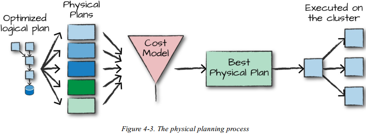

[TOC]

# 第四章 结构化API概述

本节深入探讨Spark结构化API，结构化API是一种处理各种数据类型的工具，从非结构化的日志文件到半结构化的 CSV文件以及高度结构化的Parquet文件。结构化API指以下三种核心分布式集合类型的API： 

- Datasets
- DataFrames，注意：在Spark 2.X版本中Java移除了DataFrame API，统一使用Dataset
- SQL tables 和 views 

大多数结构化API都适用于批处理和流计算。在本章中，将介绍应该理解的基本概念：

- 类型化和非类型化的API及其差异
- 核心术语 
- Spark如何将结构化API数据流实际应用到集群上并执行它

------

先回顾下第一部分中介绍的基本概念和定义。Spark是一个分布式编程模型，用户可以在其中指定 转换操作。多个转换构成一个有向无环图(DAG)。指令图的执行过程作为一个作业由一个动作操作触发，在执行过程中一个作业被分解为多个阶段和任务在集群上执行。转换操作和动作操作的逻辑结构是DataFrame和Dataset，创建一个新的DataFrame/Dataset需要调用一个转换操作。

**QA**

Q：为什么Spark RDD、DataFrame、Dataset不可变？

A：传统关系型数据库往往采用日志记录的方式来容灾容错，数据恢复都依赖于重新执行日志。Hadoop为了避免单机故障概率较高的问题，通过将数据备份到其它机器容灾。由于所有备份机器同时出故障的概率比单机故障概率低很多，从而在发生宕机等问题时，从备份机读取数据。RDD本身是一个不可变的数据集，当某个Worker节点上的Task失败时，可以利用DAG重新调度计算这些失败的Task。

## 4.1 DataFrame类型和Dataset类型

DataFrame和Dataset是具有行和列的类似于(分布式)数据表的集合类型，所有列的行数相同(可以使用null来指定缺省值)。每一列的所有行都必须保持一致的数据类型。Spark中的DataFrame和Dateset代表不可变的数据集合，可以通过它制定对特定位置数据操作。该操作以 惰性评估方式执行。当对DataFrame执行动作操作时，将触发Spark执行具体转换操作并返回结果，这些代表了如何操作执行和列计算出用户期望结果的执行计划。

------

表和视图基本上与 DataFrames 相同。所以通常在DataFrame上执行SQL操作，而不是用DataFrame专用的执行代码。

------

为了使这些定义更具体，需要先讨论下Schema数据模式，Schema数据模式定义了该分布式集合中存储的数据类型。

## 4.2 Schema

 Schema定义了DataFrame的列名和类型。可以手动定义 schemas模式或从数据源读取 schemas模式(通常称为模式读取)。Schema数据模式需要指定数据类型，这意味着需要指定在什么地方放置什么类型数据。 

## 4.3  结构化Spark类型概述

Spark 实际上是它自己的编程语言。Spark内部使用一种名为Catalyst的引擎，在计划和处理计算任务的过程中，维护自己的类型信息。这样就会带来很大的优化空间，能够显著提高性能。Spark类型直接映射到不同语言的API，并且针对Scala，Java，Python，SQL和R语言，都有一个对应的API查找表。即使通过Python或R语言来使用Spark结构化API，大多数情况也是操作Spark类型而非Python类型。例如：以下代码不会在Scala或Python中执行加法，而实际上完全是在Spark中执行加法：

```python
df = spark.range(500).toDF("number") 
df.select(df["number"] + 10) 
```

这样执行加法操作是因为Spark会将用输入语言编写的表达式转换为代表相同功能的Spark内部Catalyst表示。然后，它将根据该内部表示进行操作。

### 4.3.1 DataFrame与Dataset比较

本质上，结构化API包含两类API，即非类型化的DataFrame和类型化的Dataset。说DataFrame是无类型的可能不太准确，因为它们其实是由类型的，只是Spark完全负责维护它们的类型，仅在运行时检查这些类型是否与Schema中指定的类型一致。与之相对应的，Dataset在编译时就会检查类型是否符合规范。Dataset仅适用于基于Java虚拟机(JVM)的语言(比如Scala和Java)，并通过case类或Java bean指定类型。

在大多数情况下，会使用DataFrame。在Scala版本的Spark总，DataFrame是Row类型的Dataset集合。Row类型是Spark用于支持内存计算而优化的数据格式。这种格式有利于高效计算，因为它会避免使用会带来昂贵垃圾回收开销和对象实例化开销的JVM类型，而是基于自己的内部格式运行，所以并不会产生这种开销。Python版本和R语言版本的Spark并不支持Dataset，所有东西都是DataFrame。

充分理解DataFrame、Spark类型和Schema模式是需要一些时间的，需要强调的是，当使用DataFrame时，会大大受益于这种优化过的Spark内部格式，这种格式对所有Spark支持的语言API都具有相同的效率增益。

### 4.3.2 Column

columns表示一个简单的类型，如 integer 或 string，复杂类型，如 array 或 map，或null。Spark 将跟踪所有这些类型的信息，并提供多种方式对 columns进行转换。在第 5 章中广泛讨论了 columns，但是在大多数情况下，可以将 Spark Column 类型看作是表中的列。 

### 4.3.3 Row

一行对应一个数据记录，DataFrame中的每条记录都必须是Row类型。可以通过SQL手动创建、或者是从弹性分布式数据集RDD提取，或从数据源手动创建这些行。下面示例使用范围函数range()创建一个Row对象：

```python
spark.range(2).collect() 
```

#### 4.3.4 Spark Types

Spark有大量的内部类型表示，下表展示了各种语言中的数据类型与Spark数据类型的对应关系。

**Java**

| **Data type** | **Value type in Java**                                       | 获取创建数据类型的API                                        |
| :------------ | :----------------------------------------------------------- | :----------------------------------------------------------- |
| ByteType      | byte or Byte                                                 | DataTypes. ByteType                                          |
| ShortType     | short or Short                                               | DataTypes. ShortType                                         |
| IntegerType   | int or Integer                                               | DataTypes. IntegerType                                       |
| LongType      | long or Long                                                 | DataTypes. LongType                                          |
| FloatType     | float or Float                                               | DataTypes. FloatType                                         |
| DoubleType    | double or Double                                             | DataTypes. DoubleType                                        |
| DecinialType  | java .math.BigDecimal                                        | DataTypes.createDecinialType() DataTypes.createDecinialType(precision, scale). |
| StringType    | String                                                       | DataTypes. StringType                                        |
| BmaryType     | byte[]                                                       | DataTypes. BinaryType                                        |
| BooleanType   | boolean or Boolean                                           | DataTypes. BooleanType                                       |
| TimestampType | java. sqL Timestamp                                          | DataTypes.TimestampType                                      |
| DateType      | java.sqLDate                                                 | DataTypes. DateType                                          |
| ArrayType     | java.utiLList                                                | DataTypes.createArrayType(elementType). Note: The value of contamsNull will be true. DataTypes.createArrayType(elementType, contamsNull). |
| MapType       | java.util.Map                                                | DataTypes.createMapType(keyType, vahieType)注意：valueContainsNull的值将为true。 DataTypes.createMapType(keyType, vahieType, vahieContainsNull) |
| StructType    | org.apache.spark.sql.Row                                     | DataTypes.createStructType(fieIds)注意：字段是StructField的列表或数组。同样，两个同名字段也不被允许。 |
| StructField   | The value type in Java of the data type of this field (for example, int for a StructField with the data type IntegerType) Java中此字段的数据类型的值类型（例如，数据类型为IntegerType的StructField的int） | DataTypes.createStructField(name, dataType, nullable)        |

**Python**

| **Data type** | **Value type in Python**                                     | 获取创建数据类型的API                                        |
| :------------ | :----------------------------------------------------------- | :----------------------------------------------------------- |
| ByteType      | int或long。注意：数字将在运行时转换为1字节有符号整数。确保数字在-128到127的范围内。 | ByteType()                                                   |
| ShortType     | int or long。注意：数字将在运行时转换为2字节有符号整数。确保数字在-32768到32767的范围内。 | ShortType()                                                  |
| IntegerType   | int or long. 注意：Python的宽泛定义是“整数”。如果您使用`IntegerType()`，则太大的数字将被Spark SQL拒绝。最佳做法是使用LongType。 | Integerlype()                                                |
| LongType      | Long 注意：数字将在运行时转换为8字节有符号整数。确保数字在-9223372036854775808到9223372036854775807之间。否则，将数据转换为decimaLDecimal并使用DecimaFlype。 | Longlype()                                                   |
| FloatType     | float. Note: Numbers will be converted to 4-byte single-precision floating-point numbers at runtime. float。注意：数字将在运行时转换为4字节单精度浮点数。 | FloatType()                                                  |
| DoubleType    | float                                                        | DoubleType()                                                 |
| DecimalType   | decimalDecimal                                               | DecimalTypeO                                                 |
| StringType    | string                                                       | StringType()                                                 |
| BinaryType    | bytearray                                                    | BinaryType()                                                 |
| BooleanType   | bool                                                         | BooleanType()                                                |
| llmestamplype | datetime.datetime                                            | TlmestampTypeO                                               |
| DateType      | datetime.date                                                | DateType()                                                   |
| ArrayType     | list, tuple, or array                                        | ArrayType(elementType, [containsNull]) 注意：containsNull的默认值为True。 |
| MapType       | diet                                                         | MapType(keyType, valueType, [valueContainsNull])注意：valueContainsNull的默认值为True。 |
| Structlype    | list or tuple                                                | StructType(fields)注意：字段是StructFields的列表。同样，不允许使用具有相同名称的字段。 |
| StructField   | The value type in Python of the data type of this field (for example, Int for a StructField with the data type IntegerType) | StructField(name, datalype, [nullable]) 注意：nullable的默认值为True。 |

**Scala**

| **Data type** | **Value type in Scala**                                      | **API to access or create a data type**                      |
| :------------ | :----------------------------------------------------------- | :----------------------------------------------------------- |
| ByteType      | Byte                                                         | ByteType                                                     |
| ShortType     | Short                                                        | ShortType                                                    |
| IntegerType   | Int                                                          | IntegerType                                                  |
| LongType      | Long                                                         | LongType                                                     |
| FloatType     | Float                                                        | FloatType                                                    |
| DoubleType    | Double                                                       | DoubleType                                                   |
| DecimalType   | java.math.BigDecimal                                         | DecimalType                                                  |
| StringType    | String                                                       | StringType                                                   |
| BinaryType    | Array[Byte]                                                  | BinaryType                                                   |
| BooleanType   | Boolean                                                      | BooleanType                                                  |
| TimestampType | java.sql.Timestamp                                           | TimestampType                                                |
| DateType      | java.sql.Date                                                | DateType                                                     |
| ArrayType     | scala.collection.Seq                                         | ArrayType(elementType, [containsNull])注意：containsNull的默认值为true。 |
| MapType       | scala.collection.Map                                         | MapType(keyType, valueType, [valueContainsNull]).注意：valueContainsNull的默认值为true。 |
| StructType    | org.apache.spark.sql.Row                                     | StructType(fields).注意：字段是StructFields的数组。同样，不允许使用具有相同名称的字段。 |
| StructField   | Scala中此字段的数据类型的值类型（例如，对于数据类型为IntegerType的StructField为Int） | StructField(name, dataType, [nullable]).注意：nullable的默认值为true。 |

通过以下方法可以使用Spark类型：

```scala
// scala
import org.apache.spark.sql.types_

val b = ByteType
```

```java
//java
import org.apache.spark.sql.types.DataTypes

Bytetype x = DataTypes.DataType
```

```python
# python
from pyspark.sql.types import *

b = ByteType()
```

## 4.4 结构化API执行过程概述

本节将演示代码是如何在集群上执行的。这对理解编写代码过程和在集群上执行代码过程都很有帮助，也有助于后期的调试，接下来针对一个结构化API查询任务，逐步分析从用户代码到执行代码的过程，步骤如下：

1. 编写DataFrame/Dataset/SQL代码
2. 如果代码能有效执行，Spark将其转换为一个逻辑执行计划(Logical Plan)
3.  Spark将此逻辑执行计划转换为一个物理执行计划(Physical Plan)，检查可行的优化策略，并在此过程中检查优化
4. Spark在集群上执行该物理执行计划(RDD操作) 

编写的代码通过控制台或Spark作业形式提交给Spark，然后代码将交由Catalyst优化器决定如何执行，并制定一个执行计划，最后代码被运行，得到的结果返回给用户。图4-1展示了整个过程。


### 4.4.1 逻辑计划(Logical Plan)

执行的第一个阶段旨在获取用户代码并将其转换成逻辑计划。图4-2 说明了这个过程。 


​										**图4-2 Spark逻辑执行计划**

这个逻辑计划只代表一组抽象的转换，不涉及Executors执行器或Driver驱动程序，它纯
粹是将用户的表达式转换成最优的版本：

（1）用户代码转换成 unresolved logical plan(未解析的逻辑计划)，这一计划没有解析，因为代码中可能会有不存在的表名、列名；

（2）Spark使用catalog(所有表和DataFrames信息的存储库)在分析器中解析列和表格，如果目录中不存在所需要的表和列名称，分析器可能会拒绝该未解析的逻辑执行计划，如果分析器可以细节，则将通过Catalyst优化器

（3）Catalyst Optimizer是一组规则的集合，用于优化逻辑计划，优化方式有：谓词下推(pushing down predicates)、投影(selections)等。

### 4.4.2 物理计划(Physical Plan)

在成功创建优化的逻辑计划后，Spark就开始讲逻辑计划转换为物理计划(通常称为Spark计划)。spark会尝试生成多个不同的物理执行策略，然后通过代价模型(cost model)进行比较分析，从而制定如何在集群上执行逻辑计划。如具体流程图 4-3 所示。例如执行一个连接操作就会涉及代价比较，它通过分析数据表的物理属性(表的大小或分区大小)，对不同的物理执行策略进行代价比较，选择合适的物理执行计划。




​												**图4-3 物理执行计划**

物理规划的结果是一系列的RDD和转换操作。这个就是Spark被称为编译器的原因，因为它将对DataFrame、Dataset和SQL中的查询操作为用户编译一系列RDD和转换操作。 

### 4.4.3 执行

在选择一个物理计划时，Spark将所有代码运行在Spark底层编程接口RDD上。Spark在运行时会执行进一步优化，生成可以在执行期间优化任务或阶段的本地Java字节码，最终将结果返回给用户。

## 4.5 小结

在本章中，介绍了Spark结构化API以及Spark如何将代码转换为集群上物理执行的代码。接下来的章节中，将介绍一些核心概念以及如何使用结构化API的关键功能。