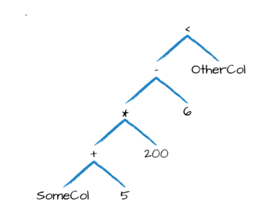

# 第五章 基本结构的操作

在第四章中，介绍了结构化API的核心抽象， 本章从体系结构概念转向使用战术工具，将使用这些工具来操纵DataFrame及其中的数据。 本章专门介绍DataFrame除聚合，窗口函数和连接(在后续章节介绍)的基本操作。从定义上讲，DataFrame由一系列记录（如表中的行）组成，这些记录的类型为Row，以及许多列（如电子表格中的列），模式定义每列中的名称和数据类型。 DataFrame的分区定义了整个集群中DataFrame或Dataset物理分布的布局。 分区方案定义了如何分配。

创建一个DataFrame：

**Scala**

```scala
val df = spark.read.format("json").load("/data/flight-data/json/2015-summary.json")
```

**Python**

```python
df = spark.read.format("json").load("/data/flight-data/json/2015-summary.json")
```

DataFame将具有列，并使用一种模式来定义它们，看一下当前DataFrame上的模式：

```
df.printSchema()
```

## 5.1 Schemas模式

Schemas模式定义了DataFrame的列名和类型。可以让数据源定义模式（称为读取时的模式schema-on-read），也可以自己显示定义。

在读取数据前，根据数据使用场景决定是否需要定义Schema。对于临时分析，读取时模式(schema-on-read)通常效果很好(尽管有时使用CSV或JSON等纯文本文件格式可能会有点慢)。但是，这也可能导致精度问题，例如在读取文件时将long类型错误地设置为整数。当使用Spark进行生产ETL时，自定义Schema比较好，尤其是在使用CSV和JSON等无类型数据源时，因为模式推断会根据所读取的数据类型的不同而有所不同。

从第4章中看到的简单文件开始，让以行分隔JSON的半结构化性质定义结构。这是来自美国运输局统计数据的航班数据：

**Scala**

```scala
spark.read.format("json").load("/data/flight-data/json/2015-summary.json").schema

Scala returns the following:
org.apache.spark.sql.types.StructType = ...
StructType(StructField(DEST_COUNTRY_NAME,StringType,true),
StructField(ORIGIN_COUNTRY_NAME,StringType,true),
StructField(count,LongType,true))
```

**Python**

```python
spark.read.format("json").load("/data/flight-data/json/2015-summary.json").schema

Python returns the following:
StructType(List(StructField(DEST_COUNTRY_NAME,StringType,true),
StructField(ORIGIN_COUNTRY_NAME,StringType,true),
StructField(count,LongType,true)))
```

模式是一种 `StructType`，由多个`StructField`字段组成，`StructField`具有名称、类型、布尔值标志，用于指定该列可以包含缺失值还是null值。最后，用户可以选择指定与该列关联的元数据 。 元数据是一种存储有关此列的信息的方式（Spark在其机器学习库中使用此信息）。

模式可以包含其他 `StructType`(Spark的复杂类型)。如果数据中的类型(在运行时)与模式不匹配，Spark将引发错误。下面的示例演示如何在DataFrame上创建特定的模式。

**Python**

```python
from pyspark.sql.types import StructField, StructType, StringType, LongType

myManualSchema = StructType([
StructField("DEST_COUNTRY_NAME", StringType(), True),
StructField("ORIGIN_COUNTRY_NAME", StringType(), True),
StructField("count", LongType(), False, metadata={"hello":"world"})
])
df = spark.read.format("json").schema(myManualSchema)\
.load("/data/flight-data/json/2015-summary.json")
```

**Scala**

```scala
import org.apache.spark.sql.types.{StructField, StructType, StringType, LongType}
import org.apache.spark.sql.types.Metadata

val myManualSchema = StructType(Array(
StructField("DEST_COUNTRY_NAME", StringType, true),
StructField("ORIGIN_COUNTRY_NAME", StringType, true),
StructField("count", LongType, false,
Metadata.fromJson("{"hello":"world"}"))
))

val df = spark.read.format("json").schema(myManualSchema).load("/data/flight-data/json/2015-summary.json")
```

正如第4章所讨论的，不能简单地通过每种语言类型设置类型，因为 Spark 维护了它自己的类型信息。现在讨论一下scheme 定义的内容：columns。 

## 5.2 列和表达式(Columns 和 Expressions) 

Spark中的列类似于电子表格中的列。可以从DataFrame 中选择列、操作列和删除列，这些操作称为
Expressions 表达式。

对于Spark而言，列是逻辑构造，仅表示通过表达式基于每个记录计算的值。这意味着，如果计算一列的值，需要有DataFrames的一行数据。不能在DataFrame上下文之外操作单个列；必须在DataFrame中使用Spark转换来修改列的内容。

**Scala**

```scala
import org.apache.spark.sql.functions.{col, column}

col("someColumnName")
column("someColumnName")

// 对于 Scala 语言而言，还可以使用$"myColumn"和'myColumn 这两种语法糖进行引用。
$"ename", $"job"
'ename, 'job
```

**Python**

```python
from pyspark.sql.functions import col, column

col("someColumnName")
column("someColumnName")
```

在这本书中将使用`col( )`函数。如前所述，这个列可能存在于DataFrames中，也可能不存在。在将列名称与 Catalog 中维护的列进行比较之前，列不会被解析，即列是 unresolved。

**显式列引用**

如果需要引用特定的DataFrame 的列，可以在特定的DataFrame上使用col方法。

### 5.2.1 表达式Expressions

上一节提到过，列是表达式，但表达式是什么? 表达式是在 DataFrame 中数据记录的一个或多个值上的一组转换。把它想象成一个函数，它将一个或多个列名作为输入，解析它们，然后潜在地应用更多的表达式，为数据集中的每个记录创建一个单一值。这个单一值可以是Map或Array之类的复杂类型。在最简单的情况下，通过expr函数创建的表达式仅是DataFrame列引用。在最简单的情况下，`expr("someCol")`等同于`col("someCol")`。

#### Columns as expressions 列作为表达式

列提供了表达式功能的子集。如果使用 `col()` 并想在该列上执行转换，那必须在该列引用上执行转换，使用表达式时，expr函数实际上解析字符串中的转换和列引用，并且可以将其传递到进一步转换中。举例：`expr("someCol - 5")`， `col("someCol") - 5` 与`expr("someCol") - 5` 是相同转换。

这是因为Spark将这些内容编译为指定操作顺序的逻辑树，有以下几个关键点：

- 列只是表达式
- 列和列的转换操作编译为与经过解析的表达式拥有相同的逻辑计划

举例说明：

```
(((col("someCol") + 5) * 200) - 6) < col("otherCol") 
```

图 5-1 展示一个逻辑树的整体概述。



这看起来很熟悉，因为它是一个有向无环图。此图等价于以下代码：

**Scala**

```scala
import org.apache.spark.sql.functions.expr
expr("(((someCol + 5) * 200) - 6) < otherCol")
```

**Python**

```python
from pyspark.sql.functions import expr
expr("(((someCol + 5) * 200) - 6) < otherCol")
```

#### Accessing a DataFrame’s columns 访问DataFrame的列

需要查看DataFrame的列，可以使用诸如`printSchema`之类的方法来完成；但是，如果要以编程方式访问列，则可以使用columns属性查看DataFrame上的所有列：

```
spark.read.format("json").load("/data/flight-data/json/2015-summary.json").columns
```

### 5.2 Records and Rows 记录和行

在Spark中，DataFrame中的每一行都是一条记录。Spark将此表示为Row类型的对象。Spark使用表达式操作Row对象，以产生可用的值。行对象在内部表示为字节数组，字节数组接口从未显示给用户，因为我们仅使用列表达式来操作它们。

当使用DataFrames时，将单个行返回给驱动程序的命令将始终返回一种或多种行类型。

### 5.2.1 Creating Rows 创建行

可以通过手动实例化具有每列中的值的Row对象来创建行。注意：只有DataFrame具有模式，行本身没有模式。 这意味着，如果手动创建Row，则必须以与可能被附加的DataFrame Schema模式相同的顺序指定值：

**Scala**

```scala
import org.apache.spark.sql.Row
val myRow = Row("Hello", null, 1, false)
```

**Python**

```python
from pyspark.sql import Row
myRow = Row("Hello", None, 1, False)
```

访问行中的数据只需指定所需的位置即可，在Scala或Java中，必须使用辅助方法或显式强制值。 但是，在Python或R中，该值将自动强制为正确的类型：

**Scala**

```scala
myRow(0) // type Any
myRow(0).asInstanceOf[String] // String
myRow.getString(0) // String
myRow.getInt(2) // Int
```

**Python**

```python
myRow[0]
myRow[2]
```

还可以使用Dataset API在相应的Java虚拟机（JVM）对象中显式返回一组数据。 这将在第11章中介绍。

## 5.3 DataFrame Transformations DataFrame转换

现在已经简要定义了DataFrame的核心部分，将继续操作DataFrame。使用单个DataFrame时，有一些基本目标。这些细分为几个核心操作，如图5-2所示：

- 添加行或列
- 删除行或列
- 将行列互相转换
- 根据列中的值更改行的顺序


### 5.3.1 Creating DataFrames 

可以从原始数据源创建DataFrame，并将其注册为一个临时视图，以便我们可以使用SQL查询它，并展示SQL中的基本转换：

**Scala**

```scala
val df = spark.read.format("json").load("/data/flight-data/json/2015-summary.json")
df.createOrReplaceTempView("dfTable")
```

**Python**

```python
df = spark.read.format("json").load("/data/flight-data/json/2015-summary.json")
df.createOrReplaceTempView("dfTable")
```

还可以通过获取一组行并将其转换为DataFrame来动态（程序运行时）创建 DataFrame。

**Scala**

```scala
import org.apache.spark.sql.Row
import org.apache.spark.sql.types.{StructField, StructType, StringType, LongType}
val myManualSchema = new StructType(Array(
new StructField("some", StringType, true),
new StructField("col", StringType, true),
new StructField("names", LongType, false)))
val myRows = Seq(Row("Hello", null, 1L))
val myRDD = spark.sparkContext.parallelize(myRows)
val myDf = spark.createDataFrame(myRDD, myManualSchema)
myDf.show()
```

**Python**

```python
from pyspark.sql import Row
from pyspark.sql.types import StructField, StructType, StringType, LongType

myManualSchema = StructType([
StructField("some", StringType(), True),
StructField("col", StringType(), True),
StructField("names", LongType(), False)
])

myRow = Row("Hello", None, 1)
myDf = spark.createDataFrame([myRow], myManualSchema)
myDf.show()
```

使用以下三个工具，应该能够解决在DataFrames 中可能遇到的大多数数据分析问题：

- select 方法：接收列 column或表达式expression为参数。 
- selectExpr方法：接收字符串表达式expression为参数。 
- 还有一些方法通过函数的形式提供，在org.apache.spark.sql.functions包中

### 5.3.2 select and selectExpr

`select` 和 `selectExpr` 允许在数据表上执行与SQL查询等效的 DataFrame 操作：

SQL查询方式 

```sql
SELECT * FROM dataFrameTable 
SELECT columnName FROM dataFrameTable 
SELECT columnName * 10, otherColumn, someOtherCol as c FROM dataFrameTable 
```

最简单的方法是使用 select 方法并将列名作为要使用的字符串传递：

```
// in Scala
df.select("DEST_COUNTRY_NAME").show(2)
# in Python
df.select("DEST_COUNTRY_NAME").show(2)
-- in SQL
SELECT DEST_COUNTRY_NAME FROM dfTable LIMIT 2
```

输出结果如下：

```
+-----------------+
|DEST_COUNTRY_NAME|
+-----------------+
|  United States  |
|  United States  |
+-----------------+
```

可以使用相同的查询样式选择多个列，只需将更多列名称字符串添加到 select 方法调用中即可：

```scala
df.select("DEST_COUNTRY_NAME", "ORIGIN_COUNTRY_NAME").show(2)
```

```python
df.select("DEST_COUNTRY_NAME", "ORIGIN_COUNTRY_NAME").show(2)
```

```sql
SELECT DEST_COUNTRY_NAME, ORIGIN_COUNTRY_NAME FROM dfTable LIMIT 2
```

### 5.3.3 Converting to Spark Types (Literals) 

有时，需要将仅作为值（而不是新列）的显式值传递给Spark。这可能是一个恒定值，或者是以后需要比较的值。

**Scala**

```scala
import org.apache.spark.sql.functions.lit
df.select(expr("*"), lit(1).as("One")).show(2)
```

**Python**

```python
from pyspark.sql.functions import lit
df.select(expr("*"), lit(1).alias("One")).show(2)
```

在SQL中，文字只是特定的值：

```sql
SELECT *, 1 as One FROM dfTable LIMIT 2
```

输出结果如下：

```
+-----------------+-------------------+-----+---+
|DEST_COUNTRY_NAME|ORIGIN_COUNTRY_NAME|count|One|
+-----------------+-------------------+-----+---+
|  United States  |    Romania        | 15  | 1 |
|  United States  |    Croatia        | 1   | 1 |
+-----------------+-------------------+-----+---+
```

### 5.3.4 Adding Columns

还有一种更正式的方法，可以在DataFrame中添加新列，即使用DataFrame上的withColumn方法。

**Scala**

```scala
// 基于已有列值新增列
df.withColumn("numberOne",$"sal"+1000)
// 基于固定值新增列
df.withColumn("numberOne",lit(1000))
```

**Python**

```python
// 基于已有列值新增列
df.withColumn("numberOne","sal"+1000)
// 基于固定值新增列
df.withColumn("numberOne",lit(1))
```

### 5.3.4 Renaming Columns

```
df.withColumnRenamed("comm", "common").show()
```

### 5.3.5 Reserved Characters and Keywords

对于Spark列名中的保留字符和关键字，通过使用反引号（`）字符来转义列名：

**Scala**

```scala
dfWithLongColName.selectExpr(
"`This Long Column-Name`",
"`This Long Column-Name` as `new col`")
.show(2)
```

**Python**

```python
dfWithLongColName.selectExpr(
"`This Long Column-Name`",
"`This Long Column-Name` as `new col`")\
.show(2)
dfWithLongColName.createOrReplaceTempView("dfTableLong")
```

**SQL**

```sql
SELECT This Long Column-Name, This Long Column-Name as new col FROM dfTableLong LIMIT 2
```

### 5.3.6 Removing Columns

```
// 支持删除多个列
df.drop("ORIGIN_COUNTRY_NAME","jDEST_COUNTRY_NAMEob").show()
```

### 5.3.7 Changing a Column’s Type

有时，可能需要从一种类型转换为另一种类型。

```
df.withColumn("count2", col("count").cast("long"))
```

### 5.3.8 Getting Unique Rows

一个常见的用例是在DataFrame中提取唯一或不同的值。 这些值可以在一列或多列中。

```
df.select("ORIGIN_COUNTRY_NAME", "DEST_COUNTRY_NAME").distinct().count()
```

```sql
SELECT COUNT(DISTINCT(ORIGIN_COUNTRY_NAME, DEST_COUNTRY_NAME)) FROM dfTable
```

### 5.3.9 Filtering Rows

为了过滤行，创建一个表达式，其结果为true或false。 然后，使用等于false的表达式过滤掉行。 可以使用where或filter。

```
df.filter(col("count") < 2).show(2)
df.where("count < 2").show(2)
```

**SQL**

```sql
SELECT * FROM dfTable WHERE count < 2 LIMIT 2
```

可能希望将多个过滤器放入相同的表达式中。尽管这是可能的，但它并不总是有用的，因为 Spark 会自动执行所有的过滤操作，而不考虑过滤器的排序。这意味着，如果您想指定多个和过滤器，只需将它们按顺序链接起来，让Spark 处理其余部分: 

```
// in Scala
df.where(col("count") < 2).where(col("ORIGIN_COUNTRY_NAME") =!= "Croatia")
.show(2)

# in Python
df.where(col("count") < 2).where(col("ORIGIN_COUNTRY_NAME") != "Croatia")\
.show(2)

-- in SQL
SELECT * FROM dfTable WHERE count < 2 AND ORIGIN_COUNTRY_NAME != "Croatia"
LIMIT 2
```

### 5.3.10 Random Samples 随机抽样

在DataFrame上使用sample方法抽取一些随机记录。

**Scala**

```scala
val seed = 5
val withReplacement = false
val fraction = 0.5
df.sample(withReplacement, fraction, seed).count()
```

**Python**

```python
seed = 5
withReplacement = False
fraction = 0.5
df.sample(withReplacement, fraction, seed).count()
```

参数说明如下：

- seed：随机种子
- withReplacement：是否有放回抽样
- fraction：抽样比例

### 5.3.11 Random Splits 随机分割

DataFrame随机分割通常与机器学习算法一起使用以创建训练，验证和测试集。在示例中，将通过设置将DataFrame分割的权重(split函数的参数)，将DataFrame分为两个不同的DataFrame。

```scala
// in Scala
val dataFrames = df.randomSplit(Array(0.25, 0.75), seed)
dataFrames(0).count() > dataFrames(1).count() // False
```

```python
# in Python
dataFrames = df.randomSplit([0.25, 0.75], seed)
dataFrames[0].count() > dataFrames[1].count() # False
```

### 5.3.12 Sorting Rows 排序行

当对一个DataFrame中的值进行排序时，总是希望使用DataFrame顶部的最大值或最小值进行排序。 有两种等效的操作可以执行完全相同的排序和 orderBy 操作。 它们接受列表达式和字符串以及多列。 默认是按升序排序：

```scala
// in Scala
df.sort("count").show(5)
df.orderBy("count", "DEST_COUNTRY_NAME").show(5)
df.orderBy(col("count"), col("DEST_COUNTRY_NAME")).show(5)
```

```python
# in Python
df.sort("count").show(5)
df.orderBy("count", "DEST_COUNTRY_NAME").show(5)
df.orderBy(col("count"), col("DEST_COUNTRY_NAME")).show(5)
```

要更明确地指定排序方向，如果对列进行操作，则需要使用 `asc` 和 `desc` 函数。

```scala
// in Scala
import org.apache.spark.sql.functions.{desc, asc}
df.orderBy(expr("count desc")).show(2)
df.orderBy(desc("count"), asc("DEST_COUNTRY_NAME")).show(2)
```

```python
# in Python
from pyspark.sql.functions import desc, asc
df.orderBy(expr("count desc")).show(2)
df.orderBy(col("count").desc(), col("DEST_COUNTRY_NAME").asc()).show(2)
```

```sql
SELECT * FROM dfTable ORDER BY count DESC, DEST_COUNTRY_NAME ASC LIMIT 2
```

一个高级技巧是使用 `asc_nulls_first`，`desc_nulls_first`，`asc_nulls_last` 或 `desc_nulls_last` 指定希望空值出现在有序DataFrame中的位置(最前端或者最后端)。

出于优化目的，有时建议在每个分区内进行另一组转换之前进行排序。 可以使用 `sortWithinPartitions` 方法执行此操作：

```scala
// in Scala
spark.read.format("json").load("/data/flight-data/json/*-summary.json")
.sortWithinPartitions("count")
```

```python
# in Python
spark.read.format("json").load("/data/flight-data/json/*-summary.json")
.sortWithinPartitions("count")
```

### 5.3.13 Limit 限制

通常，可能希望限制从DataFrame中提取的内容，通过使用limit方法来做到这一点：

```scala
// in Scala
df.limit(5).show()
```

```python
# in Python
df.limit(5).show()
```

```sql
-- in SQL
SELECT * FROM dfTable LIMIT 6
```

### 5.3.14 Repartition and Coalesce 分区与合并

另一个重要的优化是根据一些频繁过滤的列对数据进行分区这些列控制整个集群中数据的物理布局，包括分区方案和分区数。 无论是否需要重新分区，重新分区都会导致数据的完全随机洗牌（shuffle）。 这意味着通常仅应在将来的分区数大于当前的分区数时或在按一组列进行分区时重新分区：

```scala
// in Scala
df.rdd.getNumPartitions // 1
```

```python
# in Python
df.rdd.getNumPartitions() # 1
```

```scala
// in Scala
df.repartition(5)
```

```python
# in Python
df.repartition(5)
```

如果知道经常要按某个列进行过滤，则值得根据该列进行重新分区：

```scala
// in Scala
df.repartition(col("DEST_COUNTRY_NAME"))
```

```python
# in Python
df.repartition(col("DEST_COUNTRY_NAME"))
```

```scala
// in Scala
df.repartition(5, col("DEST_COUNTRY_NAME"))
```

```python
# in Python
df.repartition(5, col("DEST_COUNTRY_NAME"))
```

coalesce合并操作不会引起全量随机洗牌， 此操作将根据目标国家/地区名称将数据随机分为五个分区，然后将它们合并（不进行全量随机洗牌）：

```scala
// in Scala
df.repartition(5, col("DEST_COUNTRY_NAME")).coalesce(2)
```

```python
# in Python
df.repartition(5, col("DEST_COUNTRY_NAME")).coalesce(2)
```

### 5.3.15 Collecting Rows to the Driver 将行收集到驱动程序中

使用了几种不同的方法来进行操作，这些方法实际上都是相同的： collect从整个DataFrame中获取所有数据，take选择前N行，然后show很好地打印出多行。

```scala
// in Scala
val collectDF = df.limit(10)
collectDF.take(5) // take works with an Integer count
collectDF.show() // this prints it out nicely
collectDF.show(5, false)
collectDF.collect()
```

```python
# in Python
collectDF = df.limit(10)
collectDF.take(5) # take works with an Integer count
collectDF.show() # this prints it out nicely
collectDF.show(5, False)
collectDF.collect()
```

