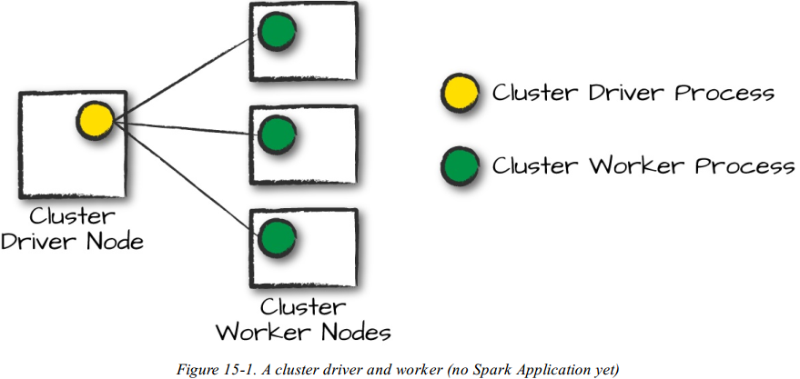
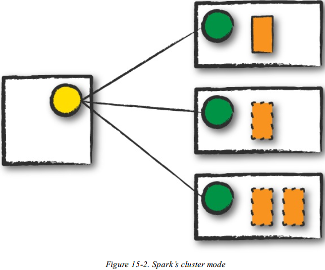
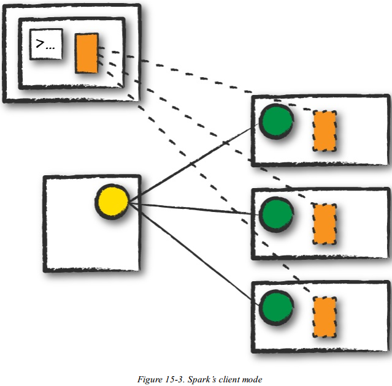
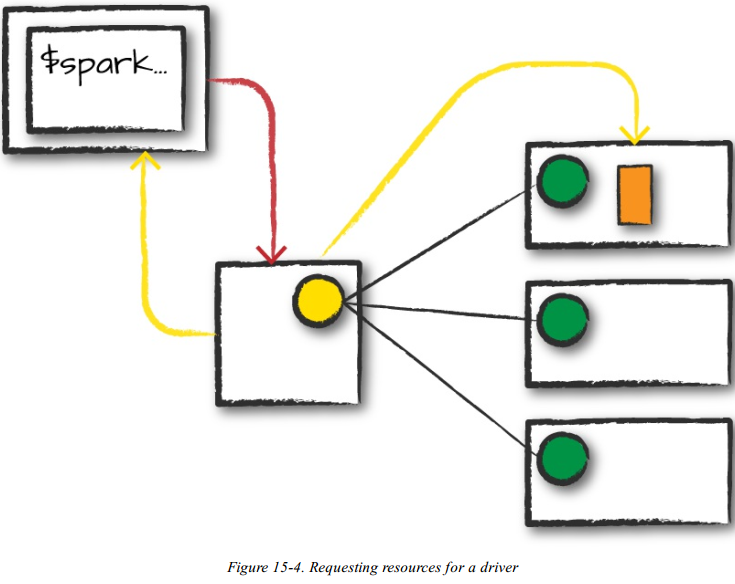
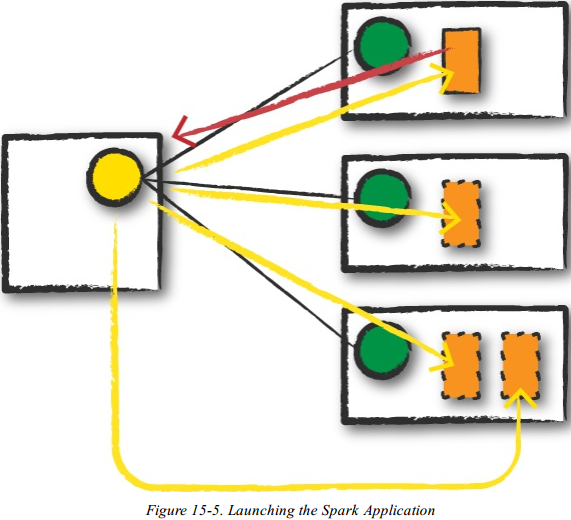

## 第十五章 Spark在集群上运行

前面章节讨论了结构化API中如何执行逻辑操作，将其分解为逻辑计划，并将其转换为实际有跨机器集群执行的弹性分布式数据集RDD操作组成的物理计划。本章主要讨论Spark 执行该代码时会发生什么。

本章包括几个关键主题：

- Spark应用程序的体系结构和组件
- Spark内外Spark应用的生命周期
- 重要的低级执行属性，如管道
- 运行Spark应用程序需要什么

## 15.1 Spark应用程序的架构

在第二章，讨论了Spark应用程序的一些高级组件：Spark Driver、Executors、Cluster manager

### 15.1.1 Spark Driver

驱动器是Spark应用程序处在“驾驶员位置”的进程。它是Spark应用程序执行的控制器，维护Spark集群的所有状态(执行器的状态和任务)。它必须与群集管理器通信，获得物理资源和启动执行器。驱动器程序只是一个物理机器上的进程，负责维护集群上运行的应用程序的状态。

### 15.1.2 Spark Executors

Spark执行器是执行Spark驱动程序分配任务的进程，执行器有一个核心工作：接收并运行驱动程序分配的任务，并报告它们的状态(成功或失败)和结果。每个Spark应用程序都有自己的独立执行器进程。

### 15.1.3 Spark Cluster Manager

Spark驱动程序和执行器不存在与一个空间，这就是集群管理器(Cluster Manager)所处的位置。集群管理器负责维护运行Spark Executors的机器集群。集群管理器将自己的驱动器程序(Spark Driver)和执行器抽象架构。核心区别在于，它们与物理机器而不是进程（如 Spark 中的进程）联系在一起。 图15-1显示了一个基本的集群设置。图左侧的机器是群集管理器驱动程序节点。圆圈表示运行在每个工作节点上并管理每个工作节点的守护进程。到目前为止还没有运行spark应用程序，这些只是来自集群管理器的进程。



在实际运行Spark应用程序时，从集群管理器请求资源，根据应用程序的配置方式，这可能包括一个运行Spark驱动程序的位置，或者可能只是Spark应用程序的执行者的资源。在Spark应用程序执行过程中，集群管理器将负责管理应用程序运行的底层机器。

Spark目前支持四种集群管理器：

- Standalone：简单的内置独立集群管理器
- Hadoop YARN
- Mesos
- Kubereters

### 15.1.4 Spark Execution Modes

执行模式使您能够在运行应用程序时确定上述资源的物理位置。您有三种模式可供选择：

- Cluster mode
- Client mode
- Local mode

将使用图15-1作为模板详细介绍每种方法，带实心边框的矩形表示 Spark驱动程序进程，而带虚线边框的矩形表示执行程序进程：

#### Cluster Mode 集群模式

集群模式是运行Spark应用程序最常见的模式。在集群模式下，用户向集群管理器提交预编译的JAR、Pytho脚本或R脚本。然后，除了执行器进程之外，集群管理器在集群内的工作节点上启动驱动器程序进程，集群管理器负责维护所有与Spark应用程序相关的流程。图15-2显示集群管理器将我们的驱动程序放在一个工作节点上，而执行器放在其他工作节点上。



#### Client Mode 客户端模式

客户端模型是集群模式几乎相同，只是Spark驱动程序保留在提交应用程序的客户端上，由客户端维护Spark驱动器程序进程，集群管理器维护执行器进程。图15-3中，运行的Spark应用程序来自一台未在集群上的机器。这些客户端所在的机器通常称为网关机器或边缘节点。在图15-3中，可以看到驱动程序(driver)在集群外部的一台机器上运行，但Executor位于集群中的机器上。



#### Local mode 本地模式

本地模式与前两种模式有很大不同：在一台机器上运行整个Spark应用程序。通过单个机器上的线程实现并行性。是学习Spark、测试应用程序或使用本地实验的常用方法，不建议在运行生产应用程序时使用本地模式。

## 15.2 Spark 应用的生命周期

本节从Spark代码来讨论Spark应用程序的整个生命周期。将通过一个使用 spark-submit 运行的应用程序的示例来讲解Spark应用生命周期。假设一个集群已经运行了四个节点、一个驱动程序(不是 Spark 驱动程序，而是集群管理器驱动程序)和三个执行器节点。

本节使用图片方式说明，带实心边框的矩形表示 Spark驱动程序进程，而带虚线边框的矩形表示执行程序进程，较暗的箭头表示通过 Spark 或 Spark 相关进程进行的通信，而虚线表示更一般的通信（如集群管理通信）。

### 15.2.1 Client Request 客户端请求

第一步是提交实际的申请。在本地计算机上执行代码，并将向集群管理员驱动程序节点发出请求（图15-4）。此时集群管理器为Spark Driver提供资源，并将驱动程序放在集群中的一个节点上。提交原始作业的客户端进程退出，应用程序在集群上关闭并运行。



Spark 作业提交脚本：

```sh
./bin/spark-submit \
--class <main-class> \
--master <master-url> \
--deploy-mode cluster \
--conf <key>=<value> \
... # other options
<application-jar> \
[application-arguments]
```

### 15.2.2 Launch 启动（应用程序）

现在应用程序已经放置在集群上，开始运行用户代码(图15-5)。此代码必须包含初始化Spark集群的SparkSession。SparkSession随后将于集群管理器通信，要求它在集群中启动 Spark executor进程。执行器（executor）的数量及其相关配置由用户通过原始 spark-submit 调用中的命令行参数设置。



集群管理器通过启动执行器进程进行响应，并将有关其位置的相关信息发送到驱动程序进程。在所有的东西都连接正确之后，就有了一个Spark 集群。