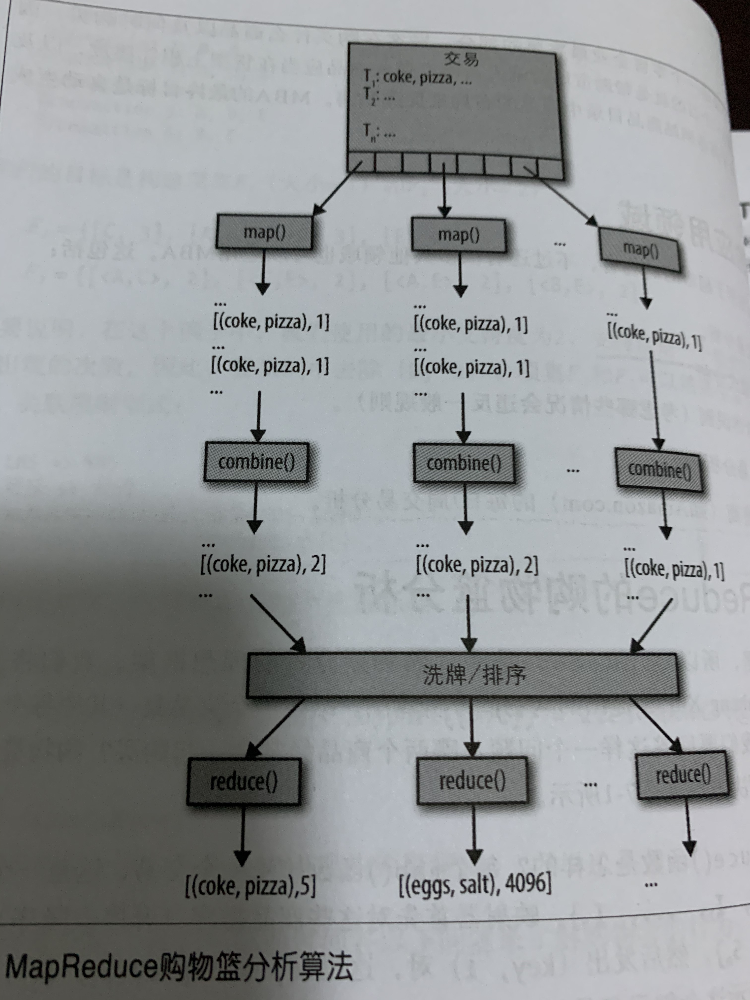

# Chap07 MBA 购物篮分析

## 1. MBA分析简介

购物篮分析(Market Basker Analysis, MBA)是一个常用的数据挖掘技术，可以用于揭示不同商品或不同商品组之间的相似度。数据挖掘一半是从庞大的数据集中提取有趣的相关信息，购物篮分析可以帮助我们找到可能一起购买的商品，关联规则挖掘会发现一个交易集中商品之间的相关性，这也是数据挖掘的频繁项集技术。

## 2. MBA的目标

在数据挖掘中，关联规则有两个度量标准：

- 支持度(Support)：一个项集出现的频度 ，计算公式如下
	$$
	Support((x,y)) = \frac{同时购买(x,y)的人数}{总人数}
	$$
	

- 置信度(Confidence)：关联规则左键和右键共同出现的频繁程度。

$$
confidence（X−>Y）= \frac{同时购买(x,y)的人数}{购买x的人数} \\

confidence（Y−>X）=\frac{同时购买{x,y}的人数}{购买y的人数}
$$

## 3. MBA的应用领域

- 购买商品推荐
- 商品降价与提升价格
- 信用卡交易分析
- 大型交易电商零售时间周期内交易分析

## 4. MBA解决方案

本章提供两种解决方案：

- 对应商品N元组的MapReduce / Hadoop解决方案，用于查找频繁项集
- Spark解决方案，找出频繁模式与关联规则

### 4.1 MapReduce的购物篮分析

#### 4.1.1 MapReduce/Hadoop实现类

| 类名       | 类描述                                   |
| ---------- | ---------------------------------------- |
| MBAMapper  | MBA映射器，将交易数据中的商品映射为N元组 |
| MBAReducer | MBA归约器，统计商品N元组出现的频度       |
| MBADriver  | Job驱动器类                              |

## 5. Spark的购物篮分析

**重点使用Spark解决方案实现MBA**。关联规则是形如$X \rightarrow Y$的if—then蕴含式。令$I = \{I_1, I_2, \dots, I_n\}$，表示一个项集，$t=\{S_1,S_2, \dots, S_m\}$表示一个交易，其中$S_i \in I, m \leq n$，交易数据库的一个交易集$T=\{T_1, T_2, \dots, T_k\}$。每一个交易$T_i \in I$。关联规则定义为：
$$
x \rightarrow y, where \quad x,y \in I \quad and \quad x \cap y=\emptyset
$$
我们的目标是找出满足用户制定的最小支持度和最小置信度的所有关联规则。Spark解决方案会找出所有频繁项集，生成所有适当的关联规则，最后计算生成这些关联规则的置信度。

### 5.1 MapReduce算法工作流

- MapReduce阶段1：Mapper将交易转换为模式，Reducer找出频繁模式；

​        

- MapReduce阶段2：Mapper将频繁模式转换为子模式，Reducer生成关联规则和置信度。

   

### 5.2 Spark算法工作流

- 生成频繁模式
- 组合/归约频繁模式
- 生成所有子模式
- 生成关联规则

