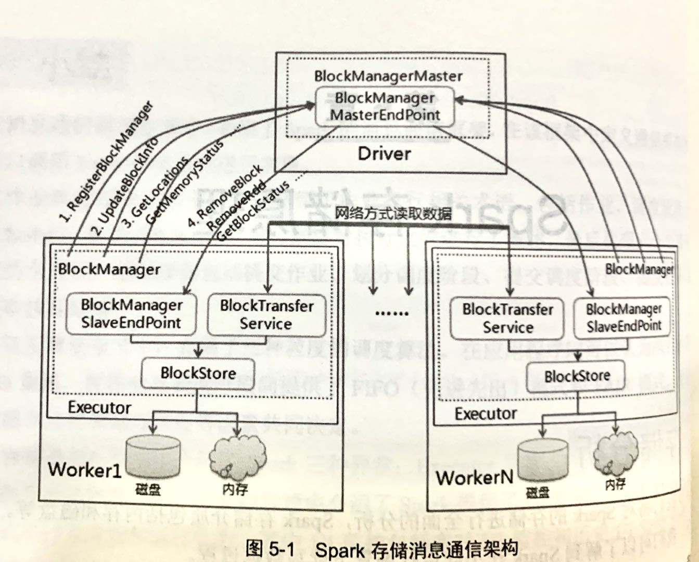

# 第五章 Spark存储原理

## 5.1 存储分析

本节将对Spark的存储进行全面的分析，Spark存储介质包括存储和磁盘等等。通过本节的分歧，我们可以了解到Spark在不同运行场景下读写数据过程。

### 5.1.1 整体架构

Spark的存储信息采取了主从模式，即Master/Slave模式，整个存储模块使用了第三节介绍的RPC的通信方式。其中，Master负责整个应用程序运行期间的数据块元数据的管理和维护，而Slave一方面负责将本地数据块的信息上报给Master，另一方面接收从Master闯过来的执行命令，如获取数据块状态、删除RDD/数据块等命令。在每个Slave存在数据传输通道，根据需要在Slave之间进行远程数据的读取和写入。Spark的存储整体架构如图5-1所示。



根据Spark存储整体架构图，下面将根据数据生命周期过程进行消息通信：

（1）在应用程序启动时，SparkContext会创建Driver端的SparkEnv，在该SparkEnv中实例化BlockManager和BlockManagerMaster，在BlockManagerMaster内部创建消息通信的终端点BlockManagerMasterEndpoint。

在Executor启动时也会创建其SparkEnv，在该SparkEnv中实例化BlockManager和负责网络数据传输服务的BlockTransferService，在BlockManager初始化过程中，一方面会加入BlockManagerSlaveEndpoint终端点，并把该终端点的应用注册到Driver中，这样Driver和Executor互相持有通信端点的引用，可以在应用执行过程中进行消息通信。实例化BlockTransferService过程中，使用Netty的数据传输服务方式(在Spark 2.0版本之前，提供Netty和NIO进行选择)。由于该数据传输服务隐藏了集群间不同节点间的消息传出操作，可类似于本地数据操作方式进行数据读写，大大简化了网络数据传输的复杂过程。在SparkEnv类中创建BlockTransferService、BlockManager和BlockManagerMaster代码如下：

```scala
/**
      * 创建BlockManagerMaster，如果是Driver端在BlockManagerMaster内部，则创建
      * BlockManagerMasterEndpoint，如果是Executor，则创建BlockManagerMasterEndpoint的引用
      */
val blockManagerMaster = new BlockManagerMaster(
  registerOrLookupEndpoint(
    BlockManagerMaster.DRIVER_ENDPOINT_NAME,
    new BlockManagerMasterEndpoint(
      rpcEnv,
      isLocal,
      conf,
      listenerBus,
      if (conf.get(config.SHUFFLE_SERVICE_FETCH_RDD_ENABLED)) {
        externalShuffleClient
      } else {
        None
      }, blockManagerInfo)),
  registerOrLookupEndpoint(
    BlockManagerMaster.DRIVER_HEARTBEAT_ENDPOINT_NAME,
    new BlockManagerMasterHeartbeatEndpoint(rpcEnv, isLocal, blockManagerInfo)),
  conf,
  isDriver)

// 创建远程数据传输服务，使用Netty方式
val blockTransferService =
new NettyBlockTransferService(conf, securityManager, bindAddress, advertiseAddress,
                              blockManagerPort, numUsableCores, blockManagerMaster.driverEndpoint)

// NB: blockManager is not valid until initialize() is called later.
// 创建BlockManager，如果是Driver端包含BlockManagerMaster，如果是Executor包含的是blockManagerMaster的引用
// 另外BlockManagerMaster包含了远程数据传输服务，当BlockManager调用initialize()方法初始化时真正生效
val blockManager = new BlockManager(
  executorId,
  rpcEnv,
  blockManagerMaster,
  serializerManager,
  conf,
  memoryManager,
  mapOutputTracker,
  shuffleManager,
  blockTransferService,
  securityManager,
  externalShuffleClient)
```

其中BlockManager初始化代码如下，如果是Executor创建其消息通信的终端点BlockManagerslaveEndpoint，并向Driver端发送RegisterBlockManager消息，把该Executor的BlockManager和其所包含的BlockManagerslaveEndpoint引用注册到BlockManagerMaster中。

```scala
/**
   * Initializes the BlockManager with the given appId. This is not performed in the constructor as
   * the appId may not be known at BlockManager instantiation time (in particular for the driver,
   * where it is only learned after registration with the TaskScheduler).
   *
   * This method initializes the BlockTransferService and BlockStoreClient, registers with the
   * BlockManagerMaster, starts the BlockManagerWorker endpoint, and registers with a local shuffle
   * service if configured.
   */
  def initialize(appId: String): Unit = {
    // 在Executor中启动远程数据传输服务，根据配置启动传输服务器BlockTransferServicer，
    // 该服务器启动后等待其他节点发送请求消息
    blockTransferService.init(this)
    externalBlockStoreClient.foreach { blockStoreClient =>
      blockStoreClient.init(appId)
    }
    blockReplicationPolicy = {
      val priorityClass = conf.get(config.STORAGE_REPLICATION_POLICY)
      val clazz = Utils.classForName(priorityClass)
      val ret = clazz.getConstructor().newInstance().asInstanceOf[BlockReplicationPolicy]
      logInfo(s"Using $priorityClass for block replication policy")
      ret
    }

    //获取BlockManager ID
    val id =
      BlockManagerId(executorId, blockTransferService.hostName, blockTransferService.port, None)

    // 把Executor的BlockManager注册到BlockManagerMaster中，其中包括其终端点
    // BlockManagerSlaveEndpoint的引用，Master端持有该引用可以向Executor发送消息
    val idFromMaster = master.registerBlockManager(
      id,
      diskBlockManager.localDirsString,
      maxOnHeapMemory,
      maxOffHeapMemory,
      slaveEndpoint)

    blockManagerId = if (idFromMaster != null) idFromMaster else id

    // 获取Shuffle服务ID，如果启动外部Shuffle服务，则加入外部Shuffle服务端口信息
    // 否则使用BlockManager编号
    shuffleServerId = if (externalShuffleServiceEnabled) {
      logInfo(s"external shuffle service port = $externalShuffleServicePort")
      BlockManagerId(executorId, blockTransferService.hostName, externalShuffleServicePort)
    } else {
      blockManagerId
    }

    // Register Executors' configuration with the local shuffle service, if one should exist.
    // 如果外部Shuffle服务启动并且为Executor节点，则注册该外部Shuffle服务
    if (externalShuffleServiceEnabled && !blockManagerId.isDriver) {
      registerWithExternalShuffleServer()
    }

    hostLocalDirManager =
      if (conf.get(config.SHUFFLE_HOST_LOCAL_DISK_READING_ENABLED) &&
          !conf.get(config.SHUFFLE_USE_OLD_FETCH_PROTOCOL)) {
        externalBlockStoreClient.map { blockStoreClient =>
          new HostLocalDirManager(
            futureExecutionContext,
            conf.get(config.STORAGE_LOCAL_DISK_BY_EXECUTORS_CACHE_SIZE),
            blockStoreClient,
            blockManagerId.host,
            externalShuffleServicePort)
        }
      } else {
        None
      }

    logInfo(s"Initialized BlockManager: $blockManagerId")
  }
```

（2）当写入、更新或删除数据完毕后，发送数据块的最新状态消息UpdateBlockInfo给BlockManagerMasterEndpoint终端点，由其更新数据块的元数据。该终端点的元数据存放在BlockManagerMasterEndpoint的3个HashMap中，分别如下：

```scala
// Mapping from executor ID to block manager ID.
// 存放了ExecutorID和BlockManagerId对应列表
private val blockManagerIdByExecutor = new mutable.HashMap[String, BlockManagerId]

// Mapping from block id to the set of block managers that have the block.
// 存放了BlockId和BlockManagerId序列所对应的列表，原因在于同一个数据可能存在多个副本，保存在多个
// Executor中
private val blockLocations = new JHashMap[BlockId, mutable.HashSet[BlockManagerId]]

// 属于BlockManagerMasterEndpoint构造函数的参数
blockManagerInfo: mutable.Map[BlockManagerId, BlockManagerInfo]
```

