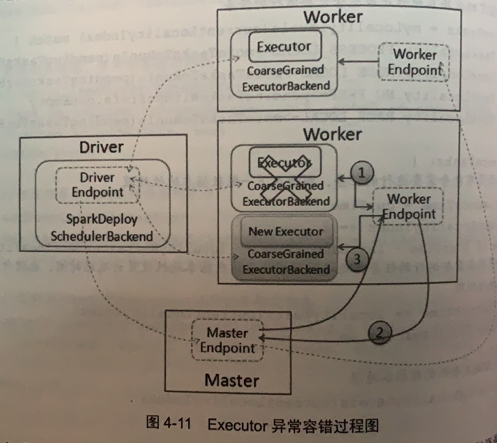
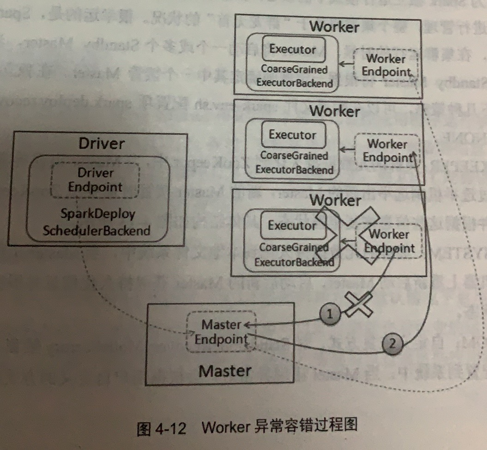
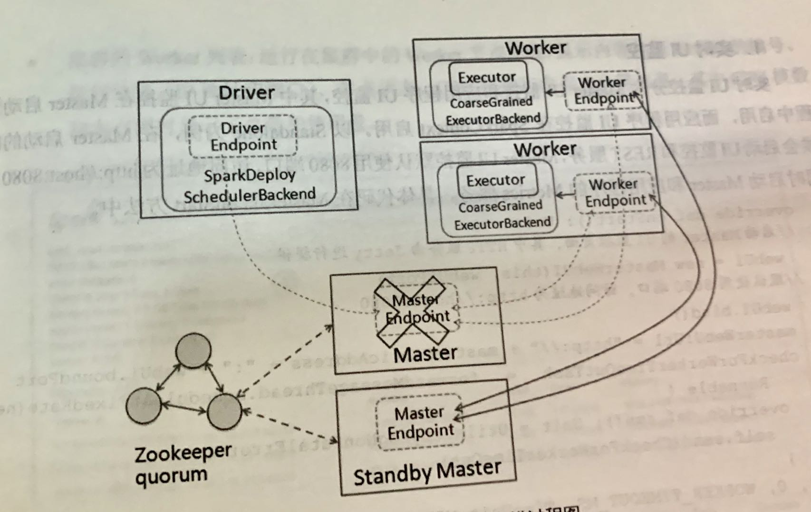

# 第四章 Spark核心原理

在描述Spark运行基本流程前，我们先介绍Spark基本概念，如图4-1所示：


​																		**图4-1 Spark运行结构图**

- **Applocation(应用程序)：**是指用户编写的Spark应用程序，包含驱动程序(Driver)和分布在集群多个节点上运行的Executor代码，在执行过程中由一到多个作业组成。
- **Driver( 驱动程序)：**Spark中的Driver即运行上述Application的main函数并创建SparkContext，其中创建SparkContext的目的是为了准备Spark Application的运行环境。SparkContext负责与ClusterManager通信，进行资源申请、任务分配和监控等。当Executor执行完毕，Driver负责将SparkContext关闭。
- **Cluster Manager(集群资源管理器)：**是指在集群上获取资源的外部服务，目前有以下几种资源管理器：
	1. **Standalone：**Spark原生资源管理，由Master节点负责资源管理
	2. **Hadoop Yarn：**由Yarn的ResourceManager负责资源的管理
	3. **Mesos：**由Mesos中的Mesos Master负责管理
	4. **Kubernetes**
- **Worker(工作节点)：**集群中任何可以运行Application代码的节点。在Yarn和Spark on Yarn模式中指的是NodeManager；在Standalone中指的是通过Slave文件配置的Worker节点。
- **Master(总控进程)：**Spark Standalone模式下的主节点，负责管理和分配集群资源来运行Spark Application。
- **Executor(执行进程)：**Aplication运行在Worker节点上的一个进程，该进程负责从线程池中抽取空余线程运行Task，Task并行的数量取决于分配给Executor进程的CPU数量。最终Executor将结果写入内存或磁盘中，每个Application都独立拥有一批Executor。

## 4.1 消息通信原理

### 4.1.1 Spark消息通信架构

Spark中定义了通信框架接口，接口实现中调用Netty的具体方法(Spark 2.0版本之后，之前使用的Akka)。在框架中以RpcEndPoint和RpcEndPointRef实现了Actor和ActorRef相关动作，其中RpcEndPointRef是RpcEndPoint的引用，它们关系如图4-2所示：


​																	**图4-2 Spark消息通讯类图**

消息通讯框架使用工厂模式，这种设计方式实现了对Netty的结偶，能够根据需要引入其他消息通讯工具。通信框架参见图4-2左上脚的四个类，具体实现步骤：

1. 定义RpcEnv和RpcEnvFactory两个抽象类，在RpcEnv定义了RPC通信框架启动、停止和关闭等抽象方法，在RpcEnvFactory定义了创建抽象方法；
2. 在NettyRpcEnv和NettyRpcEnvFactory类中使用Netty对继承的方法进行了实现，需要注意的是在NettyRpc中启动终端点方法`setupEndpoint`，这个方法会把RpcEndPoint和RpcEndPointRef相互以键值方式存放在线程安全的ConcurrentHashMap中；
3. 在RpcEnv的Objec类中通过反射方式实现了创建RpcEnv的静态方法。

在各模块使用中，如Master、Worker等，会先使用RpcEnv的静态方法创建RpcEnv实例，然后实例化Master，由于Master继承于ThreadSafeRpcEndpoint，创建的Master实例是一个线程安全的终端点，接着调用RpcEnv的setupEndPoint方法，把Master的终端点和其对应的引用注册到RpcEnv中。在消息通信中，只要其他对象获取了Master终端点的引用，就可以与Master通信。

Master.scala类的startRpcEnvAndEndPoint方法启动消息通信框架代码如下：

```scala
/**
   * Start the Master and return a three tuple of:
   *   (1) The Master RpcEnv
   *   (2) The web UI bound port
   *   (3) The REST server bound port, if any
   */
  def startRpcEnvAndEndpoint(
      host: String,
      port: Int,
      webUiPort: Int,
      conf: SparkConf): (RpcEnv, Int, Option[Int]) = {
    val securityMgr = new SecurityManager(conf)
    // RpcEnv静态方法创建RpcEnv实例
    val rpcEnv = RpcEnv.create(SYSTEM_NAME, host, port, conf, securityMgr)
    // 把Master的终端点和其对应的引用注册到RpcEnv中
    val masterEndpoint = rpcEnv.setupEndpoint(ENDPOINT_NAME,
      new Master(rpcEnv, rpcEnv.address, webUiPort, securityMgr, conf))
    val portsResponse = masterEndpoint.askSync[BoundPortsResponse](BoundPortsRequest)
    (rpcEnv, portsResponse.webUIPort, portsResponse.restPort)
  }
```

Spark运行过程中，Master、Driver、Worker以及Executor等模块之间由实践驱动消息的发送。下面以Standalone为例，分析Spark启动过程和Application运行过程中如何通信。

### 4.1.2 Spark启动消息通信

Spark启动过程主要是进行Master和Worker之间的通信，其消息发送关系如图4-3所示。首先由Worker节点向Master节点发送注册消息，然后Master节点处理完毕后，返回注册成功或失效消息，如果注册成功，则Worker定时发送心跳消息给Master。


 其详细过程如下：

**（1）**当Master启动后，随之启动各Worker，Worker启动时会创建通信环境RpcEnv和终端店EndPoint，并向Master发送注册Worker的消息RegisterWorker。

由于Worker可能需要注册到多个Master(HA环境)中，在Worker的tryRegisterAllMaster方法中创建注册线程池RegisterMasterThreadPool，把需要申请注册的请求放在该线程池中，随后通过该线程池启动注册线程，在该注册过程中，获取Master终端点引用，接着调用registerMaster方法，根据Master的RpcEndPointRef的send方法发送注册RegisterWorker消息，Worker.tryRegisterAllMaster方法代码如下所示：

```scala
// A thread pool for registering with masters. Because registering with a master is a blocking
  // action, this thread pool must be able to create "masterRpcAddresses.size" threads at the same
  // time so that we can register with all masters.
private val registerMasterThreadPool = ThreadUtils.newDaemonCachedThreadPool(
  "worker-register-master-threadpool",
  masterRpcAddresses.length // Make sure we can register with all masters at the same time
)

// A thread pool for registering with masters. Because registering with a master is a blocking
  // action, this thread pool must be able to create "masterRpcAddresses.size" threads at the same
  // time so that we can register with all masters.
private val registerMasterThreadPool = ThreadUtils.newDaemonCachedThreadPool(
  "worker-register-master-threadpool",
  masterRpcAddresses.length // Make sure we can register with all masters at the same time
)

private def tryRegisterAllMasters(): Array[JFuture[_]] = {
   // 对masterRpcAddress集合分别调用map中的方法
    masterRpcAddresses.map { masterAddress =>
      registerMasterThreadPool.submit(new Runnable {
        override def run(): Unit = {
          try {
            logInfo("Connecting to master " + masterAddress + "...")
            // 获取master节点的RpcEndPointRef
            val masterEndpoint = rpcEnv.setupEndpointRef(masterAddress, Master.ENDPOINT_NAME)
            // 调用向master注册方法
            sendRegisterMessageToMaster(masterEndpoint)
          } catch {
            case ie: InterruptedException => // Cancelled
            case NonFatal(e) => logWarning(s"Failed to connect to master $masterAddress", e)
          }
        }
      })
    }
  }
```

其中sendRegisterMessageToMaster方法代码如下

```scala
private def sendRegisterMessageToMaster(masterEndpoint: RpcEndpointRef): Unit = {
    masterEndpoint.send(RegisterWorker(
      workerId,
      host,
      port,
      self,
      cores,
      memory,
      workerWebUiUrl,
      masterEndpoint.address))
  }
```

**（2）**Master收到消息后，需要对Worker发送的消息进行验证、记录。如果注册成功，则发送RegisterWorker消息给对应的Worker，告诉Worker已经完成注册，随之进行步骤3，及Worker定期发送心跳信息给Master：如果注册过程中失败，则会发送RegisterWorkerFailed消息，worker打印出错日志并结束Worker启动。

在Master中，Maste接收到Worker消息后，先判断Master当前状态是否处于STANDBY状态，如果是则忽略该消息，如果在注册列表中发现了该Worker的编号，则发送注册失败的消息。判断完毕后使用RegisterWorker方法把该Worker加入列表中，用于集群进行处理任务时进行调度。Master.receive方法中注册Worker代码实现如下所示：

```scala
case RegisterWorker(
    id, workerHost, workerPort, workerRef, cores, memory, workerWebUiUrl, masterAddress) =>
  // 日志打印
	logInfo("Registering worker %s:%d with %d cores, %s RAM".format(
    workerHost, workerPort, cores, Utils.megabytesToString(memory)))

 // 如果是STANDBY，发送MasterInStandBy消息
  if (state == RecoveryState.STANDBY) {
    workerRef.send(MasterInStandby)
  } else if (idToWorker.contains(id)) {
    workerRef.send(RegisterWorkerFailed("Duplicate worker ID"))
  } else {
    val worker = new WorkerInfo(id, workerHost, workerPort, cores, memory,
                                workerRef, workerWebUiUrl)
    // registerWorker方法中注册Worker，该方法会讲Worker放到列表中，用于后续运行/调度Task时使用
    if (registerWorker(worker)) {
      persistenceEngine.addWorker(worker)
      workerRef.send(RegisteredWorker(self, masterWebUiUrl, masterAddress))
      schedule()
    } else {
      val workerAddress = worker.endpoint.address
      logWarning("Worker registration failed. Attempted to re-register worker at same " +
                 "address: " + workerAddress)
      workerRef.send(RegisterWorkerFailed("Attempted to re-register worker at same address: "
                                          + workerAddress))
    }
  }

```

其中registerWorker方法源码如下：

```scala
private def registerWorker(worker: WorkerInfo): Boolean = {
  // There may be one or more refs to dead workers on this same node (w/ different ID's),
  // remove them.
  workers.filter { w =>
    (w.host == worker.host && w.port == worker.port) && (w.state == WorkerState.DEAD)
  }.foreach { w =>
    workers -= w
  }

  val workerAddress = worker.endpoint.address
  if (addressToWorker.contains(workerAddress)) {
    val oldWorker = addressToWorker(workerAddress)
    if (oldWorker.state == WorkerState.UNKNOWN) {
      // A worker registering from UNKNOWN implies that the worker was restarted during recovery.
      // The old worker must thus be dead, so we will remove it and accept the new worker.
      removeWorker(oldWorker, "Worker replaced by a new worker with same address")
    } else {
      logInfo("Attempted to re-register worker at same address: " + workerAddress)
      return false
    }
  }

  workers += worker
  idToWorker(worker.id) = worker
  addressToWorker(workerAddress) = worker
  true
}
```

**（3）**当Worker注册成功后，会定时发送心跳信息Heartbear给Master，以便Master了解Worker的实时动态，时间间隔可以在`spark.worker.timeout`中设置，注意的是，该设置值的1/4为心跳间隔。因为如果心跳检测失败，Master会等待Worker再发送3次，因此总有用4次等待。

```scala
  private val HEARTBEAT_MILLIS = conf.getLong("spark.worker.timeout", 60) * 1000 / 4
```

当Worker获取到注册成功的消息后，先记录日志并更新Master信息，然后启动定时调度进程发送心跳信息，该调度进程时间间隔为上面所定义的HEARTBEAT_MILLIS值。

```scala
case RegisteredWorker(masterRef, masterWebUiUrl, masterAddress) =>
        if (preferConfiguredMasterAddress) {
          logInfo("Successfully registered with master " + masterAddress.toSparkURL)
        } else {
          logInfo("Successfully registered with master " + masterRef.address.toSparkURL)
        }
        registered = true
        changeMaster(masterRef, masterWebUiUrl, masterAddress)
        forwordMessageScheduler.scheduleAtFixedRate(new Runnable {
          override def run(): Unit = Utils.tryLogNonFatalError {
            self.send(SendHeartbeat)
          }
        }, 0, HEARTBEAT_MILLIS, TimeUnit.MILLISECONDS)
       // 如果设置了清理以前应用使用的文件夹，则进行操作
        if (CLEANUP_ENABLED) {
          logInfo(
            s"Worker cleanup enabled; old application directories will be deleted in: $workDir")
          forwordMessageScheduler.scheduleAtFixedRate(new Runnable {
            override def run(): Unit = Utils.tryLogNonFatalError {
              self.send(WorkDirCleanup)
            }
          }, CLEANUP_INTERVAL_MILLIS, CLEANUP_INTERVAL_MILLIS, TimeUnit.MILLISECONDS)
        }
        // 向Master回报Worker中的Executor最新状态，包括运行ApplicationID，ExecutorID，
        // Executor核数，Executor状态
        val execs = executors.values.map { e =>
          new ExecutorDescription(e.appId, e.execId, e.cores, e.state)
        }
        masterRef.send(WorkerLatestState(workerId, execs.toList, drivers.keys.toSeq))
```

### 4.1.3 Spark运行时消息通信

用户提交应用程序时，应用程序的SparkContext会向Master发送应用注册信息，并由Master给该应用分配Executor，Executor启动后，Executor会向SparkContext发送注册成功消息；当SparkContext的RDD触发行动操作后，将创建RDD的DAG，通过DAGScheduler进行划分Stage，并将Stage转化为TaskSet；接着由TaskScheduler向注册后的Executor发送执行消息，Executor接收到任务消息后启动并运行；最后当所有任务运行时，由Driver处理结果并回收资源。图4-4为Spark运行消息通信的交互过程。


详细过程如下：

（1）执行应用程序需启动SparkContext，在SparkContext启动过程中会先实例化ScheduleBackend对象，在独立运行(Standlone)实际创建的是SparkDeploySchedulerBackend对象，在对象的启动中会继承父类DriverEndpoint和创建Appclient的ClintEndpoint的两个终端点。

在ClientEndpoint的tryRegisterAllMaster方法中创建注册线程池registerMasterThreadPool，在线程池中启动注册线程并向Master发送RegisterApplication注册应用的消息，代码如下所示：

```scala
// org.apache.spark.deploy.client.StandaloneAppClient.ClientEndpoint#tryRegisterAllMasters
private def tryRegisterAllMasters(): Array[JFuture[_]] = {
     // 由于HA等环境有多个Master，需要遍历所有Master发送消息
      for (masterAddress <- masterRpcAddresses) yield {
        // 向线程池中启动注册线程，当该线程读取到应用注册成功的标示register=true时退出该线程
        registerMasterThreadPool.submit(new Runnable {
          override def run(): Unit = try {
            if (registered.get) {
              return
            }
            logInfo("Connecting to master " + masterAddress.toSparkURL + "...")
            // 获取master终端点的应用，发送注册信息
            val masterRef = rpcEnv.setupEndpointRef(masterAddress, Master.ENDPOINT_NAME)
            masterRef.send(RegisterApplication(appDescription, self))
          } catch {
            case ie: InterruptedException => // Cancelled
            case NonFatal(e) => logWarning(s"Failed to connect to master $masterAddress", e)
          }
        })
      }
    }
```

当Master接收到注册应用的消息时，在registerApplication方法中记录应用信息并把该应用加入到等待运行应用列表中，注册完毕后发送成功消息RegistedApplication给clientEndpoin(在Master.receive方法中)，同时调用startExecutorOnWorker方法运行应用，在执行前需要获取应用的Worker，然后发送LaunchExecutor消息给Worker，通知Worker启动Executor。Master.registerApplication方法与Master.startExecutorOnWorker方法如下：

```scala
// Master接收注册消息
override def receive: PartialFunction[Any, Unit] = {
  case RegisterApplication(description, driver) =>
      // TODO Prevent repeated registrations from some driver
      if (state == RecoveryState.STANDBY) {
        // ignore, don't send response
      } else {
        logInfo("Registering app " + description.name)
        // 创建App
        val app = createApplication(description, driver)
        // 向Master注册App
        registerApplication(app)
        logInfo("Registered app " + description.name + " with ID " + app.id)
        persistenceEngine.addApplication(app)
        // 发送消息给Client
        driver.send(RegisteredApplication(app.id, self))
        // 调用startExecutorsOnWorkers
        schedule()
      }
}

private def registerApplication(app: ApplicationInfo): Unit = {
    val appAddress = app.driver.address
    // 判断是否重复添加应用
    if (addressToApp.contains(appAddress)) {
      logInfo("Attempted to re-register application at same address: " + appAddress)
      return
    }
    // application运行指标系统
    applicationMetricsSystem.registerSource(app.appSource)
    // 
    apps += app
    idToApp(app.id) = app
    endpointToApp(app.driver) = app
    addressToApp(appAddress) = app
    // 添加至待执行app列表
    waitingApps += app
  }
```

```scala
/**
   * Schedule and launch executors on workers
   */
private def startExecutorsOnWorkers(): Unit = {
  // Right now this is a very simple FIFO scheduler. We keep trying to fit in the first app
  // 先进先出调度器
  // in the queue, then the second app, etc.
  for (app <- waitingApps) {
    val coresPerExecutor = app.desc.coresPerExecutor.getOrElse(1)
    // If the cores left is less than the coresPerExecutor,the cores left will not be allocated
    if (app.coresLeft >= coresPerExecutor) {
      // Filter out workers that don't have enough resources to launch an executor
      val usableWorkers = workers.toArray.filter(_.state == WorkerState.ALIVE)
      .filter(worker => worker.memoryFree >= app.desc.memoryPerExecutorMB &&
              worker.coresFree >= coresPerExecutor)
      .sortBy(_.coresFree).reverse // 根据Worker剩余CPU核数排序
      val assignedCores = scheduleExecutorsOnWorkers(app, usableWorkers, spreadOutApps)

      // Now that we've decided how many cores to allocate on each worker, let's allocate them
      for (pos <- 0 until usableWorkers.length if assignedCores(pos) > 0) {
        allocateWorkerResourceToExecutors(
          app, assignedCores(pos), app.desc.coresPerExecutor, usableWorkers(pos))
      }
    }
  }
}
```

（2）AppClient.ClientEndpoint接收到Master发送的RegisteredApplication消息，需要把注册标示registered置为true，Master注册线程获取状态变化后，完成注册Application进程，代码如下：

```scala
// StandloneAppClient
private class ClientEndpoint(override val rpcEnv: RpcEnv) extends ThreadSafeRpcEndpoint with Logging 


case RegisteredApplication(appId_, masterRef) =>
        // FIXME How to handle the following cases?
        // 1. A master receives multiple registrations and sends back multiple
        // RegisteredApplications due to an unstable network.
        // 2. Receive multiple RegisteredApplication from different masters because the master is
        // changing.
        appId.set(appId_)
        registered.set(true)
        master = Some(masterRef)
        // 完成Application注册
        listener.connected(appId.get)
```

（3）在Master类的startExecutorOnWorker方法中分配资源运行应用程序时，allocateWorkerResourceToExecutors方法实现在Worker中启动Executor，当Worker收到发送过来的LaunchExecutor消息，先实例化ExecutorRunner对象，在ExecutorRunner启动中会创建进程生成器ProcessBuilder，然后由该生成器使用command创建CoarseGrainedExecutorBackend对象，该对象是Executor运行的容器，最后Worker发送ExecutorStateChanged消息给Master，通知Executor容器创建完毕。

当Worker接收启动Exceutor消息，执行代码如下：

```scala
case LaunchExecutor(masterUrl, appId, execId, appDesc, cores_, memory_) =>
      if (masterUrl != activeMasterUrl) {
        logWarning("Invalid Master (" + masterUrl + ") attempted to launch executor.")
      } else {
        try {
          logInfo("Asked to launch executor %s/%d for %s".format(appId, execId, appDesc.name))

          // Create the executor's working directory
          // 创建Executor执行目录
          val executorDir = new File(workDir, appId + "/" + execId)
          if (!executorDir.mkdirs()) {
            throw new IOException("Failed to create directory " + executorDir)
          }

          // Create local dirs for the executor. These are passed to the executor via the
          // SPARK_EXECUTOR_DIRS environment variable, and deleted by the Worker when the
          // application finishes.
          // 通过SPARK_EXECUTOR_DIRS环境变量，在Worker中创建Executor执行目录，当程序执行完毕后由Worker删除
          val appLocalDirs = appDirectories.getOrElse(appId, {
            val localRootDirs = Utils.getOrCreateLocalRootDirs(conf)
            val dirs = localRootDirs.flatMap { dir =>
              try {
                val appDir = Utils.createDirectory(dir, namePrefix = "executor")
                Utils.chmod700(appDir)
                Some(appDir.getAbsolutePath())
              } catch {
                case e: IOException =>
                  logWarning(s"${e.getMessage}. Ignoring this directory.")
                  None
              }
            }.toSeq
            if (dirs.isEmpty) {
              throw new IOException("No subfolder can be created in " +
                s"${localRootDirs.mkString(",")}.")
            }
            dirs
          })
          appDirectories(appId) = appLocalDirs
          // 实例化ExecutorRunner
          val manager = new ExecutorRunner(
            appId,
            execId,
            appDesc.copy(command = Worker.maybeUpdateSSLSettings(appDesc.command, conf)),
            cores_,
            memory_,
            self,
            workerId,
            host,
            webUi.boundPort,
            publicAddress,
            sparkHome,
            executorDir,
            workerUri,
            conf,
            appLocalDirs, ExecutorState.RUNNING)
          // 加入Worker的Exceutor Map集合列表
          executors(appId + "/" + execId) = manager
          // 启动ExecutorRunner
          manager.start()
          coresUsed += cores_
          memoryUsed += memory_
          // 向Master发送消息，表示Executor状态已经更改为ExecutorState.RUNNING
          sendToMaster(ExecutorStateChanged(appId, execId, manager.state, None, None))
        } catch {
          case e: Exception =>
            logError(s"Failed to launch executor $appId/$execId for ${appDesc.name}.", e)
            if (executors.contains(appId + "/" + execId)) {
              executors(appId + "/" + execId).kill()
              executors -= appId + "/" + execId
            }
            sendToMaster(ExecutorStateChanged(appId, execId, ExecutorState.FAILED,
              Some(e.toString), None))
        }
      }
```

在Executor创建中调用了fetchAndRunExecutor方法进行实现，该方法中command内容在SparkDeploySchedularBackend中定义，指定构造器Exceutor运行容器CoarseGrainedExecutorBackend，其中创建代码过程如下：

```scala
 /**
   * Download and run the executor described in our ApplicationDescription
   */
private def fetchAndRunExecutor() {
  try {
    // Launch the process
    // 通过应用程序的信息和环境配置创建构造器builder
    val builder = CommandUtils.buildProcessBuilder(appDesc.command, new SecurityManager(conf),
                                                   memory, sparkHome.getAbsolutePath, substituteVariables)
    val command = builder.command()
    val formattedCommand = command.asScala.mkString("\"", "\" \"", "\"")
    logInfo(s"Launch command: $formattedCommand")
    
    //在构造器Builder中添加执行目录等信息 
    builder.directory(executorDir)
    builder.environment.put("SPARK_EXECUTOR_DIRS", appLocalDirs.mkString(File.pathSeparator))
    // In case we are running this from within the Spark Shell, avoid creating a "scala"
    // parent process for the executor command
    builder.environment.put("SPARK_LAUNCH_WITH_SCALA", "0")

    // Add webUI log urls
    val baseUrl =
    if (conf.getBoolean("spark.ui.reverseProxy", false)) {
      s"/proxy/$workerId/logPage/?appId=$appId&executorId=$execId&logType="
    } else {
      s"http://$publicAddress:$webUiPort/logPage/?appId=$appId&executorId=$execId&logType="
    }
    builder.environment.put("SPARK_LOG_URL_STDERR", s"${baseUrl}stderr")
    builder.environment.put("SPARK_LOG_URL_STDOUT", s"${baseUrl}stdout")

    // 启动构造器，创建CoarseGrainedExecutorBackend实例
    process = builder.start()
    val header = "Spark Executor Command: %s\n%s\n\n".format(
      formattedCommand, "=" * 40)

    // Redirect its stdout and stderr to files
    // 输出创建CoarseGrainedExecutorBackend实例运行信息
    val stdout = new File(executorDir, "stdout")
    stdoutAppender = FileAppender(process.getInputStream, stdout, conf)

    val stderr = new File(executorDir, "stderr")
    Files.write(header, stderr, StandardCharsets.UTF_8)
    stderrAppender = FileAppender(process.getErrorStream, stderr, conf)

    // Wait for it to exit; executor may exit with code 0 (when driver instructs it to shutdown)
    // or with nonzero exit code
    // 等待创建CoarseGrainedExecutorBackend实例运行结束，当结束时向Worker发送退出的状态信息
    val exitCode = process.waitFor()
    state = ExecutorState.EXITED
    val message = "Command exited with code " + exitCode
    // 发出状态退出信息
    worker.send(ExecutorStateChanged(appId, execId, state, Some(message), Some(exitCode)))
  } catch {
    case interrupted: InterruptedException =>
    logInfo("Runner thread for executor " + fullId + " interrupted")
    state = ExecutorState.KILLED
    killProcess(None)
    case e: Exception =>
    logError("Error running executor", e)
    state = ExecutorState.FAILED
    killProcess(Some(e.toString))
  }
}
```

（4）Master接收到Worker发送的ExecutorStateChange消息，并转发消息给Driver，并根据EexcuateState状态进行不同处理机制。

```scala
case ExecutorStateChanged(appId, execId, state, message, exitStatus) =>
      val execOption = idToApp.get(appId).flatMap(app => app.executors.get(execId))
      execOption match {
        case Some(exec) =>
          val appInfo = idToApp(appId)
          val oldState = exec.state
          exec.state = state

          if (state == ExecutorState.RUNNING) {
            assert(oldState == ExecutorState.LAUNCHING,
              s"executor $execId state transfer from $oldState to RUNNING is illegal")
            appInfo.resetRetryCount()
          }

          // 向Driver发送Executor状态变更消息
          exec.application.driver.send(ExecutorUpdated(execId, state, message, exitStatus, false))
          // 如果是完成状态
          if (ExecutorState.isFinished(state)) {
            // Remove this executor from the worker and app
            logInfo(s"Removing executor ${exec.fullId} because it is $state")
            // If an application has already finished, preserve its
            // state to display its information properly on the UI
            if (!appInfo.isFinished) {
              appInfo.removeExecutor(exec)
            }
            exec.worker.removeExecutor(exec)

            val normalExit = exitStatus == Some(0)
            // Only retry certain number of times so we don't go into an infinite loop.
            // Important note: this code path is not exercised by tests, so be very careful when
            // changing this `if` condition.
            // We also don't count failures from decommissioned workers since they are "expected."
            if (!normalExit
                && oldState != ExecutorState.DECOMMISSIONED
                && appInfo.incrementRetryCount() >= maxExecutorRetries
                && maxExecutorRetries >= 0) { // < 0 disables this application-killing path
              val execs = appInfo.executors.values
              if (!execs.exists(_.state == ExecutorState.RUNNING)) {
                logError(s"Application ${appInfo.desc.name} with ID ${appInfo.id} failed " +
                  s"${appInfo.retryCount} times; removing it")
                removeApplication(appInfo, ApplicationState.FAILED)
              }
            }
          }
          // 开始调度
          schedule()
        case None =>
          logWarning(s"Got status update for unknown executor $appId/$execId")
      }
```

（5）在步骤3的CoarseGrainedExecutorBackend启动方法onStart中，会发送注册Executor消息给DriverEndpoint终端点，先判断该Executor是否已经注册，如果发现已经存在发送注册失败RegisterExecutorFailed消息，否则Driver终端点会记录该Executor信息，发送注册成功RegisteredExecutor消息，在makeOffers()方法中分配运行任务资源，最终发送LaunchTask消息执行任务。

在DriverEndpoint终端点进行注册Executor的过程如下：

```scala
override def receiveAndReply(context: RpcCallContext): PartialFunction[Any, Unit] = {
  case RegisterExecutor(executorId, executorRef, hostname, cores, logUrls,
                        attributes, resources, resourceProfileId) =>
  // 如果Executor已经注册，返回注册失败消息
  if (executorDataMap.contains(executorId)) {
    context.sendFailure(new IllegalStateException(s"Duplicate executor ID: $executorId"))
  } else if (scheduler.nodeBlacklist.contains(hostname) ||
             isBlacklisted(executorId, hostname)) {
    // If the cluster manager gives us an executor on a blacklisted node (because it
    // already started allocating those resources before we informed it of our blacklist,
    // or if it ignored our blacklist), then we reject that executor immediately.
    logInfo(s"Rejecting $executorId as it has been blacklisted.")
    context.sendFailure(new IllegalStateException(s"Executor is blacklisted: $executorId"))
  } else {
    // If the executor's rpc env is not listening for incoming connections, `hostPort`
    // will be null, and the client connection should be used to contact the executor.
    val executorAddress = if (executorRef.address != null) {
      executorRef.address
    } else {
      context.senderAddress
    }
    logInfo(s"Registered executor $executorRef ($executorAddress) with ID $executorId, " +
            s" ResourceProfileId $resourceProfileId")
    //记录Executor编号以及该Executor需要的CPU核数
    addressToExecutorId(executorAddress) = executorId
    totalCoreCount.addAndGet(cores)
    totalRegisteredExecutors.addAndGet(1)
    val resourcesInfo = resources.map { case (rName, info) =>
      // tell the executor it can schedule resources up to numSlotsPerAddress times,
      // as configured by the user, or set to 1 as that is the default (1 task/resource)
      val numParts = scheduler.sc.resourceProfileManager
      .resourceProfileFromId(resourceProfileId).getNumSlotsPerAddress(rName, conf)
      (info.name, new ExecutorResourceInfo(info.name, info.addresses, numParts))
    }
    val data = new ExecutorData(executorRef, executorAddress, hostname,
                                0, cores, logUrlHandler.applyPattern(logUrls, attributes), attributes,
                                resourcesInfo, resourceProfileId)
    // This must be synchronized because variables mutated
    // in this block are read when requesting executors
    // 创建Executor编号及其具体信息的键值列表
    CoarseGrainedSchedulerBackend.this.synchronized {
      executorDataMap.put(executorId, data)
      if (currentExecutorIdCounter < executorId.toInt) {
        currentExecutorIdCounter = executorId.toInt
      }
    }
    listenerBus.post(
      SparkListenerExecutorAdded(System.currentTimeMillis(), executorId, data))
    // Note: some tests expect the reply to come after we put the executor in the map
    context.reply(true)
  }
```

（6）当CoarseGrainedExecutorBackEnd接收到Executor注册成功RegisteredExecutor消息时，CoarseGrainedExecutorBackEnd在容器中实例化Executor对象，启动完毕后，会定时向Driver发送心跳信息，等待接收从DriverEndpoint终端点发送执行任务的消息。CoarseGrainedExecutorBackEnd处理注册成功代码如下。

```scala
  case RegisteredExecutor =>
  logInfo("Successfully registered with driver")
  try {
    // 根据环境变量的参数启动Executor
    executor = new Executor(executorId, hostname, env, userClassPath, isLocal = false,
                            resources = _resources)
    driver.get.send(LaunchedExecutor(executorId))
  } catch {
    case NonFatal(e) =>
    exitExecutor(1, "Unable to create executor due to " + e.getMessage, e)
  }
```

该Executor会定时发送Driver心跳信息，等待Driver下发任务：

```scala
// Executor for the heartbeat task.
private val heartbeater = new Heartbeater(
  () => Executor.this.reportHeartBeat(),
  "executor-heartbeater",
  HEARTBEAT_INTERVAL_MS)
```

（7）CoarseGrainedExecutorBackEnd的Executor启动后，接收从DriverEndpoint终端点发出的LaunchTask执行任务消息，任务执行消息是在Executor的launchTask方法实现的。在执行时会创建TaskRunner进程。由该进程进行任务的处理，处理完毕后发送StatusUpdate消息返回给CoarseGrainedExecutorBackEnd：

```scala
case LaunchTask(data) =>
if (executor == null) {
  exitExecutor(1, "Received LaunchTask command but executor was null")
} else {
  if (decommissioned) {
    logError("Asked to launch a task while decommissioned.")
    driver match {
      case Some(endpoint) =>
      logInfo("Sending DecommissionExecutor to driver.")
      endpoint.send(DecommissionExecutor(executorId))
      case _ =>
      logError("No registered driver to send Decommission to.")
    }
  }
  val taskDesc = TaskDescription.decode(data.value)
  logInfo("Got assigned task " + taskDesc.taskId)
  taskResources(taskDesc.taskId) = taskDesc.resources
  // 启动TaskRunner进程执行任务
  executor.launchTask(this, taskDesc)
}
```

调用Executor的launchTask方法，在该方法中创建TaskRunner进程，然后把该进程计入到执行池ExecutorPool中，由Executor统一调度：

```scala
def launchTask(context: ExecutorBackend, taskDescription: TaskDescription): Unit = {
  val tr = new TaskRunner(context, taskDescription)
  runningTasks.put(taskDescription.taskId, tr)
  threadPool.execute(tr)
  if (decommissioned) {
    log.error(s"Launching a task while in decommissioned state.")
  }
}
```

（8）在TaskRunner执行任务完成时，向DriverEndpoint终端点发送状态变更StatusUpdate消息，当DriverEndpoint接收到该消息时，调用TaskSchedulerImpl的statusUpdate方法，根据任务执行的不同结果进行处理，处理完毕后在给Executor分配执行任务，其中，在DriverEndpoint终端点处理状态变更代码如下：

```scala
case StatusUpdate(executorId, taskId, state, data, resources) =>
// 调用TaskSchedulerImpl对StatusUpdate()方法，根据任务执行不同结果进行处理
scheduler.statusUpdate(taskId, state, data.value)
if (TaskState.isFinished(state)) {
  executorDataMap.get(executorId) match {
    // 任务执行成功后，回收该Executor执行该task的CPU，在根据实际情况分配任务
    case Some(executorInfo) =>
    val rpId = executorInfo.resourceProfileId
    val prof = scheduler.sc.resourceProfileManager.resourceProfileFromId(rpId)
    val taskCpus = ResourceProfile.getTaskCpusOrDefaultForProfile(prof, conf)
    executorInfo.freeCores += taskCpus
    resources.foreach { case (k, v) =>
      executorInfo.resourcesInfo.get(k).foreach { r =>
        r.release(v.addresses)
      }
    }
    makeOffers(executorId)
    case None =>
    // Ignoring the update since we don't know about the executor.
    logWarning(s"Ignored task status update ($taskId state $state) " +
               s"from unknown executor with ID $executorId")
  }
}
```

## 4.2 作业执行原理

Spark的作业和任务调度系统是其核心，能够有效地进行调度根本原因是对任务划分有向无环图（DAG）和容错，使得从底层到顶层的各个模块之间调用和处理游刃有余。

- **作业（Job）：**RDD中由行动操作生成的一个或者多个调度阶段。
- **调度阶段（Stage）：**每个Job会因为RDD之间的依赖关系拆分成多组任务集合（TaskSet），调度阶段的划分是由DAGScheduler来划分的，调度阶段有Shuffle Map Stage和Result Stage两种。
- **任务（Task）：**分发到Executor上的工作任务，是Spark实际执行应用的最小单元。
- **DAGScheduler：**DAGScheduler是面向调度阶段的任务调度器，负责接收Spark应用提交的作业，根据RDD的依赖关系划分调度阶段，并提交调度阶段给TaskScheduler。，
- **TaskScheduler：**TaskScheduler是面向任务的调度器，接收DAGScheduler提交过来的调度阶段，把Task任务分发到worker节点执行，由Worker节点的Executor来实际运行任务。

### 4.2.1 概述

Spark的作业调度主要指的是基于RDD的一系列操作构成一个作业，然后在Executor中执行。RDD的操作算子分为转换操作和行动操作，由于转换操作的Lazy机制，因此只有行动操作会提交作业。Spark任务调度中最重要的是DAGScheduler和TaskScheduler，DAGScheduler负责任务的逻辑调度，将作业拆分成不同阶段的具有有依赖关系的任务集，TaskScheduler负责具体任务的调度执行。通过图4-5进行详细说明。


​																	**图4-5 Spark作业和任务调度系统**

1. Spark应用中进行各种转换操作，通过行动操作触发作业提交运行。提交后根据RDD之间的依赖关系构建DAG图，提交给DAGScheduler解析；

2. DAGScheduler是面向调度阶段的高层次调度器，DAGScheduler根据是否为宽依赖将DAG拆分为相互依赖的调度阶段（Stage），当遇到宽依赖就划分为新的调度阶段。每个Stage有一个或多个Task任务，形成任务集（TaskSet）提交给底层调度器TaskScheduler进行调度。另外，DAGScheduler还会：

	（1）记录RDD被存入磁盘等物化操作；

	（2）寻求任务的最优调度，例如：数据本地性，**移动数据不如移动计算**；

	（3）监控调度阶段运行过程，如果某个调度阶段失败，则重新提交调度阶段；

3. 一个SparkContext只有一个TaskScheduler，TaskScheduler接收来自DAGScheduler的TaskSet（任务集），负责把TaskSet以Task形式一个个分发到集群Worker节点的Executor上运行，如果某个Task运行失败，TaskScheduler将重试分发该Task，重新执行；如果TaskScheduler发现某个Task一直未运行结束，则在集群Worker节点中再启动同样的任务，看哪个任务先结束就是用哪个任务，即**Spark推测执行(speculative)机制**；

4. Worker中的Executor接收到TaskScheduler发送过来的任务后，以多线程方式运行，每个线程负责一个任务，执行完毕，结果返回给TaskScheduler，不同任务类型返回结果不同。

Spark系统实现类图如4-6所示，在该类图中展示了作业和任务调度方法之间的调用关系，需要注意的是，在类之间既有直接调用关系，也有通过RPC远程调用，在途中使用虚箭号进行标记。


​											**图4-6 Spark独立运行模式作业执行类调用关系图**

## 4.2.2 提交作业

以经典的WordCount为例来分析提交作业的情况。

```scala
var line = sc.textFile('......')
val wordcount = line.map(_.split(" ")).map(x => (x,1)).reduceByKey(_+_).count
```

 这个作业的真正提交是从“count”这个行动操作出现开始的，在RDD的源码的count方法触发了SparkContext的runJob方法来提交作业，而这个提交作业是在其内部隐性调用runJob进行的，对于用户来说不用显性地去提交作业。

```scala
/**
	* Return the number of elements in the RDD.
*/
def count(): Long = sc.runJob(this, Utils.getIteratorSize _).sum
```

对于RDD来说，它们会根据彼此之间的依赖关系形成一个有向无环图(DAG)，然后把这个DAG图交给DAGSheduler来处理。从源码上看，SparkContext经过几次调用后，进入DAGScheduler的runJob方法，其中SparkContext中调用DAGScheduler类runJob方法如下：

```scala
/**
   * Run a function on a given set of partitions in an RDD and pass the results to the given
   * handler function. This is the main entry point for all actions in Spark.
   *
   * @param rdd target RDD to run tasks on
   * @param func a function to run on each partition of the RDD
   * @param partitions set of partitions to run on; some jobs may not want to compute on all
   * partitions of the target RDD, e.g. for operations like `first()`
   * @param resultHandler callback to pass each result to
   */
def runJob[T, U: ClassTag](
  rdd: RDD[T],
  func: (TaskContext, Iterator[T]) => U,
  partitions: Seq[Int],
  resultHandler: (Int, U) => Unit): Unit = {
  if (stopped.get()) {
    throw new IllegalStateException("SparkContext has been shutdown")
  }
  val callSite = getCallSite
  val cleanedFunc = clean(func)
  logInfo("Starting job: " + callSite.shortForm)
  if (conf.getBoolean("spark.logLineage", false)) {
    logInfo("RDD's recursive dependencies:\n" + rdd.toDebugString)
  }
  // 调用DAGScheduler的RunJob方法
  dagScheduler.runJob(rdd, cleanedFunc, partitions, callSite, resultHandler, localProperties.get)
  progressBar.foreach(_.finishAll())
  rdd.doCheckpoint()
}
```

在DAGScheduler类内部会进行一系列的方法调用，首先是在runJob方法里，调用submitJob方法来继续提交作业，这里会发生阻塞，知道返回作业完成或失败的结果；然后在submitJob方法里创建JobWaiter对象，并借助内部消息处理进行把这个对象发送给DAGScheduler的内嵌类DAGSchedulerEventProcessLoop进行处理；最后DAGSchedulerEventProcessLoop消息接收方法OnReceive中，接收到JobSubmitted样例类完成模式匹配后，继续调用DAGScheduler的handleJobSubmitted方法来提交作业，在该方法中将进行划分阶段。

```scala
/**
   * Submit an action job to the scheduler.
   *
   * @param rdd target RDD to run tasks on
   * @param func a function to run on each partition of the RDD
   * @param partitions set of partitions to run on; some jobs may not want to compute on all
   *   partitions of the target RDD, e.g. for operations like first()
   * @param callSite where in the user program this job was called
   * @param resultHandler callback to pass each result to
   * @param properties scheduler properties to attach to this job, e.g. fair scheduler pool name
   *
   * @return a JobWaiter object that can be used to block until the job finishes executing
   *         or can be used to cancel the job.
   *
   * @throws IllegalArgumentException when partitions ids are illegal
   */
  def submitJob[T, U](
      rdd: RDD[T],
      func: (TaskContext, Iterator[T]) => U,
      partitions: Seq[Int],
      callSite: CallSite,
      resultHandler: (Int, U) => Unit,
      properties: Properties): JobWaiter[U] = {
    // Check to make sure we are not launching a task on a partition that does not exist.
    // 判断任务处理的分区是否存在，如果不存在则抛出异常
    val maxPartitions = rdd.partitions.length
    partitions.find(p => p >= maxPartitions || p < 0).foreach { p =>
      throw new IllegalArgumentException(
        "Attempting to access a non-existent partition: " + p + ". " +
          "Total number of partitions: " + maxPartitions)
    }

    val jobId = nextJobId.getAndIncrement()
    // 如果作业只包含0个任务，则创建0个Task的JobWaiter并立即返回
    if (partitions.isEmpty) {
      val clonedProperties = Utils.cloneProperties(properties)
      if (sc.getLocalProperty(SparkContext.SPARK_JOB_DESCRIPTION) == null) {
        clonedProperties.setProperty(SparkContext.SPARK_JOB_DESCRIPTION, callSite.shortForm)
      }
      val time = clock.getTimeMillis()
      listenerBus.post(
        SparkListenerJobStart(jobId, time, Seq.empty, clonedProperties))
      listenerBus.post(
        SparkListenerJobEnd(jobId, time, JobSucceeded))
      // Return immediately if the job is running 0 tasks
      return new JobWaiter[U](this, jobId, 0, resultHandler)
    }

    assert(partitions.nonEmpty)
    val func2 = func.asInstanceOf[(TaskContext, Iterator[_]) => _]
    // 创建JobWaiter等待作业运行完毕
    val waiter = new JobWaiter[U](this, jobId, partitions.size, resultHandler)
    // 使用DAGSchedulerEventProcessLoop内部类提交作业
    eventProcessLoop.post(JobSubmitted(
      jobId, rdd, func2, partitions.toArray, callSite, waiter,
      Utils.cloneProperties(properties)))
    waiter
  }
```

在Spark应用中，会拆分多个作业，然后对多个作业之间进行调度，Spark目前提供了两种调度策略：FIFO模式和FAIR模式。

### 4.2.3 划分调度阶段

Spark的调度阶段是由DAGScheduler实现的，DAGScheduler会从最后一个RDD出发，使用广度优先遍历整个依赖树，从而划分调度阶段，调度阶段划分依据是以操作是否为宽依赖(ShuffleDependency)进行的，即当某个RDD的操作是Shuffle时，以该Shuffle操作为界限划分为前后两个调度阶段。

代码实现是在DAGScheduler的handleJobSubmitted方法中根据最后一个RDD生成的ResultStage开始的，具体方法从finalRDD使用getOrCreateParentStages找出其依赖的祖先RDD是否存在Shuffle操作，如果没有存在Shuffle操作，本次作业存在一个ResultStage；如果存在Shuffle操作，则本次作业存在一个ResultStage和至少一个ShuffleMapStage，该ResultStage存在父调度阶段。其中handleJobSubmitted源码如下：

```scala
private[scheduler] def handleJobSubmitted(jobId: Int,
      finalRDD: RDD[_],
      func: (TaskContext, Iterator[_]) => _,
      partitions: Array[Int],
      callSite: CallSite,
      listener: JobListener,
      properties: Properties): Unit = {
    var finalStage: ResultStage = null
    try {
      // New stage creation may throw an exception if, for example, jobs are run on a
      // HadoopRDD whose underlying HDFS files have been deleted.
      // 根据最后一个RDD回溯，获取最后一个调度阶段的finalStage
      finalStage = createResultStage(finalRDD, func, partitions, jobId, callSite)
    } catch {
      ......
    }
    // Job submitted, clear internal data.
    barrierJobIdToNumTasksCheckFailures.remove(jobId)
  
    // 根据最后一个RDD回溯，获取最后一个调度阶段finalStage
    val job = new ActiveJob(jobId, finalStage, callSite, listener, properties)
    clearCacheLocs()
    logInfo("Got job %s (%s) with %d output partitions".format(
      job.jobId, callSite.shortForm, partitions.length))
    logInfo("Final stage: " + finalStage + " (" + finalStage.name + ")")
    logInfo("Parents of final stage: " + finalStage.parents)
    logInfo("Missing parents: " + getMissingParentStages(finalStage))

    val jobSubmissionTime = clock.getTimeMillis()
    jobIdToActiveJob(jobId) = job
    activeJobs += job
    finalStage.setActiveJob(job)
    val stageIds = jobIdToStageIds(jobId).toArray
    val stageInfos = stageIds.flatMap(id => stageIdToStage.get(id).map(_.latestInfo))
    listenerBus.post(
      SparkListenerJobStart(job.jobId, jobSubmissionTime, stageInfos, properties))
    // 提交执行
    submitStage(finalStage)
  }
```

在上面代码中，把finalRDD传入createResultStage方法中，接着在createResultStage方法中再将finalRDD传入 getShuffleDependenciesAndResourceProfiles方法中，生成最后一个调度阶段finalStage，代码如下：

```scala
/**
   * Returns shuffle dependencies that are immediate parents of the given RDD and the
   * ResourceProfiles associated with the RDDs for this stage.
   *
   * This function will not return more distant ancestors for shuffle dependencies. For example,
   * if C has a shuffle dependency on B which has a shuffle dependency on A:
   *
   * A <-- B <-- C
   *
   * calling this function with rdd C will only return the B <-- C dependency.
   *
   * This function is scheduler-visible for the purpose of unit testing.
   */
  private[scheduler] def getShuffleDependenciesAndResourceProfiles(
      rdd: RDD[_]): (HashSet[ShuffleDependency[_, _, _]], HashSet[ResourceProfile]) = {
    // 用于存放当前RDD回溯的上一个ShuffleDependency RDD
    val parents = new HashSet[ShuffleDependency[_, _, _]]
    val resourceProfiles = new HashSet[ResourceProfile]
    val visited = new HashSet[RDD[_]]
    // 存放非ShuffleDependency的RDD
    val waitingForVisit = new ListBuffer[RDD[_]]
    // 最后一个RDD放入待遍历RDD列表
    waitingForVisit += rdd
    // 遍历处理，先对访问过的RDD标记，然后根据当前RDD所依赖的RDD操作类型不同进行不同的处理
    while (waitingForVisit.nonEmpty) {
      val toVisit = waitingForVisit.remove(0)
      if (!visited(toVisit)) {
        // 放入以遍历RDD列表
        visited += toVisit
        Option(toVisit.getResourceProfile).foreach(resourceProfiles += _)
        toVisit.dependencies.foreach {
          // 遍历直到遇到ShuffleDependency
          case shuffleDep: ShuffleDependency[_, _, _] =>
            parents += shuffleDep
          case dependency =>
            waitingForVisit.prepend(dependency.rdd)
        }
      }
    }
    (parents, resourceProfiles)
  }
```

当finalRDD存在ShuffleDependency，需要从发生Shuffle操作的RDD往前遍历，找出所有的ShuffleMapStage。这个是调度阶段划分的最关键部分，该算法和getShuffleDependenciesAndResourceProfiles类似，由

## 4.4 容错及HA

所谓容错是指一个系统的部分出现错误的情况下还能持续地提供服务，不会因为一些细微的错误导致系统性能严重下降或者出现系统瘫痪。在一个集群出现机器股故障、网络问题等是常态，尤其是集群达到较大规模后，很可能比较频繁出现机器故障不能进行提供服务，因此对分布式集群进行容错设计。Spark在设计之初考虑到这样的情况，所以它能够实现高容错，以下将从Executor、Worker和Master的异常处理来介绍。

### 4.4.1 Executor异常

Spark支持多种运行模式，这些运行模式中的集群管理器会为任务分配运行资源，在运行资源中启动Executor，由Executor负责任务的执行，最终把任务运行状态发送给Driver，以下将以独立运行模式分析Executor出现异常的情况，其运行结构图如图4-11所示，其中虚线是正常进行消息通信线路，实线为异常处理步骤。



（1）首先看Executor的启动过程，在集群中由Master给应用程序分配运行资源后，然后在Worker中启动ExecutorRunner，而ExecutorRunner根据当前运行模式启动CoarseGrainedExecutorBackend进程，该进程会向Driver发送注册Executor信息，如果注册成功，则CoarseGrainedExecutorBackend在其内部启动Executor，Executor由ExecutorRunner进行管理，当Executor出现异常时(如所运行容器CoarseGrainedExecutorBackend进程异常退出等)，由ExecutorRunner捕获该异常并发送ExecutorStateChanged消息给Worker。

（2）Worker接收到ExecutorStateChanged消息时，在Worker的handleExecutorStateChanged方法中根据Executor状态进行信息更新，同时把Executor状态信息转发给Master。

（3）Master接收到Executor状态变化消息后，如果发现Executor出现异常退出，则调用Master的schedule方法，尝试获取可用的Worker节点并启动Executor，而这个Worker很可能不是失败之前运行Executor的Worker节点。该尝试系统会进行10次，如果超过10次，则标记该应用运行失败并移除集群中移除该应用。这种限定失败次数是为了避免提交的应用程序存在Bug而反复提交，进而挤占集群宝贵的资源。

### 4.4.2 Worker异常

Spark独立运行模式采用的是Master/Slave的结构，其中Slave是由Worker来担任的，在运行的时候会发送心跳给Master，让Master知道Worker的实时状态，另一方面Master也会检测注册的Worker是否超时，因为在集群运行过程中，可能由于机器宕机或者进程被杀死等原因造层Worker进程异常退出。下面将分析Spark集群如何处理这种情况，其处理流程如图4-12所示。



（1）这里需要了解Master是如何感知Worker超时的，在Master接收Worker心跳的同时，在其启动onstart()方法中启动检测Worker超时的线程，其代码如下：

```scala
checkForWorkerTimeOutTask = forwardMessageThread.scheduleAtFixedRate(
      () => Utils.tryLogNonFatalError { 
        //非自身发送消息CheckForWorkerTimeOut，调用timeOutDeadWorkers方法进行检测
        self.send(CheckForWorkerTimeOut) 
      },
      0, workerTimeoutMs, TimeUnit.MILLISECONDS)
```

（2）当Worker出现超时时，Master调用timeOutDeadWorkers方法进行处理，在处理时根据Worker运行的是Executor和Driver分别进行处理。

- 如果是Executor，Master先把该Worker上运行的Executor发送消息ExecutorUpdate给对应的Driver，告知Executor已经丢失，同时把这些Executor从其应用程序运行列表中删除，另外，相关Executor的异常也需要按照前一小节进行处理(在其他Worker节点上启动Executor，再将异常Worker上的Executor中的任务调度至新的Executor)。
- 如果是Driver，则判断是否设置重新启动，如果需要，则调用Master.schedule方法进行调度，分配合适节点重启Driver；如果不需要重启，则删除该应用程序。

### 4.4.3 Master异常

Master作为Spark独立运行模式中的核心，如果Master出现异常，则整个集群的运行情况和资源将无法进行管理，整个集群将处于“群龙无首”的情况，Spark在设计时已经考虑了这种情况，在集群运行的时候，Master将启动一个或多个Standby Master，当Master出现异常的时候，Standby Master将根据一定规则确定其中一个接管Master。在独立运行模式中，Spark支持如下几种策略，可以在配置文件spark-env.sh配置项spark.deploy.recoveryMode进行设置，默认为NONE。

- ZOOKEEPER：集群的元数据持久化到Zookeeper中，当Master出现异常时，Zookeeper会通过选举机制选举出新的Master，新的Master接管时需要从Zookeeper获取持久化信息并根据这些信息恢复集群状态。具体结构如图4-13所示。
- FILESYSTEM：集群的元数据持久化到本地文件系统中，当Master出现异常时，只要在该机器上重新启动Master，启动新的Master获取持久化信息并根据这些信息恢复集群状态。
- CUSTOM：自定义恢复方式，对StandloneRecoveryModeFactory抽象类进行实现并把该类配置到系统中，当Master出现异常时，会根据用户自定义的方式进行恢复集群状态。
- NONE：不持久化集群的元数据，当Master出现异常时，新启动的Master不进行恢复集群状态，而是直接接管集群。



## 4.5 监控管理

Spark提供了UI监控、Spark Metrics和REST三种方式监控应用程序运行状态。其中，UI监控是以网页方式提供用户监控调度阶段、存储、运行环境和Executor参数等信息，Spark Metrics通过定制的方式，将应用程序的运行情况以多种方式展现出来，而REST则提供API给用户，通过API开发监控应用程序的各阶段信息。

### 4.5.1 UI监控

Spark的UI监控分为实时监控和历史UI监控两种方式，默认情况下启用实时UI监控，历史UI监控需要手动启用。在实时UI监控页面中可以即时刷新查看作业的运行情况，而历史UI监控则是保存了应用程序的运行状态数据，根据用户需要可以查询这些应用历史运行情况。

#### 1. 实时UI监控

实时UI监控为了Master UI监控和应用程序UI监控，其中Master UI监控在Master启动过程中启用，而应用程序UI监控在SparkContext启用。以Standalone为例，在Master启用的时候会启用UI监控和REST服务，Master UI监控默认使用8080端口。同时启用Master和应用程序的Metrics服务，具体代码在Master的onStart方法中。

```scala
override def onStart(): Unit = {
    logInfo("Starting Spark master at " + masterUrl)
    logInfo(s"Running Spark version ${org.apache.spark.SPARK_VERSION}")
    // 启动Master的UI监控页面，其中HTTP服务由Jetty进行提供
    webUi = new MasterWebUI(this, webUiPort)
    // 默认使用8080端口
    webUi.bind()
    masterWebUiUrl = s"${webUi.scheme}$masterPublicAddress:${webUi.boundPort}"
    if (reverseProxy) {
      masterWebUiUrl = conf.get(UI_REVERSE_PROXY_URL).orElse(Some(masterWebUiUrl)).get
      webUi.addProxy()
      logInfo(s"Spark Master is acting as a reverse proxy. Master, Workers and " +
       s"Applications UIs are available at $masterWebUiUrl")
    }
    checkForWorkerTimeOutTask = forwardMessageThread.scheduleAtFixedRate(
      () => Utils.tryLogNonFatalError { self.send(CheckForWorkerTimeOut) },
      0, workerTimeoutMs, TimeUnit.MILLISECONDS)
    
    // 启用REST服务，默认端口为6066
    if (restServerEnabled) {
      val port = conf.get(MASTER_REST_SERVER_PORT)
      restServer = Some(new StandaloneRestServer(address.host, port, conf, self, masterUrl))
    }
    restServerBoundPort = restServer.map(_.start())

    masterMetricsSystem.registerSource(masterSource)
    masterMetricsSystem.start()
    applicationMetricsSystem.start()
    // Attach the master and app metrics servlet handler to the web ui after the metrics systems are
    // started.
    // 启用Master和应用程序的Metrics服务，把Master UI的监控句柄注入到Master和应用程序的Metrics服务中，
    // 这样Master监控信息会同时发送到Master和应用程序的Metrics中
    masterMetricsSystem.getServletHandlers.foreach(webUi.attachHandler)
    applicationMetricsSystem.getServletHandlers.foreach(webUi.attachHandler)
```

在Master UI监控页面上有以下4部分内容，界面如图4-14所示：

- Master概要信息
- 集群的Worker列表
- 正在运行的应用程序
- 完成运行的应用程序

而SparkContext启动时，启用应用程序的UI监控界面，默认端口为4040，访问地址为http://host:4040，启动代码在SparkContext的初始化过程中。

```scala
 _ui =
      // 默认情况下启动应用程序的UI监控，在监控过程中加入把作业处理监听器JobProgressListener
      // 注入到消息总线ListenerBus中，用于监控作业处理状态
      if (conf.get(UI_ENABLED)) {
        Some(SparkUI.create(Some(this), _statusStore, _conf, _env.securityManager, appName, "",
          startTime))
      } else {
        // For tests, do not enable the UI
        None
      }
    // Bind the UI before starting the task scheduler to communicate
    // the bound port to the cluster manager properly
    // 如果端口被占用就会逐步递增，默认端口是4040
    _ui.foreach(_.bind())
```

应用程序的UI监控一般包括作业、调度阶段、存储、运行环境、Executor和SQL等信息。在Spark Streaming中会增加Streaming监控信息。在Spark1.4版本中，UI监控加入了数据可视化功能，增加了事件时间轴，执行DAG和Spark Streaming统计3个视图。

（1）作业监控页面

​	在监控页面中显示了作业的运行情况，内容包括作业的概要信息、事件时间轴视图、正在运行的作业和已运行成功的作业等信息。

