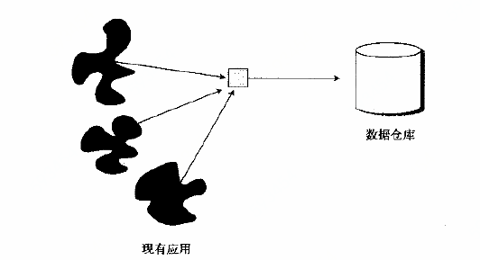
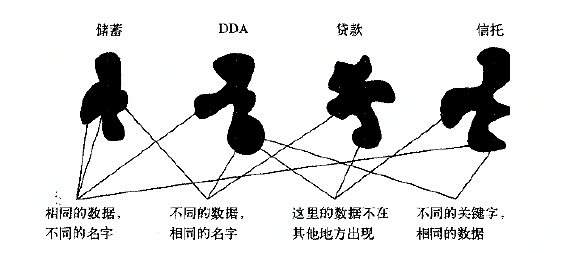
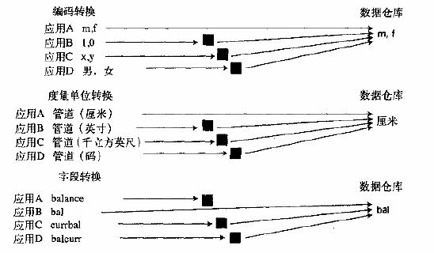
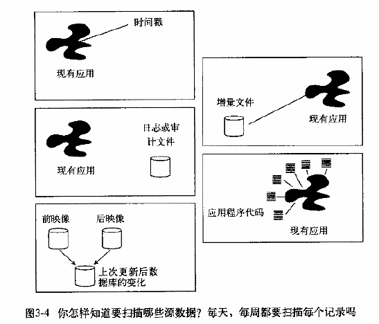
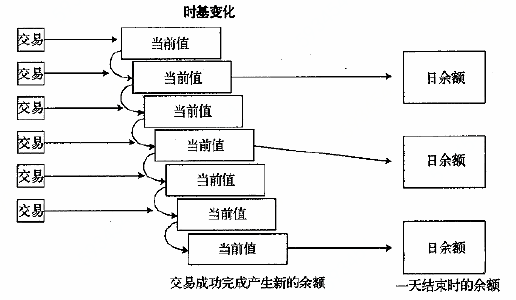
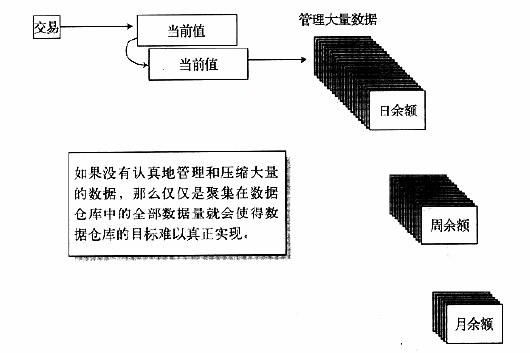
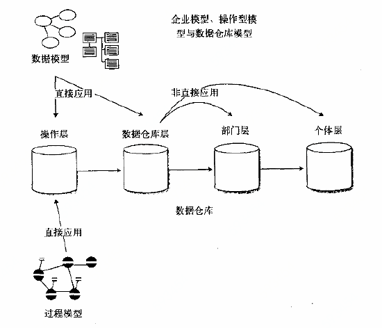

# 第三章 设计数据仓库

建造数据仓库主要包括两个部分的工作——与操作型系统接口的设计和数据仓库本身的设计。因为“设计”一次暗含了可以预先对组成单元进行规划的意思，所以用在这里不完全正确，数据仓库的需求只有在已装载了部分数据并开始使用时才能弄清楚。数据仓库是启发方式下键槽的，在这个过程中一个阶段的开发完全依赖于上一阶段获得的结果。首先，载入一部分数据供DSS分析员使用和查看，最终根据用户的反馈，修改数据和/或添加其他数据，然后建立数据仓库的另一部分，如此继续。这种反馈过程穿于数据仓库的整个开发生命周期之中。

因此，数据仓库的设计不能采用与传统的需求驱动的系统相同的方法进行。

## 3.1 从操作型数据开始

设计时首先要考虑的问题是如何将数据放置在数据仓库中，数据从操作型环境到数据仓库的放置过程中有许多需要考虑的东西。

起初，面向事务处理的操作型数据被封锁在现有历史系统中。仅仅是将数据从历史环境中取出并放到数据仓库中几乎挖掘不出数据仓库的任何潜力。

图3-1简单地展示了数据从现有历史系统环境转移到数据仓库的过程。这里，我们可以看到，有多个应用向数据仓库提供数据。

​							**图3-1 将数据从操作型环境移入数据仓库环境不是简单的抽取**

图3-1显得过于简单了，这里有很多原因，最重要的一个原因是，这一过程没有考虑到操作型环境中的数据是未经集成的。图3-2描述了一个典型的现有系统中缺乏集成的情况，将未经集成的数据载入到数据仓库是一个极端严重的错误。

​												**图3-2 不同应用的数据集成性很差**

在建立现有应用时，根本没有考虑过以后可能存在的集成问题，每一个应用都有其独有的特殊的需求。因此，出现相同的数据以不同的名字出现在各个地方，一些数据在不同的地方以相同的方式标注，一些数据用相同的名字存在相同的地方却使用了不同的度量单位等等。从多处抽取数据并将数据集成到一个统一的视图中是一个非常复杂的问题。

如图3-3所示，为了从操作型环境中适当地抽取数据，必须对无数细节编程进行一致性处理。

​			**图3-3 为了将现有系统环境中的数据正确转移到数据仓库环境中，必须进行集成**

数据缺乏集成的一个简单例子就是数据编码不一致，如图对性别的不同编码，在一个应用中，性别编码为"m/f"；另一个为“0/1”。在数据仓库中，只要性别的编码方法一致，因此：

- **在数据进入数据仓库时，必须先对各个应用的不同值进行正确地译码，然后再重新编码为合适的值**
- **必须将管道的度量单位转换为唯一并且一致的全局度量标准**
- **对于同一字段在不同应用中有不同的名称，必须建立不同源字段到数据仓库字段的映射**
- **原有数据在不同DBMS下可能以多种不同格式存储，所有数据都必须转换到另一种技术下存储**

另一个主要问题是访问现有系统数据的效率，扫描现有系统的程序如何知道一个文件已经被扫描过呢？现有系统环境中有大量的数据，每次进行数据仓库装载时都试图对所有数据扫描一次，既会产生极大的浪费，同事也是不现实的。

------

从操作型数据库导入数据到数据仓库有三大主要问题：

- 操作型系统表数据口径和标准不同需要统一转换为数据仓库的标准口径
- 操作型系统数据存储介质不同，数据同步时，数据仓库需要兼容多种存储介质读取数据
- 访问操作型数据的读取效率（我知道的解决方案：拉链表）

------

从操作型环境到数据仓库有三种装载工作要做：

- 装载档案数据
- 装载在操作型系统中的现有数据
- 将上次数据仓库刷新以来在操作型环境中不断发生变化(更新)从操作型环境中装载到数据仓库中

一般来说，数据仓库刚开始装载数据时从历史环境中装载档案数据的难度不是很大，原因有两点：一是因为不少企业发现在很多环境下使用旧的数据在成本上不合算，所以经常是根本不做这项工作；二是即使要装载，档案数据也只需要装载一次，所以难度不大。

同样，从现有的操作型环境中装载当前的、非档案数据由于只需要装载一次，因此难度也不大。通常可以将现有系统环境下载到一个顺序文件中，然后再将这个顺序文件下载到数据仓库中，这样就不会对在线环境产生什么破坏。

对数据体系结构设计者而言，当操作环境发生变化时，不断将变化数据装载到数据仓库中是最为困难的，要有效地捕捉到那些不断发生的日常变化，并对之进行处理并非是一件容易的事。于是，扫描现有系统的文件成了数据仓库体系结构设计者要面对的主要问题。

如图3-4所示，数据仓库刷新时，为了限制扫描的操作型数据量，通常可以采用五种技术：

- 第一种技术是扫描在操作型环境中那些被打上时戳的数据，当一个应用对记录的最近一次变化或重新打上时戳时，数据仓库扫描就能很有效地进行，因为日期不相符的数据就不必处理了。然而，当前被打上时戳的数据很少；
- 第二种控制扫描数据量的技术是增量扫描文件。增量文件是只包含在操作型环境中运行的事务的结果对应用造成的改变。有了增量文件，扫描的过程就变得高效，因为不在候选扫描集中的数据永远不会涉及到。然而，只有很少应用创建增量文件
- 第三种技术是对作为事务处理的副产品产生的日志文件或审计文件进行扫描，日志文件所包含的内容与增量文件基本相同。利用日志文件的另一个困难是它的内部格式是针对系统用途构造的，而不是针对应用程序；另外一个缺点是其中包含的内容比数据仓库开发人员所需要的内容多很多
- 第四种是修改应用程序代码，这并不常用，因为很多应用程序的代码陈旧而且不易修改
- 最后一种可供选择的技术，是将前一个映像文件和后一个映像文件进行比较。使用这种方法，抽取时就建立一个数据库快照。另一轮抽取时，建立另一个快照。然后将两个快照顺序比较，以确定已发生的业务活动。这种方法很麻烦、复杂，还需要各种各样的资源，只不过是没有办法时才采用的方法、

集成和性能并不是仅有的两个使得简单的抽取过程中无法用于构造数据仓库的主要问题，第三个主要困难是数据从操作型环境到数据仓库时要经历的时基变化。如图3-5所示。

​							**图3-5 当数据从操作型环境移到数据仓库环境时，时基要发生变化**

现有的操作型数据通常是当前值数据。当前值数据在被访问的时刻是准确有效的，而且是可更新的。但是数据仓库中的数据是不能更新的，此外，这些数据必须附加上时间元素。当数据从操作型环境传送到数据仓库时，其处理方法也要发生很大的变化。

当数据从现有操作型环境传送到数据仓库时，要考虑的另一个问题是需要对数据仓库中已有的及要传入数据的规模进行管理。数据在抽取和进入数据仓库时都要进行压缩，否则数据仓库中的数据量就会失控。图3-6所示为一种简单的数据压缩形式。

​									**图3-6 数据压缩是数据仓库数据的管理中至关重要的内容**

## 3.2 数据/过程模型与体系结构化环境

设计者在尝试使用传统的数据库设计方法之前，必须明白这些方法的适用范围及其局限性。图3-7说明了体系结构层次间的关系及数据建模和过程建模所适用的范围。过程模型仅仅适用于操作型环境。数据模型即可用于操作型环境，又可以用于数据仓库环境。

**过程模型**

一个过程模型一般包括以下内容：

- 功能分解
- 第零层上下文图
- 数据流图
- 结构图
- 状态转换图
- HIPO图
- 伪代码

在建立数据集市时，由于过程模型是需求驱动的，因此不适用于数据仓库。它假设在详细设计开始之前需求是已知的。对于许多过程，是可以这样假设的，但这样的假设在建造数据仓库时不成立。

​										**图3-7 如何在体系结构化环境中应用不同类型的模型**

## 3.3 数据仓库与数据模型

如图3-8所示，数据模型既适用于现有系统环境也适用于数据仓库环境。图3-8所示的是一个企业数据模型，该模型建造时没有考虑到现有操作型系统与数据仓库之间的差别。

