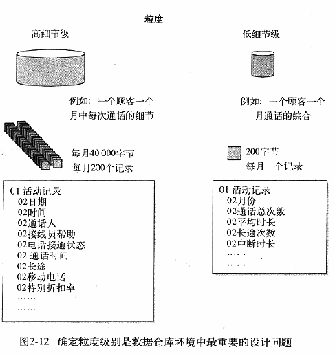
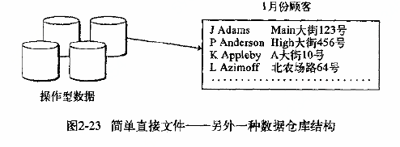

# 第二章 数据仓库环境

数据仓库是体系结构化环境的核心，是决策支持系统(DSS)处理的基础。本章将介绍数据仓库的一些非常重要的特性。数据仓库是一个

- 面向主题的（Subject Oriented） 
- 集成的（Integrated） 
- 非易失的（Non-Volatile） 
- 随时间变化的（Time Variant） 

用来支持管理人员决策的数据集合。

**面向主题**

主题（Subject）是在较高层次上将企业信息系统中的数据进行综合、归类和分析利用的一个抽象概念，每一个主题基本对应一个宏观的分析领域。 面向主题的数据组织方式，就是在较高层次上对分析对象数据的一个完整并且一致的描述，能刻画各个分析对象所涉及的企业各项数据，以及数据之间的联系。 典型的主题有：

- 顾客
- 产品
- 交易或者活动
- 政策
- 索赔
- 帐目

**集成**

集成是在数据仓库的所有特性之中，最重要的一种。 数据仓库中的数据是从多个不同的数据源抽取过来的。应用设计人员多年来做出的各种设计决策有很多种不同的表示方法。他们在建立一个应用时，从来不会考虑他们正在操作的数据在将来的某天会进入数据仓库，并与其他应用的数据进行集成。这样的后果是多个应用之间在编码、命名习惯、物理属性、属性度量单位等方面不存在任何一致性。 当数据进入数据仓库时，要采用某种方法来消除应用层的许多不一致性。 数据仓库中的编码是何表现形式并不重要，重要的是编码的一致性，如果不一致，就需要进行转换。

**非易失性**

下图说明了数据的非易失性和对操作型数据的访问和处理，一般是按一次一条记录的方式进行。

操作型环境中的数据一般是周期性的更新或者实时性的更新。数据仓库中的数据呈现出一组非常不同的特性。数据仓库的数据通常以批量方式载入与访问。数据仓库环境中并不进行数据的更新。数据仓库中的数据在进行装载时是以静态快照的格式进行的。当产生后继变化时，一个新的快照记录就会写入数据仓库。这样，在数据仓库中就保持了数据的历史状况。

**随时间变化**

数据仓库的最后一个显著特性是随时间变化。时变性的意思是数据仓库中每个数据单元是在某一时间是准确的。在一些情况下，记录中有时间戳，而另外一些情况下则记录一个事务的时间。总之，在多数情况下，记录都包含某种形式的时间标志用以说明数据在那一时间是准确的。

操作型数据含有当前值，这些数据的准备性在访问时是有效的，其随着业务系统的变化而更新。数据仓库中的数据仅仅是一系列在某时刻生成的复杂快照。这一些列快照使数据仓库保留了活动和事件的历史记录，操作类型数据的关键字结构可能包含也可能不包含时间元素，如年、月、日等，而数据仓库的关键字结构总是包含时间元素。

## 2.1 数据仓库结构

数据仓库环境中存在着不同的细节级：早期细节级(通常是存储在备用的海量存储器上)、当前细节级、轻度总和数据级(数据集市级)以及高度总和数据级。数据由操作型环境导入数据仓库，很多数据转换发生在操作层向数据仓库层传输过程中。

### 2.2 面向主题

数据仓库面向高层企业数据模型中已经定义好的企业主题域。典型的主题域有：

- 顾客
- 产品
- 交易或活动
- 政策
- 索赔
- 账目

在数据仓库中，每一个主要主题域都是以一组相关的表来具体实现的，一个主题域可能由10个，100个或更多的相互关联的物理表构成。

顾客主题域的所有物理表通过一个公共关键字关系起来，如图2-7所示，顾客主题域使用公共关键字顾客ID将顾客主题域中所找到的所有数据联系起来。

主题域的数据可以存储在不同的介质上，访问频繁且占用存储空间小的数据放在快速且相对昂贵的存储介质上；访问较少且占用存储空间大的数据存放在廉价、慢速的存储介质上。存储在不同的存储介质上意味着在数据仓库中可能有多个数据库管理系统(DBMS)对数据进行管理。

DASD和磁带是数据仓库中最多应用的两种数据存储介质，这些数据既有细节级的明细数据，也有综合级的维度数据。

### 2.3 第一天到第n天的现象

### 2.4 粒度

粒度问题是设计数据仓库的最重要的方面，粒度指的是数据仓库中数据单元的细节程度或综合程度的级别。细节程度越高，粒度级别就越低。

数据粒度一直以来都是一个主要的设计问题，在早期建立的操作型系统中，就考虑到了粒度问题，当更新细节数据时，几乎总是假定把它存放在最低粒度级上。

zai 

在数据仓库环境中粒度之所以是最重要的设计问题，是因为它会深刻地影响存放在数据仓库中的数据量的大小以及数据仓库中所能回答的查询类型。数据仓库中数据量的大小与查询的细节程度成反比。粒度级别越低，查询范围越广，反之，级别粒度越高，查询越少。

数据仓库的主要设计问题：粒度、分区和适当设计。

在高粒度级上，由于数据经过压缩更为简洁，所以能够很快提供一个答案。如果在高级粒度上包括了足够多的细节，则使用高粒度数据的效率将会高很多。

在设计和构造数据仓库之初必须仔细权衡各种因素。

### 2.5 探查与数据挖掘

数据改库中粒度化不但可以支持数据集市还可以支持探查和数据挖掘，探查和数据挖掘需要大量历史细节数据。

数据仓库包含了对探查与数据挖掘工具非常有用的数据源。数据仓库中经过清理的、集成的和有组织的历史数据证实探查和数据挖掘者开展探查与数据挖掘活动所需要的基础。

### 2.6 活样本数据库

有些时候，对于正常的存取和分析来说，仓库中的数据实在是太多了。如果出现这种情况。必须使用一些特殊的设计方案。

活样本数据库是数据仓库中的一种混合形式，在数据仓库中的数据增长到非常大时，对于查询轻度聚合统计非常有效。活样本数据是从数据仓库中取得的真实档案数据或轻度综合数据的一个子集。术语**样本**是指它是一个大的数据库的子集(样本)，**活**是指这个数据库需要进行周期刷新。如下图所示为一个活样本数据库。

活样本数据库不是通用的数据库，适用于统计分析和观察发展趋势。当数据必须以整体观察时，活样本数据能够提供理想的结果。

建立活样本数据库的一个重要问题是如果装载数据，这决定了活样本数据库中的数据量以及其中的数据随机程度。它是用一个抽取/选择程序搜索一个大规模的数据库，选取1/100或1/1000的记录。

对于样本记录的选取一般是随机的，必要时可以采用一个判断样本。判断样本带来的问题会使活样本数据具有某种偏差，随机抽取数据带来的问题是可能数据不具有统计意义。其最大好处是**存取效率高效**。

一种观点认为进行统计分析会导致错误的理论。例如：分析员分析一个具有250000000条记录的大文件，确定路上56.7%的司机是男性；而使用活样本数据库得出55.9%的司机是男性，前一种分析比后一种分析需要的资源大的多，而计算得出的结论差异却非常小。用大规模数据库进行分析会比较准确，但是代价太高了，尤其是在迭代式进行的启发式处理时，这种代价难以接受。

采用活样本数据是在数据仓库中改变粒度，以便于进行DSS处理的另一种方法。

### 2.7 分区设计方法

数据仓库中数据的第二个主要设计问题(在粒度问题之后)是分区。数据分区是指把数据分散到可独立处理的分离物理单元中去，在数据仓库中，围绕分区问题的焦点不是该不该分区而是如何分区。

恰当的分区可以给数据仓库在多方面带来好处：

- 数据装载
- 数据访问
- 数据存档
- 数据删除
- 数据监控
- 数据存储

恰当地进行数据分区使得数据可以增长，并且可以进行管理。

#### 2.7.1 数据分区

对当前细节数据进行分区的目的是把数据划分成小的可管理的物理单元。数据分区为什么如此重要呢？这是因为运行维护人员和设计者在管理小的物理单元时将比管理大的物理单元时享有更大的灵活性。

当数据存放在大的物理单元中时，以下这些任务将无法轻松地进行：

- 重构
- 索引
- 顺序扫描
- 重组
- 恢复
- 监控

简单来说，数据仓库的本质之一就是灵活地访问数据，如果是大块的数据，就达不到这一要求，因而，对所有当前细节的数据仓库数据都要进行分区。

当结构相似的数据被分到多个数据的物理单元时，数据便被分区的，此外，任何给定的数据单元属于且仅属于一个分区。

有多种数据分区的标准。例如，按：

- 时间
- 业务条线
- 地理位置
- 组织单位
- 所有上述标准

数据分区的标准完全由开发人员来决定。然而，在数据仓库环境中，日期几乎总是分区标准中的一个必然组成部分。

数据分区可以采用多种方式，数据仓库开发人员面临的主要问题之一是在系统层上还是在应用层上对数据进行分区。在系统层上进行分区在一定程度上是某些DBMS和操作系统的一种功能，在应用层上进行分区由设计的应用程序代码完成，而且只由开发者和程序员严格控制。

通常，在应用层上对数据仓库分区是很有意义的，应用层上每个时间分区的数据有不同的定义。

对数据分区最严峻的考验是提出这样的问题：“能否在分区中加入索引而不会明显地妨碍其他操作？”如果一个索引能随意加上去的话，那么这种分区就足够理想了，如果索引不能很容易地加入，那么这个分区还是要分得更精细一点。

## 2.8 数据仓库中的数据组织

数据仓库中有多种数据组织形式，最简单最常用的数据组织形式也许是简单堆积结构。如图2-20所示。图2-20表示从操作型环境中传输的日常事务记录(例如：MySQL库表)，再综合成数据仓库记录。这个综合可以根据顾客、账目或者根据任何数据仓库的主题域来进行。图2-20的事务处理是以每天进行综合的。换句话说，对一个顾客的一个账号每天所有活动进行合计，并在一天一天的基础上进入数据仓库。

​			**图2-20  数据仓库中最简单的数据组织形式是以逐个记录为基础的堆积数据 简单堆积结构**

图2-21表示简单逐日堆积数据的一个变种，称为轮转综合数据存储。

数据用与前面相同的处理方式从操作环境中进入到数据仓库环境中，然而，在轮转综合数据中，数据载入到一种完全不同的结构中。第一周的7天活动逐一综合到7个相应的日槽中，到第8天，将7个日槽加在一起，放在第1个周槽中，然后，第8日放在第1个日槽中。

月底将各个周槽加到一起，并放入第1个月槽中，然后各周清零。到了年底，将每个月槽加在一起，放入第一个年槽中，然后每个月清零。

轮转综合数据结构与简单堆积结构相比，仅处理非常少的数据单元，他们之间的优缺点比较如图2-22所示：

数据改库数据的另外一种组织形式是简单直接文件，如图2-23所示。

图2-23表明，数据仅仅是从操作型环境拖入数据仓库环境中，并没有任何积累。另外，简单直接文件不是在每天的基础上组织的，而是以较长时间生成的，比如1周或1个月。因此，简单直接文件时操作型数据间隔一定时间的快照。

依据两个或者更多的简单直接文件能生成一种连续文件。图2-24把1月份和2月份的两个数据快照合并，创建数据的一个连续文件。

连续文件也可以通过把一个快照追加到一个以前生成的连续文件上来创建，如图2-25所示。

数据仓库中还有许多其他的数据组织形式，最常用的是：

- 简单堆积
- 轮转综合
- 简单直接文件
- 连续文件

在关键字层，数据仓库的关键字总是符合关键字，这有两种强制性的理由：

- 日期——年、年/月、年/月/日，等等，几乎总是关键字的一部分
- 因为数据仓库中的数据是分区的，分区的不同部分表现为关键字的一部分

## 2.9 审计与数据仓库

即使能对数据仓库审计，也不应该进行，不这样做的主要原因如下：

- 原先在数据仓库中没有的数据会突然出现
- 当需要审计能力时，数据进入数据仓库的时间标定过程会发生剧烈变化
- 当需要审计能力时，数据仓库的备份与恢复限制会放生急剧变化

## 2.10 数据的同构/异构

数据仓库中数据的所有记录类型是相同的，在这一意义下，看起来数据仓库中的数据也是同构的。而事实上，数据仓库的数据是异构的。数据仓库中的数据被分到称为主题域的主要子划分中。图2-26表示一个有产品、顾客、销售商以及交易这几个主题域的数据仓库。

​														**图2-26 数据划分到主题域**

数据仓库中数据的第一次划分是按照公司主要主题进行的。但是，对每一个主题域还有更细的划分。主题域中的数据又划分到多个表中，图2-27表示产品这一主题域进一步划分到表中的情形。

​					**图2-27 主题域由多个不同类型的表构成，每个表都以通用的产品ID作为关键字的一部分**

如图2-27中所示五个表构成了数据仓库中的产品主题域。每个表都有自身的数据，但这一主题域中的每一个表又共享同一主线——产品，即键/外键数据单元。

构成主题域的物理表中还有更细的划分，这些划分是按照出现数据值的差异创建的，例如，在产品收发货表中，有一月发货，二月发货等等。

因此数据仓库中的数据按下列标准化分：

- 主题域
- 表
- 数据在表中的出现

数据仓库中数据的这种组织方式使得数据能够基于数据仓库数据简历的体系结构各个部分容易地访问和理解。结果如图2-28所示，数据仓库与其中粒度化的数据成为许多不同应用的基础。针对多种不同的目的以不同的方式访问数据。

​										**图2-28 数据仓库位于大框架的中心**

## 2.11 数据仓库中的数据清理

数据并非永久性地注入数据仓库，它在数据仓库中也有自己的生命周期。到了一定时候，数据将从仓库中清除。数据清理问题是数据仓库设计人员无法回避的基本设计问题之一。