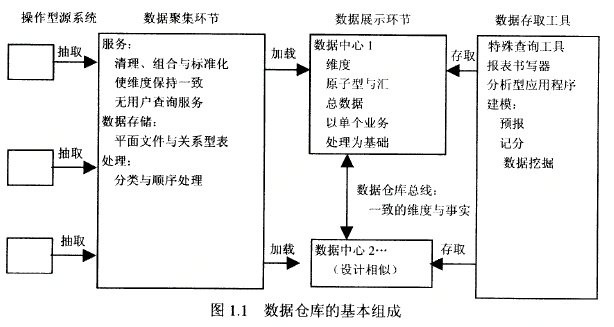

# 第一章 维度建模初步

本章主要概念：

- 数据仓库受业务驱动的最终目标
- 数据仓库体系的主要构件
- 维度建模在数据仓库展示环节方面的重要性
- 事实表和维度表术语
- 数据仓库构件需要避免的常见错误
- 有关维度建模的讹传

## 1.1 信息应用的不同领域

对于任何机构而言，信息都是其最重要的资产之一，并且几乎总是以操作型系统的记录和数据仓库这两种形式存在。粗略的说，操作型系统就是存入数据的地方，而数据仓库就是索取数据之所在。

操作型系统的用户推动这机构轮子的运转，从事获取订单、注册新顾客与记录投诉内容等工作。这类用户几乎总是按一次一条记录的方式进行着数据的处理，并不断重复着这样的操作型作业。

数据仓库的用户则观测轮子的运转，从事对新订单进行计数、询问注册新顾客的原因以及顾客因何原因抱怨等工作。这类用户几乎从来不按一次一行记录的方式处理数据，相反，他们往往需要搜索成百上千的记录并压缩成几个答案，从而使提出的问题得以解答。而且，如果情况特别复杂，需要不断变换提问的种类。

## 1.2 数据仓库的最终目标

**数据仓库必须使组织架构的信息变得容易存取**。数据仓库的内容必定是容易理解的，数据对于业务人员也必定是直观的、明显的，而不能仅仅对开发人员来说是这样。容易理解意味着容易阅读，而数据内容在标识方面应该是见名知义的。业务人员要能够以永无止境的组合形式，对仓库中的数据进行通常称之为切割处理的分离与合并操作。数据仓库存取工具必须简单易用，并以最短的延迟时间将查询结果返回给用户。

**数据仓库必须一致地展示组织结构的信息**。数据仓库中的数据必须是可信的。它必须通过机构的各种渠道收集得到并精心组织起来，必须经过整理、具有质量保证并且在量上满足了用户需求的情况下才进行发布。通过不同处理方法得到的信息应该相互匹配。如果两个性能度量值具有相同的称谓，那么含义上应该指的是相同的事情，相反，如果两者表示的不是同样的事情，就应该具有不同的标识。具有一致性的信息意味着，信息是高质量的且全部数据都纳入了考虑，因而是完整的。一致性还意味着，关于数据仓库内容的所有定义对于用户都是共同的。

**数据仓库必须具有广泛的适应性和便于修改**。修改是不可回避的，用户需求、业务情形、数据内容和技术状况等，都要接受迅速移动着的时间沙丘的洗礼。数据仓库在设计上要能够处理这种不可避免的变化。针对数据仓库的修改应该是自然的，亦即不会使现有的数据或者应用无效。在业务提出新问题或者有新的数据加入到数据仓库时，现有数据和应用不应该发生改变或者崩溃。

**数据仓库必须发挥安全堡垒作用以保护信息资产**。

**数据仓库必须在推进有效决策方面承担最基本的角色**。数据仓库必须为决策的制定提供正确的数据支持。

**数据仓库为业务群里所接受的前提是被认定是成功的**。

### 1.2.1 出版业方面的比喻实例

数据仓库管理人员职责：

- 在业务范围、工作职责和计算机性能等方面多为用户考虑
- 确定业务用户在数据仓库帮助下想要做出什么样的决策
- 标定那些使用数据仓库进行效能高而作用大的决策制定的最佳用户
- 寻找潜在的新用户并让他们了解数据仓库
- 选取哪些从机构海量数据中挑出的最有效和最富有实际意义的数据子集在数据仓库中进行展示
- 适应用户对相关处理概况的感性认识，将用户接口和应用做得简单并且时模板驱动的
- 跨部门一致性地标注数据，确保数据是准确的、可信的
- 持续不断地对数据的准确性和提交报告的内容进行监控
- 搜罗新的数据来源，持续不断地调整数据仓库以适应数据概况的修改、需求支持和业务优先权的调整等方面的需要
- 抽取一分部在使用数据仓库进行业务决策方面具有良好声誉的实现，并用这些成功的例子对人员、软件和硬件配备与选购是否合理做出判断
- 按通行的方式发布数据
- 维持业务用户的信任
- 让业务用户、经理和老板都感到满意

## 1.3 数据仓库的组成

每个仓库构件都发挥着一种特定的作用，对于数据仓库的建造而言，最大的威胁就是对构建的角色和作用的混淆。

如图1.1所示，在开发数仓环境时，有4个相互分离的独特构件需要考虑——操作型源系统、数据聚集环节、数据展示环节与数据存取工具。

### 1.3.1 操作型源系统

操作型源系统是获取行业事务的记录(形式的)操作型系统。源系统或许应该被当做数据仓库意外的部分加以对待，因为一般情况下，只能对源系统转发过来的数据内容及其格式施加少量的控制。源系统优先解决的是处理的高性能和可用性。对源系统的查询是小范围内一次一条记录的查询。它只是一般事务流量中的一部分，并严格限制在针对操作型系统进行的请求方面。源系统并不以数据仓库普遍采用的那种宽泛而不可预测的方式进行数据查询。源系统几乎不维护什么历史数据，完全可以将重现旧内容方面的许多事情交给数据仓库来完成。

### 1.3.2 数据聚集环节

数据仓库的聚集环节包括存储环节和一般称之为析取转换加载(ETL)的一组处理过程。操作型源系统和数据展示环节之间的部分，都属于数据存储环节之列。

数据聚集环节的关键性结构要件，就是不受行业用户的束缚，不必提供查询和展示服务。

析取是将数据聚集到数据仓库处理过程的第一步。析取和析取操作意味着读解析源数据，并将数据仓库所需要的数据复制到聚集环节做进一步处理。

一旦数据被析取到聚集环节，就意味着要进行大量可能的转换，这包括数据的清理(拼写错误的更正、定义冲突的消除元素丢失的补充，标准格式的析构)、多数据源的组合、重复数据的去除以及仓库关键字的分配等。这些转换是为数据加载到数据仓库展示环节所进行的准备。

数据聚集环节主要进行如分类和排序这样的简单活动。在许多情况下，它并不基于关系技术，而有可能包含一些平面文件系统，在按定义的一对一和多对一业务规则检验数据之后，很可能突然发现，为建立一个地道的第3范式物理数据库而采取最后的步骤已经变得毫无意义。

### 1.3.3 数据展示

数据展示环节是进行数据组织、存储并向用户、报表撰写和其他分析型应用提供直接查询操作的场所。后台聚集环节是用户接触不到的，这样一来，展示环节就成为业务群体眼中的数据仓库，它是业务群体通过数据存取工具所看到的和接触的一切。

一般来说，展示环节就是一些列数据中心的集成。一个数据中心就是整个展示环节拼图的一个契块。

关于展示环节有几个特别需要注意的方面。首先，数据应该以维度形式进行展示、存储和访问。维度建模相对以往那种着力于构造简单而可理解的数据库的技术手段而言，是一个新名词。

从开始就注重简明性的数据模型，才更有望最终也是简单的，而开始就显得复杂的数据模型最终必然是过于复杂的。过于复杂的模型运行起来会很慢，不能为业务用户所接受。维度建模与第3范式建模很不相同。3NF建模是一种以消除数据冗余为追求目标的设计技术，在这里，数据被划分成许多离散的实体，而每个实体形成关系数据库中的一个表。譬如，构造一个销售单数据库并不就从为每行顺序生成一条记录开始，而是要将其先转换成复杂得令人吃惊的蛛网状3NF模型图，这样的图包含成百上千的规范化表格是很有可能的。

### 1.3.4 数据存取工具

数据仓库环境中最后一个主要构件是数据存取工具。从定义角度将，所有数据存取工具访问的是数据仓库展示环节中的数据。

