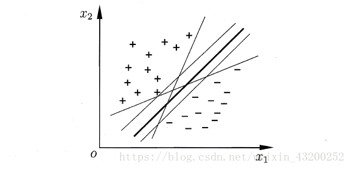
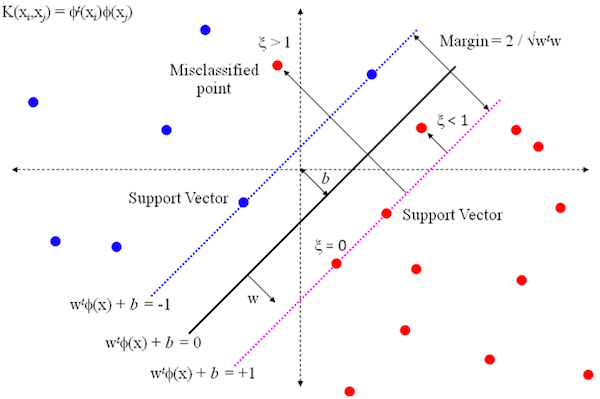
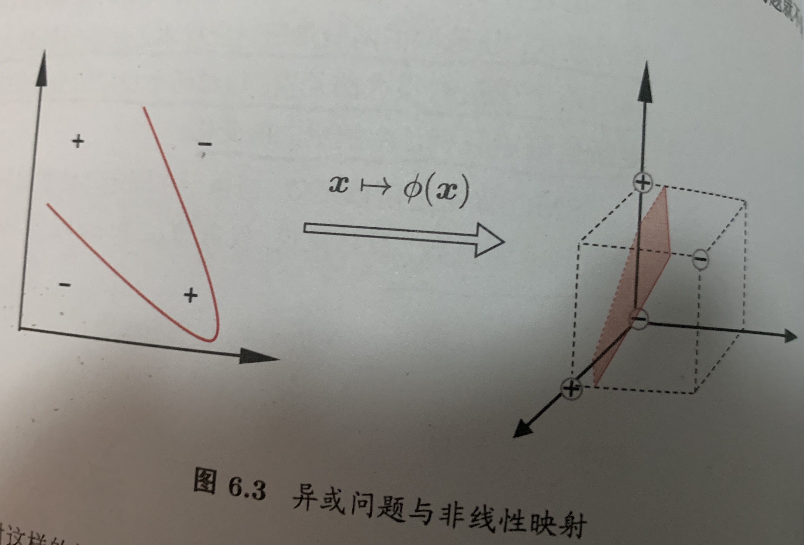

**支持向量机**（Support Vector Machine，简称SVM）是一种针对二分类任务设计的分类器，它的理论相对神经网络模型来说更加完备和严密，并且效果显著，结果可预测，是非常值得学习的模型。

这一章的内容大致如下：

- **间隔与支持向量**：如何计算空间中任一点到超平面的距离？什么是支持向量？什么是间隔？支持向量机求解的目标是什么？
- **对偶问题**：求取最大间隔等价于怎样的对偶问题？KKT条件揭示出支持向量机的什么性质？如何用SMO算法进行高效求解？为什么SMO算法能高效求解？
- **核函数**：如何处理非线性可分问题？什么是核函数？为什么需要核函数？有哪些常用的核函数？核函数具有什么性质？
- **软间隔与正则化**：如何应对过拟合问题？软间隔和硬间隔分别指什么？如何求解软间隔支持向量机？0/1损失函数有哪些可选的替代损失函数？支持向量机和对率回归模型有什么联系？结构风险和经验风险分别指什么？
- **支持向量回归**：什么是支持向量回归？与传统回归模型有什么不同？支持向量回归的支持向量满足什么条件？
- **核方法**：什么是表示定理？什么是核方法？如何应用？

# 6.1 间隔与支持向量

给定训练样本集$D = \{(x_1, y_1), (x_2, y_2), \dots, (x_n, y_n)\}, y\in\{-1, +1\}$，分类学习算法的最基本思想是基于训练集$D$在样本空间中找到一个划分超平面，将不同类别样本分开，但是能将训练样本分开的超平面有很多，应该选哪个呢？

直观上看。选择加粗的超平面最合适，因为该划分超平面对训练样本局部扰动的**容忍性**最好。当超平面距离与它最近的数据点的间隔越大，分类的鲁棒性越好，即当新的数据点加入时，超平面对这些点的适应性最强，出错的可能性最小。

在样本空间中，划分超平面可以通过如下线性方程描述：
$$
w^Tx + b = 0 \tag{6.1}
$$
其中$w=\{w_1;w_2,\dots, w_d\}$为法向量，决定了超平面的方向，$b$为位移项，决定超平面与原点的距离。

## 6.1.1 函数间隔

在超平面$w^Tx+b=0$确定的情况下，$|w^Tx*+b|$能够代表点$x$距离超平面的远近，易知：当$w^Tx+b>0$时，表示x在超平面的一侧（正类，类标为1），而当$w^Tx*+b<0$时，则表示x超平面的另外一侧（负类，类别为-1），因此$(w^Tx+b)$的正负性恰能表示数据点x是否被分类正确。于是便引出了**函数间隔**的定义（functional margin）:
$$
\hat{\gamma} = y(w^Tx + b) = yf(x) \tag{6.1.1}
$$
而超平面（w,b）关于所有样本点（Xi，Yi）的函数间隔最小值则为超平面在训练数据集T上的函数间隔：
$$
\hat{\gamma} = min \hat{\gamma_i} \tag{6.1.2} 
$$
可以看出：这样定义的函数间隔在处理SVM上会有问题，当超平面的两个参数w和b同比例改变时，函数间隔也会跟着改变，但是实际上超平面还是原来的超平面，并没有变化。例如：$w_1x_1+w_2x_2+w_3x_3+b=0$其实等价于$2w_1x_1+2w_2x_2+2w_3x_3+2b=0$，但计算的函数间隔却翻了一倍。从而引出了能真正度量点到超平面距离的概念--几何间隔（geometrical margin）。

## 6.1.2 几何间隔

**几何间隔**代表的则是数据点到超平面的真实距离，对于超平面$w'x+b=0$，$w$代表的是该超平面的法向量，设$x$为超平面外一点x在法向量$w$方向上的投影点，x与超平面的距离为r，则有$x=x-r(\frac{w}{||w||})$，又x在超平面上，即$w'x+b=0$，代入即可得：
$$
\gamma =\frac{|w^Tx +b|}{||w||} \tag{6.2}
$$
假设超平面$(w,b)$能将训练样本正确分类，对于$(x_i,y_i)\in D$，对于所有标记为+1的点有 $\mathbf{w}^T\mathbf{x}+b>0$，所有标记为-1的点有 $\mathbf{w}^T\mathbf{x}+b<0$。令：
$$
\begin{cases}{\boldsymbol{w}^{\mathrm{T}} \boldsymbol{x}^{i}+b \geqslant+1,} & {y^{i}=+1} \\ {\boldsymbol{w}^{\mathrm{T}} \boldsymbol{x}^{i}+b \leqslant-1,} & {y^{i}=-1}\end{cases} \tag{6.3}
$$
**[推导]**：假设这个超平面是$\left(\boldsymbol{w}^{\prime}\right)^{\top} \boldsymbol{x}+b^{\prime}=0$，对于$\left(\boldsymbol{x}^{i}, y^{i}\right) \in D$，有：
$$
\begin{cases}{\left(\boldsymbol{w}^{\prime}\right)^{\top} \boldsymbol{x}^{i}+b^{\prime}>0,} & {y^{i}=+1} \\ {\left(\boldsymbol{w}^{\prime}\right)^{\top} \boldsymbol{x}^{i}+b^{\prime}<0,} & {y^{i}=-1}\end{cases}  \tag{6.3.1}
$$
根据几何间隔，将以上关系修正为： 
$$
\begin{cases}\left(\boldsymbol{w}^{\prime}\right)^{\top} \boldsymbol{x}^{i}+b^{\prime} \geq+\zeta & {y^{i}=+1} \\ {\left(\boldsymbol{w}^{\prime}\right)^{\top} \boldsymbol{x}^{i}+b^{\prime} \leq-\zeta,} & {y^{i}=-1}\end{cases} \tag{6.3.2}
$$
 其中$\zeta$为某个大于零的常数，两边同除以$\zeta$，再次修正以上关系为：
$$
\begin{cases}{\left(\frac{1}{\zeta} \boldsymbol{w}^{\prime}\right)^{\top} \boldsymbol{x}^{i}+\frac{b^{\prime}}{\zeta} \geq+1,} & {y^{i}=+1} \\ {\left(\frac{1}{\zeta} \boldsymbol{w}^{\prime}\right)^{\top} \boldsymbol{x}^{i}+\frac{b^{\prime}}{\zeta} \leq-1,} & {y^{i}=-1}\end{cases} \tag{6.3.3}
$$
 令：$\boldsymbol{w}=\frac{1}{\zeta} \boldsymbol{w}^{\prime}, b=\frac{b^{\prime}}{\zeta}$，则以上关系可写为:
$$
\begin{cases}{\boldsymbol{w}^{\top} \boldsymbol{x}^{i}+b \geq+1,} & {y^{i}=+1} \\{\boldsymbol{w}^{\top} \boldsymbol{x}^{i}+b \leq-1,} & {y^{i}=-1}\end{cases} \tag{6.3.4}
$$
从上述函数间隔与几何间隔的定义可以看出：实质上函数间隔就是$|w'x+b|$，而几何间隔就是点到超平面的距离。

## 6.1.3 最大间隔与支持向量

而SVM中定义**使得式(6.3)等号成立的训练样本点**就是**支持向量（support vector）**（如果叫作**支持点**可能更好理解一些，因为事实上就是样本空间中的数据点，但因为我们在表示数据点的时候一般写成向量形式，所以就称为支持向量），它们是距离超平面最近的几个样本点，也即上面图中两条虚线上的点。两个异类支持向量到超平面的距离之和为：
$$
\zeta = \frac{2}{||w||} \tag{6.4}
$$
它被称为**间隔**。

在SVM中，我们希望实现的是**最大化两类支持向量到超平面的距离之和**，那首先就得知道怎么计算距离。**怎样计算样本空间中任意数据点到划分超平面的距离**呢？

画了一个图，方便讲解。图中蓝色线即超平面，对应直线方程 $\mathbf{w}^T\mathbf{x}+b=0$。投影向量 $\mathbf{w}$垂直于超平面，点 $x$ 对应向量 $\mathbf{x}$，过点 $x$ 作超平面的垂线，交点 $x_0$ 对应向量 $\mathbf{x_0}$。假设**由点 $x_0$ 指向点 $x$ 的向量**为 $\mathbf{r}$，长度（也即点 $x$ 与超平面的距离）为 $r$。有两种方法计算可以计算出 $r$ 的大小：

##### 方法1：向量计算

由向量加法定义可得 $\mathbf{x} = \mathbf{x_0} + \mathbf{r}$。

那么向量 $\mathbf{r}$ 等于什么呢？它等于这个方向的单位向量乘上 $r$，也即有 $\mathbf{r} = \frac{\mathbf{w}}{\Vert \mathbf{w} \Vert} \cdot r$

因此又有 $\mathbf{x} = \mathbf{x_0} + \frac{\mathbf{w}}{\Vert \mathbf{w} \Vert} \cdot r$。

由于点 $x_0$ 在超平面上，所以有 $\mathbf{w}^T\mathbf{x_0}+b=0$

由 
$$
\mathbf{x} = \mathbf{x_0} + \frac{\mathbf{w}}{\Vert \mathbf{w} \Vert} \cdot r \tag{3.6.5}
$$
可得 $\mathbf{x_0} = \mathbf{x} - \frac{\mathbf{w}}{\Vert \mathbf{w} \Vert} \cdot r$，代入直线方程消去 $\mathbf{x_0}$：
$$
\mathbf{w}^T\mathbf{x_0}+b = \mathbf{w}^T(\mathbf{x} - \frac{\mathbf{w}}{\Vert \mathbf{w} \Vert} \cdot r)+b = 0 \tag{6.3.6}
$$
简单变换即可得到:

$$
r = \frac{\mathbf{w}^T\mathbf{x}+b}{\Vert \mathbf{w} \Vert} \tag{6.3.7}
$$
又因为我们取距离为正值，所以要加上绝对值符号：

$$
r = \frac{|\mathbf{w}^T\mathbf{x}+b|}{\Vert \mathbf{w} \Vert} \tag{6.3.8}
$$

##### 方法2：点到直线距离公式

假设直线方程为 $ax_1 + bx_2 + c= 0$，那么有点到直线距离公式：

$$
r = \frac{|ax + bx_2 + c|}{\sqrt{a^2+b^2}}  \tag{6.3.9}
$$
令 $\mathbf{w} = (a,b)$，$\mathbf{x} = (x_1,x_2)$，则可以把 $ax_1 + bx_2$ 写成向量形式 $\mathbf{w}^T\mathbf{x}$。把截距项设为$b$，则直线方程变为 $\mathbf{w}^T\mathbf{x}+b=0$，代入距离公式可得：

$$
r = \frac{|\mathbf{w}^T\mathbf{x}+b|}{\sqrt{\mathbf{w}^T\mathbf{w}}} = \frac{|\mathbf{w}^T\mathbf{x}+b|}{\Vert \mathbf{w} \Vert} \tag{6.3.10}
$$
该式扩展到多维情况下也是通用的。

欲找到具有最大间隔的划分超平面，也就是能满足式(6.3)中约束的参数$w$和$b$，使得$\gamma$最大，即：
$$
\max_{\mathbf{w},b} \frac{2}{\Vert \mathbf{w} \Vert} \\ \quad s.t. \quad y_i(\mathbf{w}^T\mathbf{x}+b) \geq 1, \quad i=1,2,...,m \tag{6.5}
$$
约束部分指的是全部样本都被正确分类，此时标记值（$+1$ 或 $-1$）乘上预测值（$\geq +1$ 或 $\leq -1$）必定是一个 $\geq 1$ 的数值。

看上去间隔大小只与 $\mathbf{w}$ 有关，但实际上位移项 $b$ 也通过约束影响着 $\mathbf{w}$ 的取值，进而对间隔产生影响。

由于最大化 $\Vert \mathbf{w} \Vert^{-1}$ 等价于最小化 $\Vert \mathbf{w} \Vert^{2}$，所以可以重写**目标函数**为：
$$
\min_{\mathbf{w},b} \frac{1}{2} \Vert \mathbf{w} \Vert^2 \\ \quad s.t. \quad y_i(\mathbf{w}^T\mathbf{x}+b) \geq 1, \quad i=1,2,...,m\qquad \tag{6.6}
$$
引入 $\frac{1}{2}$ 是为了求导时可以约去平方项的2，这便是**支持向量机的基本型**。

# 6.2 对偶问题

我们希望求解式(6.6) 对应来得到最大间隔划分超平面对应的模型：
$$
f(x) = w^Tx+b \tag{6.7}
$$
式(6.6)是一个**带约束的凸二次规划（convex quadratic programming）问题**（凸问题就意味着必定能求到全局最优解，而不会陷入局部最优）。对这样一个问题，可以直接用现成的优化计算包求解，但这一小节介绍的是一种更高效的方法。

对式(6.6)使用拉格朗日子乘法可得到其的**对偶问题**（dual problem），具体步骤如下：

1. 首先为式（6.6）的每条约束添加拉格朗日乘子 $a_i \geq 0$（对应m个样本的m条约束），得到该问题的拉格朗日函数：   

$$
L(\mathbf{w},b,\mathbf{a}) = \frac{1}{2} \Vert \mathbf{w} \Vert^2 + \sum_{i=1}^m a_i(1-y_i(\mathbf{w}^T\mathbf{x}_i+b))\qquad \tag{6.8}
$$

​       [推导]： 待求目标: 
$$
\begin{aligned} \min_{\boldsymbol{x}}\quad f(\boldsymbol{x})\\ s.t.\quad h(\boldsymbol{x})&=0\\ g(\boldsymbol{x}) &\leq 0 \end{aligned} \tag{6.8.1}
$$
​	   等式约束和不等式约束：$h(\boldsymbol{x})=0, g(\boldsymbol{x}) \leq 0$分别是由一个等式方程和一个不等式方程组成的方程组。

​		拉格朗日乘子：$\boldsymbol{\lambda}=\left(\lambda_{1}, \lambda_{2}, \ldots, \lambda_{m}\right)$ $\qquad\boldsymbol{\mu}=\left(\mu_{1}, \mu_{2}, \ldots, \mu_{n}\right)$

​		拉格朗日函数：$L(\boldsymbol{x}, \boldsymbol{\lambda}, \boldsymbol{\mu})=f(\boldsymbol{x})+\boldsymbol{\lambda} h(\boldsymbol{x})+\boldsymbol{\mu} g(\boldsymbol{x})$

​		其中 $\mathbf{a} = (a_1;a_2;...;a_m)$，对拉格朗日函数求 $\mathbf{w}$ 和 $b$ 的偏导，并令偏导为0可以得到：		
$$
\begin{split} \mathbf{w} &= \sum_{i=1}^m a_i y_i \mathbf{x}_i\qquad  \\ 0 &= \sum{i=1}^m a_i y_i\qquad \end{split}  \tag{6.9-6.10}
$$
​		[推导]：式（6.8）可作如下展开：
$$
\begin{aligned} L(\boldsymbol{w},b,\boldsymbol{\alpha}) &= \frac{1}{2}||\boldsymbol{w}||^2+\sum_{i=1}^m\alpha_i(1-y_i(\boldsymbol{w}^T\boldsymbol{x}_i+b)) \\ & = \frac{1}{2}||\boldsymbol{w}||^2+\sum_{i=1}^m(\alpha_i-\alpha_iy_i \boldsymbol{w}^T\boldsymbol{x}_i-\alpha_iy_ib)\\ & =\frac{1}{2}\boldsymbol{w}^T\boldsymbol{w}+\sum_{i=1}^m\alpha_i -\sum_{i=1}^m\alpha_iy_i\boldsymbol{w}^T\boldsymbol{x}_i-\sum_{i=1}^m\alpha_iy_ib \end{aligned}
$$
​	 对$\boldsymbol{w}$和$b$分别求偏导数并令其等于0：
$$
\frac {\partial L}{\partial \boldsymbol{w}}=\frac{1}{2}\times2\times\boldsymbol{w} + 0 - \sum_{i=1}^{m}\alpha_iy_i \boldsymbol{x}_i-0= 0 \Longrightarrow \boldsymbol{w}=\sum_{i=1}^{m}\alpha_iy_i \boldsymbol{x}_i \tag{6.9.1}
$$

$$
\frac {\partial L}{\partial b}=0+0-0-\sum_{i=1}^{m}\alpha_iy_i=0 \Longrightarrow \sum_{i=1}^{m}\alpha_iy_i=0 \tag{6.10.1}
$$

2. 将式(6.9-6.10)代入式(6.8)可以消去 $\mathbf{w}$，又因为式（6.8）中 $b$ 的系数是 $a_i y_i$，由式（4）可知 $b$ 也可以消去。然后再考虑式（6.10）的约束就得到了式（6.6）的**对偶问题**（dual problem）：

$$
\begin{aligned} \max_{\boldsymbol{\alpha}} & \sum_{i=1}^m\alpha_i - \frac{1}{2}\sum_{i = 1}^m\sum_{j=1}^m\alpha_i \alpha_j y_iy_j\boldsymbol{x}i^T\boldsymbol{x}j \\ s.t. & \sum_{i=1}^m \alpha_i y_i =0 \\ & \alpha_i \geq 0 \quad i=1,2,\dots ,m \end{aligned} \tag{6.11}
$$

[推导]：将式 (6.9)代入 (6.8) ，即可将$L(\boldsymbol{w},b,\boldsymbol{\alpha})$ 中的 $\boldsymbol{w}$ 和 $b$ 消去,再考虑式 (6.10) 的约束,就得到式 (6.6) 的对偶问题： 
$$
\begin{aligned} \min_{\boldsymbol{w},b} L(\boldsymbol{w},b,\boldsymbol{\alpha}) &=\frac{1}{2}\boldsymbol{w}^T\boldsymbol{w}+\sum_{i=1}^m\alpha_i -\sum_{i=1}^m\alpha_iy_i\boldsymbol{w}^T\boldsymbol{x}_i-\sum_{i=1}^m\alpha_iy_ib \\ &=\frac {1}{2}\boldsymbol{w}^T\sum _{i=1}^m\alpha_iy_i\boldsymbol{x}_i-\boldsymbol{w}^T\sum _{i=1}^m\alpha_iy_i\boldsymbol{x}_i+\sum_{i=1}^m\alpha_i -b\sum _{i=1}^m\alpha_iy_i \\ & = -\frac {1}{2}\boldsymbol{w}^T\sum _{i=1}^m\alpha_iy_i\boldsymbol{x}_i+\sum_{i=1}^m\alpha_i -b\sum_{i=1}^m\alpha_iy_i \end{aligned} \tag{6.11.1}
$$
 又$\sum\limits_{i=1}^{m}\alpha_iy_i=0$，所以上式最后一项可化为0，于是得： 
$$
\begin{aligned} \min_{\boldsymbol{w},b} L(\boldsymbol{w},b,\boldsymbol{\alpha}) &= -\frac {1}{2}\boldsymbol{w}^T\sum _{i=1}^m\alpha_iy_i\boldsymbol{x}_i+\sum_{i=1}^m\alpha_i \\ &=-\frac {1}{2}(\sum_{i=1}^{m}\alpha_iy_i\boldsymbol{x}_i)^T(\sum _{i=1}^m\alpha_iy_i\boldsymbol{x}_i)+\sum_{i=1}^m\alpha_i \\ &=-\frac {1}{2}\sum_{i=1}^{m}\alpha_iy_i\boldsymbol{x}_i^T\sum_{i=1}^m\alpha_iy_i\boldsymbol{x}_i+\sum_{i=1}^m\alpha_i \\ &=\sum_{i=1}^m\alpha_i-\frac{1}{2}\sum_{i=1 }^{m}\sum_{j=1}^{m}\alpha_i\alpha_jy_iy_j\boldsymbol{x}_i^T\boldsymbol{x}_j \end{aligned}
$$
 所以 
$$
\max_{\boldsymbol{\alpha}}\min_{\boldsymbol{w},b} L(\boldsymbol{w},b,\boldsymbol{\alpha}) =\max_{\boldsymbol{\alpha}} \sum_{i=1}^m\alpha_i - \frac{1}{2}\sum_{i = 1}^m\sum_{j=1}^m\alpha_i \alpha_j y_iy_j\boldsymbol{x}_i^T\boldsymbol{x}_j  \tag{6.11.2}
$$
只要求出该对偶问题的解 $\mathbf{a}$，就可以推出 $\mathbf{w}$ 和 $b$，从而得到模型：
$$
\begin{split} f(\mathbf{x}) &= \mathbf{w}^T \mathbf{x} + b\ &= \sum_{i=1}^m a_i y_i \mathbf{x}_i^T \mathbf{x} + b \qquad  \end{split} \tag{6.12}
$$
由于式(6.6)的约束条件是**不等式约束**，所以求解过程要求满足**KKT（Karush-Kuhn-Tucker）条件**：
$$
\begin{cases} a_i \geq 0; \\ y_i f(\mathbf{x}_i)-1 \geq 0 \\ a_i (y_i f(\mathbf{x}_i)-1) = 0\end{cases} \tag{6.13}
$$
这个KKT条件说明了，对任何一个样本 $(x_i,y_i)$ 来说，总有$a_i = 0$或者$y_if(x_i)=1$

- 要么对应的拉格朗日乘子 $a_i$ 为0，此时样本 $\mathbf{x}_i$ 对式（6.12）毫无贡献，不会影响到模型；
- 要么函数间隔 $y_i f(\mathbf{x}_i) = 1$，此时样本 $\mathbf{x}_i$ 位于最大间隔边界上，是一个支持向量。

它揭示了SVM的一个重要性质：**最终模型只与支持向量有关，因此训练完成后，大部分的训练样本都不需保留**。

如何求解式(6.11)呢？可以发现这是一个二次规划问题，可以使用通用的二次规划算法求解。但**问题规模正比于样本数**，因此开销相当大。为了避免这个开销，可以使用高效的**SMO（Sequential Minimal Optimization）算法**。

SMO的基本思想是固定$a_i$之外的所有参数，然后球$a_i$的极值，由于存在$\sum\limits_{i=1}^{m}\alpha_iy_i=0$，若固定$x_i$之外的其他变量，$a_i$可以由其他变量导出。初始化参数 $\mathbf{a}$ 后，SMO算法重复下面两个步骤直至收敛：

1. 选取一对需要更新的变量 $a_i$ 和 $a_j$
2. 固定 $a_i$ 和 $a_j$ 以外的参数，求解对偶问题式（6.11）来更新 $a_i$ 和 $a_j$

**怎么选取 $a_i$ 和 $a_j$呢？**

注意到，只要选取的 $a_i$ 和 $a_j$ 中有一个不满足KKT条件，那么更新后目标函数的值就会增大。而且**违背KKT条件的程度越大，则更新后导致目标函数增幅就越大**。因此，SMO算法**先选取一个违背KKT条件程度最大的变量 $a_i$**，然后再选一个使目标函数增长最快的变量 $a_j$，但由于找出 $a_j$ 的开销较大，所以SMO算法采用了一个**启发式**，使**选取的两变量对应的样本之间间隔最大**。这样两个变量差别很大，与选取两个相似变量相比，这种方法能为目标函数带来更大的变化，从而更快搜索到全局最大值。

由于SMO算法在每次迭代中，仅优化两个选定的参数，其他参数是固定的，所以会非常高效。此时，可将对偶问题式(6.11)的约束重写为：
$$
a_iy_i + a_jy_j = c,\quad a_i \geq 0, a_j \geq 0 \tag{6.14}
$$
其中
$$
c = -\sum_{k \neq i,j} a_k y_k \tag{6.15}
$$
是使 $\sum_{i=1}^{m}a_iy_i=0$成立的常数。利用式(6.14)消去式(6.11)中的变量$a_j$，则得到一个关于$a_i$的单变量二次规划问题，只需考虑 $a_i \geq 0$ 这个约束。这样的问题具有**闭式解**，所以我们连数值优化方法都不需要了，可以直接算出 $a_i$ 和 $a_j$。

使用SMO算法计算出最优解之后，我们关注的是如何推出 $\mathbf{w}$ 和 $b$，从而得到最终模型。获得 $\mathbf{w}$ 很简单，直接用式(6.9)就可以了。而位移项 $b$ 则可以通过支持向量导出，因为对于任一支持向量 $(\mathbf{x}_s, y_s)$，都有函数间隔等于1，所以有：
$$
y_sf(\mathbf{x}) = y_s(\sum_{i \in S} a_i y_i \mathbf{x}_i^T \mathbf{x}_s + b)= 1  \tag{6.17}
$$
这里的 $S=\{ia_i>0,|i=1,2,\dots,m\}$ 是所有支持向量的下标集（事实上，用所有样本的下标也行，不过非支持向量的拉格朗日乘子等于0，对求和没贡献，这一点前面已经提到了）。理论上，我们只要选取任意一个支持向量代入式（6.17）就可以把 $b$ 算出来了。但实际任务中往往采用一种**更鲁棒**的做法：用所有支持向量求解的平均值。
$$
b = \frac{1}{|S|} \sum_{s \in S} (\frac{1}{y_s} - \sum_{i \in S}a_i y_i \mathbf{x}_i^T \mathbf{x}_s) \tag{6.18}
$$

## 6.4 核函数

在6.1—6.3章节的讨论中，我们假设训练样本是线性可分的，即存在一个划分平面能将训练样本正确分类，在现实任务中，我们更常遇到的是**在原始样本空间中非线性可分**的问题。

对这样的问题，一种常用的思路是将样本从原始空间映射到一个更高维的特征空间，使得样本在该特征空间中线性可分。幸运的是，**只要原始空间是有限维的（也即属性数目有限），那就必然存在一个高维特征空间使样本线性可分**。

在上面的例子中，我们是把每个样本对应的二维的特征向量 $\mathbf{x}$ 映射为一个三维的特征向量，假设我们**用 $\phi(\mathbf{x})$ 来表示映射所得的特征向量**。则**在映射的高维特征空间中**，用于划分的线性超平面可以表示为：
$$
f(\mathbf{x}) = \mathbf{w}^T \phi(\mathbf{x}) + b \tag{6.19}
$$
其中 $\mathbf{w}$和$b$是模型参数，类似于式(6.6)，可得：
$$
\min_{\mathbf{w},b} \frac{1}{2} \Vert \mathbf{w} \Vert^2 \\ \quad s.t. \quad y_i(\mathbf{w}^T\phi(\mathbf{x})+b) \geq 1, \quad i=1,2,...,m \tag{6.20}
$$
其对偶问题是：
$$
\max_{\mathbf{a}} \sum_{i=1}^m a_i - \frac{1}{2} \sum_{i=1}^m\sum_{j=1}^m a_i a_j y_i y_j \phi(\mathbf{x}_i)^T \phi(\mathbf{x}_j) \\ \quad s.t. \quad \sum_{i=1}^m a_i y_i = 0, \quad a_i \geq 0, \quad i=1,2,...,m \tag{6.21}
$$
注意到对偶问题中，涉及到 $\phi(\mathbf{x}_i)^T \phi(\mathbf{x}_j)$ 的计算，也即 $x_i$ 和 $x_j$ 映射到高维特征空间后的内积（比如 $x_i = (1,2,3)$，$x_j = (4,5,6)$，那么内积 $x_i^Tx_j$ 就等于 $1*4+2*5+3*6=32$），由于**特征空间维数可能很高**，所以**直接计算映射后特征向量的内积是很困难的**，如果映射后的特征空间是无限维，根本无法进行计算。

为了解决这样的问题，就引入了**核函数（kernel function）**。
$$
\kappa(x_i, x_j) = <(\phi(\mathbf{x}_i), \phi(\mathbf{x}_j))> =\phi(\mathbf{x}_i)^T \phi(\mathbf{x}_j) \tag{6.22}
$$
即高维特征空间中两个点的内积，可以写成一个**关于原始空间中两个点的函数** $\kappa(\cdot,\cdot)$的计算结果，不必去计算高维甚至无穷特征空间中的内积，式（6.21）可以改写为：
$$
\max_{\mathbf{a}} \sum_{i=1}^m a_i - \frac{1}{2} \sum_{i=1}^m\sum_{j=1}^m a_i a_j y_i y_j \kappa(x_i, x_j) \\ \quad s.t. \quad \sum_{i=1}^m a_i y_i = 0, \quad a_i \geq 0, \quad i=1,2,...,m \tag{6.23}
$$
求解后得到的模型可以表示为：
$$
\begin{split} f(\mathbf{x}) &= \mathbf{w}^T \phi(\mathbf{x}) + b\\ & = \sum_{i=1}^m a_i y_i \phi(\mathbf{x}_i)^T \phi(\mathbf{x}) + b\\ & = \sum_{i=1}^m a_i y_i \kappa(\mathbf{x}_i;\mathbf{x}) + b \end{split} \tag{6.24}
$$
**式(6.4)显示模型最优解可通过训练样本的核函数展开**，称为**支持向量展式（support vector expansion）**

在需要对新样本进行预测时，我们**无需把新样本映射到高维（甚至无限维）空间**，而是可以**利用保存下来的训练样本（支持向量）和核函数 $\kappa$ 进行求解**。

注意，**核函数本身不等于映射！！！它只是一个与计算两个数据点映射到高维空间之后的内积**等价的函数。 当我们发现数据在原始空间线性不可分时，会有把数据映射到高维空间来实现线性可分的想法，比方说引入原有属性的幂或者原有属性之间的乘积作为新的维度。假设我们把数据点都映射到了一个维数很高甚至无穷维的特征空间，而**模型求解和预测的过程需要用到映射后两个数据点的内积**，这时直接计算就没辙了。但我们又幸运地发现，原来**高维空间中两点的内积在数值上等于原始空间通过某个核函数算出的函数值**，无需先映射再求值，就很好地解决了计算的问题了。

显然，若已知合适的映射$\phi(.)$的具体形式，则可以写出核函数，但是现实中我们通常不知道映射的形式，那么适合的核函数是否存在？什么样的函数可以作为核函数呢？

**定理6.1（核函数）**给定一个输入空间 $\mathcal{X}$，函数 $\kappa(\cdot;\cdot)$ 是定义在 $\mathcal{X} \times \mathcal{X}$ 上的**对称函数**。当且仅当对于任意数据集 $D = \{x_1,x_2,...,x_m\}$, 对应的**核矩阵（kernel matrix）**都是半正定的时候，$\kappa$ 是核函数。
$$
\left[
\begin{matrix}
 \kappa(x_1,x_1)     & \kappa(x_1,x_2)      & \cdots & \kappa(x_1,x_m)      \\
 \vdots & \vdots & \ddots & \vdots \\
 \kappa(x_i,x_1)       & \kappa(x_i,x_2)      & \cdots & \kappa(x_i,x_m)       \\
 \vdots & \vdots & \ddots & \vdots \\
 \kappa(x_m,x_1)       & \kappa(x_m,x_2)       & \cdots & \kappa(x_m,x_m)       \\
\end{matrix}
\right] \tag{6.25}
$$
定理6.1表明，只要一个对称函数所对应的核矩阵是半正定矩阵，它就能作为核函数使用。核矩阵是一个规模为 $m \times m$ 的函数矩阵，每个元素都是一个函数，比如第 $i$ 行 $j$ 列的元素是 $\kappa(\mathbf{x}_i,\mathbf{x}_j)$。也即是说，**任何一个核函数都隐式地定义了一个称为“再生核希尔伯特空间（Reproducing Kernel Hilbert Space，简称RKHS）”的特征空间**。

做映射的初衷是希望**样本在新特征空间上线性可分**，新特征空间的好坏直接决定了支持向量机的性能，但是我们并**不知道怎样的核函数是合适的**，而核函数只是隐式的映射了特征空间。一般来说有以下几种常用核函数：

| 名称                | 表达式                                                       | 参数                                        |
| ------------------- | ------------------------------------------------------------ | ------------------------------------------- |
| 线性核              | $\kappa(\mathbf{x}_i,\mathbf{x}_j)=\mathbf{x}_i^T\mathbf{x}_j$ | -                                           |
| 多项式核            | $\kappa(\mathbf{x}_i,\mathbf{x}_j)=(\mathbf{x}_i^T\mathbf{x}_j)^d$ | $d \geq 1$为多项式的次数，d=1时退化为线性核 |
| 高斯核（亦称RBF核） | $\kappa(\mathbf{x}_i,\mathbf{x}_j)=\exp (-\frac{\Vert \mathbf{x}_i-\mathbf{x}_j \Vert ^2}{2\sigma^2})$ | $\sigma>0$ 为高斯核的带宽（width）          |
| 拉普拉斯核          | $\kappa(\mathbf{x}_i,\mathbf{x}_j)=\exp (-\frac{\Vert \mathbf{x}_i-\mathbf{x}_j \Vert}{\sigma})$ | $\sigma>0$                                  |
| Sigmoid核           | $\kappa(\mathbf{x}_i,\mathbf{x}_j)=\tanh(\beta \mathbf{x}_i^T\mathbf{x}_j+\theta)$ | $tanh$ 为双曲正切函数，$\beta>0,\theta<0$   |

除了这些常用的核函数，要**产生核函数还可以使用组合的方式**：

- 若 $\kappa_1$ 和 $\kappa_2$ 都是核函数，则 $a\kappa_1+b\kappa_2$ 也是核函数，其中 $a>0,b>0$。

- 若 $\kappa_1$ 和 $\kappa_2$ 都是核函数，则其直积 
	$$
	\kappa_1 \otimes \kappa_2(\mathbf{x},\mathbf{z}) = \kappa_1(\mathbf{x},\mathbf{z})\kappa_2(\mathbf{x},\mathbf{z}) \tag{6.26}
	$$
	也是核函数。

- 若 $\kappa_1$ 是核函数，则对于任意函数 $g(\mathbf{x})$，
	$$
	\kappa(\mathbf{x},\mathbf{z}) = g(\mathbf{x}) \kappa_1(\mathbf{x},\mathbf{z}) g(\mathbf{z}) \tag{6.27}
	$$
	 也是核函数。

## 6.5 软间隔与正则化

在前面几章的讨论中，我们一直假定训练样本在样本空间，特征空间或者通过核函数隐式映射的高维特征空间式线性可分的，然而，现实任务中往往很难确定合适的核函数使得训练样本在特征空间内线性可分，即使某个核函数能令训练集在新特征空间中线性可分，也难保这不是**过拟合**造成的结果。

缓解该问题的一个办法是允许支持向量机在一些样本上出错，因此引入**软间隔**的概念，如下图所示：

黑色虚线是此时的划分超平面，最大间隔很小。但事实上，黑色圆圈圈起的蓝点是一个 **outlier**，可能是噪声的原因，它**偏离了正确的分布**。而训练模型时，我们并没有考虑这一点，这就导致**把训练样本中的 outlier当成数据的真实分布拟合了**，也即过拟合。

但当我们**允许这个 outlier 被误分类**时，得到的划分超平面可能就如图中深红色线所示，此时的最大间隔更大，预测新样本时误分类的概率也会降低很多。

**在实际任务中，outlier 的情况可能更加严重**。比方说，如果图中的 outlier 再往右上移动一些距离的话，我们甚至会**无法构造出一个能将数据划分开的超平面**。

**软间隔是相对于**硬间隔（hard margin）**的一个概念**，**硬间隔要求所有样本都必须划分正确**，也即约束：
$$
y_i(\mathbf{w}^T\mathbf{x}_i+b) \geq 1 \tag{6.28}
$$
软间隔则**允许某些样本不满足约束**（根据约束条件的不同，有可能某些样本出现在间隔内，甚至被误分类）,但是在最大化间隔的同时，不满足约束的样本应该尽可能的少，于是优化目标可变为：
$$
\min_{\mathbf{w},b} \frac{1}{2} \Vert \mathbf{w} \Vert^2 + C \sum_{i=1}^m \ell_{0/1}(y_i(\mathbf{w}^T\mathbf{x}+b)-1) \tag{6.29}
$$
其中$C > 0$是一个常数， $\ell_{0/1}$ 是**0/1损失函数**：
$$
\ell_{0/1}(z)= \begin{cases} 1, \quad if\ z<0; \\ 0, \quad otherwise. \end{cases} \tag{6.30}
$$
它的含义很简单：如果分类正确，那么函数间隔必定大于等于1，此时损失为0；如果分类错误，那么函数间隔必定小于等于-1，此时损失为1。

然而$\ell_{0/1}$是非凸，非连续函数，数学性质不好，使得式(6.29)不易求解，因此常用其它函数作为“替代损失函数”。

最常用的有以下三种：

- hinge损失：$\ell_{hinge}(z) = \max (0,1-z)$
- 指数损失（exponential loss）：$\ell_{\exp}(z) = \exp (-z)$
- 对率损失（logistic loss）：$\ell_{\log}(z) = \log (1+\exp (-z) )$

实际任务中**最常用的是hinge损失**，这里就以hinge损失为例，替代0/1损失函数，此时目标函数式（12）可以重写为：
$$
\min_{\mathbf{w},b} \frac{1}{2} \Vert \mathbf{w} \Vert^2 + C \sum_{i=1}^m \max(0, 1-y_i(\mathbf{w}^T\mathbf{x}+b)) \tag{6.34}
$$
引入**松弛变量（slack variables）** $\xi_i \geq 0$，可以把式（6.34）重写为：
$$
\min_{\mathbf{w},b} \frac{1}{2} \Vert \mathbf{w} \Vert^2 + C \sum_{i=1}^m \xi_i \\ \quad s.t. \quad y_i(\mathbf{w}^T\mathbf{x}+b) \geq 1-\xi_i, \quad \xi_i \geq 0, \quad i=1,2,...,m \tag{6.35}
$$
式(6.35)描述的就是**软间隔支持向量机**，其中每个样本都对应着一个松弛变量，用以**表示该样本误分类的程度**，松弛变量的值越大，程度越高。

式(6.35)仍然是一个二次规划问题，类似于前面的做法，分以下几步：

1. 通过拉格朗日乘子法把 $m$ 个约束转换 $m$ 个拉格朗日乘子，得到该问题的拉格朗日函数。
2. 分别对 $\mathbf{w}, b, \xi$ 求偏导，代入拉格朗日函数得到对偶问题。
3. 使用SMO算法求解对偶问题，解出所有样本对应的拉格朗日乘子。
4. 需要进行新样本预测时，使用支持向量及其对应的拉格朗日乘子进行求解。

$$
\min_{\boldsymbol{w},b,\boldsymbol{\xi}}L(\boldsymbol{w},b,\boldsymbol{\alpha},\boldsymbol{\xi},\boldsymbol{\mu}) = \frac{1}{2}||\boldsymbol{w}||^2+C\sum_{i=1}^m \xi_i+\sum_{i=1}^m \alpha_i(1-\xi_i-y_i(\boldsymbol{w}^T\boldsymbol{x}i+b))-\sum_{i=1}^m\mu_i \xi_i \tag{6.36}
$$

其中$a_i \geq 0$，$\mu_i \geq 0$是拉格朗日乘子。