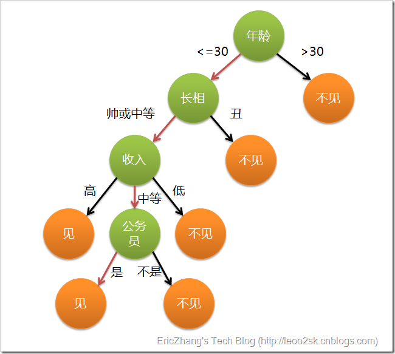
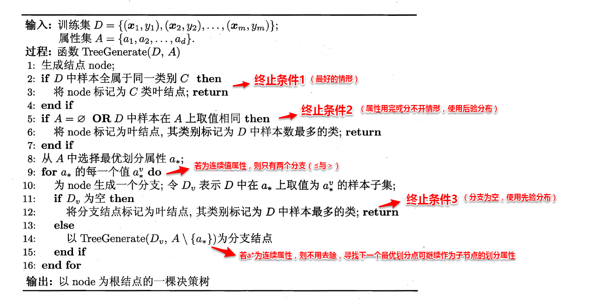
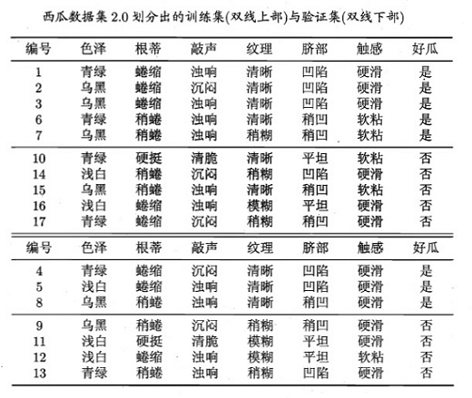
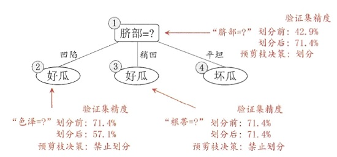
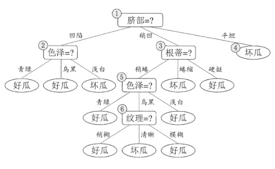
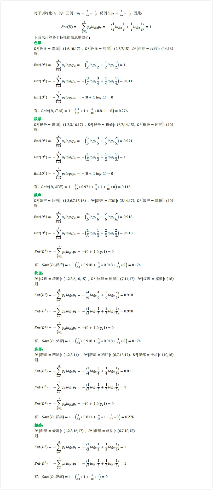
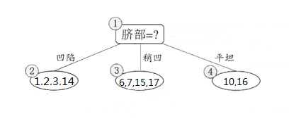
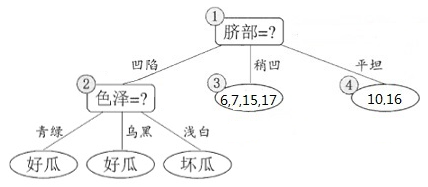
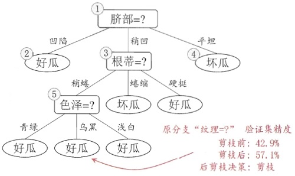

这一章的内容大致如下：

- **基本流程**：决策树是如何决策的？决策树学习的目的是什么？如何生成一颗决策树？
- **划分选择**：怎样选择最优划分属性？有哪些判断指标？具体是怎样运作的？
- **剪枝处理**：为什么要剪枝？如何判断剪枝后决策树模型的泛化性能是否提升？预剪枝和后剪枝是怎样工作的？有什么优缺点？
- **连续与缺失值**：如何把连续属性离散化？如何基于离散化后的属性进行划分？和离散属性有何不同？如何在属性值缺失的情况下选择最优划分属性？给定划分属性，如何划分缺失该属性值的样本？
- **多变量决策树**：决策树模型的分类边界的特点是怎样的？多变量决策数是如何定义的？又是如何工作的？

# 4.1 基本流程

决策树是一种常见的机器学习方法，基于树结构，模仿人类在面临决策问题上决策的学习方法。现想象一位捉急的母亲想要给自己的女娃介绍一个男朋友，于是有了下面的对话：

------

```
  女儿：多大年纪了？
  母亲：26。
  女儿：长的帅不帅？
  母亲：挺帅的。
  女儿：收入高不？
  母亲：不算很高，中等情况。
  女儿：是公务员不？
  母亲：是，在税务局上班呢。
  女儿：那好，我去见见。
```

------

这个女孩的挑剔过程就是一个典型的决策树，即相当于通过年龄、长相、收入和是否公务员将男童鞋分为两个类别：见和不见。假设这个女孩对男人的要求是：30岁以下、长相中等以上并且是高收入者或中等以上收入的公务员，那么使用下图就能很好地表示女孩的决策逻辑（即一颗决策树）。

​	

一般的，一颗决策树包含一个根结点，若干个内部节点和若干个叶子结点：

- 每个非叶子结点表示属性的测试
- 每个分支表示这个属性在某个值域上的输出
- 每个叶子结点存放一个类别
- 每个节点包含的样本集集合通过属性测试被划分到子节点中，根节点包含样本全集
- 根节点到每个叶子结点的路径对应一个测试序列

决策树学习的目的是产生一颗泛化能力强，即处理未见实例能力强的决策树，基本流程遵循**分而治之**的策略。构造步骤如霞所示：



​        													图4.2 决策树学习基本算法

决策树的构造是一个递归的过程，有三种情形会导致递归返回：

1. 当前结点包含的样本全属于同一类别，这时直接将该节点标记为叶节点，并设为相应的类别；
2. 当前属性集为空，或是所有样本在所有属性上取值相同，无法划分，这时将该节点标记为叶节点，并将其类别设为该节点所含样本最多的类别；
3. 当前结点包含的样本集合为空，不能划分，这时也将该节点标记为叶节点，并将其类别设为父节点中所含样本最多的类别。

注意终止条件2和3的区别：终止条件2利用当前结点的后验分布；终止条件3把父节点的样本分布作为当前节点的先验分布。

## 4.1.1 先验分布与后验分布


# 4.2 划分选择

由算法4.2可以看出，决策树学习的关键是如何选择最优的划分属性，一般而言，随着划分过程的不断进行，我们希望决策树的分支节点所包含的样本尽可能属于同一类别，即节点的纯度越来越高。

## 4.2.1 信息增益

**信息熵(information entropy)**是度量样本结合纯度的常用指标，假定当前样本集合$D$中第$k$类样本所占比例为$p_k(k=1,2,3,\cdots,k)$，则样本集合$D$的信息熵定义为：
$$
\operatorname{Ent}(D)=-\sum_{k=1}^{|y|}p_klog_{2}{p_k} \tag{4.1}
$$
$\operatorname{Ent}(D)$的值越小，则$D$的纯度越高。 **注意：**$\operatorname{Ent}(D)$的最小值为0，最大值为 $\log_2|y|$

**[解析]：**已知集合D的信息熵的定义为 :
$$
\operatorname{Ent}(D)=-\sum_{k=1}^{ | \mathcal{Y}|} p_{k} \log_{2}{p_{k}} \tag{4.1.1} 
$$
其中，$| \mathcal{Y}|$表示样本类别总数，$p_k$表示第k类样本所占的比例，且$0 \leq p_k \leq 1,\sum_{k=1}^{n}p_k=1$。 若令$| \mathcal{Y}|=n,p_k=x_k$，那么信息熵$\operatorname{Ent}(D)$就可以看作一个$n$元实值函数，也即：
$$
\operatorname{Ent}(D)=f(x_1,...,x_n)=-\sum_{k=1}^{n} x_{k} \log_{2} x_{k} \tag{4.1.2}
$$
 其中，$0 \leq x_k \leq 1,\sum_{k=1}^{n}x_k=1$，下面考虑求该多元函数的最值。

**求最大值：**
		如果不考虑约束$0 \leq x_k \leq 1$，仅考虑$\sum_{k=1}^{n}x_k=1$的话，对$f(x_1,...,x_n)$求最大值等价于如下最小化问题 ：
$$
\begin{array}{ll}{ \operatorname{min}} & {\sum\limits_{k=1}^{n} x_{k} \log_{2} x_{k} } \ {\text { s.t. }} & {\sum\limits_{k=1}^{n}x_k=1} \end{array} \tag{4.1.3}
$$
 显然，在$0 \leq x_k \leq 1$时，此问题为凸优化问题，而对于凸优化问题来说，满足KKT条件的点即为最优解。由于此最小化问题仅含等式约束，那么能令其拉格朗日函数的一阶偏导数等于0的点即为满足KKT条件的点。根据拉格朗日乘子法可知，该优化问题的拉格朗日函数为：
$$
L(x_1,...,x_n,\lambda)=-\sum_{k=1}^{n} x_{k} \log_{2} x_{k}+\lambda(\sum_{k=1}^{n}x_k-1) \tag{4.1.4}
$$
其中，$\lambda$为拉格朗日乘子。对$L(x_1,...,x_n,\lambda)$分别关于$x_1,...,x_n,\lambda$求一阶偏导数，并令偏导数等于0可得:
$$
\begin{aligned} \cfrac{\partial L(x_1,...,x_n,\lambda)}{\partial x_1}&=\cfrac{\partial }{\partial x_1}\left[-\sum_{k=1}^{n} x_{k} \log {2} x_{k}+\lambda(\sum_{k=1}^{n}x_k-1)\right]=0\\ &=-\log {2} x_{1}-x_1\cdot \cfrac{1}{x_1\ln2}+\lambda=0 \\ &=-\log {2} x_{1}-\cfrac{1}{\ln2}+\lambda=0 \ \Rightarrow \lambda=\log {2} x_{1}+\cfrac{1}{\ln2}\\
\cfrac{\partial L(x_1,...,x_n,\lambda)}{\partial x_2}&=\cfrac{\partial }{\partial x_2}\left[-\sum_{k=1}^{n} x_{k} \log {2} x_{k}+\lambda(\sum_{k=1}^{n}x_k-1)\right]=0\ \Rightarrow \lambda=\log {2} x_{2}+\cfrac{1}{\ln2}\\ 
\vdots \\
\cfrac{\partial L(x_1,...,x_n,\lambda)}{\partial x_n}&=\cfrac{\partial }{\partial x_n}\left[-\sum_{k=1}^{n} x_{k} \log {2} x_{k}+\lambda(\sum_{k=1}^{n}x_k-1)\right]=0\ \Rightarrow \lambda=\log_{2} x_{n}+\cfrac{1}{\ln2}\ \cfrac{\partial L(x_1,...,x_n,\lambda)}{\partial \lambda}&=\cfrac{\partial }{\partial \lambda}\left[-\sum_{k=1}^{n} x_{k} \log {2} x{k}+\lambda(\sum_{k=1}^{n}x_k-1)\right]=0\ &\Rightarrow \sum_{k=1}^{n}x_k=1\ \end{aligned} \tag{4.1.5}
$$
 整理一下可得 :
$$
{ \begin{array}{lr} \lambda=\log_{2} x_{1}+\cfrac{1}{\ln2}=\log_{2} x_{2}+\cfrac{1}{\ln2}=...=\log_{2} x_{n}+\cfrac{1}{\ln2} \ \sum\limits_{k=1}^{n}x_k=1 \end{array}}
$$
又因为$x_k$还满足约束$0 \leq x_k \leq 1$，显然$0 \leq\cfrac{1}{n}\leq 1$，所以$x_1=x_2=...=x_n=\cfrac{1}{n}$是满足所有约束的最优解，也即为当前最小化问题的目标函数的最小值点，同样也是$f(x_1,...,x_n)$的最大值点。将$x_1=x_2=...=x_n=\cfrac{1}{n}$代入$f(x_1,...,x_n)$中可得:
$$
f(\cfrac{1}{n},...,\cfrac{1}{n})=-\sum_{k=1}^{n} \cfrac{1}{n} \log_{2} \cfrac{1}{n}=-n\cdot\cfrac{1}{n} \log {2} \cfrac{1}{n}=\log {2} n
$$
所以$f(x_1,...,x_n)$在满足约束$0 \leq x_k \leq 1,\sum_{k=1}^{n}x_k=1$时的最大值为$\log {2} n$。

假定**离散属性**$a$有$V$个可能的取值$\{a^1,a^2,\cdots, a^v\}$，若使用属性a划分样本集D，会产生$V$个分支点，其中第$v$个分支结点包含了$D$中所有在属性$a$上取值为$a^v$的样本，记为$D^v$，易知：分支节点包含的样本数越多，表示该分支节点的影响力越大，给分支结点赋予权重：$\frac{|D^v}{|D|}$ ，于是可以计算出属性$a$对样本集进行互粉所得到的**信息增益**（information gain）：
$$
Gain(D,a) = Ent(D) - \sum_{v=1}^{V}\frac{|D^v|}{|D|}Ent({D^v})   \tag{4.2}
$$
信息增益越大，表示使用该属性$a$划分样本集$D$的效果越好，即纯度提升越大，因此ID3算法在递归过程中，每次选择最大信息增益的属性作为当前的划分属性，即$a_*=\underset{a\in A}{argmax}Gain(D,a)$。

**缺点**：由于在计算信息增益中倾向于特征值越多的特征进行优先划分，这样假设某个特征值的离散值个数与样本集 *D* 个数相同（假设为样本编号），虽然用样本编号对样本进行划分，样本纯度提升最高，但是并不具有泛化能力。

## 4.2.2  增益率

ID3算法存在一个问题，就是偏向于取值数目较多的属性，例如：如果存在一个唯一标识，这样样本集D将会被划分为$|D|$个分支，每个分支只有一个样本，这样划分后的信息熵为零，十分纯净，但是对分类毫无用处。因此C4.5算法使用了**增益率（gain ratio）**来选择划分属性，来避免这个问题带来的困扰。增益率定义为：
$$
Gain_ratio(D,a)=\frac{Gain(D,a)}{IV(a)}  \tag{4.3}
$$
其中
$$
IV(a)=-\sum_{v=1}^{V}\frac{|D^v|}{|D|}log_2\frac{|D^v|}{|D|}  \tag{4.4}
$$
称为属性$a$的固有值，当属性$a$的可能取值数目越多，即$V$越大，$IV(a)$的值通常会越大。 $IV(a)$ 是特征 $a$ 的熵。

增益率对特征值较少的特征有一定偏好，因此 C4.5 **算法选择特征的方法是先从候选特征中选出信息增益高于平均水平的特征，再从这些特征中选择增益率最高的**。

## 4.2.3 基尼指数

CART决策树使用“基尼指数”（Gini index）来选择划分属性，基尼指数定义如下：
$$
\begin{aligned} Gini(D) &=\sum_{k=1}^{|y|}\sum_{k\neq{k'}}{p_k}{p_{k'}}\\ &=1-\sum_{k=1}^{|y|}p_k^2 \end{aligned} \tag{4.5}
$$
基尼指数反映的是从样本集D中随机抽取两个样本，其类别标记不一致的概率，因此$Gini(D)$越小 ，则数据的纯度越高，属性$a$的基尼指数定义为：
$$
Gini-index(D,a)=\sum_{v=1}^{V}\frac{|D^v|}{|D|}Gini(D) \tag{4.6}
$$
我们选择候选属性集合$A$中，基尼指数最小的属性作为最优划分属性。

# 4.3 剪枝处理

在决策树的学习中，为了尽可能的正确分类训练样本，划分过程将递归不断的重复，有时就会导致决策树分支过多，把训练集自身的一些特征作为所有数据都具有的一般性质，导致**过拟合**问题，即太依赖于训练样本。剪枝（pruning）则是决策树算法对付过拟合的主要手段，剪枝的策略有两种如下：

- 预剪枝（prepruning）：在构造的过程中，对每个结点在划分前先评估，再考虑是否分支。若当前节点的划分不能带来决策树泛化性能提升，则停止划分。
- 后剪枝（post-pruning）：在构造好一颗完整的决策树后，自底向上对非叶子结点进行考察，评估分支的必要性，即若将该节点对应的子树替换为叶子结点，是否能带来决策树泛化性能提升。

如何评估决策树泛化性能的提升？我们采用2.2节介绍的**留出法**，预留一部分数据作为验证集。



## 4.3.1 预剪枝

 基于信息增益准则，选择脐部来对训练集进行划分，并产生三个分支，如图4.6所示



​																图4.6 基于表生成的预剪枝决策树



​																图4.5 基于表生成的未剪枝决策树

预剪枝具体构造过程如下：

1. 用信息增益构造决策树，先来计算出所有特征的信息增益值：



1. **色泽**和**脐部**的信息增益值最大，所以从这两个中随机挑选一个，这里选择**脐部**来对数据集进行划分，这会产生三个分支，如下图所示：



但是因为是预剪枝，所以要判断是否应该进行这个划分，判断的标准就是看划分前后的泛华性能是否有提升，也就是如果划分后泛华性能有提升，则划分；否则，不划分。 下面来看看是否要用脐部进行划分，划分前：所有样本都在根节点，把该结点标记为叶结点，其类别标记为训练集中样本数量最多的类别，因此标记为好瓜，然后用验证集对其性能评估，可以看出样本{4，5，8}被正确分类，其他被错误分类，因此精度为43.9%。划分后： 验证集$(4,5,8,11,12)$被正确分类，在这颗决策树上的精度为：$5/7 = 0.714 > 0.429$。因此，用**脐部**进行划分。 

2. 决策树算法对结点 (2) 进行划分，再次使用信息增益挑选出值最大的那个特征，这里我就不算了，计算方法和上面类似，信息增益值最大的那个特征是“色泽”，则使用“色泽”划分后决策树为： 



但到底该不该划分这个结点，还是要用验证集进行计算，可以看到划分后，精度为：5/7=0.571<0.714，因此，预剪枝策略将禁止划分结点 (2) 。对于结点 (3) 最优的属性为“根蒂”，划分后验证集精度仍为71.4%，因此这个划分不能提升验证集精度，所以预剪枝将禁止结点 (3) 划分。对于结点 (4) ，其所含训练样本已属于同一类，所以不再进行划分。

 所以基于预剪枝策略生成的最终的决策树为：


对比未剪枝的决策树和经过预剪枝的决策树可以看出：预剪枝使得决策树的很多分支都没有“展开”，这不仅降低了过拟合的风险，还显著减少了决策树的训练时间开销和测试时间开销。但是，另一方面，因为预剪枝是基于“贪心”的，所以，虽然当前划分不能提升泛华性能，但是基于该划分的后续划分却有可能导致性能提升，因此预剪枝决策树有可能带来**欠拟合**的风险。

## 4.3.2 后剪枝

后剪枝就是先构造一颗完整的决策树，然后自底向上的对非叶结点进行考察，若将该结点对应的子树换为叶结点能够带来泛华性能的提升，则把该子树替换为叶结点。完整的决策树如下图所示：


后剪枝算法的过程如下：

1. 考察上图中的结点 (6)，若将以其为根节点的子树删除，即相当于把结点 (6) 替换为叶结点，替换后的叶结点包括编号为{7,15}的训练样本，因此把该叶结点标记为“好瓜”（因为这里正负样本数量相等，所以随便标记一个类别），因此此时的决策树在验证集上的精度为57.1%（未剪枝的决策树为42.9%），所以后剪枝策略决定剪枝，剪枝后的决策树如下图所示： 
	

2. 考察结点 5，同样的操作，把以其为根节点的子树替换为叶结点，替换后的叶结点包含编号为{6,7,15}的训练样本，根据“多数原则”把该叶结点标记为“好瓜”，测试的决策树精度认仍为57.1%，所以不进行剪枝。 
3. 考察结点 2 ，和上述操作一样，不多说了，叶结点包含编号为{1,2,3,14}的训练样本，标记为“好瓜”，此时决策树在验证集上的精度为71.4%，因此，后剪枝策略决定剪枝。剪枝后的决策树为：


对比预剪枝和后剪枝，能够发现，后剪枝决策树通常比预剪枝决策树保留了更多的分支，一般情形下，后剪枝决策树的欠拟合风险小，泛华性能往往也要优于预剪枝决策树。但后剪枝过程是在构建完全决策树之后进行的，并且要自底向上的对树中的所有非叶结点进行逐一考察，因此其训练时间开销要比未剪枝决策树和预剪枝决策树都大得多。

# 4.4 连续与缺省值的处理

## 4.4.1 连续值的处理

目前为止，决策树的属性都是基于离散属性，现实学习任务中常会遇到连续属性，如何处理连续属性呢？

由于连续值的取值数目不再有限，因此，不能直接使用连续属性的可取值进行划分，我们采取连续属性离散化的技术，最简单的是：**二分法**处理，C4.5决策树算法采用的此机制。

### 4.4.1.1 二分法

基本思想为：给定样本集D与连续属性$a$，二分法试图找到一个划分点t将样本集D在属性α上分为≤t与＞t。具体划分步骤如下：给定样本集$D$和连续属性$a$，a在D上的取值个数为$n$。

将$a$的所有取值按升序排列，记为$\{a^1,a^2,\cdots, a^n\}$，基于划分点$t$可将$D$划分为$D_t^-$和$D_t^+$，$D_t^-$包含属性$a$取值不大于$t$的样本，$D_t^+$包含属性$a$取值大于$t$的样本，对于相邻属性取值$a^{i}$与$a^{i+1}$在区间$[a^i,a^{i+1})$中取值所产生的划分结果相同，因此对于连续属性，我们可以考察包含$n-1$个元素的候选划分集合：
$$
T_a=\lbrace{\frac{a^i+a^{i+1}}{2}|1\leq{i}\leq{n-1}}\rbrace \tag {4.7}
$$
对于取值集合 $ T_a$ 中的每个 $t$ 值计算将特征 $a$ 离散为一个特征只有两个值，分别是 $\lbrace{a} >t\rbrace$ 和 $\lbrace{a} \leq{t}\rbrace$ 的特征，计算新特征的信息增益，找到信息增益最大的 $t$ 值即为该特征的最优划分点。 
$$
\begin{aligned} Gain(D,a) &= \max\limits_{t \in T_a} \ Gain(D,a，t) \\ &= \max\limits_{t \in T_a} \ Ent(D)-\sum_{\lambda \in {-,+}} \frac{\left | D_t^{\lambda } \right |}{\left |D \right |}Ent(D_t^{\lambda }) \end{aligned} \tag{4.8}
$$
其中$\ Gain(D,a，t)$是样本集$D$基于划分点$t$二分后的信息增益。

**注意：**与离散属性不同，若当前节点划分属性为连续属性，该属性还可以作为其后代结点的划分属性。例如在父节点使用了$a \leq 0.318$，则会禁止在子节点使用$a \leq 0.294$。

## 4.4.2 缺省值的处理

现实任务中常会遇到不完整的样本，即样本的某些属性值缺失。如果放弃不完整的样本，仅使用无缺失值的样本进行学习，是对数据信息的极大浪费，有必要考虑利用有缺失值的训练样本进行学习，考虑解决两个问题：

    （1）如何在属性值缺失的情况下进行划分属性选择？
    
    （2）给定划分属性，若样本在该属性上的值缺失，如何对样本进行划分？
给定训练集D和属性a，$\widetilde{D}$表示D中在属性a上没有缺失值的样本子集，对于问题（1）仅我们可以根据$\widetilde{D}$来判断属性a的优劣，假定属性a有V个取值$\{a^1,a^2,\cdots, a^v\}$，令$\widetilde{D}^v$表示属性$\widetilde{D}$在属性a上取值为$a^v$的样本子集，$\widetilde{D}_k$表示$\widetilde{D}$中属于第k类$k=\{1,2,3,\cdots,|Y|\}$的样本子集，显然有$\widetilde{D}=\bigcup_{k=1}^{|Y|}\widetilde{D}_k$，$\widetilde{D}=\bigcup_{v=1}^{V}\widetilde{D}^v$ ，假定我们为每个样本集赋予一个初始权重$w_x$，并定义：
$$
\rho = \frac{\sum_{x\in \widetilde{D}}w_x}{\sum_{x\in D}w_x} \\
\widetilde{p}_k=\frac{\sum_{x\in \widetilde{D}_k}w_x}{\sum_{x\in \widetilde D}w_x} \\
\widetilde{r}_v = \frac{\sum_{x\in \widetilde{D}^v}w_x}{\sum_{x\in \widetilde D}w_x} \tag{4.9-4.11}
$$
 对于属性a，$\rho$表示无缺省值的样本所占的比例，$\widetilde{p}_k$表示无缺省值的样本中第k类所占比例，$\widetilde{r}_v$则表示无缺失值样本中在属性a上取值$a^v$的样本所占的比例。

基于以上定义，我们可以将信息增益的计算公式(4.2)推广为：
$$
Gain(D,a) = \rho \times Gain(\widetilde D,a) = \rho(Ent(\widetilde D) - \sum_{v=1}^{V}\widetilde{r}_vEnt({\widetilde D^v}))   \tag{4.12}
$$
再由式(4.1)有：
$$
Ent(\widetilde D) = -\sum_{k=1}^{|Y|}\widetilde{p}_k \log_2\widetilde{p}_k \tag{4.13}
$$
 对于问题2，若样本$x$在划分属性$a$上的取值已知，则将$x$划入与其取值对应的子结点，且样本权值在子结点中保持为$w_x$；若样本$x$在划分属性$a$上的取值未知，则将$x$同时划入所有子结点，且样本权值在属性值$a^v$对应的子结点中调整为：$\widetilde{r}_v w_x$，直观上看，就是让同一个样本以不同的概率划分到不同的子结点中。C4.5算法使用了上述解决方案。