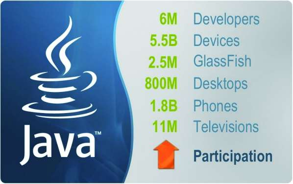
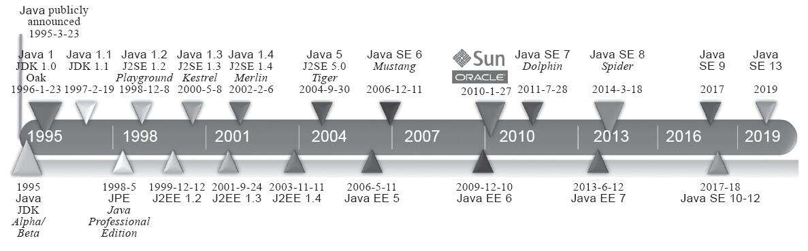

# 第1章 走进Java

## 1.1 概述

Java不仅仅是一门编程语言，它还是一个由一系列计算机软件和规范组成的技术体系，这个技术体系提供了完整的用于软件开发和跨平台部署的支持环境，并广泛应用于嵌入式系统、移动终端、企业服务器、大型机等多种场合，如图1-1所示。时至今日，Java技术体系已经吸引了600多万软件开发者，这是全球最大的软件开发团队。使用Java的设备已经超过了45亿，其中包括8亿多台个人计算机、21亿部移动电话及其他手持设备、35亿个智能卡，以及大量机顶盒、导航系统和其他设备。



​																		**图1-1 Java技术的广泛应用**

Java能获得如此广泛的认可，除了它拥有一门结构严谨、面向对象的编程语言之外，还有许多不可忽视的优点：它摆脱了硬件平台的束缚，实现了“一次编写，到处运行”的理想；它提供了一种相对安全的内存管理和访问机制，避免了绝大部分内存泄漏和指针越界问题；它实现了热点代码检测和运行时编译及优化，这使得Java应用能随着运行时间的增长而获得更高的性能；它有一套完善的应用程序接口，还有无数来自商业机构和开源社区的第三方类库来帮助用户实现各种各样的功能……Java带来的这些好处，让软件的开发效率得到了极大的提升。作为一名Java程序员，在编写程序时除了尽情发挥Java的各种优势外，还会情不自禁地想去了解和思考一下Java技术体系中这些优秀的技术特性是如何出现及怎样实现的。认识这些技术运行的本质，是自己思考“程序这样写好不好”的必要基础与前提。当我们在使用一门技术时，不再依赖书本和他人就能得到这些问题的答案，那才算升华到了“不惑”的境界。

本书将会与读者一起分析Java技术体系中那些最基础、最重要特性的实现原理。在本章中，笔者将重点讲述Java技术体系所囊括的内容，以及Java的历史、现状和未来的发展趋势。

## 1.2 Java技术体系

从广义上讲，Kotlin、Clojure、JRuby、Groovy等运行于Java虚拟机上的编程语言及其相关的程序都属于Java技术体系中的一员。如果仅从传统意义上来看，JCP官方所定义的Java技术体系包括了以下几个组成部分：

- Java程序设计语言
- 各种硬件平台上的Java虚拟机实现
- Class文件格式
- Java类库API
- 来自商业机构和开源社区的第三方Java类库

我们可以把Java程序设计语言、Java虚拟机、Java类库这三部分统称为JDK(JavaDevelopment Kit)，JDK是用于支持Java程序开发的最小环境，本书中为行文方便，在不产生歧义的地方常以JDK来代指整个Java技术体系。可以把**Java类库API中的Java SE API子集和Java虚拟机这两部分统称为JRE**(Java Runtime Environment)，JRE是支持Java程序运行的标准环境。图1-2展示了Java技术体系所包括的内容，以及JDK和JRE所涵盖的范围。


- Java ME（Micro Edition）：支持Java程序运行在移动终端（手机、PDA）上的平台，对JavaAPI有所精简，并加入了移动终端的针对性支持，这条产品线在JDK 6以前被称为J2ME。有一点读者请勿混淆，现在在智能手机上非常流行的、主要使用Java语言开发程序的Android并不属于Java ME。
- Java SE（Standard Edition）：支持面向桌面级应用（如Windows下的应用程序）的Java平台，提供了完整的Java核心API，这条产品线在JDK 6以前被称为J2SE。
- Java EE（Enterprise Edition）：支持使用多层架构的企业应用（如ERP、MIS、CRM应用）的Java平台，除了提供Java SE API外，还对其做了大量有针对性的扩充[插图]，并提供了相关的部署支持，这条产品线在JDK 6以前被称为J2EE，在JDK 10以后被Oracle放弃，捐献给Eclipse基金会管理，此后被称为Jakarta EE。

## 1.3 Java发展史

从Java的第一个版本诞生到现在已经有二十余年的时间，白驹过隙，沧海桑田，转眼已过了四分之一个世纪，在图1-3所示的时间线里，我们看到JDK的版本已经发展到了JDK 13。这二十多年里诞生过无数与Java相关的产品、技术与标准。现在让我们走入时间隧道，从孕育Java语言的时代开始，再来回顾一下Java的发展轨迹和历史变迁。

1991年4月，由James Gosling博士领导的绿色计划（Green Project）开始启动，此计划最初的目标是开发一种能够在各种消费性电子产品（如机顶盒、冰箱、收音机等）上运行的程序架构。这个计划的产品就是Java语言的前身：Oak（得名于James Gosling办公室外的一棵橡树）。Oak当时在消费品市场上并不算成功，但随着1995年互联网潮流的兴起，Oak迅速找到了最适合自己发展的市场定位并蜕变成为Java语言。



1995年5月23日，Oak语言改名为Java，并且在SunWorld大会上正式发布Java 1.0版本。Java语言第一次提出了“Write Once，Run Anywhere”的口号。

1996年1月23日，JDK 1.0发布，Java语言有了第一个正式版本的运行环境。JDK 1.0提供了一个纯解释执行的Java虚拟机实现（Sun Classic VM）。JDK 1.0版本的代表技术包括：Java虚拟机、Applet、AWT等。

1996年4月，十个最主要的操作系统和计算机供应商声明将在其产品中嵌入Java技术。同年9月，已有大约8.3万个网页应用了Java技术来制作。在1996年5月底，Sun于美国旧金山举行了首届JavaOne大会，从此JavaOne成为全世界数百万Java语言开发者每年一度的技术盛会。

1997年2月19日，Sun公司发布了JDK 1.1，Java里许多最基础的技术支撑点（如JDBC等）都是在JDK 1.1版本中提出的，JDK 1.1版的技术代表有：JAR文件格式、JDBC、JavaBeans、RMI等。Java语言的语法也有了一定的增强，如内部类（Inner Class）和反射（Reflection）都是在这时候出现的。

直到1999年4月8日，JDK 1.1一共发布了1.1.0至1.1.8这9个版本。从1.1.4以后，每个JDK版本都有一个属于自己的名字（工程代号），分别为：JDK 1.1.4-Sparkler（宝石）、JDK 1.1.5-Pumpkin（南瓜）、JDK 1.1.6-Abigail（阿比盖尔，女子名）、JDK 1.1.7-Brutus（布鲁图，古罗马政治家和将军）和JDK 1.1.8-Chelsea（切尔西，城市名）。

1998年12月4日，JDK迎来了一个里程碑式的重要版本：工程代号为Playground（竞技场）的JDK 1.2，Sun在这个版本中把Java技术体系拆分为三个方向，分别是面向桌面应用开发的J2SE（Java 2 Platform，Standard Edition）、面向企业级开发的J2EE（Java 2 Platform，Enterprise Edition）和面向手机等移动终端开发的J2ME（Java 2 Platform，MicroEdition）。在这个版本中出现的代表性技术非常多，如EJB、Java Plug-in、Java IDL、Swing等，并且这个版本中Java虚拟机第一次内置了JIT（Just In Time）即时编译器（JDK 1.2中曾并存过三个虚拟机，Classic VM、HotSpot VM和Exact VM，其中Exact VM只在Solaris平台出现过；后面两款虚拟机都是内置了JIT即时编译器的，而之前版本所带的Classic VM只能以外挂的形式使用即时编译器）。在语言和API层面上，Java添加了strictfp关键字，Java类库添加了现在Java编码之中极为常用的一系列Collections集合类等。在1999年3月和7月，分别有JDK 1.2.1和JDK 1.2.2两个小升级版本发布。

1999年4月27日，HotSpot虚拟机诞生。HotSpot最初由一家名为“Longview Techno-logies”的小公司开发，由于HotSpot的优异表现，这家公司在1997年被Sun公司收购。Hot-Spot虚拟机刚发布时是作为JDK 1.2的附加程序提供的，后来它成为JDK 1.3及之后所有JDK版本的默认Java虚拟机。

2000年5月8日，工程代号为Kestrel（美洲红隼）的JDK 1.3发布。相对于JDK 1.2，JDK 1.3的改进主要体现在Java类库上（如数学运算和新的Timer API等），JNDI服务从JDK 1.3开始被作为一项平台级服务提供（以前JNDI仅仅是一项扩展服务），使用CORBA IIOP来实现RMI的通信协议，等等。这个版本还对Java 2D做了很多改进，提供了大量新的Java 2D API，并且新添加了JavaSound类库。JDK 1.3有1个修正版本JDK 1.3.1，工程代号为Ladybird（瓢虫），于2001年5月17日发布。

自从JDK 1.3开始，Sun公司维持着稳定的研发节奏：**大约每隔两年发布一个JDK的主版本**，以动物命名，期间发布的各个修正版本则以昆虫作为工程代号。

2002年2月13日，JDK 1.4发布，工程代号为Merlin（灰背隼）。JDK 1.4是标志着Java真正走向成熟的一个版本，Compaq、Fujitsu、SAS、Symbian、IBM等著名公司都有参与功能规划，甚至实现自己独立发行的JDK 1.4。哪怕是在近二十年后的今天，仍然有一些主流应用能直接运行在JDK 1.4之上，或者继续发布能运行在1.4上的版本。JDK 1.4同样带来了很多新的技术特性，如正则表达式、异常链、NIO、日志类、XML解析器和XSLT转换器，等等。JDK 1.4有两个后续修正版：2002年9月16日发布的工程代号为Grasshopper（蚱蜢）的JDK 1.4.1与2003年6月26日发布的工程代号为Mantis（螳螂）的JDK 1.4.2。

2002年前后还发生了一件与Java没有直接关系，但事实上对Java的发展进程影响很大的事件，就是微软的.NET Framework发布。这个无论是技术实现还是目标用户上都与Java有很多相近之处的技术平台给Java带来了很多讨论、比较与竞争，.NET平台和Java平台之间声势浩大的孰优孰劣的论战到今天为止都仍然没有完全平息。

2004年9月30日，JDK 5发布，工程代号为Tiger（老虎）。Sun公司从这个版本开始放弃了谦逊的“JDK 1.x”的命名方式，将产品版本号修改成了“JDK x”。从JDK 1.2以来，Java在语法层面上的变动一直很小，而JDK 5在Java语法易用性上做出了非常大的改进。如：自动装箱、泛型、动态注解、枚举、可变长参数、遍历循环（foreach循环）等语法特性都是在JDK 5中加入的。在虚拟机和API层面上，这个版本改进了Java的内存模型（Java Memory Model，JMM）、提供了java.util.concurrent并发包等。另外，JDK 5是官方声明可以支持Windows 9x操作系统的最后一个JDK版本。

2006年12月11日，JDK 6发布，工程代号为Mustang（野马）。在这个版本中，Sun公司终结了从JDK 1.2开始已经有八年历史的J2EE、J2SE、J2ME的产品线命名方式，启用Java EE 6、Java SE 6、Java ME 6的新命名来代替。JDK 6的改进包括：提供初步的动态语言支持（通过内置Mozilla JavaScript Rhino引擎实现）、提供编译期注解处理器和微型HTTP服务器API，等等。同时，这个版本对Java虚拟机内部做了大量改进，包括锁与同步、垃圾收集、类加载等方面的实现都有相当多的改动。

JDK 6发布以后，由于代码复杂性的增加、Java开源、开发JavaFX、世界经济危机及Oracle对Sun的收购案等原因，Sun公司在发展Java以外的事情上耗费了太多精力和资源，JDK的更新没有能够继续维持两年发布一个主版本的研发速度，这导致了JDK 6的生命周期异常的长，一共发布了211个更新升级补丁，最后的版本为Java SE 6 Update 211，于2018年10月18日发布。

2009年2月19日，工程代号为Dolphin（海豚）的JDK 7完成了其第一个里程碑版本。按照JDK 7最初的功能规划，一共会设置十个里程碑。最后一个里程碑版本原计划定于2010年9月9日结束，但由于各种原因，JDK 7最终无法按计划完成。

从JDK 7最原始的功能清单来看，它本应是一个包含许多重要改进的JDK版本，其中规划的子项目都为Java业界翘首以盼，包括：

- Lambda项目：支持Lambda表达式，支持函数式编程。
- Jigsaw项目：虚拟机层面的模块化支持。
- 动态语言支持：Java是静态语言，为其他运行在Java虚拟机上的动态语言提供支持。
- Garbage-First收集器。
- Coin项目：Java语法细节进化。

令人惋惜的是，在JDK 7开发期间，Sun公司相继在技术竞争和商业竞争中陷入泥潭，公司的股票市值跌至仅有高峰时期的3%，已无力推动JDK 7的研发工作按计划继续进行。为了尽快结束JDK 7长期跳票的问题，Oracle收购Sun公司后随即宣布马上实行“B计划”，大幅裁剪了JDK 7预定目标，以保证JDK 7的正式版能够于2011年7月28日准时发布。“B计划”的主要措施是把不能按时完成的Lambda项目、Jigsaw项目和Coin项目的部分改进延迟到JDK 8之中。最终，JDK7包含的改进有：提供新的G1收集器（G1在发布时依然处于Experimental状态，直至2012年4月的Update 4中才正式商用）、加强对非Java语言的调用支持（JSR-292，这项特性在到JDK 11还有改动）、可并行的类加载架构等。

Oracle公司接手了JDK开发工作以后，迅速展现出了完全不同于Sun时期的、极具商业化的处事风格。面对Java中使用最广泛而又一直免费的Java SE产品线，Oracle很快定义了一套新的JavaSE Support[插图]产品计划，把JDK的更新支持作为一项商业服务。JDK 7发布的前80个更新仍然免费面向所有用户提供，但后续的其他更新包，用户[插图]只能从“将Java SE升级到Java SESupport”与“将JDK 7升级到最新版本”两个选项里挑一个。JDK 7计划维护至2022年，迄今（面向付费用户）已发布了超过两百个更新补丁，最新版本为JDK 7 Update 221。

.....

## 1.4 Java虚拟机家族

上一节我们以JDK版本演进过程为线索，回顾了Java技术的发展历史，体会过其中企业与技术的成败兴衰，现在，我们将聚焦到本书的主题“Java虚拟机”。许多Java程序员都会潜意识地把Java虚拟机与OracleJDK的HotSpot虚拟机等同看待，也许还有一些程序员会注意到BEAJRockit和IBM J9虚拟机，但绝大多数人对Java虚拟机的认识就仅限于此了。从1996年初Sun发布的JDK 1.0中包含的Sun Classic虚拟机到今天，曾经涌现、湮灭过许多或经典，或优秀，或有特色，或有争议的虚拟机实现，在这一节中，我们仍先把代码与技术放下，一起来回顾Java虚拟机家族的发展轨迹和历史变迁。

### 1.4.1 虚拟机始祖：Sun Classic/Exact VM

以今天的视角来看，Sun Classic虚拟机的技术已经相当原始，这款虚拟机的使命也早已终结。但仅凭它“世界上第一款商用Java虚拟机”的头衔，就足够有令历史记住它的理由。

1996年1月23日，Sun发布JDK 1.0，Java语言首次拥有了商用的正式运行环境，这个JDK中所带的虚拟机就是Classic VM。这款虚拟机只能使用纯解释器方式来执行Java代码，如果要使用即时编译器那就必须进行外挂，但是假如外挂了即时编译器的话，即时编译器就会完全接管虚拟机的执行系统，解释器便不能再工作了。在JDK 1.2及之前，用户用Classic虚拟机执行java-version命令，将会看到类似下面这行的输出：

```
java version "1.2.2"
Classic VM (build JDK-1.2.2-001, green threads, sunwjit)
```

Exact VM因它使用准确式内存管理（Exact Memory Management，也可以叫Non-Con-servative/Accurate Memory Management）而得名。准确式内存管理是指虚拟机可以知道内存中某个位置的数据具体是什么类型。譬如内存中有一个32bit的整数123456，虚拟机将有能力分辨出它到底是一个指向了123456的内存地址的引用类型还是一个数值为123456的整数，准确分辨出哪些内存是引用类型，这也是在垃圾收集时准确判断堆上的数据是否还可能被使用的前提。

### 1.4.2 武林盟主：HotSpot VM

相信所有Java程序员都听说过HotSpot虚拟机，它是Sun/OracleJDK和OpenJDK中的默认Java虚拟机，也是目前使用范围最广的Java虚拟机。但不一定所有人都知道的是，这个在今天看起来“血统纯正”的虚拟机在最初并非由Sun公司所开发，而是由一家名为“LongviewTechnologies”的小公司设计；甚至这个虚拟机最初并非是为Java语言而研发的，它来源于Strongtalk虚拟机，而这款虚拟机中相当多的技术又是来源于一款为支持Self语言实现“达到C语言50%以上的执行效率”的目标而设计的Self虚拟机，最终甚至可以追溯到20世纪80年代中期开发的Berkeley Smalltalk上。Sun公司注意到这款虚拟机在即时编译等多个方面有着优秀的理念和实际成果，在1997年收购了Longview Technologies公司，从而获得了HotSpot虚拟机。

HotSpot既继承了Sun之前两款商用虚拟机的优点（如前面提到的准确式内存管理），也有许多自己新的技术优势，如它名称中的HotSpot指的就是它的热点代码探测技术（这里的描写带有“历史由胜利者书写”的味道，其实HotSpot与Exact虚拟机基本上是同时期的独立产品，HotSpot出现得还稍早一些，一开始HotSpot就是基于准确式内存管理的，而Exact VM之中也有与HotSpot几乎一样的热点探测技术，为了Exact VM和HotSpot VM哪个该成为Sun主要支持的虚拟机，在Sun公司内部还争吵过一场，HotSpot击败Exact并不能算技术上的胜利），HotSpot虚拟机的热点代码探测能力可以通过执行计数器找出最具有编译价值的代码，然后通知即时编译器以方法为单位进行编译。如果一个方法被频繁调用，或方法中有效循环次数很多，将会分别触发标准即时编译和栈上替换编译（On-Stack Replacement，OSR）行为。通过编译器与解释器恰当地协同工作，可以在最优化的程序响应时间与最佳执行性能中取得平衡，而且无须等待本地代码输出才能执行程序，即时编译的时间压力也相对减小，这样有助于引入更复杂的代码优化技术，输出质量更高的本地代码。

....

## 1.5 展望Java技术的未来

本书第1、2版中的“展望Java技术的未来”分别成文于2011年和2013年，将近十年时间已经过去，当时畅想的Java新发展新变化全部如约而至，这部分内容已不再有“展望”的价值。笔者在更新第3版时重写了本节全部内容，并把第2版的“展望”的原文挪到附录之中。倘若Java的未来依旧灿烂精彩，倘若下一个十年本书还更新第4、第5版，亦希望届时能在附录中回首今日，去回溯哪些预测成为现实，哪些改进中途夭折。

如1.3节结尾所言，今天的Java正处于机遇与挑战并存的时期，Java未来能否继续壮大发展，某种程度上取决于如何应对当下已出现的挑战，本文将按照这个脉络来组织，向读者介绍现在仍处于Oracle Labs中的Graal VM、Valhalla、Amber、Loom、Panama等面向未来的研究项目。

## 1.7 本章小结

本章介绍了Java技术体系的过去、现在和未来的发展趋势，并在实践中介绍了如何自己编译一个OpenJDK 12。作为全书的引言部分，本章建立了后文研究所必需的环境。在了解Java技术的来龙去脉后，后面章节将分为四部分去介绍Java在“自动内存管理”“Class文件结构与执行引擎”“编译器优化”及“多线程并发”方面的实现原理。