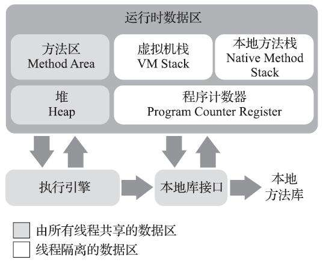
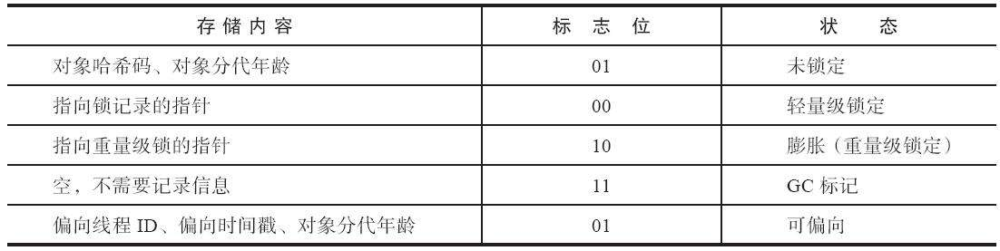
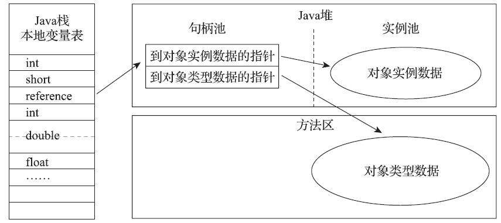
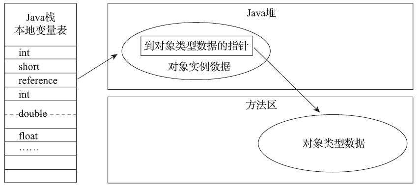

# 第2章 Java内存区域与内存溢出异常

Java与C++之间有一堵由内存动态分配和垃圾收集技术所围成的高墙，墙外面的人想进去，墙里面的人却想出来。

## 2.1 概述

对于从事C、C++程序开发的开发人员来说，在内存管理领域，他们既是拥有最高权力的“皇帝”，又是从事最基础工作的劳动人民——既拥有每一个对象的“所有权”，又担负着每一个对象生命从开始到终结的维护责任。

对于Java程序员来说，在虚拟机自动内存管理机制的帮助下，不再需要为每一个new操作去写配对的delete/free代码，不容易出现内存泄漏和内存溢出问题，看起来由虚拟机管理内存一切都很美好。不过，也正是因为Java程序员把控制内存的权力交给了Java虚拟机，一旦出现内存泄漏和溢出方面的问题，如果不了解虚拟机是怎样使用内存的，那排查错误、修正问题将会成为一项异常艰难的工作。

本章是第二部分的第1章，笔者将从概念上介绍Java虚拟机内存的各个区域，讲解这些区域的作用、服务对象以及其中可能产生的问题，这也是翻越虚拟机内存管理这堵围墙的第一步。

## 2.2 运行时数据区域

Java虚拟机在执行Java程序的过程中会把它所管理的内存划分为若干个不同的数据区域。这些区域有各自的用途，以及创建和销毁的时间，有的区域随着虚拟机进程的启动而一直存在，有些区域则是依赖用户线程的启动和结束而建立和销毁。根据《Java虚拟机规范》的规定，Java虚拟机所管理的内存将会包括以下几个运行时数据区域，如图2-1所示。



​																			**图2-1 Java虚拟机运行时数据区**

### 2.2.1 程序计数器

程序计数器(Program Counter Register)是一块较小的内存空间，它可以看作是当前线程所执行的字节码的行号指示器。在Java虚拟机的概念模型里，字节码解释器工作时就是通过改变这个计数器的值来选取下一条需要执行的字节码指令，它是程序控制流的指示器，分支、循环、跳转、异常处理、线程恢复等基础功能都需要依赖这个计数器来完成。

由于**Java虚拟机的多线程是通过线程轮流切换、分配处理器执行时间的方式来实现的**，在任何一个确定的时刻，一个处理器（对于多核处理器来说是一个内核）都只会执行一条线程中的指令。因此，为了线程切换后能恢复到正确的执行位置，**每条线程都需要有一个独立的程序计数器**，各条线程之间计数器互不影响，独立存储，我们称这类内存区域为“线程私有”的内存。

如果线程正在执行的是一个Java方法，这个计数器记录的是正在执行的虚拟机字节码指令的地址；如果正在执行的是本地（Native）方法，这个计数器值则应为空（Undefined）。此内存区域是唯一一个在《Java虚拟机规范》中没有规定任何OutOfMemoryError情况的区域。

### 2.2.2 Java虚拟机栈

与程序计数器一样，Java虚拟机栈(Java Virtual Machine Stack)也是线程私有的，它的生命周期与线程相同。**虚拟机栈描述的是Java方法执行的线程内存模型**：每个方法被执行的时候，Java虚拟机都会同步创建一个栈帧(Stack Frame)用于存储局部变量表、操作数栈、动态连接、方法出口等信息。每一个方法被调用直至执行完毕的过程，就对应着一个栈帧在虚拟机栈中从入栈到出栈的过程。

经常有人把Java内存区域笼统地划分为堆内存（Heap）和栈内存（Stack），这种划分方式直接继承自传统的C、C++程序的内存布局结构，在Java语言里就显得有些粗糙了，实际的内存区域划分要比这更复杂。不过这种划分方式的流行也间接说明了程序员最关注的、与对象内存分配关系最密切的区域是“堆”和“栈”两块。其中，“堆”在稍后笔者会专门讲述，而**“栈”通常就是指这里讲的虚拟机栈**，或者更多的情况下只是指虚拟机栈中**局部变量表部分**。

局部变量表存放了编译期可知的各种Java虚拟机基本数据类型(boolean、byte、char、short、int、float、long、double)、对象引用(reference类型，它并不等同于对象本身，可能是一个指向对象起始地址的引用指针，也可能是指向一个代表对象的句柄或者其他与此对象相关的位置)和returnAddress类型(指向了一条字节码指令的地址)。

这些数据类型在局部变量表中的存储空间以局部变量槽（Slot）来表示，其中64位长度的long和double类型的数据会占用两个变量槽，其余的数据类型只占用一个。**局部变量表所需的内存空间在编译期间完成分配**，当进入一个方法时，这个方法需要在栈帧中分配多大的局部变量空间是完全确定的，在方法运行期间不会改变局部变量表的大小。请读者注意，这里说的“大小”是指变量槽的数量，虚拟机真正使用多大的内存空间(譬如按照1个变量槽占用32个比特、64个比特，或者更多)来实现一个变量槽，这是完全由具体的虚拟机实现自行决定的事情。

在《Java虚拟机规范》中，对这个内存区域规定了两类异常状况：

- 如果线程请求的栈深度大于虚拟机所允许的深度，将抛出StackOverflowError异常；
- 如果Java虚拟机栈容量可以动态扩展，当栈扩展时无法申请到足够的内存会抛出OutOfMemoryError异常。

### 2.2.3 本地方法栈

本地方法栈(Native Method Stacks)与虚拟机栈所发挥的作用是非常相似的，其区别只是虚拟机栈为虚拟机执行Java方法(也就是字节码)服务，而本地方法栈则是为虚拟机使用到的本地(Native)方法服务。

《Java虚拟机规范》对本地方法栈中方法使用的语言、使用方式与数据结构并没有任何强制规定，因此具体的虚拟机可以根据需要自由实现它，甚至有的Java虚拟机（譬如Hot-Spot虚拟机）直接就把本地方法栈和虚拟机栈合二为一。与虚拟机栈一样，**本地方法栈也会在栈深度溢出或者栈扩展失败时分别抛出StackOverflowError和OutOfMemoryError异常**。

### 2.2.4 Java堆

对于Java应用程序来说，Java堆(Java Heap)是虚拟机所管理的内存中最大的一块。Java堆是被所有线程共享的一块内存区域，**在虚拟机启动时创建**。此内存区域的唯一目的就是存放对象实例，Java世界里“几乎”所有的对象实例都在这里分配内存。在《Java虚拟机规范》中对Java堆的描述是：“所有的对象实例以及数组都应当在堆上分配”，而这里笔者写的“几乎”是指从实现角度来看，随着Java语言的发展，现在已经能看到些许迹象表明日后可能出现**值类型**的支持，即使只考虑现在，由于即时编译技术的进步，尤其是逃逸分析技术的日渐强大，**栈上分配、标量替换**优化手段已经导致一些微妙的变化悄然发生，所以说Java对象实例都分配在堆上也渐渐变得不是那么绝对了。

**Java堆是垃圾收集器管理的内存区域**，因此一些资料中它也被称作“GC堆”(GarbageCollected Heap，幸好国内没翻译成“垃圾堆”)。从回收内存的角度看，由于现代垃圾收集器大部分都是基于分代收集理论设计的，所以Java堆中经常会出现**“新生代”,“老年代”,“永久代”,“Eden空间”,“From Survivor空间”,“To Survivor空间”**等名词，这些概念在本书后续章节中还会反复登场亮相，在这里笔者想先说明的是这些区域划分仅仅是一部分垃圾收集器的共同特性或者说设计风格而已，而非某个Java虚拟机具体实现的固有内存布局，更不是《Java虚拟机规范》里对Java堆的进一步细致划分。不少资料上经常写着类似于“Java虚拟机的堆内存分为新生代、老年代、永久代、Eden、Survivor……”这样的内容。在十年之前(以G1收集器的出现为分界)，作为业界绝对主流的HotSpot虚拟机，它内部的垃圾收集器全部都基于“经典分代”来设计，需要新生代、老年代收集器搭配才能工作，在这种背景下，上述说法还算是不会产生太大歧义。但是到了今天，垃圾收集器技术与十年前已不可同日而语，**HotSpot里面也出现了不采用分代设计的新垃圾收集器**，再按照上面的提法就有很多需要商榷的地方了。

如果从分配内存的角度看，所有线程共享的Java堆中可以划分出多个线程私有的分配缓冲区（Thread Local Allocation Buffer，TLAB），以提升对象分配时的效率。不过无论从什么角度，无论如何划分，都不会改变Java堆中存储内容的共性，无论是哪个区域，存储的都只能是对象的实例，**将Java堆细分的目的只是为了更好地回收内存，或者更快地分配内存**。在本章中，我们仅仅针对内存区域的作用进行讨论，Java堆中的上述各个区域的分配、回收等细节将会是下一章的主题。

根据《Java虚拟机规范》的规定，Java堆可以处于物理上不连续的内存空间中，但在逻辑上它应该被视为连续的，这点就像我们用磁盘空间去存储文件一样，并不要求每个文件都连续存放。但对于大对象（典型的如数组对象），多数虚拟机实现出于实现简单、存储高效的考虑，很可能会要求连续的内存空间。

Java堆既可以被实现成固定大小的，也可以是可扩展的，不过当前主流的Java虚拟机都是按照可扩展来实现的(通过参数-Xmx和-Xms设定)。如果在Java堆中没有内存完成实例分配，并且堆也无法再扩展时，Java虚拟机将会抛出OutOfMemoryError异常。

### 2.2.5 方法区

方法区(Method Area)与Java堆一样，是各个线程共享的内存区域，**它用于存储已被虚拟机加载的类型信息、常量、静态变量、即时编译器编译后的代码缓存**等数据。虽然《Java虚拟机规范》中把方法区描述为堆的一个逻辑部分，但是它却有一个别名叫作“非堆”（Non-Heap），目的是与Java堆区分开来。

说到方法区，不得不提一下“永久代”这个概念，尤其是在JDK 8以前，许多Java程序员都习惯在HotSpot虚拟机上开发、部署程序，很多人都更愿意把方法区称呼为“永久代”(PermanentGeneration)，或将两者混为一谈。本质上这两者并不是等价的，因为仅仅是当时的HotSpot虚拟机设计团队选择把收集器的分代设计扩展至方法区，或者说使用**永久代来实现方法区而已**，这样使得HotSpot的垃圾收集器能够像管理Java堆一样管理这部分内存，省去专门为方法区编写内存管理代码的工作。但是对于其他虚拟机实现，譬如BEA JRockit、IBM J9等来说，是不存在永久代的概念的。原则上如何实现方法区属于虚拟机实现细节，不受《Java虚拟机规范》管束，并不要求统一。但现在回头来看，当年使用永久代来实现方法区的决定并不是一个好主意，这种设计导致了Java应用更容易遇到内存溢出的问题（永久代有-XX：MaxPermSize的上限，即使不设置也有默认大小，而J9和JRockit只要没有触碰到进程可用内存的上限，例如32位系统中的4GB限制，就不会出问题），而且有极少数方法（例如String::intern()）会因永久代的原因而导致不同虚拟机下有不同的表现。当Oracle收购BEA获得了JRockit的所有权后，准备把JRockit中的优秀功能，譬如Java Mission Control管理工具，移植到HotSpot虚拟机时，但因为两者对方法区实现的差异而面临诸多困难。考虑到HotSpot未来的发展，在JDK 6的时候HotSpot开发团队就有放弃永久代，逐步改为**采用本地内存(Native Memory)来实现方法区**的计划了，到了JDK 7的HotSpot，已经把原本放在永久代的字符串常量池、静态变量等移出，而到了**JDK8，终于完全废弃了永久代的概念**，改用与JRockit、J9一样在**本地内存中实现的元空间**(Meta-space)来代替，把JDK 7中永久代还剩余的内容(主要是类型信息)全部移到元空间中。

《Java虚拟机规范》对方法区的约束是非常宽松的，除了和Java堆一样不需要连续的内存和可以选择固定大小或者可扩展外，甚至还可以选择不实现垃圾收集。相对而言，垃圾收集行为在这个区域的确是比较少出现的，但并非数据进入了方法区就如永久代的名字一样“永久”存在了。这区域的内存回收目标主要是**针对常量池的回收和对类型的卸载**，一般来说这个区域的回收效果比较难令人满意，尤其是类型的卸载，条件相当苛刻，但是这部分区域的回收有时又确实是必要的。以前Sun公司的Bug列表中，曾出现过的若干个严重的Bug就是由于低版本的HotSpot虚拟机对此区域未完全回收而导致内存泄漏。

根据《Java虚拟机规范》的规定，如果方法区无法满足新的内存分配需求时，将抛出OutOfMemoryError异常。

### 2.2.6 运行时常量池

**运行时常量池(Runtime Constant Pool)是方法区的一部分**。Class文件中除了有类的版本、字段、方法、接口等描述信息外，还有一项信息是常量池表(Constant Pool Table)，**用于存放编译期生成的各种字面量与符号引用**，这部分内容将在类加载后存放到方法区的运行时常量池中。

Java虚拟机对于Class文件每一部分(自然也包括常量池)的格式都有严格规定，如每一个字节用于存储哪种数据都必须符合规范上的要求才会被虚拟机认可、加载和执行，但对于运行时常量池，《Java虚拟机规范》并没有做任何细节的要求，不同提供商实现的虚拟机可以按照自己的需要来实现这个内存区域，不过一般来说，除了保存Class文件中描述的符号引用外，还会把由符号引用翻译出来的直接引用也存储在运行时常量池中。

运行时常量池相对于Class文件常量池的另外一个重要特征是具备动态性，Java语言并不要求常量一定只有编译期才能产生，也就是说，并非预置入Class文件中常量池的内容才能进入方法区运行时常量池，运行期间也可以将新的常量放入池中，这种特性被开发人员利用得比较多的便是String类的intern()方法(该方法作用是把字符串加载到常量池中)。

既然运行时常量池是方法区的一部分，自然受到方法区内存的限制，当常量池无法再申请到内存时会抛出OutOfMemoryError异常。

### 2.2.7 直接内存

直接内存(Direct Memory)并不是虚拟机运行时数据区的一部分，也不是《Java虚拟机规范》中定义的内存区域。但是这部分内存也被频繁地使用，而且也可能导致OutOfMemoryError异常出现，所以我们放到这里一起讲解。

在JDK 1.4中新加入了NIO（New Input/Output）类，引入了一种基于通道(Channel)与缓冲区(Buffer)的I/O方式，它可以使用Native函数库直接分配堆外内存，然后通过一个存储在Java堆里面的DirectByteBuffer对象作为这块内存的引用进行操作。这样能在一些场景中显著提高性能，因为避免了在Java堆和Native堆中来回复制数据。

显然，本机直接内存的分配不会受到Java堆大小的限制，但是，既然是内存，则肯定还是会受到本机总内存（包括物理内存、SWAP分区或者分页文件）大小以及处理器寻址空间的限制，一般服务器管理员配置虚拟机参数时，会根据实际内存去设置-Xmx等参数信息，但经常忽略掉直接内存，使得各个内存区域总和大于物理内存限制(包括物理的和操作系统级的限制)，从而导致动态扩展时出现OutOfMemoryError异常。

## 2.3 HotSpot虚拟机对象探秘

介绍完Java虚拟机的运行时数据区域之后，我们大致明白了Java虚拟机内存模型的概况，相信读者了解过内存中放了什么，也许就会更进一步想了解这些虚拟机内存中数据的其他细节，譬如它们是如何创建、如何布局以及如何访问的。对于这样涉及细节的问题，必须把讨论范围限定在具体的虚拟机和集中在某一个内存区域上才有意义。基于实用优先的原则，笔者以最常用的虚拟机HotSpot和最常用的内存区域Java堆为例，深入探讨一下HotSpot虚拟机在Java堆中对象分配、布局和访问的全过程。

### 2.3.1 对象的创建

Java是一门面向对象的编程语言，Java程序运行过程中无时无刻都有对象被创建出来。在语言层面上，创建对象通常（例外：复制、反序列化）仅仅是一个new关键字而已，而在虚拟机中，对象(文中讨论的对象限于普通Java对象，不包括数组和Class对象等)的创建又是怎样一个过程呢？

当Java虚拟机遇到一条字节码new指令时，**首先将去检查这个指令的参数是否能在常量池中定位到一个类的符号引用**，并且检查这个符号引用代表的类是否已被加载、解析和初始化过。如果没有，那必须先执行相应的类加载过程，本书第7章将探讨这部分细节。

在类加载检查通过后，接下来虚拟机将为新生对象分配内存。**对象所需内存的大小在类加载完成后便可完全确定**(如何确定将在2.3.2节中介绍)，为对象分配空间的任务实际上便等同于把一块确定大小的内存块从Java堆中划分出来。假设Java堆中内存是绝对规整的，所有被使用过的内存都被放在一边，空闲的内存被放在另一边，中间放着一个指针作为分界点的指示器，那所分配内存就仅仅是把那个指针向空闲空间方向挪动一段与对象大小相等的距离，这种分配方式称为**指针碰撞(Bump The Pointer)**。但如果Java堆中的内存并不是规整的，已被使用的内存和空闲的内存相互交错在一起，那就没有办法简单地进行指针碰撞了。虚拟机就必须维护一个列表，记录上哪些内存块是可用的，在分配的时候从列表中找到一块足够大的空间划分给对象实例，并更新列表上的记录，这种分配方式称为**空闲列表(Free List)**。选择哪种分配方式由Java堆是否规整决定，而Java堆是否规整又由所采用的垃圾收集器是否带有空间压缩整理(Compact)的能力决定。因此，当使用**Serial、ParNew等带压缩整理过程的收集器**时，系统采用的分配算法是指针碰撞，既简单又高效；而当使用**CMS这种基于清除(Sweep)算法的收集器**时，理论上就只能采用较为复杂的空闲列表来分配内存。

除如何划分可用空间之外，还有另外一个需要考虑的问题：对象创建在虚拟机中是非常频繁的行为，即使仅仅修改一个指针所指向的位置，在并发情况下也并不是线程安全的，可能出现正在给对象A分配内存，指针还没来得及修改，对象B又同时使用了原来的指针来分配内存的情况。解决这个问题有两种可选方案：

- 一种是对分配内存空间的动作进行同步处理——实际上虚拟机是采用**CAS配上失败重试的方式保证更新操作的原子性**；
- 另外一种是把内存分配的动作按照线程划分在不同的空间之中进行，即每个线程在Java堆中预先分配一小块内存，称为**本地线程分配缓冲(Thread Local Allocation Buffer，TLAB)**，哪个线程要分配内存，就在哪个线程的本地缓冲区中分配，只有本地缓冲区用完了，分配新的缓存区时才需要同步锁定。虚拟机是否使用TLAB，可以通过`-XX：+/-UseTLAB`参数来设定。

**内存分配完成之后，虚拟机必须将分配到的内存空间(但不包括对象头)都初始化为零值**，如果使用了TLAB的话，这一项工作也可以提前至TLAB分配时顺便进行。这步操作保证了对象的实例字段在Java代码中可以不赋初始值就直接使用，使程序能访问到这些字段的数据类型所对应的零值。

接下来，Java虚拟机还要对对象进行必要的设置，例如这个对象是哪个类的实例、如何才能找到类的元数据信息、对象的哈希码(实际上对象的哈希码会延后到真正调用Object::hashCode()方法时才计算)、对象的GC分代年龄等信息。这些信息存放在对象的对象头(ObjectHeader)之中。根据虚拟机当前运行状态的不同，如是否启用偏向锁等，对象头会有不同的设置方式。关于对象头的具体内容，稍后会详细介绍。

在上面工作都完成之后，从虚拟机的视角来看，一个新的对象已经产生了。但是从Java程序的视角看来，对象创建才刚刚开始——构造函数，即Class文件中的`<init>()`方法还没有执行，所有的字段都为默认的零值，对象需要的其他资源和状态信息也还没有按照预定的意图构造好。一般来说（由字节码流中new指令后面是否跟随invokespecial指令所决定，Java编译器会在遇到new关键字的地方同时生成这两条字节码指令，但如果直接通过其他方式产生的则不一定如此），**new指令之后会接着执行`<init>()`方法**，按照程序员的意愿对对象进行初始化，这样一个真正可用的对象才算完全被构造出来。

下面代码清单2-1是HotSpot虚拟机字节码解释器(bytecodeInterpreter.cpp)中的代码片段。这个解释器实现很少有机会实际使用，大部分平台上都使用模板解释器；当代码通过即时编译器执行时差异就更大了。不过这段代码以及注释用于了解HotSpot的运作过程是没有什么问题的。

```c
// 确保常量池中存放的是已解释的类
if (!constants->tag_at(index).is_unresolved_klass()) {
    // 断言确保是klassOop和instanceKlassOop（这部分下一节介绍）
    oop entry = (klassOop) *constants->obj_at_addr(index);
    assert(entry->is_klass(), "Should be resolved klass");
    klassOop k_entry = (klassOop) entry;
    assert(k_entry->klass_part()->oop_is_instance(), "Should be instanceKlass");
    instanceKlass* ik = (instanceKlass*) k_entry->klass_part();
    // 确保对象所属类型已经经过初始化阶段
    if ( ik->is_initialized() && ik->can_be_fastpath_allocated() ) {
        // 取对象长度
        size_t obj_size = ik->size_helper();
        oop result = NULL;
        // 记录是否需要将对象所有字段置零值
        bool need_zero = !ZeroTLAB;
        // 是否在TLAB中分配对象
        if (UseTLAB) {
            result = (oop) THREAD->tlab().allocate(obj_size);
        }
        if (result == NULL) {
            need_zero = true;
            // 直接在eden中分配对象
retry:
            HeapWord* compare_to = *Universe::heap()->top_addr();
            HeapWord* new_top = compare_to + obj_size;
            // cmpxchg是x86中的CAS指令，这里是一个C++方法，通过CAS方式分配空间，并发失败的
               话，转到retry中重试直至成功分配为止
            if (new_top <= *Universe::heap()->end_addr()) {
                if (Atomic::cmpxchg_ptr(new_top, Universe::heap()->top_addr(), compare_to) != compare_to) {
                    goto retry;
                }
                result = (oop) compare_to;
            }
        }
        if (result != NULL) {
            // 如果需要，为对象初始化零值
            if (need_zero ) {
                HeapWord* to_zero = (HeapWord*) result + sizeof(oopDesc) / oopSize;
                obj_size -= sizeof(oopDesc) / oopSize;
                if (obj_size > 0 ) {
                    memset(to_zero, 0, obj_size * HeapWordSize);
                }
            }
            // 根据是否启用偏向锁，设置对象头信息
            if (UseBiasedLocking) {
                result->set_mark(ik->prototype_header());
            } else {
                result->set_mark(markOopDesc::prototype());
            }
            result->set_klass_gap(0);
            result->set_klass(k_entry);
            // 将对象引用入栈，继续执行下一条指令
            SET_STACK_OBJECT(result, 0);
            UPDATE_PC_AND_TOS_AND_CONTINUE(3, 1);
        }
    }
}
```

### 2.3.2 对象的内存布局

在HotSpot虚拟机里，对象在堆内存中的存储布局可以划分为三个部分：对象头(Header)、实例数据(Instance Data)和对齐填充(Padding)。

HotSpot虚拟机对象的对象头部分包括两类信息：第一类是用于存储对象自身的运行时数据，如哈希码(HashCode)、GC分代年龄、锁状态标志、线程持有的锁、偏向线程ID、偏向时间戳等，这部分数据的长度在32位和64位的虚拟机（未开启压缩指针）中分别为32个比特和64个比特，官方称它为“Mark Word”。对象需要存储的运行时数据很多，其实已经超出了32、64位Bitmap结构所能记录的最大限度，但对象头里的信息是与对象自身定义的数据无关的额外存储成本，考虑到虚拟机的空间效率，Mark Word被设计成一个有着动态定义的数据结构，以便在极小的空间内存储尽量多的数据，根据对象的状态复用自己的存储空间。例如在32位的HotSpot虚拟机中，如对象未被同步锁锁定的状态下，Mark Word的32个比特存储空间中的25个比特用于存储对象哈希码，4个比特用于存储对象分代年龄，2个比特用于存储锁标志位，1个比特固定为0，在其他状态（轻量级锁定、重量级锁定、GC标记、可偏向）[插图]下对象的存储内容如表2-1所示。

​													**表2-1 HotSpot虚拟机对象头Mark Word**



对象头的另外一部分是类型指针，即对象指向它的类型元数据的指针，Java虚拟机通过这个指针来确定该对象是哪个类的实例。并不是所有的虚拟机实现都必须在对象数据上保留类型指针，换句话说，查找对象的元数据信息并不一定要经过对象本身，这点我们会在下一节具体讨论。此外，如果对象是一个Java数组，那在对象头中还必须有一块用于记录数组长度的数据，因为虚拟机可以通过普通Java对象的元数据信息确定Java对象的大小，但是如果数组的长度是不确定的，将无法通过元数据中的信息推断出数组的大小。

代码清单2-2为HotSpot虚拟机代表Mark Word中的代码（markOop.cpp）注释片段，它描述了32位虚拟机Mark Word的存储布局：

​															**代码清单2-2 markOop.cpp片段**

```c
// Bit-format of an object header (most significant first, big endian layout below):
//
//  32 bits:
//  --------
//  hash:25 ------------&gt;| age:4    biased_lock:1 lock:2 (normal object)
//  JavaThread*:23 epoch:2 age:4    biased_lock:1 lock:2 (biased object)
//  size:32 ------------------------------------------&gt;| (CMS free block)
//  PromotedObject*:29 ----------&gt;| promo_bits:3 -----&gt;| (CMS promoted object)
```

接下来实例数据部分是对象真正存储的有效信息，即我们在程序代码里面所定义的各种类型的字段内容，无论是从父类继承下来的，还是在子类中定义的字段都必须记录起来。这部分的存储顺序会受到虚拟机分配策略参数(`-XX：FieldsAllocationStyle`参数)和字段在Java源码中定义顺序的影响。HotSpot虚拟机默认的分配顺序为longs/doubles、ints、shorts/chars、bytes/booleans、oops(Ordinary Object Pointers，OOPs)，从以上默认的分配策略中可以看到，相同宽度的字段总是被分配到一起存放，在满足这个前提条件的情况下，在父类中定义的变量会出现在子类之前。如果HotSpot虚拟机的`+XX：CompactFields`参数值为true(默认就为true)，那子类之中较窄的变量也允许插入父类变量的空隙之中，以节省出一点点空间。

对象的第三部分是对齐填充，这并不是必然存在的，也没有特别的含义，它仅仅起着占位符的作用。由于HotSpot虚拟机的自动内存管理系统要求对象起始地址必须是8字节的整数倍，换句话说就是任何对象的大小都必须是8字节的整数倍。对象头部分已经被精心设计成正好是8字节的倍数(1倍或者2倍)，因此，如果对象实例数据部分没有对齐的话，就需要通过对齐填充来补全。

### 2.3.3 对象的访问定位

创建对象自然是为了后续使用该对象，我们的Java程序会通过栈上的reference数据来操作堆上的具体对象。由于reference类型在《Java虚拟机规范》里面只规定了它是一个指向对象的引用，并没有定义这个引用应该通过什么方式去定位、访问到堆中对象的具体位置，所以对象访问方式也是由虚拟机实现而定的，主流的访问方式主要有使用**句柄和直接指针**两种：

- 如果使用句柄访问的话，Java堆中将可能会划分出一块内存来作为句柄池，reference中存储的就是对象的句柄地址，而句柄中包含了对象实例数据与类型数据各自具体的地址信息，其结构如图2-2所示
- 如果使用直接指针访问的话，Java堆中对象的内存布局就必须考虑如何放置访问类型数据的相关信息，reference中存储的直接就是对象地址，如果只是访问对象本身的话，就不需要多一次间接访问的开销，如图2-3所示。

这两种对象访问方式各有优势，使用句柄来访问的最大好处就是reference中存储的是稳定句柄地址，在对象被移动(垃圾收集时移动对象是非常普遍的行为)时只会改变句柄中的实例数据指针，而reference本身不需要被修改。



​																		**图2-2 通过句柄访问对象**



​																	**图2-3 通过直接指针访问对象**

使用直接指针来访问最大的好处就是速度更快，它节省了一次指针定位的时间开销，由于对象访问在Java中非常频繁，因此这类开销积少成多也是一项极为可观的执行成本，就本书讨论的主要虚拟机**HotSpot主要使用第二种方式进行对象访问**(有例外情况，如果使用了Shenandoah收集器的话也会有一次额外的转发，具体可参见第3章)，但从整个软件开发的范围来看，在各种语言、框架中使用句柄来访问的情况也十分常见。

## 2.4 实战：OutOfMemoryError异常

