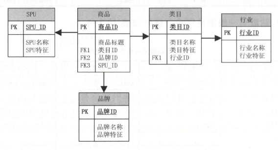
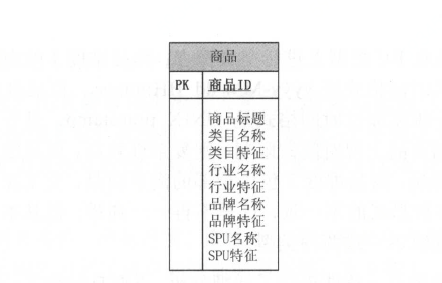

# 第十章 维度设计

## 10.1 维度设计基础

### 10.1.1 维度的基本概念

维度是维度建模的基础和灵魂。在维度建模中，将度量称为事实，将环境描述为维度，维度是用于分析事实所需要的多样环境。例如，在分析交易过程中，可以通过买家、卖家、商品和时间等维度描述交易发生的环境。

维度所包含的表示维度的列，称为维度属性。维度属性是查询约束条件、分组和报表标签生成的基本来源，是数据易用性的关键。例如，在查询请求中，获得某类目的商品、正常状态的商品等，是通过约束商品类目属性和商品状态属性来实现的；统计淘宝不同商品类目的每日成交金额，是通过商品维度的类目属性进行分组的；我们在报表中看到的类目、BC 类型（ B 指天猫， C 指集市）等，都是维度属性。所以**维度的作用一般是查询约束、分类汇总以及排序等**。

如何获取维度或维度属性？如上面所提到的，一方面，可以在报表中获取；另一方面，可以在和业务人员的交谈中发现维度或维度属性。因为它们经常出现在查询或报表请求中的“按照”（ by ）语句内。例如，用户要“按照”月份和产品来查看销售情况，那么用来描述其业务的自然方法应该作为维度或维度属性包括在维度模型中。

**维度使用主键标识其唯一性**，主键也是确保与之相连的任何事实表之间存在引用完整性的基础。主键有两种：**代理键和自然键**，它们都是用于标识某维度的具体值。但代理键是不具有业务含义的键， 一般用于处理缓慢变化维；自然键是具有业务含义的键，比如商品，在ETL过程中，对于商品维表的每一行，可以生成一个唯一的代理键与之对应；商品本身的自然键可能是商品ID 等。其实对于前台应用系统来说，商品ID 是代理键：而对于数据仓库系统来说，商品ID 则属于自然键。

### 10.1.2 维度的基本设计方法

维度的设计过程就是确定**维度属性**的过程，如何生成维度属性，以及所生成的维度属性的优劣，决定了维度使用的方便性，成为数据仓库易用性的关键。正如Kimball所说的，数据仓库的能力直接与维度属性的质量和深度成正比。

下面以淘宝的商品维度为例对维度设计方法进行详细说明。

第一步：选择维度或新建维度。作为维度建模的核心，在**企业级数据仓库中必须保证维度的唯一性**。以淘宝商品维度为例，有且只允许有一个维度定义。

第二步：确定主维表。此处的主维表一般是ODS 表，直接与业务系统同步。以淘宝商品维度为例， s_a uction_ auctions 是与前台商品中心系统同步的商品表，此表即是主维表。

第三步：确定相关维表。数据仓库是业务源系统的数据整合，不同业务系统或者同一业务系统中的表之间存在关联性。根据对业务的梳理，确定哪些表和主维表存在关联关系，并选择其中的某些表用于生成维度属性。以淘宝商品维度为例，根据对业务逻辑的梳理，可以得到商品与类目、SPU 、卖家、店铺等维度存在关联关系。

第四步：确定维度属性。本步骤主要包括两个阶段：其中第一个阶段是从主维表中选择维度属性或生成新的维度属性；第二个阶段是从相关维表中选择维度属性或生成新的维度属性。以淘宝商品维度为例，从主维表(s_auction_auctions)和类目、SPU 、卖家、店铺等相关维表中选择维度属性或生成新的维度属性。

确定维度属性的几点提示：

（1）**尽可能生成丰富的维度属性**

比如淘宝商品维度有近百个维度属性，为下游的数据统计、分析、探查提供了良好的基础。

（2）**尽可能多地给出包括一些富有意义的文字性描述**

属性不应该是编码，而应该是真正的文字。在间里巴巴维度建模中，一般是编码和文字同时存在，比如商品维度中的商品ID 和商品标题、类目ID 和类目名称等。ID 一般用于不同表之间的关联，而名称一般用于报表标签。

（3）区分数值型属性和事实

数值型字段是作为事实还是维度属性，可以参考字段的一般用途。如果通常用于查询约束条件或分组统计，则是作为维度属性；如果通常用于参与度量的计算， 则是作为事实。比如商品价格，可以用于查询约束条件或统计价格区间的商品数量，此时是作为维度属性使用的；也可以用于统计某类目下商品的平均价格，此时是作为事实使用的。另外，如果数值型字段是离散值，则作为维度属性存在的可能性较大；如果数值型宇段是连续值，则作为度量存在的可能性较大，但并不绝对，需要同时参考宇段的具体用途。

（4）尽量沉淀出通用的维度属性

有些维度属性获取需要进行比较复杂的逻辑处理，有些需要通过多表关联得到，或者通过单表的不同宇段混合处理得到，或者通过对单表的某个字段进行解析得到。此时，需要将尽可能多的通用的维度属性进行沉淀。一方面，可以提高下游使用的方便性，减少复杂度；另一方面，可以避免下游使用解析时由于各自逻辑不同而导致口径不一致。例如，淘宝商品的property 字段，使用$key:value$ 方式存储多个商品属性。商品品牌就存存储在此字段中，而商品品牌是重要的分组统计和查询约束的条件，所以需要将品牌解析出来，作为品牌属性存在。例如，商品是否在线，即在淘宝网站是否可以查看到此商品，是重要的查询约束的条件，但是无法直接获取，需要进行加工，加工逻辑是：商品状态为0和1且商品上架时间小于或等于当前时间，则是在线商品，否则是非在线商品。所以需要封装商品是否在线的逻辑作为一个单独的属性字段。

### 10.1.3 维度的层次结构

维度中的一些描述属性以层次方式或一对多的方式相互关联，可以被理解为包含连续主从关系的属性层次。层次的最底层代表维度中描述的最低级别的详细信息，最高层代表最高级别的概要信息。维度常常有多个这样的嵌入层次结构。比如淘宝商品维度，有卖家、类目、品牌等。商品属于类目，类目属于行业，其中类目的最低级别是叶子类目，叶子类目属于二级类目，二级类目属于一级类目。

在属性的层次结构中进行钻取是数据钻取的方法之一。假设己有一个淘宝交易订单，创建事实表。现在统计2015 年“双11 ”的下单GMV ， 得到一行记录；沿着层次向下钻取，添加行业，得到行业实例个数的记录数；继续沿着层次向下钻取，添加一级类目，得到一级类目实例个数的记录数。可以看到，通过向报表中添加连续的维
度细节级别，实现在层次结构中进行钻取。

最高层次的统计，如表10-1所示。

​															**表10-1 最高层次统计**

| 日期     | 行业 | 一级类目 | 下单GMV |
| -------- | ---- | -------- | ------- |
| 20151111 | ALL  | ALL      | 912亿   |

钻取至行业层次，统计如表10-2 所示。

​															**表10-2 钻取至行业层次统计**

| 日期     | 行业  | 一级类目 | 下单GMV       |
| -------- | ----- | -------- | ------------- |
| 20151111 | 行业1 | ALL      | industry1_gmv |
|          | 行业2 | ALL      | industry2_gmv |
|          | 行业3 | ALL      | industry3_gmv |
|          | ....  | ...      | ...           |
|          | 行业n | ALL      | industryN_gmv |

钻取至一级类目层次，统计如表10-3 所示。

​															**表10-3 钻取至一级类目层次统计**

| 日期     | 行业  | 一级类目 | 下单GMV            |
| -------- | ----- | -------- | ------------------ |
| 20151111 | 行业1 | cat1     | industry1_cat1_gmv |
|          | ...   | catM     | ndustry1_catM_gmv  |
|          | 行业2 | cat1     | industry2_cat1_gmv |
|          | 行业2 | catY     | industry2_catY_gmv |
|          | 行业3 | cat1     | industry3_cat1_gmv |
|          | ....  | ...      | ...                |
|          | 行业n | catX     | industryN_catX_gmv |

类目、行业、品牌等属性层次是被实例化为多个维度，还是作为维度属性存在于商品维度中？如何设计，我们在下一节中详细讨论。

### 10.1.4 规范化与反规范化

**当属性层次被实例化为一系列维度，而不是单一的维度时，被称为雪花模式**。大多数联机事务处理系统(OLTP )的底层数据结构在设计时采用此种规范化技术，通过规范化处理将重复属性移至其自身所属的表中，删除冗余数据。

这种方法用在OLTP 系统中可以有效避免数据冗余导致的不一致性。比如在OLTP 系统中，存在商品表和类目表，且商品表中有冗余的类目表的属性字段，假设对某类目进行更新，则必须更新商品表和类目表，且由于商品和类目是一对多的关系，商品表可能每次需要更新几十万甚至上百万条记录，这是不合理的。而对于联机分析处理系统(OLAP)来说，数据是稳定的，不存在OLTP 系统中所存在的问题。

对于淘系商品维度，如果采用雪花模式进行规范化处理，将表现为如图10.1 所示的形式。

​											**图10-1 规范化处理沟宝商品维度所农观的形式**

将维度的属性层次合并到单个维度中的操作称为反规范化。分析系统的主要目的是用于数据分析和统计，如何更方便用户进行统计分析决定了分析系统的优劣。采用雪花模式，用户在统计分析的过程中需要大量的关联操作，使用复杂度高，同时查询性能很差；而采用反规范化处理，则方便、易用且性能好。

对于淘宝商品维度，如果采用反规范化处理，将表现为如图10-2所示的形式。

​											**图10-2 反规范化处理沟宝商品维度所求观的形式**

如上所述，从用户角度来看简化了模型，并且使用数据库查询优化器的连接路径比完全规范化的模型简化许多。反规范化的维度仍包含与规范化模型同样的信息和关系，从分析角度来看，没有丢失任何信息，但复杂性降低了。

采用雪花模型，除了可以节约一部分存储之外，对于OLAP系统来说没有其他效用。而现阶段存储的成本非常低。出于易用性和性能考虑，维表一般是很不规范化的。在实际应用中，几乎总是**使用维表的空间来换取简明性和查询性能**。

### 10.1.5 一致性维度和交叉探查

构建企业级数据仓库不可能一蹦而就， 一般采用迭代式的构建过程。

