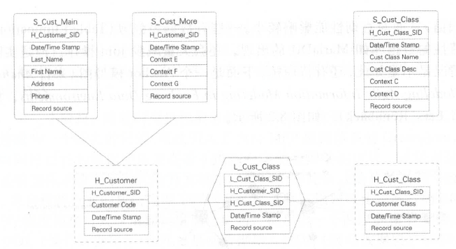
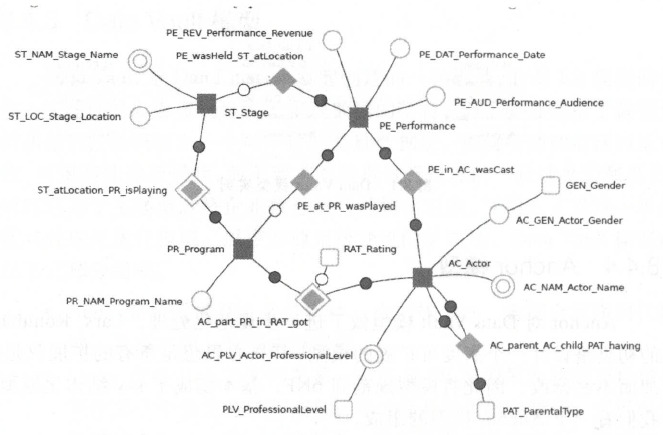

# 第八章 大数据领域建模综述

## 8.1 为什么需要数据建模

随着D T 时代互联网、智能设备及其他信息技术的发展，数据爆发式增长，如何将这些数据进行**有序、有结构地分类组织和存储**是我们面临的一个挑战。

如果把数据看作图书馆里的书，我们希望看到它们在书架上分门别类地放置；如果把数据看作城市的建筑，我们希望城市规划布局合理：如果把数据看作电脑文件和文件夹，我们希望按照自己的习惯有很好的文件夹组织方式，而不是糟糕棍乱的桌面，经常为找一个文件而不知所措。

数据模型就是数据组织和存储方法，它强调从业务、数据存取和使用角度合理存储数据。有了适合业务和基础数据存储环境的模型，那么大数据就能获得以下好处。

- 性能：良好的数据模型能帮助我们快速查询所需要的数据，减少数据的I/O吞吐
- 成本：良好的数据模型能极大地减少不需要的数据冗余，也能实现计算结果复用，极大地降低大数据系统中的存储和计算成本
- 效率：良好的数据模型能极大地改善用户使用数据的体验，提高使用数据的效率。
- 质量：良好的数据模型能改善数据统计口径不一致，减少数据计算错误的可能性

因此，毋庸置疑，大数据系统需要数据模型方法来帮助更好地组织和存储数据，以便在性能、成本、效率和质量之间取得最佳平衡。

## 8.2 关系型数据库系统和数据仓库

E .F .Codd 是关系数据库的鼻祖，他首次提出了数据库系统的关系模型，开创了数据库关系方法和关系数据理论的研究。随着一大批大型关系数据库商业软件（如Oracle 、lnformix 、DB2 等）的兴起，现代企业信息系统几乎都使用关系数据库来存储、加工和处理数据。数据仓库系统也不例外，大量的数据仓库系统依托强大的关系数据库能力存储和处理数据，其采用的数据模型方法也是基于关系数据库理论的。虽然近年来大数据的存储和计算基础设施在分布式方面有了飞速的发展，NoSQL 技术也曾流行一时，但是不管是Hadoop 、Spark 还是阿里巴巴集团的MaxCompute 系统，仍然在大规模使用SQL 进行数据的加工和处理，仍然在用Table 存储数据，仍然在使用关系理论描述数据之间的关系，只是在大数据领域，基于其数据存取的特点在关系数据模型的范式上有了不同的选择而已。

## 8.3 从OLTP和OLAP系统的区别看模型方法论的选择

OLTP系统通常是面向的主要数据操作是随机读写，主要采用满足3NF的实体关系模型存储数据，从而在事务处理中解决数据的冗余和一致性问题。而OLAP系统面向的主要数据操作是批量读/写，事务处理中的不一致性不是OLAP所关注的，其主要关注数据的整合，以及在一次性的复杂大数据查询和处理中的性能，因此它需要采用一些不同的数据建模方法。

## 8.4 典型的数据仓库建模万法论

### 8.4.1 ER 模型

数据仓库之父Bill lnmon 提出的建模方法是从全企业的高度设计一个3NF 模型，用实体关系(Entity Relationship, ER)模型描述企业业务，在范式理论上符合3NF。数据仓库中的3NF与OLTP中的3NF区别在于：它是站在企业角度面向主题的抽象，而不是针对某个具体业务流程的实体对象关系的抽象。其具体有以下几个特点：

- 需要全面了解企业业务和数据
- 实施周期非常长
- 对建模人员的能力要求非常高

采用ER模型建设数据仓库模型的出发点是整合数据，将各个系统中的数据以整个企业角度按主题进行相似性组合和合并，并进行一致性处理，为数据分析决策服务，但是并不能直接用于分析决策。

其建模步骤分为三个阶段：

- 高层模型：一个高度抽象的模型，描述主要的主题，以及主题间的关系，用于描述企业的业务总体概况。
- 中层模型：在高层模型的基础上，细化主题的数据项。
- 物理模型(底层模型)：在中层模型的基础上，考虑物理存储，同时基于性能和平台特点进行物理属性的设计，也可能做一些表的合并、分区的设计等。

ER 模型在实践中最典型的代表是Teradata 公司基于金融业务发布的FS-LDM (Financial Services Logical Data Model ），它通过对金融业务的高度抽象和总结，将金融业务划分为10 大主题，并以设计面向金融仓库模型的核心为基础，企业基于此模型做适当调整和扩展就能快速落地实施。

### 8.4.2 维度模型

维度模型是数据仓库领域的Ralph Kimball 大师所倡导的，他的TheData wrehouse tolkit-The Complete Guide to Dimensional Modeling()是数据仓库工程领域最流行的数据仓库建模的经典。

维度建模从分析决策的需求出发构建模型，为分析需求服务，因此它重点关注用户如何更快速地完成需求分析，同时具有较好的大规模复杂性查询的相应。其典型的代表是星型模型，以及在一些特殊场景下的雪花模型。其设计分为以下几个步骤：

- 选择需要进行分析决策的业务过程。业务过程可以是单个业务事件，比如交易的支付、退款等；也可以是某个事件的状态，比如当前的账户余额等；还可以是一系列相关业务事件组成的业务流程，具体需要看我们分析的是某些事件发生情况，还是当前状态，或是事件流转效率。
- 选择粒度。在事件分析中，要预判所有分析需要细分的程度，从而决定选择的粒度。粒度是维度的一个组合。
- 识别维表。选择好粒度之后，就需要基于此粒度设计维表，包括维度属性，用于分析时进行分组和筛选。
- 选择事实，确定分析需要衡量的指标

### 8.4.3 Data Vault模型

Data Vault 是Dan Linstedt 发起创建的一种模型，它是ER模型的衍生，其设计的出发点也是为了实现数据的整合，但不能直接用于数据分析决策。它强调建立一个可审计的基础数据层，也就是强调数据的历史性、可追溯性和原子性，而不要求对数据进行过度的一致性处理和整合；同时它基于主题概念将企业数据进行结构化组织，并引入了更进一步的范式处理来优化模型，以应对游、系统变更的扩展性。Data Vault 模型由以下几部分组成。

- Hub：是企业的核心业务实体，由实体key 、数据仓库序列代理键、装载时间、数据来源组成。
- Link ：代表Hub 之间的关系。这里与ER 模型最大的区别是将关系作为一个独立的单元抽象，可以提升模型的扩展性。它可以直接描述1:1、1:n 和n:n 的关系，而不需要做任何变更。它由Hub的代理键、装载时间、数据来源组成。
- Satellite ：是Hub 的详细描述内容， 一个Hub 可以有多个Satellite 。它由Hub 的代理键、装载时间、来源类型、详细的Hub 描述信息组成。

Data Vault 模型比ER 模型更容易设计和产出，它的ETL加工可实现配置化。通过Dan Linstedt 的比喻更能理解Data Vault 的核心思想：Hub 可以想象成人的骨架，那么Link 就是连接骨架的韧带，而SateIIite就是骨架上面的血肉。看如下实例（来自Data 均ult Modeling Guide,作者Hans Hultgren ），如图8.1 所示。

​															**图8-1 Data Vault模型实例**

### 8.4.4 Anchor 模型

Anchor 对Data Vault 模型做了进一步规范化处理， Lars. Ri:innback的初衷是设计一个高度可扩展的模型，其核心思想是所有的扩展只是添加而不是修改，因此将模型规范到6NF ，基本变成了k-v 结构化模型。看一下Anchor 模型的组成。

- Anchors ：类似于Data Vault 的Hub ，代表业务实体，且只有主键。
- Attributes ：功能类似于Data Vault 的Satellite ，但是它更加规范化，将其全部k-v 结构化， 一个表只有一个Anchors 的属性描述。
- Ties ：就是Anchors 之间的关系，单独用表来描述，类似于Data Vault 的Link ，可以提升整体模型关系的扩展能力。
- Knots ：代表那些可能会在多个Anchors 中公用的属性的提炼，比如性别、状态等这种枚举类型且被公用的属性。

在上述四个基本对象的基础上，又可以细划分为历史的和非历史的，其中历史的会以时间戳加多条记录的方式记录数据的变迁历史。

Anchor 模型的创建者以此方式来获取极大的可扩展性，但是也会增加非常多的查询join 操作。创建者的观点是，数据仓库中的分析查询只是基于一小部分字段进行的，类似于列存储结构，可以大大减少数据扫描，从而对查询性能影响较小。一些有数据表裁剪（ Table Elimination)特性的数据库如Maria DB 的出现， 还会大量减少join 操作。但是实际情况是不是如此，还有待商榷。下面是一个Anchor 模型图。

​																	**图8 .2 Anchor 模型图**

## 8.5 阿里巴巴数据模型实践综述

**第一个阶段**：完全应用驱动的时代，阿里巴巴的第一代数据仓库体系构建在Oracle上，数据完全以满足报表需求为目的，将数据以与源结构相同的方式同步到Oracle （称作ODS 层），数据工程师基于ODS数据进行统计，基本没有系统化的模型方法体系，完全基于对Oracle数据库特性的利用进行数据存储和加工，部分采用一些维度建模的缓慢变化维方式进行历史数据处理。这时候的数据架构只有两层，即ODS+DSS。

**第二个阶段**：随着阿里巴巴业务的快速发展，数据量也在飞速增长，性能成为一个较大的问题，因此引入了当时MPP 架构体系的Greenplum,同时阿里巴巴的数据团队也在着手进行一定的数据架构优化，希望通过一些模型技术改变烟囱式的开发模型，消除一些冗余，提升数据的一致性。来自传统行业的数据仓库工程师开始尝试将工程领域比较流行的ER模型＋维度模型方式应用到阿里巴巴集团，构建出一个四层的模型架构，即ODL(操作数据层) +BDL(基础数据层)+ IDL(接口数据层) +ADL(应用数据层)。

ODL和源系统保持一致；BDL希望引人ER 模型，加强数据的整合，构建一致的基础数据模型。IDL基于维度模型方法构建集市层。A DL 完成应用的个性化和基于展现需求的数据组装。在此期间，我们在构建E R 模型时遇到了比较大的困难和挑战，互联网业务的快速发展、人员的快速变化、业务知识功底的不够全面，导致ER 模型设计
迟迟不能产出。至此，我们也得到了一个经验： 在不太成熟、快速变化的业务面前，构建ER模型的风险非常大，不太适合去构建ER 模型。

**第三个阶段：**阿里巴巴集团的业务和数据还在飞速发展，这时候迎来了以Hadoop 为代表的分布式存储计算平台的快速发展，同时阿里巴巴集团自主研发的分布式计算平台Max Compute 也在紧锣密鼓地进行着。我们在拥抱分布式计算平台的同时，也开始建设自己的第三代模型架构，这时候需要找到既适合阿里巴巴集团业务发展，又能充分利用分布式计算平台能力的数据模型方式。我们选择了以Kimball 的维度建模为核心理念的模型方法论，同时对其进行了一定的升级和扩展，构建了阿里巴巴集团的公共层模型数据架构体系。

数据公共层建设的目的是着力解决数据存储和计算的共享问题，阿里巴巴集团当下已经发展为多个BU ，各个业务产生庞大的数据，并且数据每年以近2. 5 倍的速度在增长，数据的增长远远超过业务的增长，带来的成本开销也是非常令人担忧的。阿里巴巴数据公共层建设的指导方法是一套统一化的集团数据整合及管理的方法体系(在内部这一体系称为“ OneData ”)，其包括一致性的指标定义体系、模型设计方法体系以及配套工具。