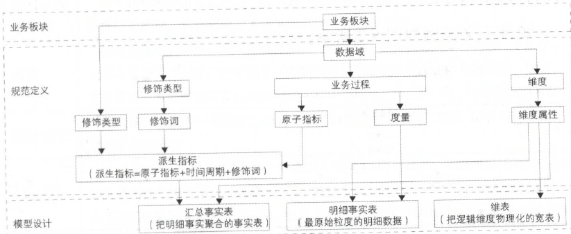
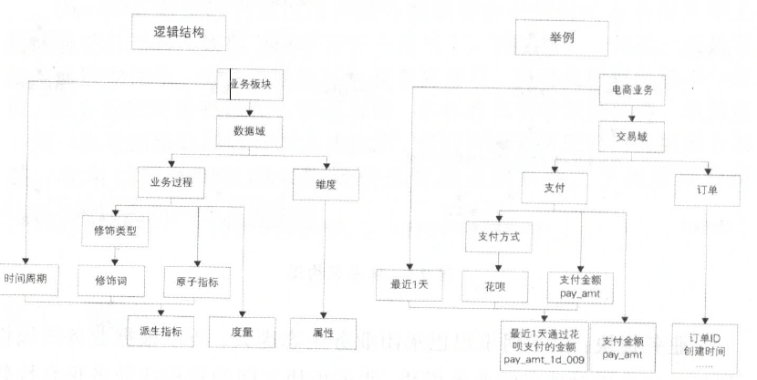
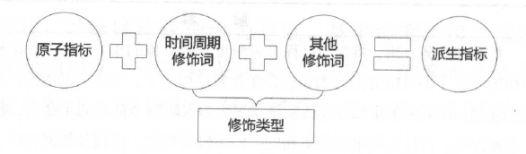
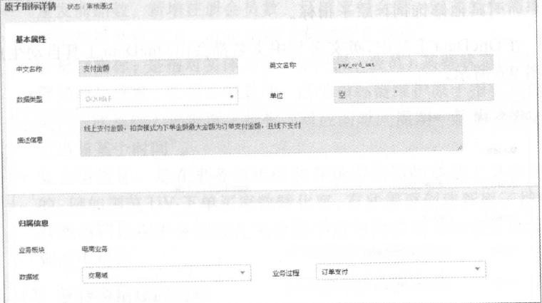

# 第九章 阿里巴巴数据整合及管理体系

面对爆炸式增长的数据，如何建设高效的数据模型和体系，对这些数据进行有序和有结构地分类组织和存储，避免重复建设和数据不一致性，保证数据的规范性， 一直是大数据系统建设不断追求的方向。

OneData 即是阿里巴巴内部进行数据整合及管理的方法体系和工具。阿里巴巴的大数据工程师在这一体系下，构建统一、规范、可共享的全域数据体系，避免数据的冗余和重复建设，规避数据烟囱和不一致性，充分发挥阿里巴巴在大数据海量、多样性方面的独特优势。借助这一统一化数据整合及管理的方法体系，我们构建了阿里巴巴的数据公共层，并可以帮助相似的大数据项目快速落地实现。下面重点介绍OneData 体系和实施方法论。

## 9.1 概述

阿里巴巴集团大数据建设方法论的核心是：从业务架构设计到模型设计，从数据研发到数据服务，做到数据可管理、可追溯、可规避重复建设。目前，阿里巴巴集团数据公共层团队已把这套方法论沉淀为产品，以帮助数据PD 、数据模型师和ETL 工程师建设阿里的大数据。这一体系包含方法论以及相关产品。

### 9.1.1 定位及价值

建设统一的、规范化的数据接入层(ODS)和数据中间层(DWD和DWS)，通过数据服务和数据产品，完成服务于阿里巴巴的大数据系统建设，即数据公共层建设。提供标准化的（ Standard ）、共享的（ Shared ）、数据服务（ Service ）能力，降低数据互通成本，释放计算、存储、人力等资源，以消除业务和技术之痛。

### 9.1.2 体系架构

体系架构图如图9.1 所示。

​																			**图9.1 休系架构图**

**业务板块：**由于阿里巴巴集团业务生态庞大，所以根据业务的属性划分出几个相对独立的业务板块，业务板块之间的指标或业务重叠性较小。如电商业务板块涵盖淘系、B2B 系和Ali Express 系等。

**规范定义：** 阿里数据业务庞大，结合行业的数据仓库建设经验和阿里数据自身特点，设计出的一套数据规范命名体系，规范定义将会被用在模型设计中。后面章节将会详细说明。

**模型设计：**以维度建模理论为基础，基于维度建模总线架构，构建一致性的维度和事实(进行规范定义)。同时，在落地表模型时，基于阿里自身业务特点， 设计出一套表规范命名体系。后面章节将会详细说明。

## 9.2 规范定义 

规范定义指以维度建模作为理论基础，构建总线矩阵，划分和定义数据域、业务过程、维度、度量/原子指标、修饰类型、修饰词、时间周期、派生指标。

规范定义实例如图9.2 所示。

​																	**图9_2 规范定义实例**

### 9.2.1 名词术语

名词术语解释如表9.1 所示。

​																		**表9.1 名词术语解释**

| 名词术语      | 解释                                                         |
| ------------- | :----------------------------------------------------------- |
| 数据域        | 指面向业务分析，将业务过程或者维度进行抽象的集合。其中， 业务过程可以概括为一个个不可拆分的行为事件， 在业务过程之下， 可以定义指标；维度是指度量的环境，如买家下单事件，买家是维度。为保障整个体系的生命力， 数据域是需要抽象提炼，并且长期维护和更新的， 但不轻易变动。在划分数据域时， 既能涵盖当前所有的业务需求，又能在新业务进入时无影响地被包含进已有的数据域中和扩展新的数据域 |
| 业务过程      | 指企业的业务活动事件，如下单、支付、退款都是业务过程。请注意，业务过程是一个不可拆分的行为事件，通俗地讲，业务过程就是企业活动中的事件 |
| 时间周期      | 用来明确数据统计的时间范用或者时间点，如最近30 天、自然周、截至当日等 |
| 修饰类型      | 是对修饰词的一种抽象划分。修饰类型从属于某个业务域，如日志域的访问终端类型涵盖无线端、PC 端等修饰词 |
| 修饰词        | 指除了统计维度以外指标的业务场景限定抽象。修饰词隶属于一种修饰类型，如在日志域的访问终端类型下， 有修饰词PC 端、无线端等 |
| 度量/原子指标 | 原子指标和度量含义相同，基于某一业务事件行为下的度量，是业务定义中不可再拆分的指标，具有明确业务含义的名词，如支付金额 |
| 维度          | 维度是度盟的环境，用来反映业务的一类属性， 这类属性的集合构成一个维度，也可以成为实体对象。维度属于一个数据域，如地理维度（其中包挤罔家、地区、省以及城市等级别的内容）、时间维度（其中包括年、季、月、周、日等级别的内容） |
| 维度属性      | 维度属性隶属于一个维度， 如地理维度里面的国家名称、同家ID 、省份名称等都属于维度属性 |
| 派生指标      | 派生指标=一个原子指标+多个修饰词(可选)+时间周期。可以理解为对原子指标业务统计范围的圈定。如原子指标： 支付金额，最近1天海外买家支付金额则为=派生指标(最近1天为时间周期， 海外为修饰词， 买家作为维度，而不作为修饰词) |

### 9.2.2 指标体系

在讲述指标时，会涵盖其组成体系（原子指标、派生指标、修饰类型、修饰词、时间周期），将它们作为一个整体来解读。

#### 1. 基本原则

（1）组成体系之间的关系

- 派生指标由原子指标、时间周期修饰词、若干其他修饰词组合得到(见图9.3)。

	

	​														**图9.3 派生指标**

- 原子指标、修饰类型及修饰词，直接归属在业务过程下，其中修饰词继承修饰类型的数据域

- 派生指标可以选择多个修饰词，修饰词之间的关系为“或”或者“且”，由具体的派生指标语义决定

- 派生指标唯一归属一个原子指标，继承原子指标的数据域， 与修饰词的数据域无关

一般而言，事务型指标和存量型指标只会唯一定位到一个业务过程，如果遇到同时有两个行为发生、需要多个修饰词、生成一个派生指标的情况，则选择时间靠后的行为创建原子指标，选择时间靠前的行为创建修饰词。

原子指标有确定的英文字段名、数据类型和算法说明；派生指标要继承原子指标的英文名、数据类型和算法要求。

（2）命名约定

- 命名所用术语。指标命名，尽量使用英文简写，其次是英文， 当指标英文名太长时，可考虑用汉语拼音首字母命名。如中国质造，用zgzc 。在OneData 工具中维护着常用的名词术语，以用来进行命名。
- 业务过程。英文名：用英文或英文的缩写或者中文拼音简写；中文名：具体的业务过程中文即可，如图9.4 所示。

关于存量型指标对应的业务过程的约定：实体对象英文名+stock。如在线会员数、一星会员数等，其对应的业务过程为mbr_stock在线商品数、商品SKU 种类小于5 的商品数，其对应的业务过程为itm_stock 。

- 原子指标。英文名：动作＋度量：中文名：动作＋度量。原子指标必须挂靠在某个业务过程下，如图9.5 所示。

	

	​																**图9.5 原子指标详情**

- 修饰词。只有时间周期才会有英文名，且长度为2 位，加上“ _”为3 位，例如一ld 。其他修饰词无英文名。

阿里巴巴常用的时间周期修饰词如表9.2 所示。

​													**表9.2 阿里巴巴常用的时间周期修饰词**

| 中文名       | 英文名 |
| ------------ | ------ |
| 最近1天      | 1d     |
| 最近3天      | 3d     |
| 最近7天      | 1w     |
| 最近14天     | 2w     |
| 最近30天     | 1m     |
| 最近60天     | 2m     |
| 最近90天     | 3m     |
| 最近180天    | 6m     |
| 180天以前    | bh     |
| 自然周       | cw     |
| 自然月       | cm     |
| 自然季度     | cq     |
| 截止当日     | td     |
| 年初截止当日 | sd     |
| 零点截止当前 | tt     |
| 财年         | fy     |
| 最近一小时   | 1h     |
| 准实时       | ts     |
| 未来7天      | f1w    |
| 未来4周      | f4w    |