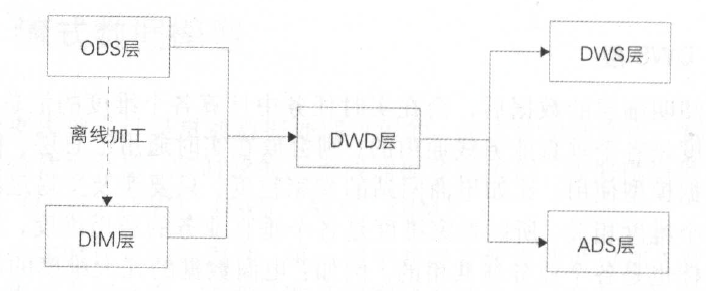
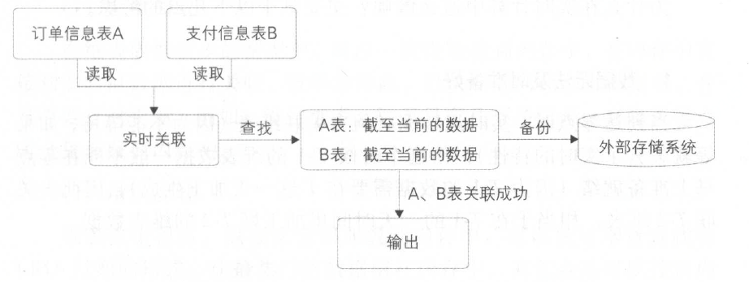

# 第五章 实时技术

## 5.2 流式处理技术架构

在流式计算技术中，需要各个子系统之间相互依赖形成一条数据处理链路，才能产出结果最终对外提供实时数据服务。

### 5.2.3 数据存储

实时任务在运行过程中，会计算很多维度和指标，这些数据需要放在一个存储系统中作为恢复或者关联使用。其中会涉及三种数据类型：

- 中间计算结果——在实时应用处理过程中，会有一些状态的保存(比如去重指标的明细数据)，用于在发生故障时，使用数据库中的数据恢复内存现场
- 最终结果数据——指的是通过ETL处理后的实时结果数据，这些数据是实时更新的，写的频率非常高，可以被下游直接使用
- 维表数据——在离线计算系统中，通过同步工具导入到在线存储系统中，供实时任务来关联实时流数据

数据库分为很多种类型，比如关系型数据库、列式数据库、文档数据库等， 那么在选择实时任务所使用的数据库时应该注意哪些特征呢？

前面提到实时任务是多线程处理的，这就意味着数据存储系统必须能够比较好地支持**多并发读写，并且延时需要在毫秒级**才能满足实时的。

在实践中，一般使用H Base 、Tair 、MongoDB 等列式存储系统。由于这些系统在写数据时是先写内存再落磁盘，因此写延时在毫秒级：读请求也有缓存机制，重要的是多并发读时也可以达到毫秒级延时。

但是这些系统的缺点也是比较明显的，以HBase 为例， 一张表必须要有row key ，而rowkey 是按照ASCII 码来排序的，这就像关系型数据库的索引一样， row key 的规则限制了读取数据的方式。如果业务方需要使用另一种读取数据的方式，就必须重新输出row key 。从这个角度来看， HBase 没有关系型数据库方便。但是H Base 的一张表能够存储几TB 甚至几十TB 的数据，而关系型数据库必须要分库分表才能实现这个量级的数据存储。因此，对于海量数据的实时计算，一般会采用非关系型数据库，以应对大量的多并发读写。

下面介绍在数据统计中表名设计和row key 设计的一些实践经验。

**1. 表名设计**

设计规则：汇总层标识＋数据域＋主维度＋时间维度。例如： dws_trd_s lr_dtr ，表示汇总层交易数据，根据卖家（ sir ）主维度+O 点截至当日(dtr)进行统计汇总。

这样做的好处是，所有主维度相同的数据都放在一张物理表中，避免表数量过多，难以维护。另外，可以从表名上直观地看到存储的是什么数据内容，方便排查问题。

**2. rowkey设计**

设计规则： MD5 ＋主维度＋维度标识＋子维度1 ＋时间维度＋子维度2

例如：卖家ID 的MD5 前四位＋卖家ID+ app ＋ 一级类目ID+ ddd ＋二级类目ID 。

以M D5 的前四位作为row key 的第一部分，可以把数据散列，让服务器整体负载是均衡的，避免热点问题。在上面的例子中，卖家ID 属于主维度，在查数据时是必传的。每个统计维度都会生成一个维度标识，以便在rowkey 上做区分。

### 5.2.4 数据服务

实时数据落地到存储系统中后，使用方就可以通过统一的数据服务获取到实时数据。比如下一章将要讲到的OneService ，其好处是：

- 不需要直连数据库，数据源等信息在数据服务层维护，这样当存储系统迁移时，对下游是透明的
- 调用方只需要使用服务层暴露的接口，不需要关心底层取数逻辑的实现
- 屏蔽存储系统间的差异，统一的调用输出，便于分析和监控下游使用情况。

## 5.3 流式数据模型

数据模型设计是贯通数据处理过程的，流式数据处理也一样，需要对数据流建模分层。实时建模跟离线建模非常类似，数据模型整体上分为五层(ODS、DWD 、DWS 、ADS 、DIM)。

由于实时计算的局限性，每一层中并没有像离线做得那么宽，维度和指标也没有那么多，特别是涉及回溯状态的指标，在实时数据模型中几乎没有。

整体来看，实时数据模型是离线数据模型的一个子集，在实时数据处理过程中，很多模型设计就是参考离线数据模型实现的。

下面从数据分层，多流关联、维表使用这三个方面来详细说明。

### 5.3.1 数据分层

在流式数据模型中，数据模型整体上分为五层。

#### 1. ODS层

跟离线系统的定义一样，ODS层属于操作数据层，是直接从业务系统采集过来的原始数据，办函了所有业务的变更过程，数据粒度也是最细的。在这一层，实时和离线在源头上是统一的， 这样的好处是用同一份数据加工出来的指标，口径基本是统一的，可以更方便进行实时和离线间数据比对。例如：原始的订单变更记录数据、服务器引擎的访问日志。

#### 2. DWD层

DWD层是在ODS层基础上，根据业务过程建模出来的实时事实明细层，对于访问日志这种数据(没有上下文关系，且不需要等待过程的记录)，会回流到离线系统供下游使用，最大程度地保证实时和离线数据在ODS 层和DWD 层是一致的。例如： 订单的支付明细表、退款明细表、用户的访问日志明细表。

#### 3. DWS层

订阅明细层的数据后，会在实时任务中计算各个维度的汇总指标。如果维度是各个垂直业务线通用的，则会放在实时通用汇总层，作为通用的模型使用，比如电商网站的卖家粒度，只要涉及交易过程，就会跟这个维度相关。所以卖家维度是各个垂直业务的通用维度，其中的汇总指标也是各个业务线共用的。例如：电商数据的几大维度的汇总表(卖家、商品、买家)。

#### 4. ADS层

个性化维度汇总层，对于不是特别通用的统计维度数据会放在这一层中，这里计算只有自身业务才会关注的维度和指标，跟其他业务线一般没有交集，常用于一些垂直创新业务中。例如：手机淘宝下面的某个爱逛街、微淘等垂直业务。

#### 5. DIM层

实时维表层的数据基本上都是从离线维表层导出来的，抽取到在线系统中供实时应用调用。这一层对实时应用来说是静态的，所有的ETL处理工作会在离线系统中完成。维表在实时应用的使用中跟离线稍有区别，例如：商品维表、卖家维表、买家维表、类目维表。

下面通过简单的例子来说明每一层存储的数据：

- ODS层：订单粒度的变更过程，一笔订单有多条记录
- DWD层：订单粒度的支付记录，一笔订单只有一条记录
- DWS层：卖家的实时成交金额，一个卖家只有一条记录，并且指标在实时刷新
- ADS层：外卖地区的实时成交金额，只有外卖业务使用。
- DIM层：订单商品类目和行业的对应关系维表。

整体的数据流向如图5.5 所示。

​																			**图5.5 数据流向**

其中， O D S 层到D IM 层的ETL 处理是在离线系统中进行的，处理完成后会同步到实时计算所使用的存储系统。ODS层和DWD层会放在数据中间件中，供下游订阅使用。而DWS层和ADS层会落到在线存储系统中，下游通过接口调用的形式使用。

在每一层中，按照重要性划分为$P_0,P_1,P_2,P_3$等级，$P_0$属于最高优先级保障。根据不同的优先级给实时任务分配不同的计算和存储资源，力求重要的任务可以得到最好的保障。

字段命名、表命名、指标命名是按照OneData 规范来定义的，以便更好地维护和管理。具体OneData 的说明见后续章节。

### 5.3.2 多流关联

在流式计算中常常需要把两个实时流进行主键关联，以得到对应的实时明细表。在离线系统中两个表关联是非常简单的，因为离线计算在任务启动时已经可以获得两张表的全量数据，只要根据关联键进行分桶关联就可以了。但是流式计算不一样，数据的到达是一个增量的过程，并且数据叨叨的时间是不确定的和无序的，因此数据处理工程中会涉及中间状态的保存和恢复机制等细节问题。

比如A 表和B 表使用ID 进行实时关联，由于无法知道两个表的到达顺序，因此在两个数据流的每条新数据到来时，都需要到另外一张表中进行查找。如A表的某条数据到达，到B表的全量数据中查找，如果能查找到，说明可以关联上，拼接成一条记录直接输出到下游；但是如果关联不上，则需要放在内存或外部存储中等待，直到B表的记录也到达。多流关联的一个关键点就是需要相互等待，只有双方都到达了，才能关联成功。

下面通过例子（订单信息表和支付信息表关联）来说明，如图5-6所示。

​														**图5.6 多流关联示例**

在上面的例子中，实时采集两张表的数据，每到来一条心数据时都在内存中的对方表截止至当前的全量数据中查找，如果能查找到，则说明关联成功，直接输出：如果没查找到，则把数据放在内存中的自己表数据集合中等待。另外，不管是否关联成功，内存中的数据都需要备份到外部存储系统中。例如：Flink的State存储介质内存——RocksDB——HDFS/本地文件系统。这样才能保证数据不丢失。因为在重启时，任务都是续跑的，不会重新跑
之前的数据。

另外订单记录的变更有可能发生多次(比如订单的多个字段多次更新)，在这种情况下， 需要根据订单ID 去重，避免A 表和B 表多次关联成功；否则输出到下游就会有多条记录，这样得到的数据是有重复的。

以上是整体的双流关联流程，在实际处理时，考虑到查找数据的性能，实时关联这个步骤一般会把数据按照关联主键进行分桶处理，并且在故障恢复时也根据分桶来进行，以降低查找数据量和提高吞吐量。

### 5.3.3 维表使用

在离线系统中，一般是根据业务分区来关联事实表和维表的，因为在关联之前维表的数据就已经就绪了。而在实时计算中，关联维表一般会使用当前的实时数据(T)去关联T-2的维表数据，相当于在T 的数据到达之前需要把维表数据准备好，并且一般是一份静态的数据。

这样做的原因如下：

**1. 数据无法及时准备好**

当到达零点时，实时流数据必须去关联维表（因为不能等待，如果等就失去了实时的特性），而这个时候T- 1 的维表数据一般不能在零点马上准备就绪（因为T-1 的数据需要在T 这一天加工生成），因此去关联巨2 维表，相当于在T-1 的一天时间里加工好T-2 的维表数据。

**2. 无法准确获取全量的最新数据**

维表一般是全量的数据，如果需要实时获取到当天的最新维表数据，则需要T-1的数据+当前变更才能获取到完整的维表数据。也就是说，维表也作为一个实时流输入，这就需要使用多流实时关联来实现。但是由于实时数据是无序的并且到达时间不确定，因此在维表关联上有歧义。

**3. 数据无序性**

如果维表作为实时流输入的话，获取维表数据将存在困难。比如10:00 点的业务数据成功关联维表，得到了相关的维表字段信息，这个时候是否就已经拿到最新的维表数据了呢？其实这只代表拿到截至10:00 点的最新状态数据（实时应用永远也不知道什么时候才是最新状态，因为不知道维表后面是否会发生变更）。

因此在实时计算中维表关联一般都统一使用T-2的数据，这样对于业务来说，起码关联到的维表数据是确定的（虽然维表数据有一定的延时，但是许多业务的维表在两天之间变化是很少的）。

在有些业务场景下，可以关联T-1 的数据，但T-1 的数据是不全的。比如在T斗的晚上22:00 点开始对维表进行加工处理，在零点到达之前，有两个小时可以把数据准备好，这样就可以在T 的时候关联T-1 的数据了，但是会缺失两个小时的维表变更过程。

另外，由于实时任务是常驻进程的，因此维表的使用分为两种形式。

（1）全量加载

在维表数据较少的情况下，可以一次性加载到内存中，在内存中直接和实时流数据进行关联，效率非常高。但缺点是内存一直占用着，并且需要定时更新。例如：类目维表，每天只有几万条记录，在每天零点时全量加载到内存中。

（2）增量加载

维表 数据很多，没办法全部加载到内存中，可以使用增量查找和LRU过期的形式，让最热门的数据留在内存中。其优点是可以控制内存的使用量；缺点是需要查找外部存储系统，运行效率会降低。例如：会员维表，有上亿条记录，每次实时数据到达时，去外部数据库中查询，并且把查询结果放在内存中，然后每隔一段时间清理一次最近最少使用的数据，以避免内存溢出。

在实际应用中，这两种形式根据维表数据量和实时性能要求综合考虑来选择使用。