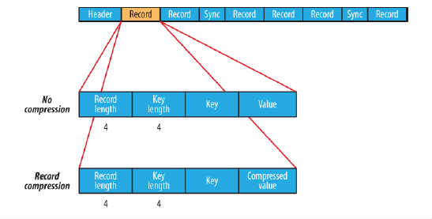
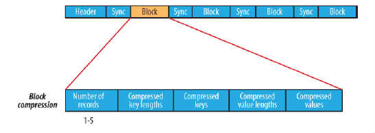

# SequenceFile与MapFile

## 1. SequenceFile

### 1.1 SequenceFile概述

- sequenceFile文件是Hadoop用来存储二进制形式的<Key,Value>对而设计的一种平面文件(Flat File)
- 可以把SequenceFile当做是一个容器，把所有的文件打包到SequenceFile类中可以高效的对小文件进行存储和处理
- SequenceFile文件并不按照其存储的Key进行排序存储，SequenceFile的内部类Writer提供了append功能
- SequenceFile中的Key和Value可以是任意类型Writable或者是自定义Writable
- 存储结构上，SequenceFile主要由一个Header与多条Record组成，Header主要包含了Keyclassname，valueclassname，存储压缩算法，用户自定义元数据等信息，此外，还包含了一些同步标识，用于快速定位到记录的边界。每条Record以键值对的方式进行存储，用来表示它的字符数组可以一次解析成：record的长度、Key的长度、Key值和value值，并且Value值的结构取决于该记录是否被压缩。

### 1.2 SequenceFile压缩

SequenceFIle的内部格式取决于是否启用压缩，如果是压缩，则又可以分为记录压缩和块压缩。

有以下三种类型的压缩：

- 无压缩类型：如果没有启用压缩(默认设置)那么每个记录就由它的记录长度(字节数)、键的长度，键和值组成。长度字段为4字节

- 记录压缩类型：记录压缩格式与无压缩格式基本相同，不同的是值字节是用定义在头部的编码器来压缩。注意：键是不压缩的。下图为记录压缩：

	

- 块压缩类型：块压缩一次压缩多个记录，因此它比记录压缩更紧凑，而且一般优先选择。当记录的字节数达到最小大小，才会添加到块。该最小值由io.seqfile.compress.blocksize中的属性定义。默认值是1000000字节。格式为记录数、键长度、键、值长度、值。下图为块压缩：

	

### 1.4 SequenceFile读取文件

```java
public class SequenceFileReader {
	//定义文件读取的路径
	private static final String INPATH = "hdfs://liaozhongmin:9000";
	public static void main(String[] args) {
		try {
			//创建配置信息
			Configuration conf = new Configuration();
			//创建文件系统
			FileSystem fs = FileSystem.get(new URI(INPATH),conf);
			//创建Path对象
			Path path = new Path(INPATH + "/tmp.seq");
			//创建SequenceFile.Reader对象
			SequenceFile.Reader reader = new SequenceFile.Reader(fs, path, conf);
			//创建Key和value
			Text key = new Text();
			Text value = new Text();
			//从tmp.seq中循环读取内容
			while (reader.next(key, value)){
				System.out.println("key=" + key);
				System.out.println("value=" + key);
				System.out.println("position=" + reader.getPosition());
			}
			//关闭资源
			IOUtils.closeStream(reader);
		} catch (Exception e) {
		   e.printStackTrace();
		}
	}
}
```

### 1.5 SequenceFile总结

#### 优点

- 支持基于记录(Record)或块(Block)的数据压缩
- 支持splitable，能够作为MapReduce的输入分片
- 修改简单：主要负责修改相应的业务逻辑，而不用考虑具体的存储格式

#### 缺点

- 需要一个合并文件的过程，且合并后的文件不方便查看

## 2. MapFile

### 2.1 MapFile概述

- MapFile是排序后的SequenceFile，通过观察其目录结构可以看到MapFile由两部分组成分别是data和index
- index作为文件的数据索引，主要记录了每个Record的Key值，以及该Record在文件中的偏移位置。在MapFile被访问的时候，索引文件会被加载到内存，通过索引映射关系可以迅速定位到指定Record所在文件位置，因此，相对SequenceFile而言，MapFile的检索效率是最高的，缺点是会消耗一部分内存来存储index数据
- MapFile并不不会把所有的Record都记录到index中去，默认情况下每隔128条记录会存储一个索引映射。记录间隔可以修改：通过MapFile.Writer的setIndexInterval()方法或修改io.map.index.interval属性
- 与SequenceFile不同的是，MapFile的KeyClass一定要实现WritableComparable接口，即Key值是可比较的

### 2.2 MapFile写入示例

```java
public class MapFileWriter {
	//定义压缩的路径
	private static final String URL = "hdfs://liaozhongmin:9000";
	
	public static void main(String[] args) {
		
		try {
			//1.创建Configuration
			Configuration conf = new Configuration();
			//2.获取FileSystem
			FileSystem fileSystem = FileSystem.get(new URI(URL), conf);
			//3.创建文件输出路径Path
			Path path = new Path(URL + "/mapfile");
			//4.new一个MapFile.Writer对象
			MapFile.Writer writer = new MapFile.Writer(conf, fileSystem, path.toString(), Text.class, Text.class);
			//5.调用MapFile.Writer.append()方法追加写入
			writer.append(new Text("name"), new Text("liaozhongmin"));
			//关闭流
			writer.close();
		} catch (Exception e) {
			throw e;
		}
		
	}
}
```

### 2.3 MapFile读取

```java
public class MapFileReader {
 
	//定义文件读取的路径
	private static final String INPATH = "hdfs://liaozhongmin:9000";
	
	public static void main(String[] args) {
		
		try {
			//创建配置信息
			Configuration conf = new Configuration();
			//创建文件系统
			FileSystem fs = FileSystem.get(new URI(INPATH),conf);
			//创建Path对象
			Path path = new Path(INPATH + "/mapfile");
			//4.new一个MapFile.Reader进行读取
			MapFile.Reader reader = new MapFile.Reader(fs, path.toString(), conf);
			
			//创建Key和Value
			Text key = new Text();
			Text  value = new Text();
			
			//遍历获取结果
			while (reader.next(key, value)){
				System.out.println("key=" + key);
				System.out.println("value=" + value);
			}
			//关闭流
			IOUtils.closeStream(reader);
		} catch (Exception e) {
			e.printStackTrace();
		}
		
	}
}
```


