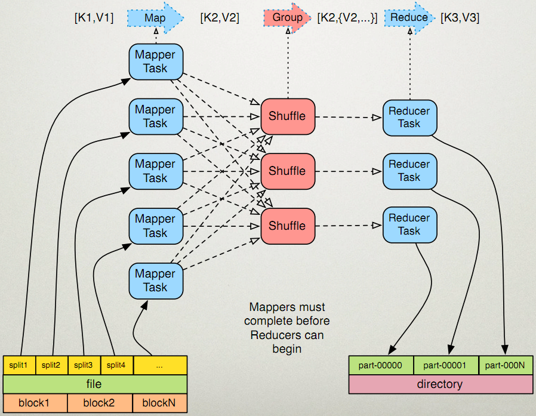

# MapReduce InputSplit详解

## 1. 概述

**输入分片(Input Split)**：在进行map计算之前，mapreduce会根据输入文件计算输入分片(input split)，每个输入分片(input split)针对一个map任务，输入分片(input split)存储的并非数据本身，而是一个分片长度和一个记录数据的位置的数组。




Hadoop 2.x默认的block大小是128MB，Hadoop 1.x默认的block大小是64MB，可以在hdfs-site.xml中设置dfs.block.size，注意单位是byte。

分片大小范围可以在mapred-site.xml中设置：mapred.min.split.size mapred.max.split.size，minSplitSize大小默认为1B，maxSplitSize大小默认为`Long.MAX_VALUE = 9223372036854775807`。

## 2. 分片大小计算方式

计算分片的几个关键名词：

- **block_size** : hdfs的文件块大小，默认为128M，可以通过参数`dfs.block.size`设

- **total_size** : 输入文件整体的大小

- **input_file_num** : 输入文件的个数

	

```
minSize=max{minSplitSize,mapred.min.split.size} 

maxSize=mapred.max.split.size/Long.MAX_VALUE

long blockSize = file.getBlockSize();

splitSize=max{minSize,min{maxSize,blockSize}}
```

源码：

```java
long minSize = Math.max(job.getLong(org.apache.hadoop.mapreduce.lib.input.
      FileInputFormat.SPLIT_MINSIZE, 1), minSplitSize);
long blockSize = file.getBlockSize();

protected long computeSplitSize(long goalSize, long minSize,long blockSize) {
    return Math.max(minSize, Math.min(goalSize, blockSize));
}
```

所以在没有设置分片的范围的时候，分片大小是由block块大小决定的，和它的大小一样。比如把一个258MB的文件上传到HDFS上，假设block块大小是128MB，那么它就会被分成三个block块，与之对应产生三个split，所以最终会产生三个map task。

## 3. 控制map数量

- **默认map个数**

	 如果不进行任何设置，默认的map个数是和blcok_size相关的。

	```
	 default_num = total_size/block_size;
	```

- **期望大小**

	可以通过参数mapred.map.tasks来设置程序员期望的map个数，但是这个个数只有在大于default_num的时候，才会生效。

	```
	goal_num = mapred.map.tasks;
	```

- **设置处理的文件大小**

	可以通过mapred.min.split.size 设置每个task处理的文件大小，但是这个大小只有在大于block_size的时候才会生效。

	```
	split_size = max(mapred.min.split.size, block_size);
	split_num = total_size / split_size;
	```

- **计算的map个数**

	```
	compute_map_num = min(split_num,  max(default_num, goal_num))
	```

 经过以上的分析，在设置map个数的时候，可以简单的总结为以下几点：

- 如果想增加map个数，则设置mapred.map.tasks 为一个较大的值。
- 如果想减小map个数，则设置mapred.min.split.size 为一个较大的值。
- 如果输入中有很多小文件，依然想减少map个数，则需要将小文件merger为大文件，然后
	