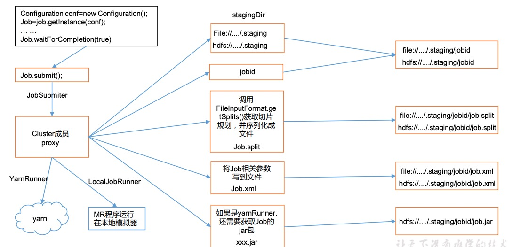

# MapReduce框架原理

## 1. InputFormat数据输入

### 1.1 切片与 MapTask 并行度决定机制

MapTask的并行度决定 Map 阶段的任务处理并发度，进而影响到整个 Job 的处理速度。

**MapTask并行度决定机制**

**数据块**：Block 是 HDFS 物理上把数据分成一块一块。 

**数据切片**：数据切片只是在逻辑上对输入进行分片，并不会在磁盘上将其切分成片进行存储。


### 1.2 Job 提交流程源码和切片源码详解

**Job提交流程源码**

```java
submit();
// 1 建立连接
connect();
// 1）创建提交 Job 的代理
new Cluster(getConfiguration());
// （1）判断是本地 yarn 还是远程
initialize(jobTrackAddr, conf);
// 2 提交 job
submitter.submitJobInternal(Job.this, cluster)
// 1）创建给集群提交数据的 Stag 路径
Path jobStagingArea =
JobSubmissionFiles.getStagingDir(cluster, conf);
// 2）获取 jobid ，并创建 Job 路径
JobID jobId = submitClient.getNewJobID();
// 3）拷贝 jar 包到集群
copyAndConfigureFiles(job, submitJobDir);
rUploader.uploadFiles(job, jobSubmitDir);
// 4）计算切片，生成切片规划文件
writeSplits(job, submitJobDir);
maps = writeNewSplits(job, jobSubmitDir);
input.getSplits(job);
// 5）向 Stag 路径写 XML 配置文件
writeConf(conf, submitJobFile);
conf.writeXml(out);
// 6）提交 Job,返回提交状态
status = submitClient.submitJob(jobId,
submitJobDir.toString(), job.getCredentials());
```



