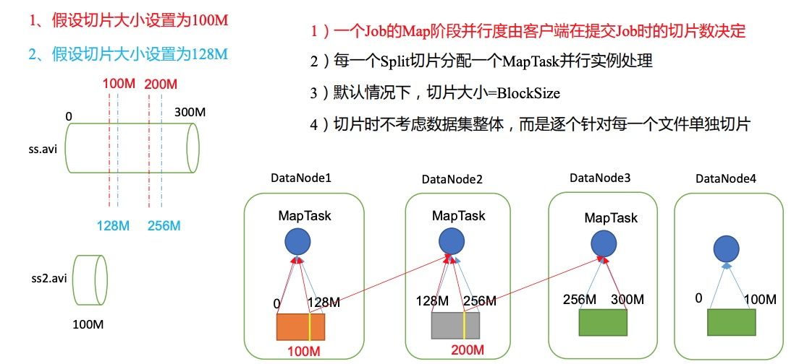

# MapReduce框架原理

## 1. InputFormat数据输入

### 1.1 切片与 MapTask 并行度决定机制

MapTask的并行度决定 Map 阶段的任务处理并发度，进而影响到整个 Job 的处理速度。

**MapTask并行度决定机制**

**数据块**：Block 是 HDFS 物理上把数据分成一块一块。 

**数据切片**：数据切片只是在逻辑上对输入进行分片，并不会在磁盘上将其切分成片进行存储。



### 1.2 Job 提交流程源码和切片源码详解

**Job提交流程源码**

```
waitForCompletion();
```

